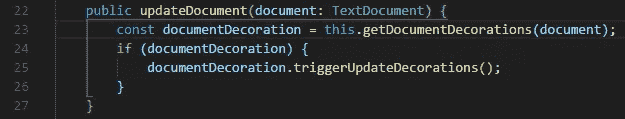
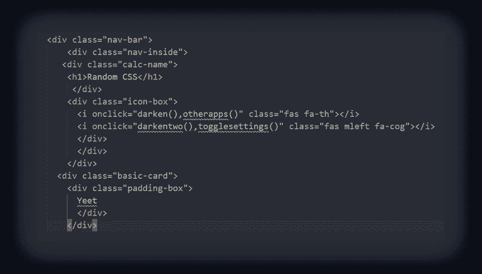
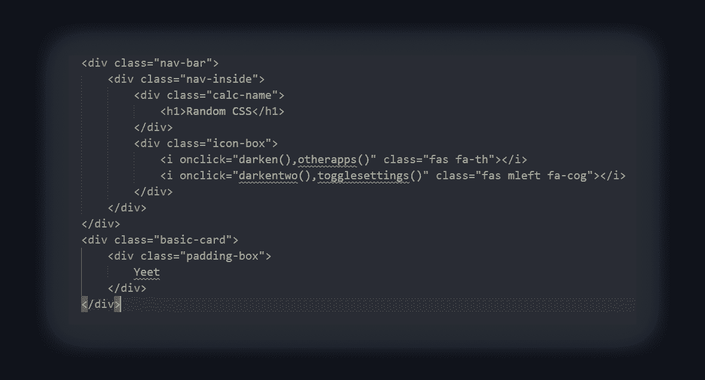
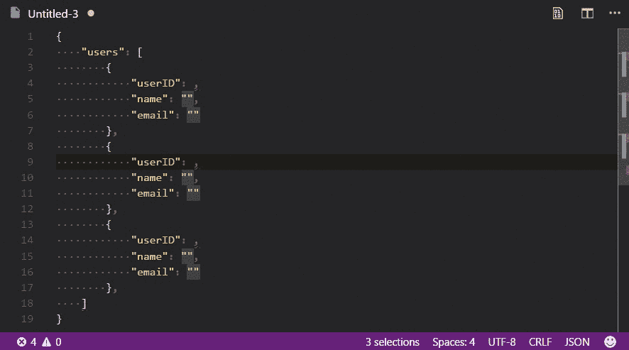
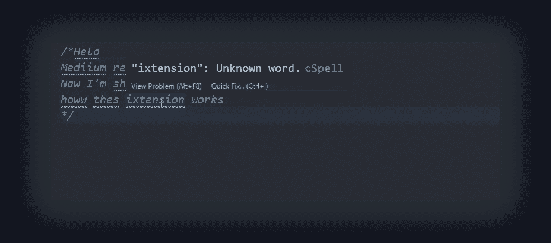
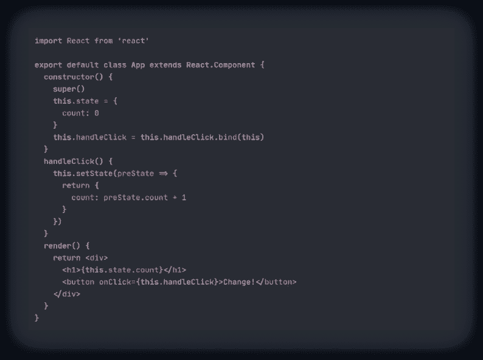

# 我最喜欢的 9 个 VSCode 扩展，你绝对需要

> 原文：<https://javascript.plainenglish.io/my-9-favorite-vscode-extensions-which-you-definitely-need-fc1cac12b207?source=collection_archive---------6----------------------->

## 虚拟代码

## 有些会让你的工作流程更加舒适，有些会帮助你提高工作效率

Cark #00514 ([MetaCark — 10,000 unique Carks](https://metacark.com/))

VSCode 是最流行的编程 ide 之一，与其他 ide 相比，它也有很多优势，比如 Sublime Text 3 或 Atom。它有一个非常酷的设计和许多可能性，使用默认的 VSCode，你几乎可以做任何你想做的事情。然而，有许多免费的扩展，您可以安装到您的 IDE 中来完成一些特定的任务，如更改配色方案，并使其可定制并适合您的工作流程。它还通过添加扩展来帮助您更快地编写代码，从而帮助您提高生产率。

所以，是的，在这篇文章中，我们将仔细看看这些优秀的扩展，我个人已经使用了一段时间，我想你们每个人都应该！

# [1。项目经理](https://marketplace.visualstudio.com/items?itemName=alefragnani.project-manager)

第一个也可能是最重要的一个是项目经理。它可以帮助你更好地工作，尤其是当你有大量不同的项目可以同时进行的时候。通过使用这个扩展，你可以把所有的东西都放在一个特殊的文件夹中，并且在任何你想要的时候使用它，所以不会有任何混乱，所有的东西都是严格结构化的。所以，如果你有很多项目，这将有助于你不失去对你的主要项目的关注！

Project Manager

# [2。GItLens](https://marketplace.visualstudio.com/items?itemName=eamodio.gitlens)

列表中的第二个扩展是 Gitlens，它对于任何使用 GIT 的人来说都是必不可少的。简而言之，它向您展示了对 GIT 库的所有更改的历史，以及一系列其他很酷的特性，您只需下载它就可以查看！顺便说一下，如果您不使用 GIT，那么您肯定应该使用它。

Gitlens

# [3。彩虹括号](https://marketplace.visualstudio.com/items?itemName=2gua.rainbow-brackets)

第三个是一个扩展，为您突出显示所有括号，使您更容易找到合适的括号。可能，你们中的许多人已经知道这个扩展或其他类似的功能，但我认为它真的很有用，尤其是对于害怕看代码的初学者:)

Rainbow Brackets

# [4。更漂亮](https://marketplace.visualstudio.com/items?itemName=esbenp.prettier-vscode)

漂亮实际上是一个非常有用的扩展，尤其是当你和一个团队一起工作或者为别人做一个项目的时候。通过在需要的地方添加和删除空格，它可以帮助您的文件看起来比现在更漂亮。之后，你会说感谢这些扩展，因为阅读你的代码变得比以前容易多了。所以现在就下载这些扩展，让你同事的生活更轻松！

Before

After

# [5。随机一切](https://marketplace.visualstudio.com/items?itemName=helixquar.randomeverything)

实际上，这是一个非常奇怪的扩展，它会根据您的需要生成不同的随机类型的信息。你可以生成随机的名字，数字，甚至电子邮件。因此，如果您正在测试某样东西，或者您需要尽快得到结果，它会非常有用。

Random Everything

# [6。CSS 窥视](https://marketplace.visualstudio.com/items?itemName=pranaygp.vscode-css-peek)

这是一个基本的扩展，适用于所有从事 Web 开发并花费大量时间搜索整个 CSS 代码以找到正确 ID 的人。这个扩展将再次为你做所有的事情，它将为你节省大量的时间！

CSS Peek

# [7。代码拼写检查器](https://marketplace.visualstudio.com/items?itemName=streetsidesoftware.code-spell-checker)

我们列表中的第七个扩展是代码拼写检查器。正如你可能从标题中猜到的，它检查你的代码，特别是那些写在注释中的拼写错误。这并不重要，因为计算机并不关心你如何调用或写了什么，它只是取你的值，然后继续用它。但是同样，如果你和一个专业团队一起工作，他们最好能够正确地阅读你的代码和注释。所以也要注意！

Code Spell Checker

# [8。直播服务器](https://marketplace.visualstudio.com/items?itemName=ritwickdey.LiveServer)

Live Server 允许您为静态和动态 web 应用程序运行本地开发服务器。对于那些想通过 VS 代码测试他们的 web 应用程序而不想花费太多时间手动重新加载页面的 web 开发人员来说，这是非常有用的。

Live Server

# [9。一个黑暗职业](https://marketplace.visualstudio.com/items?itemName=zhuangtongfa.Material-theme)

这个列表中的最后一个扩展只是你的 VSCode 的修饰。换句话说，One Dark Pro 是您最喜欢的 IDE 的配色方案，它将使 IDE 更加漂亮和舒适。我个人非常喜欢这个扩展，已经用了好几年了，我不能把我的美丽的 VS 代码拿掉！

One Dark Pro

# 结论

这就是我最喜欢的 VSCode 扩展。我认为几乎每个开发人员都应该定期安装和使用它们，因为当我刚刚开始时，我甚至不知道有这么多的解决方案可以增强我的工作流程和提高我的生产率。如果我没有添加你最喜欢的扩展，你可以留下评论，我一定会在未来的列表中包括它。另外，别忘了在推特上关注我，看看我的新的 [NFT 元卡收藏。](https://metacark.com/)

*更多内容看* [***说白了就是***](https://plainenglish.io/) *。报名参加我们的* [***免费周报***](http://newsletter.plainenglish.io/) *。关注我们关于*[***Twitter***](https://twitter.com/inPlainEngHQ)*和*[***LinkedIn***](https://www.linkedin.com/company/inplainenglish/)*。查看我们的* [***社区不和谐***](https://discord.gg/GtDtUAvyhW) *加入我们的* [***人才集体***](https://inplainenglish.pallet.com/talent/welcome) *。*