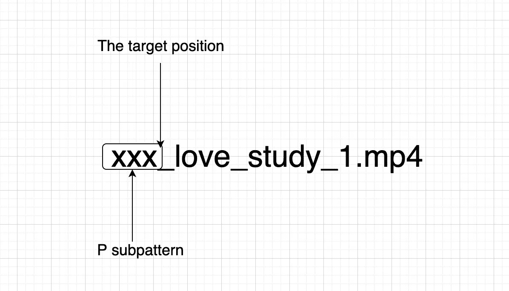

# 我老板:这么简单的正则表达式都学不会吗？😡

> 原文：<https://javascript.plainenglish.io/my-boss-cant-you-learn-such-a-simple-regular-expression-a194d17201a8?source=collection_archive---------5----------------------->

## 我老板的愤怒

Photo by [freestocks](https://unsplash.com/@freestocks?utm_source=medium&utm_medium=referral) on [Unsplash](https://unsplash.com?utm_source=medium&utm_medium=referral)

# 前言

**你是那种因为正则表达式看起来复杂而不想学的人吗？别担心，我以前也是这样，但现在不是了。**

我老板有一次跟我说，**“这么简单的正则表达式你都学不会？”**

为了学习正则表达式，我看了很多文章和书籍，经过大量的实践，终于对正则表达式有了一些了解。

我想试着用更简单易懂的方式和你一起学习正则表达式，我们一起来做吧！

# 3 篇正则表达式文章

朋友们，我打算写 3 篇文章来讲解正则表达式的相关知识。如果你对它感兴趣，欢迎在文章底部评论。

1.  **关于正则表达式中的“位置”匹配知识**
2.  关于正则表达式中的字符串匹配知识
3.  正则表达式分析的 10 个例子

# 正则表达式的位置是什么？

如下图箭头所示，正则表达式的位置可以理解为相邻字符之间的位置。

我们可以用一个空字符串来比较“位置”。“hello”的开头、结尾和间隔可以用空字符串连接。

# 正则表达式中有哪些位置？

正则表达式中有 8 个与位置相关的符号:

1.  ^
2.  $
3.  \b
4.  \B
5.  ？=p
6.  (?！p)
7.  (?<=p)
8.  (?

Don’t worry, they are easy to learn. Come on, let’s conquer all the 8 symbols together.

# 1\. ^

It matches the beginning of the input. If the multiline flag is set to true, then the position immediately following a newline is also matched.

**例如:**

如何在“你好”开头插入笑脸(😄 )?

# 2\. $

它匹配输入的结尾。如果 multiline 标志设置为 true，则换行符之前的位置也匹配。

这是正则表达式中两个最简单的位置字符。你觉得他们很单纯吗？

# 3.\b

它代表了单词的边界，包含三个规则。

1.  位置在\w 和\W 之间
2.  ^和\w 之间的位置
3.  位置在\w 和$之间

**例如:**

如何将“xxx_love_study_1.mp4”转换为`❤️xxx_love_study_1❤️.❤️mp4❤️`？

# 4.\B

它代表一个非词边界，与\b 相反，其规则如下:

1.  位置在\w 和\w 之间
2.  位置在\W 和\W 之间
3.  ^和\W 之间的位置
4.  位置在\W 和$之间

我们还是用上面的例子，这段代码执行的时候会发生什么？

是的，它会看起来像这样。

# 5.(?=p)

紧随其后的位置需要满足 p 子模式。

我们还是用`xxx_love_study_1.mp4`的例子。如果要在`xxx`前面插一颗心，应该怎么写？

是这样吗？不，如果你那样做，“XXX”就会消失。

使用(？=p)可以轻松解决这个问题。

# 6.(?！p)

`(?=p)`的反意，可以理解为`(?=p)`匹配位置以外的位置。

我们仔细对比一下。除了(？=xxx)匹配第一个位置，所有其他位置都用(？！xxx)。

# 7.(?<=p)

It is a position where the content preceding it needs to match the p subpattern.

We still use this example: we want to insert a heart after xxx, what should we do?

# 8\. (?

The reverse meaning of 【 and it can be understood as a position other than the position matched by 【 .

Let’s compare it carefully. Except 【 matches the first position, all other positions are matched by 【 .

# Test learning

**以上都是关于正则表达式中的“位置”,让我们看几个例子来测试我们的学习。**

# 1.格式化货币

请将“123456789”转换为“123456789”。

**答题流程**

问题的规律是从后往前每三个数字前加一个逗号(需要注意的是开头不用加逗号)。符合`(?=p)`的规律吗？

`p`可以代表三个数字，要加逗号的位置正好是`(?=p)`匹配的位置。

**第一步**

我们可以先得到最后一个逗号。

第二步

获取所有逗号。

如果我们想得到所有的逗号，我们要解决的主要问题是什么？

是的，如何表示一组三个数就是解决第一个问题，太简单了，我们用括号就可以解决。

**第三步**

去掉第一个逗号。

我们很快就能解决这个问题。那首先怎么去掉逗号呢？没错，就是`(?! P)`。它可以意味着这个位置不能是第一。

哇，太棒了！

# 2.移动格式

请将手机号码`18379836654`转换为`183-7983-6654`

有了上面格式化钱的经验，相信做这道题会轻松很多。

# 最后

**感谢阅读。**我期待着您的关注和阅读更多高质量的文章。

 [## 采访者:“npm 跑 xxx”怎么了？

### 一个大多数人都不知道的秘密。

javascript.plainenglish.io](/interviewer-what-happened-to-npm-run-xxx-cdcb37dbaf44)  [## 每个开发人员都应该知道的 20 种 JavaScript 数组方法

### 你知道这 20 个数组方法是怎么实现的吗？

javascript.plainenglish.io](/20-javascript-array-methods-every-developer-should-know-6c04cc7a557d)  [## 让你看起来像高级开发人员的 8 个很酷的 GitHub 技巧

### 使用 GitHub 可以做的 8 件很酷的事情

javascript.plainenglish.io](/8-cool-github-tricks-to-make-you-look-like-a-senior-developer-ab8fe9ae9b14)  [## 面试官:可以“x！== x "在 JavaScript 中返回 True？

### 你可能不知道的五个神奇的 JavaScript 知识点！

javascript.plainenglish.io](/interviewer-can-x-x-return-true-in-javascript-7e1d1fa7b5cd)  [## 123['toString']。length + 123)用 JavaScript 打印出来？

### 95%的前端开发者回答错误的问题。

javascript.plainenglish.io](/what-does-123-tostring-length-123-print-out-in-javascript-2c804a414325) 

*更多内容请看*[***plain English . io***](https://plainenglish.io/)*。报名参加我们的* [***免费周报***](http://newsletter.plainenglish.io/) *。关注我们关于*[***Twitter***](https://twitter.com/inPlainEngHQ)*和*[***LinkedIn***](https://www.linkedin.com/company/inplainenglish/)*。查看我们的* [***社区不和谐***](https://discord.gg/GtDtUAvyhW) *加入我们的* [***人才集体***](https://inplainenglish.pallet.com/talent/welcome) *。*