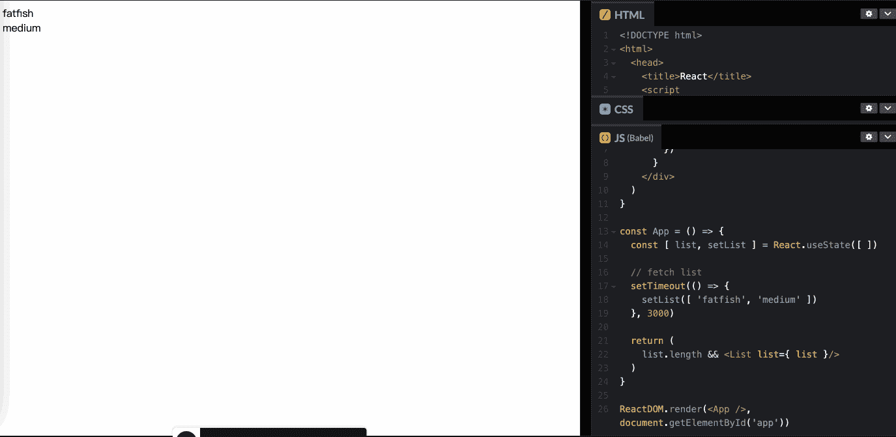

# 我老板:你根本不知道反应！😠

> 原文：<https://javascript.plainenglish.io/my-boss-you-dont-know-react-at-all-f493970f1807?source=collection_archive---------0----------------------->

## 你必须知道的 React 的 3 种错误用法。

# 前言

我在 React 工作了很多年，我确信我对它非常了解，但最近我的老板对我说:“你根本不了解 React，你对它一无所知。”

我很生他的气，但他指出了我程序中的三个漏洞。

# 1.你知道怎么用“&&”吗？

在 React 程序中，我经常使用“&&”操作符来决定是否显示内容，方式如下:

**我的上司:** **【难道你不知道& &的特点吗】操作员？当请求没有成功返回时，将直接呈现“0”。”**

我不相信，因为我一直都是这样写代码的，从来没有犯过错误。为了证明老板是错的，我写了下面的例子

**OMG！我老板说的没错，页面一开始显示的是 0，3 秒后显示的是列表。**

**为什么？**

**提示**(来自 [MDN](https://developer.mozilla.org/en-US/docs/Web/JavaScript/Reference/Operators/Logical_AND) ):“一组布尔操作数的逻辑 AND ( & &)运算符(逻辑合取)当且仅当所有操作数为真时为真。否则就是假的。”

更一般地，当从左到右求值时，运算符返回遇到的第一个假操作数的值，或者如果它们都为真，则返回最后一个操作数的值。

**几个例子**

现在我终于明白为什么那样写代码会导致错误。原因如下:

**如何解决？**

我找到了三种方法来解决这个问题。我希望你不要犯和我一样的错误。祝福你。

# 2.“道具.儿童”的奇怪行为

我猜你也写过类似的代码。向`<Container />`组件传递内容时，将显示**【孩子】**。否则，将显示一个空的工具提示。像下面这样:

**我的老板:“你必须谨慎使用‘儿童’属性，它会引起逻辑异常！就像下面这些情况。”**

**1。清空列表数据**

你认为这个例子会显示什么——“空”吗？

很不幸，答案是另一个。你也觉得不可思议吗？朋友们，一定要非常谨慎地使用`props.children`。否则老板可能会扣你工资。

props.children

**为什么？**

让我们向“容器”组件添加一行代码，并尝试打印出子组件是什么！

是的，你是对的。此时，“children”是一个空数组，所以显示“children 的内容是:”而不是“empty”

**怎么解决？**

使用[做出反应。Children.toArray](https://reactjs.org/docs/react-api.html#reactchildrentoarray) 解决这个问题会很容易，这时你会看到“空”显示出来。所以如果你真的需要用孩子作为条件判断，我建议你用这个方法！

# 3.关于安装和更新的问题

在 React 中通过状态切换组件是很常见的，但是这个小东西也会让你迷惑。

在下面的代码中，你是否认为当你切换名称的值时，一个演示组件会被卸载，另一个会被挂载？

我录了一个简短的 gif 给你说实话，你也可以通过 CodePen 试试。

**为什么？**

虽然我们写了两个`Demo`组件，并假设它们会分别挂载和更新，但 React 认为它们是同一个组件，所以`componentDidMount`只会执行一次。

**如何解决？**

但是当我们想写两个完全相同的组件，却传递不同的参数时，该怎么办呢？

是的，你应该给这两个组件添加不同的键，这样 React 就会认为它们是不同的组件。组件安装也将被单独执行。

`Let's try`

key for Demo

# 最后

**感谢阅读。**期待期待您的关注，阅读更多高质量的文章。

 [## 让你看起来像高级开发人员的 8 个很酷的 GitHub 技巧

### 使用 GitHub 可以做的 8 件很酷的事情

javascript.plainenglish.io](/8-cool-github-tricks-to-make-you-look-like-a-senior-developer-ab8fe9ae9b14)  [## 10 个你可能不知道答案的简单面试问题

### 99%的人不一定知道答案。

javascript.plainenglish.io](/10-easy-interview-questions-you-may-not-know-the-answer-e9421a0953b8)  [## 面试官:可以“x！== x "在 JavaScript 中返回 True？

### 你可能不知道的五个神奇的 JavaScript 知识点！

javascript.plainenglish.io](/interviewer-can-x-x-return-true-in-javascript-7e1d1fa7b5cd)  [## 123['toString']。length + 123)用 JavaScript 打印出来？

### 95%的前端开发者回答错误的问题。

javascript.plainenglish.io](/what-does-123-tostring-length-123-print-out-in-javascript-2c804a414325) 

*更多内容请看*[***plain English . io***](https://plainenglish.io/)*。报名参加我们的* [***免费周报***](http://newsletter.plainenglish.io/) *。关注我们关于*[***Twitter***](https://twitter.com/inPlainEngHQ)*和*[***LinkedIn***](https://www.linkedin.com/company/inplainenglish/)*。查看我们的* [***社区不和谐***](https://discord.gg/GtDtUAvyhW) *加入我们的* [***人才集体***](https://inplainenglish.pallet.com/talent/welcome) *。*