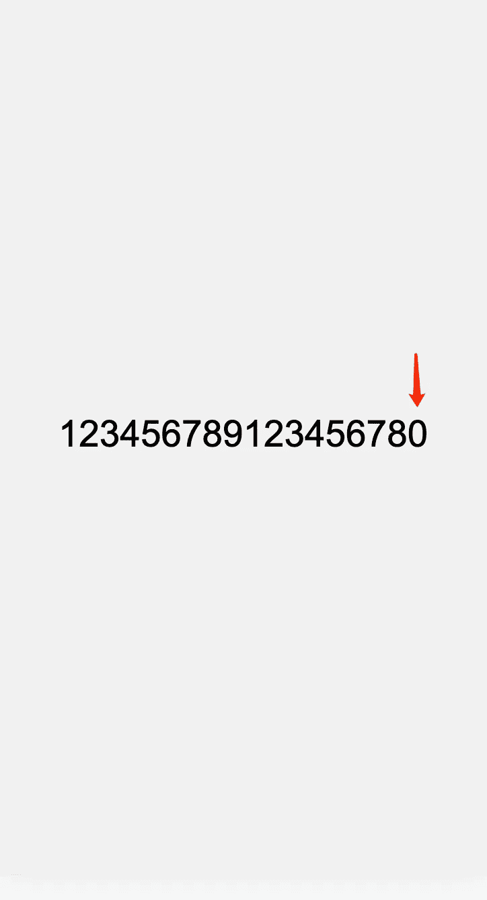
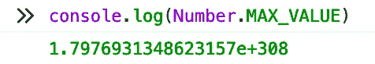
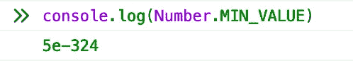
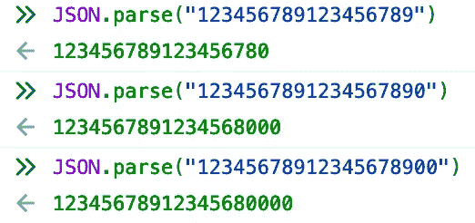

# 😠我的老板:你已经工作 5 年了，但是为什么你仍然犯这个简单的错误？

> 原文：<https://javascript.plainenglish.io/my-boss-you-have-been-working-for-5-years-but-why-do-you-still-make-this-simple-mistake-7a5f2c4fab4e?source=collection_archive---------1----------------------->

## 这可能是每个人都犯过的错误

我的朋友 Lily 已经工作了 5 年，她过去一直是一名前端工程师。

**很不幸，她被老板批评了，因为她在工作中犯了一个错误，这是一个很简单却容易被忽视的问题。**

# 此**错误的描述**

问题大概是这样的。

Lily 负责公司的一个重要项目，其中一个模块是显示一条与**数字**相关的信息。

这是后端工程师接口返回的信息**(只是一个例子)**

朋友们，我们调用`getInfo`接口会返回什么信息？会是`123456789123456789`吗？

通过 chrome 浏览器的调试工具可以看到，似乎一切都和我们想象的结果一样`123456789123456789`。

**但是页面上显示的结果是** `**123456789123456780**` **，最后一位是 0 而不是 9**

**到底是怎么回事？这太奇怪了。**

# 原因分析

我尝试分析返回的位数，发现只有位数超过 16 位时，才会出现后几位不一致的问题。

**是因为数字太大，出现了精度损失吗？**

**`**Java**`**语言中的 Long 类型是 64 位，难道** `**Long**` **类型中的** `**JavaScript**` **语言小于 64 位？****

**Omg，`JavaScript`好像没有`Long`类型的数据！**

**其实在`JavaScript`中，我们用一个数字来表示类型号的值。**

**数字类型的总长度为 64 位。这 64 位大致是这样分配的，其中 53 位代表小数，10 位代表指数位，1 位代表符号位。因此，数字整数的表示范围是`-2^53 ~ 2^53`。**

**让我们试着在控制台上用 JavaScript 打印出最大值和最小值。**

********

**在其他语言中，如 Java，Long 类型占用 64 个二进制位，最大值为 9223372036854774807(2⁶-1)，长度约为 19 位。**

**在`JavaScript`中，由于数字类型的值也包含小数，所以最大值为 9007199254740993 (2^53 - 1)，长度约为 16 位。**

****所以当 Java 向 JSON 返回超过 16 个**位**的长类型字段时，前端 JavaScript 得到的数据会因为溢出而失去精度。****

****

# **如何解决这个问题？**

**也许我们可以尝试在前端解决这个问题，但我认为我们应该寻求后端工程师的帮助。**

****我们应该将可能超出范围的数值型(Long)变量转换为字符串型(string)。****

# **最后**

****感谢阅读。**我期待着您的关注和阅读更多高质量的文章。**

** [## “我失去了一个工作机会，只是因为承诺。所有”

### 一次让我好难过的面试经历。

javascript.plainenglish.io](/i-lost-a-job-opportunity-just-because-of-promise-all-be396f6efe87)  [## 采访者:“npm 跑 xxx”怎么了？

### 一个大多数人都不知道的秘密。

javascript.plainenglish.io](/interviewer-what-happened-to-npm-run-xxx-cdcb37dbaf44)  [## 面试官:可以“x！== x "在 JavaScript 中返回 True？

### 你可能不知道的五个神奇的 JavaScript 知识点！

javascript.plainenglish.io](/interviewer-can-x-x-return-true-in-javascript-7e1d1fa7b5cd)  [## 现在是 2022 年，不要再滥用箭头功能了

### 不应该使用箭头函数的 4 种情况。

javascript.plainenglish.io](/its-2022-don-t-abuse-the-arrow-function-anymore-905862a9c668) 

*更多内容看* [***说白了。报名参加我们的***](https://plainenglish.io/) **[***免费周报***](http://newsletter.plainenglish.io/) *。关注我们关于* [***推特***](https://twitter.com/inPlainEngHQ) ，[***LinkedIn***](https://www.linkedin.com/company/inplainenglish/)*，*[***YouTube***](https://www.youtube.com/channel/UCtipWUghju290NWcn8jhyAw)*，以及* [***不和***](https://discord.gg/GtDtUAvyhW) *。对增长黑客感兴趣？检查* [***电路***](https://circuit.ooo/) *。*****