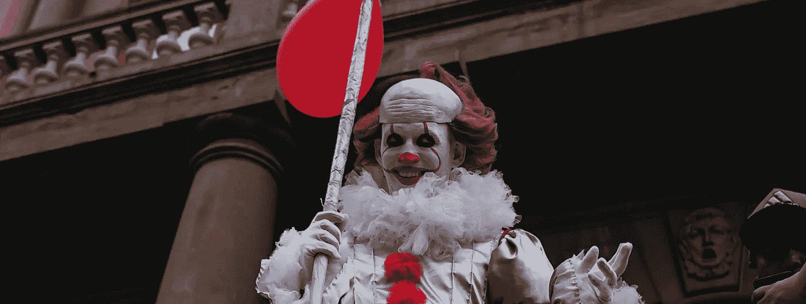

# 我的同事因为喝光了所有的咖啡而被解雇了

> 原文：<https://javascript.plainenglish.io/my-colleague-got-fired-for-drinking-out-all-the-coffee-1779d344880b?source=collection_archive---------4----------------------->

## 我在第一排看着这一切发生

Captured by [Harrison Haines](https://www.pexels.com/sk-sk/@harrisonhaines?utm_content=attributionCopyText&utm_medium=referral&utm_source=pexels) on [Pexels](https://www.pexels.com/sk-sk/fotka/pitie-mokry-styl-tehlova-stena-3536500/?utm_content=attributionCopyText&utm_medium=referral&utm_source=pexels)

那是 2018 年 2 月 4 日，我的同事正在享受他早上喝的每一口咖啡。但是他不知道，他就要被解雇了。

那天，我的同事被老板叫去开会，**被告知他将被公司解雇。他感到震惊和崩溃——他不知道会发生这种事。**

事件持续了一天，我的同事最终在保安的护送下离开了**。对所有相关人员来说，这都是艰难的一天，我同事被解雇的消息让我们所有人都大吃一惊。**

这是一个疯狂又出人意料的故事。但要正确理解它，我们需要回到几个月前。

# 见见亨利

亨利是一个正派的程序员。他总是按时完成他的工作，并且很少在我们的代码库中引入 bug。然而，尽管他是一名优秀的程序员，但他有一个缺点，这让他很难共事。他缺乏社交技巧，也不擅长与人交往。

如果你只是发出“噗噗”的声音，开始在脑子里对这篇文章的荒谬性进行小小的独白，我明白你的意思。我也是这么想的。老实说，我和亨利之间没有任何问题。

然而，我们的老板有不同的意见。

Captured by [Wilson Vitorino](https://www.pexels.com/sk-sk/@wilsonvitorino?utm_content=attributionCopyText&utm_medium=referral&utm_source=pexels) on [Pexels](https://www.pexels.com/sk-sk/fotka/vyraz-tvare-statie-postavenie-podhlad-3230473/?utm_content=attributionCopyText&utm_medium=referral&utm_source=pexels)

在这件事发生的几个月前，我们的老板就亨利的工作表现对他提出了警告。他被告知他需要改进，否则他将被解雇。考虑到他的技能和工作质量，你可以想象他有多惊讶。

发生在我眼前的一切，我认为亨利不明白我们的老板想告诉他什么。但是，他又不是一个喜欢交际的人。

然而，他认真对待这个警告，并努力提高自己的表现。他干得更好、更快、更久。但不幸的是，他在**试图改善错误的事情。这不是关于他的工作质量，而是关于他的个性。**

直到今天，我仍然不明白为什么我们的老板对亨利有这么大的不满。我很遗憾他们不能像正常人一样理解这一点。但正如有人会说的，职场是一个丛林，只有最强的才能生存。

我认为主要的问题是我们的老板没有看到亨利的潜力。他对他缺乏信心。最后，我认为这是导致他被解雇的原因。这真的是一个悲伤的故事，我仍然不能相信它发生了。亨利是个好人，我认为他应该得到更好的。

但是你已经猜到了，他没有得到他应得的。

# 冲突

所以已经确定我的老板不喜欢亨利。这让我们想起了他被解雇的那一天。这只是又一个普通的日子，我们为期两周的冲刺即将结束，可以肯定地说我们有很多工作要做。

当我们为一整天的工作做准备时，早晨开始得很慢。我们需要来点活力，所以我们决定在厨房休息一会儿，喝杯咖啡。我们开着玩笑，抱怨着我们的生活，这只是开发者们在**通常的早晨例行公事。**

我们回到自己的办公桌前，收拾好东西，然后去会议室参加每日脱口秀。

> 每日站立会议只是一个简短的会议，在这里我们讨论我们昨天做了什么，我们今天要做什么，以及我们是否有任何问题。这是一种快速同步并确保每个人都在同一页面上的方法。

当我们进入会议室，**我们看到我们的老板和亨利在争论。我们都坐下来，假装什么也没看见。我们的老板开始单口相声，但他显然没有心情。他一直在模仿亨利的蒙娜丽莎。**

Credits: [BEETTHOW](https://www.pexels.com/sk-sk/@beetthow-1212639?utm_content=attributionCopyText&utm_medium=referral&utm_source=pexels) on [Pexels](https://www.pexels.com/sk-sk/fotka/malba-obraz-ilustracia-vintage-4658409/?utm_content=attributionCopyText&utm_medium=referral&utm_source=pexels)

起立鼓掌之后，我们都回到了自己的办公桌前，几分钟后，亨利来到我们的办公桌前，说他被解雇了。我们都很惊讶，没有人知道该说什么。我们问他发生了什么事，但他只是耸耸肩说他不知道。

当亨利面对我们的老板时，情况发生了变化。他没有攻击性或类似的东西。他只是想知道他被解雇的原因。

起初平静的对话很快升级为激烈的争论。几分钟后，我们发现自己置身于一部阿根廷肥皂剧之中。

我可以看到我的老板在发脾气，争论了几分钟后，他怒气冲冲地离开了会议室。亨利跟在他后面，我们可以听到他们在走廊里互相喊叫。

几分钟后，我们的老板回到房间，告诉我们亨利已经被保安护送出大楼。听到这个消息本身就令人震惊，但是当我听到他解雇他的原因时，真正的惊喜来了。

# 解雇的理由

我们都被刚刚目睹的事情震惊了。但同时，我们也很好奇。我们知道老板不喜欢亨利，但是亨利能做什么让他如此生气呢？这一切都与咖啡有关。

Captured by [Mike Jones](https://www.pexels.com/sk-sk/@mike-jones?utm_content=attributionCopyText&utm_medium=referral&utm_source=pexels) on [Pexels](https://www.pexels.com/sk-sk/fotka/keramicky-zena-kava-salka-9051445/?utm_content=attributionCopyText&utm_medium=referral&utm_source=pexels)

当我们完成了早上的例行工作，我们回到了我们的工作站，但在此之前发生了一些(不那么)重要的事情。亨利**忘了给咖啡机**加满咖啡豆。

我很确定这不是原因。但引发这场大火的是一种催化剂。火开始慢慢燃烧，最后，它变得越来越强，烧毁了整个建筑。

# 余波

我们都惊呆了，谁也不知道该说什么。整个事件给我们留下了不好的印象，影响了我们的士气。我们都为亨利感到难过，我们都对老板的反应感到惊讶。

几个月后我离开了，再也没有回头。我不确定其他同事是不是留下来了或者换了工作。但是**我真的希望他们不要忘记再装满咖啡豆。**

故事到此结束。我不知道亨利后来发生了什么事，也不知道他在哪里。但我想听听你的想法。

***如果要面对同样的情况，你会怎么做？***

我希望你喜欢这个故事。如果你想从我这里听到更多或者阅读更多，可以考虑使用 [***这个链接***](https://bernardbad.medium.com/membership) ***成为一个中等会员。***

*更多内容看* [***说白了就是***](https://plainenglish.io/) *。报名参加我们的* [***免费每周简讯***](http://newsletter.plainenglish.io/) *。关注我们* [***推特***](https://twitter.com/inPlainEngHQ) *和*[***LinkedIn***](https://www.linkedin.com/company/inplainenglish/)*。加入我们的* [***社区不和谐***](https://discord.gg/GtDtUAvyhW) *。*