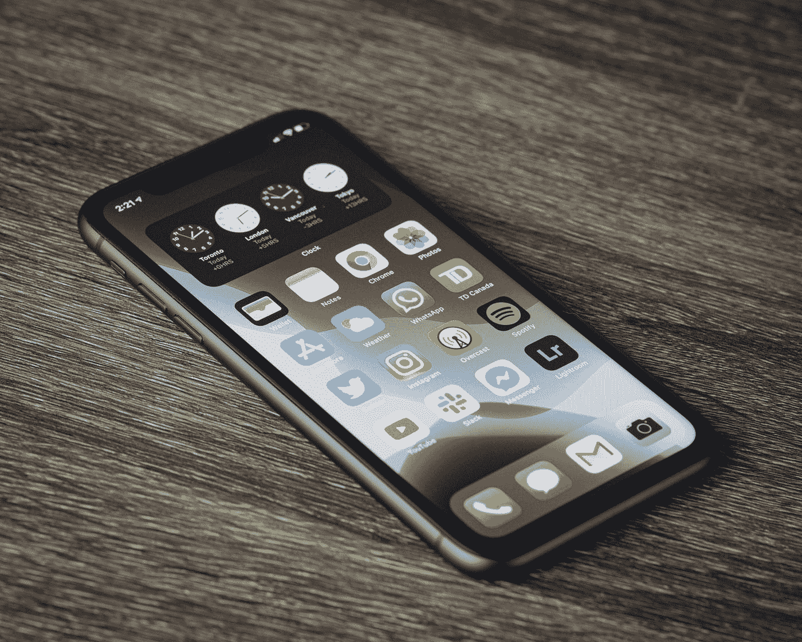

# 我对 Web Share API 的体验

> 原文：<https://javascript.plainenglish.io/my-experience-with-the-web-share-api-b76a95a2b3bf?source=collection_archive---------17----------------------->

## 吸取的教训。



Photo by [Thom Bradley](https://unsplash.com/@thombradley?utm_source=medium&utm_medium=referral) on [Unsplash](https://unsplash.com?utm_source=medium&utm_medium=referral)

# 背景

在过去的几年里，我一直在开发一个 web 应用程序，最近我决定用 Svelte 重写它。作为该过程的一部分，我必须重新实现与其他用户共享页面的能力。为了做到这一点，我依赖于[网络共享 API](https://developer.mozilla.org/en-US/docs/Web/API/Web_Share_API) 。

虽然浏览器支持不是最好的，但它是在足够多的移动设备上提供功能的良好开端，这是我的主要目标。

# 问题是

在这个重新实现的过程中，我遇到了一个场景，这个标题并不是在所有情况下都被使用。在查看了分享功能的[文档后，它指出浏览器可能会忽略该标题。](https://developer.mozilla.org/en-US/docs/Web/API/Navigator/share)

```
await navigator.share({
  title: document.title, // ignored by Safari on iOS
  url: window.location.href,
});
```

对我来说，最主要的问题是——这个头衔从何而来？对于某些页面，标题会正确显示，而其他时候，当它被明确定义时，它会显示为`undefined`。在绞尽脑汁了一会儿之后，我终于找到了问题的原因。

# 解决方案

至少当它来到 iOS 上的 Safari 时，传递到函数中的标题根本没有被使用(文档警告可能会发生这种情况)。相反，Safari 似乎会单独调用传入的 URL 来检索文档的标题。在我的例子中，我试图分享的页面是在认证之后的。无论 Safari 使用什么机制来加载该页面，都不会使用最初加载该页面时使用的授权头。

我做了一些额外的研究，并确定这是因为太容易通过欺骗标题来误导共享链接的接收者。为了提高安全性，它将信任通过 URL 生成的标题，而不是传递给`navigator.share`函数的标题。

# 结论

如果您尝试使用 Web 共享 API，如果您还想共享页面标题，请确保传入的 URL 不在身份验证之后。如果是在身份验证之后，至少要确保页面的标题仍然填充有适当的标题，以供 Web 共享 API 使用。

*更多内容请看*[***plain English . io***](https://plainenglish.io/)*。报名参加我们的* [***免费周报***](http://newsletter.plainenglish.io/) *。关注我们关于*[***Twitter***](https://twitter.com/inPlainEngHQ)*和*[***LinkedIn***](https://www.linkedin.com/company/inplainenglish/)*。加入我们的* [***社区不和谐***](https://discord.gg/GtDtUAvyhW) *。*