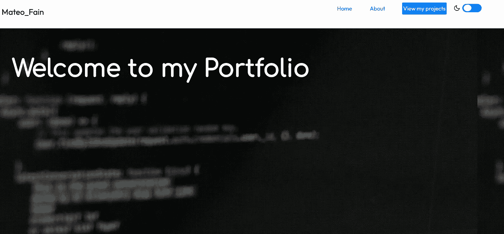
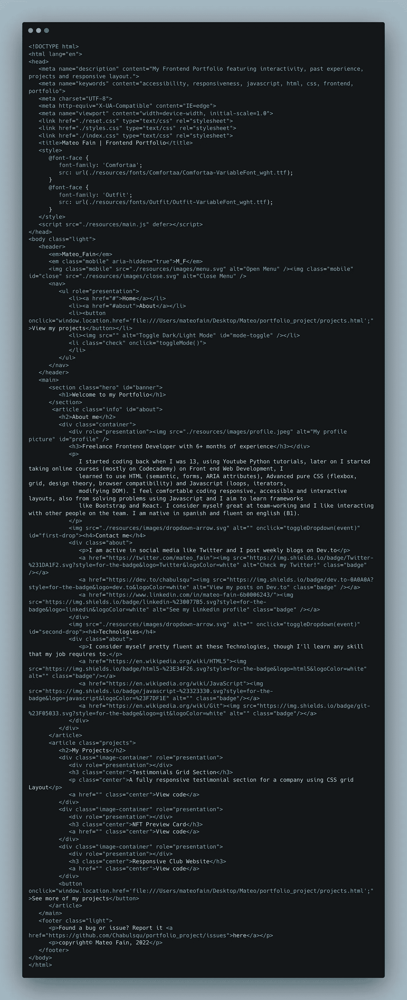
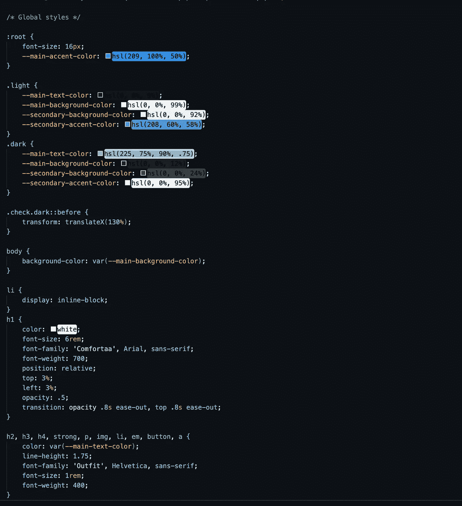
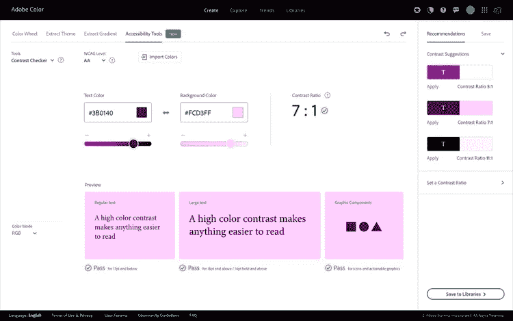
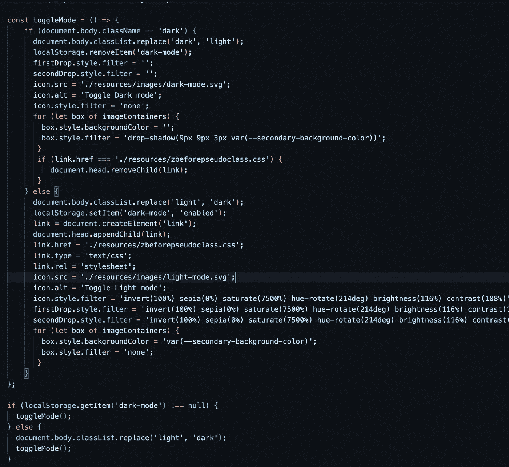
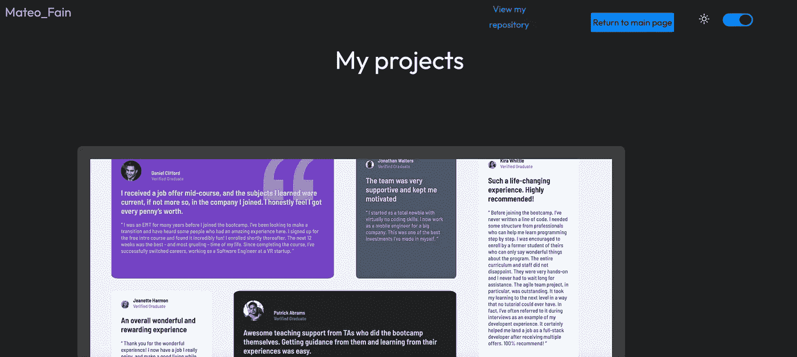

# 我的第一个前端投资组合

> 原文：<https://javascript.plainenglish.io/my-first-front-end-portfolio-6de9b3db1203?source=collection_archive---------2----------------------->

## 作为一名前端开发人员，一名新生开始构建您的第一个投资组合。

大家好，我几个月前开始学习前端开发课程，我最终决定制作我的第一个个人投资组合网站，这花了我整整一个月的时间，每天工作 1/2 小时。你可以看到它的[现场](https://chabulsqu.github.io/portfolio_project/index.html)或者[项目库](https://github.com/Chabulsqu/portfolio_project)。

My portfolio, on desktop view

## 第一步:线框我的网站

我用一种非常基本的方式在纸上制作了我的主页和项目页面的第一个线框，但是它们指导我并帮助我在编码时记住了设计。

## 第二步:编写基本的 HTML

我对两个页面都这样做了，并添加了我认为在项目后期会用到的类。

## 第三步:为你的作品集添加基本的风格

我建议在一个单独的样式表上这样做，而不是在每个页面上使用的样式表(styles.css ),这样当你像我一样在项目中做进一步的工作时就不必拆分代码。我还建议使用 reset.css 这样的重置文件来更容易地管理样式。

谈到总体设计和调色板，我希望页面有一个现代和柔和的外观，所以，使用 Adobe 颜色对比检查器并受 Twitter 设计的启发，我选择了暗和亮模式的主要背景，强调和文本颜色，我还试图使用柔和的阴影给它一个更深的外观。

## 第四步:让每个站点都响应

如果可以的话，尽可能多地使用相对度量，这样就可以少写代码。我研究过 5 种尺寸范围的设备:手机(320 到 480 像素)；平板电脑(481 到 768 px)；笔记本电脑(769px 到 1024 px)；桌面(1025px 到 1440px)和大屏幕(1440px+)。如果你看到你的样式表在这一点上变得很大(500 多行),试着把它分成更多，相信我，以后编辑起来会更容易。

## 步骤 5:为交互性添加 Javascript

在这种情况下，我决定使用 JS 制作一个亮/暗模式开关(在 CSS 类和自定义属性的帮助下)，一个 hamburguer 菜单(仅限移动设备)和两个 dropodowns，展示我在项目中使用的技术和我的联系信息。我还学会了使用本地存储，这样我可以保存用户的首选模式，并在他/她下次访问页面时使用它。

## 第六步:开始第二页

我决定在我的第二个页面上展示我所有的项目，链接到他们的代码和他们的实时版本，如果你喜欢，你也可以制作第三个或第四个页面，但对我来说，我认为这对于一个作品集来说已经足够了。

My projects page, seen on Dark Mode

## 步骤 7:最终功能和可访问性

由于媒体的询问，经过几天的头痛，在把一个视频转换成 gif 以便我可以直接在我的网站 hero 上使用它的背景图像属性之后；我终于完成了这一页。在这一点上，我建议你使用一些可访问性测试工具，如 Axe devtools，以确保你的网站是可访问的。如果你还没有这样做，为你的项目创建一个 Github 库，并在上面启用 Github 页面，制作一个像样的自述文件，并将其发布在任何你想发布的网站上。

今天的文章就到这里，希望你喜欢，祝你有美好的一天！😄

*更多内容看* [***说白了。报名参加我们的***](https://plainenglish.io/) **[***免费周报***](http://newsletter.plainenglish.io/) *。关注我们关于*[***Twitter***](https://twitter.com/inPlainEngHQ)[***LinkedIn***](https://www.linkedin.com/company/inplainenglish/)*[***YouTube***](https://www.youtube.com/channel/UCtipWUghju290NWcn8jhyAw)***，以及****[***不和***](https://discord.gg/GtDtUAvyhW)**** ***对成长黑客感兴趣？检查出* [***电路***](https://circuit.ooo/) ***。*****