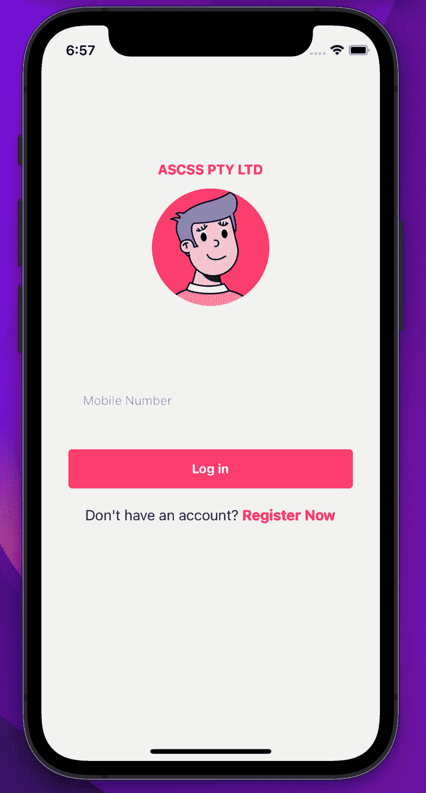
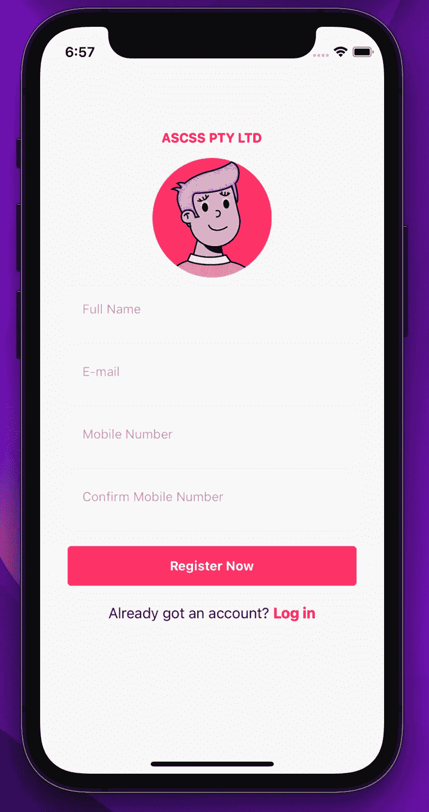
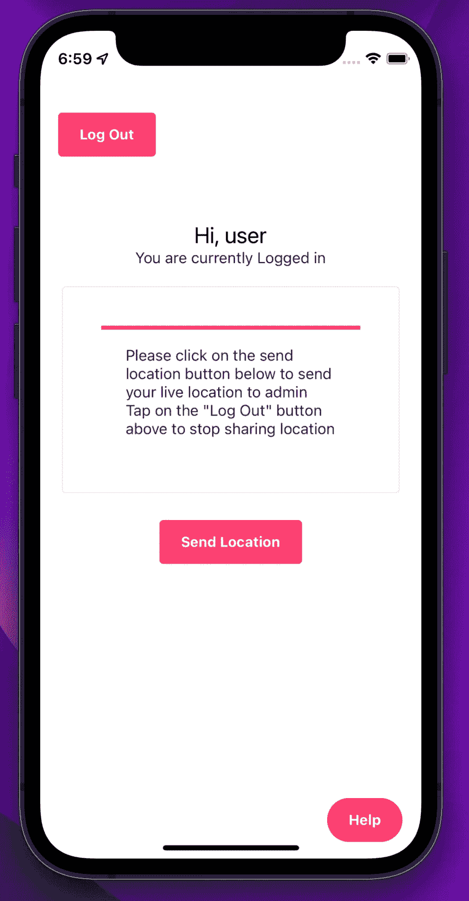
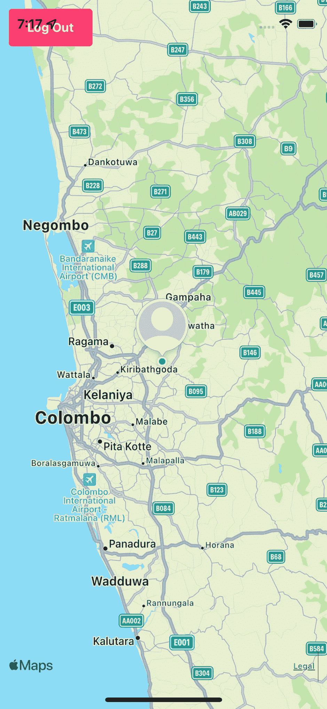

# 我的第一次本土经验

> 原文：<https://javascript.plainenglish.io/my-first-react-native-experience-dc187e79a299?source=collection_archive---------18----------------------->

首先，新年快乐！🥳希望你平安无事！这是我 2022 年的第一篇文章。我一直想开发一个移动应用程序，但没有机会开发。然后我得到了一个小项目来尝试。在这篇文章里，我分享几句我的经历。

React Native 是显而易见的选择，因为我已经使用过 React。好吧，那么后端呢？我选择了 [Firebase](https://firebase.google.com/) 作为后端。Firebase 为我的应用程序提供了我想要的所有功能。我得到的项目没有任何复杂的逻辑或类似的东西，所以它给了我更多关注 UI 的机会。对于 UI 组件，我发现了这个叫做 [UI Kitten](https://akveo.github.io/react-native-ui-kitten/) 的不错的框架。

然后我浏览了[入门指南](https://reactnative.dev/docs/getting-started)来设置开发环境。

## 要求

该应用程序的基本要求如下:

*   用户注册/登录
*   用户位置发送
*   在地图上显示用户的位置
*   当用户登录和注销时发送通知

为了进行身份验证，我使用了 firebase 电话提供商，它允许您通过手机号码登录。

当我把地图添加到屏幕上时，我遇到了一些问题，但是我可以用老的 StackOverflow 解决这些问题。

另一个挑战是使用 [Firebase Cloud Messaging](https://firebase.google.com/docs/cloud-messaging) 发送通知。经过反复试验，我也能够解决这个问题了。

以下是一些截图:

## **最终想法**

即使这是一个小的移动应用程序。我学到了很多。因为我已经知道反应是更容易的方式。到目前为止，我没有什么可抱怨的。

## 下一步是什么？

接下来的部分将是目前为止最难的部分。那就是发布应用程序。该应用程序将同时出现在 play store 和 app store 上。希望尽快完成，并关注更多相关信息。

说完，我们来到了文章的结尾。别忘了看看我的其他文章。下次再见了。在那之前，注意安全！✌️

*更多内容请看*[***plain English . io***](http://plainenglish.io/)*。报名参加我们的* [***免费周报***](http://newsletter.plainenglish.io/) *。在我们的* [***社区***](https://discord.gg/GtDtUAvyhW) *获得独家获得写作机会和建议。*