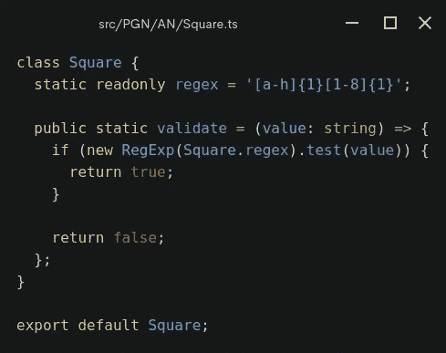
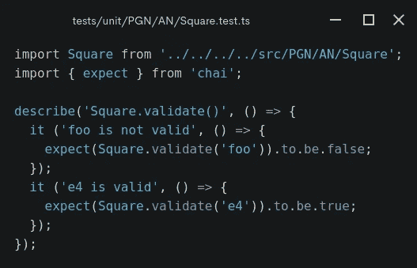
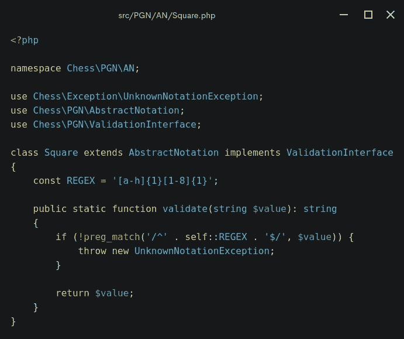
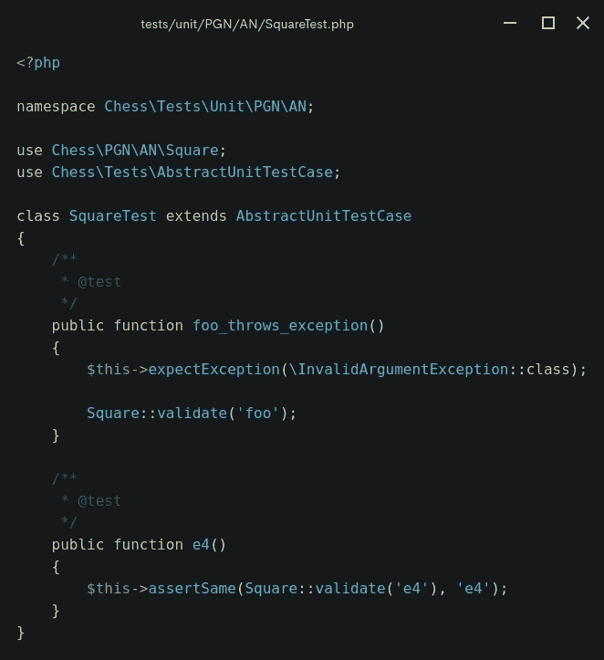

# 我的第一个 TypeScript 单元测试

> 原文：<https://javascript.plainenglish.io/my-first-unit-test-in-typescript-40a1e62d5a61?source=collection_archive---------10----------------------->

## 用摩卡和柴。


Photo by [Elizabeth Gottwald](https://unsplash.com/@wanderlustphotography?utm_source=unsplash&utm_medium=referral&utm_content=creditCopyText) on [Unsplash](https://unsplash.com/s/photos/uyuni?utm_source=unsplash&utm_medium=referral&utm_content=creditCopyText)

大家好，我希望你们今天都过得愉快。这是系列文章[为什么 TypeScript 和 PHP 是好朋友](https://medium.com/geekculture/why-typescript-and-php-are-good-friends-964360fb75f6)的第一篇，我们将从头开始把复杂的静态类型、面向对象的代码库从 PHP 转录到 TypeScript。

今天，我们将学习:

*   如何在 GitHub 上建立一个类型脚本代码库
*   用 TypeScript 编写一个简单的类
*   与[摩卡](https://mochajs.org/)和[柴](https://www.chaijs.com/)一起做一些测试驱动开发 TDD

快乐编码和学习！但是首先，让我说几句开场白。

距离我上次使用 TypeScript 已经有很长时间了——大约四年前。在这段时间里，我主要关注的是不同的 web 开发堆栈，但感觉好像我处于一个很好的位置，可以将我的编程技能从一个堆栈转移到另一个堆栈。

我想这一系列的帖子将有助于我在旅途中恢复记忆。这是一个将你的 PHP 技能转移到 TypeScript 的好机会，反之亦然！

如果你是一个完全的新手，刚刚开始学习 TypeScript，那么可以考虑的一个好方法就是阅读教程和观看视频，以及从容易到困难地解决问题。

一次迈出一步非常有效，尤其是在你成为软件开发人员的职业道路的开始阶段。

然而，如果你有多年的经验，或者只是对不同的学习方式感到好奇，你可能会想使用一种基于同化的学习方式——也就是说主要基于观察和思考。

[](https://medium.com/geekculture/a-react-chessboard-with-redux-and-hooks-in-few-lines-6009cb724bb) [## 一种反作用棋盘

### React 在 2021 年非常酷，并且随着时间的推移会越来越好

medium.com](https://medium.com/geekculture/a-react-chessboard-with-redux-and-hooks-in-few-lines-6009cb724bb) 

我假设你熟悉编程的基础，并且从通才的角度探索一门新的语言感觉很舒服。如果这听起来像是您没有错过在 GitHub 上浏览趋势类型脚本库的机会，同时注意编码约定、目录结构等等。

[](https://github.com/trending/typescript) [## 一起打造更好的软件

### GitHub 是人们构建软件的地方。超过 7300 万人使用 GitHub 来发现、分享和贡献超过…

github.com](https://github.com/trending/typescript) 

说了这么多，让我们切入正题。

# 第一次提交

让我们看看第一次提交。

[第一次提交](https://github.com/chesslablab/ts-chess/commit/29e681dec04fb23ddfaa52585a18ab2e9302e3cd)到[chess lab/ts-chess](https://github.com/chesslablab/ts-chess)repo 包括成功运行这个项目的第一个单元测试所需的所有东西。

如您所见，代码库是在两个配置文件的帮助下建立的:`package.json`和`tsconfig.json`。我们将使用 Mocha 和 Chai 来编写单元测试。

请克隆回购。

```
$ git clone [git@github.com](mailto:git@github.com):chesslablab/ts-chess.git
```

然后检查提交日志以查看更早的提交。

```
$ git log --oneline
29e681d (HEAD -> master, origin/master, origin/HEAD) Implemented the Square class
```

然后结帐到第一个。

```
$ git checkout 29e681d
HEAD is now at 29e681d Implemented the Square class
```

不要忘记安装 npm 依赖项。

```
$ npm install
```

现在，您已经准备好在本地运行单元测试了。

```
$ npm test> test
> mocha -r ts-node/register tests/**/*.test.tsSquare.validate()
    ✔ foo is not valid
    ✔ e4 is valid2 passing (6ms)
```

现在你可能想喝一口水。

# TypeScript vs PHP

`Square.test.ts`的产量看起来很大，但实际上是什么呢？

答案就在这两个文件中:

*   [src/PGN/安/Square.ts](https://github.com/chesslablab/ts-chess/blob/29e681dec04fb23ddfaa52585a18ab2e9302e3cd/src/PGN/AN/Square.ts)
*   [测试/单位/PGN/安/平方](https://github.com/chesslablab/ts-chess/blob/29e681dec04fb23ddfaa52585a18ab2e9302e3cd/tests/unit/PGN/AN/Square.test.ts)

我刚刚开始将源存储库的目录结构复制到目标存储库。我从这两个开始，因为他们简单，我想。

`Square.ts`是 PGN [代数符号(AN)](https://en.wikipedia.org/wiki/Algebraic_notation_(chess)) 的一种构建模块，它允许确定一个特定的字符串值是否可以标识棋盘方格。



它是一个静态类，这意味着它不能被实例化，但是可以通过单元测试中显示的类名直接访问。



让我们通过比较上面的两个文件来看看 PHP 和 TypeScript 有多么相似或不同。换句话说，他们会在这种场合成为好朋友吗？

下面是 PHP 对应部分的样子。

*   [src/PGN/安/Square.php](https://github.com/chesslablab/php-chess/blob/master/src/PGN/AN/Square.php)
*   [测试/单元/PGN/安/平方测试. php](https://github.com/chesslablab/php-chess/blob/master/tests/unit/PGN/AN/SquareTest.php)



而这是用 [PHPUnit](https://phpunit.de/) 写的对应单元测试。



到目前为止一切顺利，我们正在接近目标。

# 他们看起来很相似，不是吗？

这是使 PHP 类似于 TypeScript 的第一次良好尝试，反之亦然，但是乍一看，上面描述的例子之间似乎仍然存在显著的差异。

如你所见，`Square.php`实现了`ValidationInterface`并扩展了`AbstractNotation`类，而`Square.ts`没有。另外，如果正则表达式不匹配，那么`Square::validate('foo')`抛出一个定制的 PHP 异常，而它的 TypeScript 副本`Square.validate('foo')`只是返回一个布尔值。

别担心，TypeScript 和 PHP 是最好的朋友，我们将在接下来的文章中解决这两个问题。

一步一个脚印，一点一点来。

敬请期待！

下面是“为什么 TypeScript 和 PHP 是好朋友”系列的更多帖子。

[](https://medium.com/codex/static-methods-not-supported-in-typescript-interfaces-54a01e1e46ea) [## TypeScript 接口中不支持静态方法

### 暂时

medium.com](https://medium.com/codex/static-methods-not-supported-in-typescript-interfaces-54a01e1e46ea) [](https://programarivm.medium.com/i-threw-a-custom-error-in-typescript-756fdd1d569c) [## 我在 TypeScript 中抛出了一个自定义错误

### 也就是说 PHP 中的一个异常

programarivm.medium.com](https://programarivm.medium.com/i-threw-a-custom-error-in-typescript-756fdd1d569c) 

*更多内容看* [***说白了就是 io***](https://plainenglish.io/) *。报名参加我们的* [***免费周报***](http://newsletter.plainenglish.io/) *。关注我们关于*[***Twitter***](https://twitter.com/inPlainEngHQ)*和*[***LinkedIn***](https://www.linkedin.com/company/inplainenglish/)*。加入我们的* [***社区***](https://discord.gg/GtDtUAvyhW) *。*