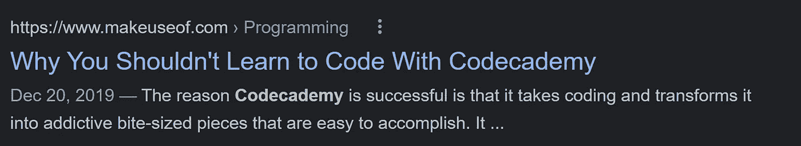

# 我对 Codecademy 的诚实评论:对有抱负的开发人员来说值得吗？

> 原文：<https://javascript.plainenglish.io/my-honest-review-of-codecademy-is-it-worth-it-for-aspiring-developers-245b4666c94a?source=collection_archive---------7----------------------->

## 我有两年的专业会员资格。以下是我未经过滤的观点。

Photo by [Brooke Cagle](https://unsplash.com/@brookecagle?utm_source=medium&utm_medium=referral) on [Unsplash](https://unsplash.com?utm_source=medium&utm_medium=referral)

image from [wikimedia](https://commons.wikimedia.org/wiki/File:Codecademy.svg)

拥有超过 5000 万用户的[，](https://expandedramblings.com/index.php/codecademy-facts-statistics/) [Codecademy](https://www.codecademy.com/) 不仅是最热门的代码学习平台之一，也是最受欢迎的平台之一。人们对它的评价从压倒性的积极，

screenshot by author

变得几乎完全相反。

screenshot by author

那么这个平台的现实是怎样的呢？

我尝试了 Codecademy Pro——Codecademy 的会员计划，年费为每月 19.99 美元——并完成了几门课程，以确定这个平台的真正价值。

My completed courses on Codecademy, image by author

我的结论是:Codecademy 是否值得真的取决于到目前为止你有多少编码经验以及你的目标是什么

## Codecademy 非常适合那些需要对自己的编码潜力建立信心的人。

Codecademy 在你的编码之旅中提供超级支持。他们不仅提供社区聊天来寻求其他用户的帮助，而且他们还有所有练习的提示和解决方案，当你遇到困难时随时可用，以及文章、备忘单、测验等，以确保你对关键概念有坚实的理解。

Quiz question on Data Structures. Screenshot by author.

## Codecademy 对于想要快速掌握新语言语法的开发人员来说非常有用。

如果你已经是一个对一种语言很有信心的开发人员，但却在另一种语言上苦苦挣扎，Codecademy 有一些很好的课程可以让你使用，这些课程不会在编码的基础上停留太久(比如什么是字符串或者什么是数组)，而是快速涵盖语法规则。

screenshot by author

更不用说他们提供结业证书，证明你确实可以用你选择的任何额外语言编写代码。

它们还提供了一些备忘单，如果你需要快速复习如何用一种你已经几个月或几年没有接触过的语言编程，你可以使用它们。

## Codecademy 非常适合那些只想尽快学会编码的人。

Codecademy 将在不到 30 个小时的时间里教你 Python 和 C++以及其他流行的编程语言，而 pro 版本也将通过用这些语言创建你的第一个项目来支持你。该平台非常适合基础编码的实践课程。

## Codecademy 对于那些真正想把自己的创造性思维和解决问题的能力提升到一个新水平的人来说并不是那么好。

对 Codecademy 的主要抱怨是，他们真的没有足够地挑战他们的用户。他们给你的编程任务通常超级容易解决。他们的解决方案是立竿见影的(尽管用一种你不熟悉的语言编写它们可能需要一些时间)，所以你并没有通过解决它们而真正获得很多新技能。

在 Codecademy 上有一些真正具有挑战性的问题……但是 Codecademy 会全程牵着你的手解决这些问题。

# 匆忙中的人们的总结

*   如果你想对一门新的编程语言有一个温和的介绍，使用 Codecademy
*   如果你已经会编程，但是需要语法复习，那么就使用 Codecademy
*   如果您已经可以用一种语言编程，但想快速学会用另一种语言编程，请使用 Codecademy
*   如果显著提高你解决问题的技能是优先考虑的事情，不要使用编程

仅此而已。感谢您的阅读！

*更多内容请看*[***plain English . io***](https://plainenglish.io/)*。报名参加我们的* [***免费周报***](http://newsletter.plainenglish.io/) *。关注我们关于*[***Twitter***](https://twitter.com/inPlainEngHQ)*和**[***LinkedIn***](https://www.linkedin.com/company/inplainenglish/)*。加入我们的* [***社区***](https://discord.gg/GtDtUAvyhW) *。**