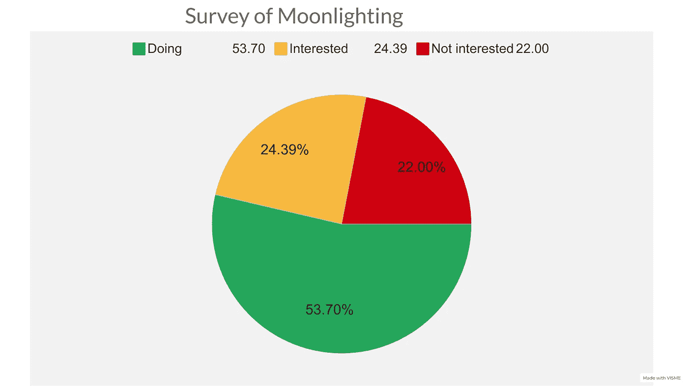

# 我最近的调查:超过 50%的开发者是兼职者

> 原文：<https://javascript.plainenglish.io/my-recent-survey-more-than-50-of-developers-are-moonlighters-128e92f7a334?source=collection_archive---------0----------------------->

## 兼职将很快改变远程工作的性质

Photo by [Luca Bravo](https://unsplash.com/@lucabravo?utm_source=medium&utm_medium=referral) on [Unsplash](https://unsplash.com?utm_source=medium&utm_medium=referral)

自从 Covid 袭击世界以来，远程工作变得非常受欢迎。一些大公司还没有设法回到老式的方式，即员工必须从 9 点到 5 点在办公室工作。

许多专家认为，开发工作的性质已经发生了如此大的变化，它可能永远不会完全回到旧的系统，因为开发人员已经尝到了在家工作的滋味。老实说，我也不是。

# 但是另一个问题出现了

在这些公司应对这些工作的远程性质之前，管理团队面临着另一个令人头疼的问题。

> 那是兼职！！

我想现在所有的开发者都知道这个术语叫做**兼职**！！

> 兼职指**一个人在主业之外的副业。在兼职中，这样的副业通常是由雇员在不通知雇主的情况下秘密进行的。**

许多开发人员除了主要的全职工作之外，还做一些额外的工作。远程工作者有足够的自由和机会做月光。如果这样做，雇主很难抓住开发商。

除了全职工作，我还做兼职，但我的雇主知道这一点，只要我完美地完成任务，他就不会介意。因为没有告诉我的雇主，感觉像是欺骗。

# 所以我很好奇

所以，我很好奇有多少开发人员在兼职……我感兴趣是因为我想知道有多少百分比的开发人员在兼职。

我做了一个谷歌表格，做了一个调查。41 名开发人员参与了调查。但是这个调查并不是对每个开发者都有效。参加这个调查我提了两个要求。

1.  至少有三年工作经验的开发人员。
2.  在做本职工作的同时获得工作机会的开发人员，或者一直在自己寻找兼职工作的开发人员。

Made by the author with Visme

在这 41 名开发人员中，有 22 人说他们正在做一份额外的工作，或者在主要工作之外做一个项目。

十名开发商表示，他们对兼职持开放态度。

其余的人对做多份工作不感兴趣。

由于只有 41 名开发人员参与了调查，这可能不是该行业的准确情况。但事实上，这是雇主和雇员之间越来越严重的问题。

# 前途如何？

随着越来越多的开发人员选择远程工作，兼职在开发人员中越来越受欢迎，远程工作的性质将会改变。

比如怎样？我不是 100%确定。

但首先，开发商和雇主之间的雇佣协议会更加严格。许多雇主希望合同中包含这样的条款，即开发者不能加班或做其他工作或项目。许多大公司已经在这么做了。

其次，兼职将成为整个行业更流行和普遍的做法。许多公司会接受它来留住他们最好的员工。

第三，自由职业者将是雇主更受欢迎的选择。一种新的工作将被创造出来。那是自由职业者和全职职位的混合体。

# 结论

这合乎道德吗？这个话题我已经讨论过一些了。这就像一个灰色地带。关于这个话题可能会有一些争论。但是我的意见很明确。只要你的雇主知道这件事，就没问题。否则就不是了。

很抱歉这会伤害你。但我不能证明在偏远地区兼职是正当的。

你可能会在这里读到文章: [***300 名开发人员因兼职而被解雇***](/300-developers-have-been-fired-for-moonlighting-e5b701080686?source=your_stories_page-------------------------------------) ***。***

*感谢阅读！当然，请与我们分享您的观点。如果你想支持我，请加入我！*