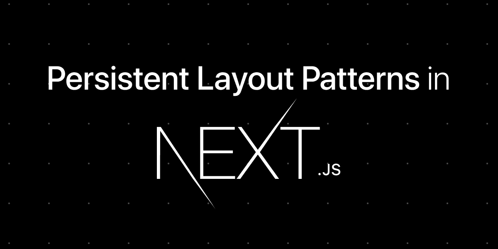

# Next.js 的持久化布局模式

> 原文：<https://javascript.plainenglish.io/my-revisited-typescript-persistent-layout-pattern-for-next-js-9491bb39b24c?source=collection_archive---------8----------------------->

## 代码模式

## 用 Next.js 管理布局的一个众所周知且非常高效的模式



当您开发 Next.js 应用程序时，您可能希望定义不同页面之间的通用布局。

那么复用的问题就出现了。官方文档为我们提供了一个实用的方法，但是在如何管理它的布局方面却有些欠缺。

# 我对 Next.js 持久化布局的建议

它由三件事组成:

1.  一个允许从属性中动态加载给定布局的组件。
2.  一个类型文件，允许在我们的页面和布局之间定义一个接口契约。
3.  遵守此接口协定的布局组件。
4.  最后，`pages/_app.tsx`文件中的更新考虑到了我们的布局。

让我们从类型定义文件开始，这里有`CodingSparkAppProps`，这是我们将在`pages/_app.tsx`中使用的属性，然后我们定义`CodingSparkPageLayoutProps`，它用我们应用程序可用的布局覆盖了一个相当通用的类型 LayoutArgs。

当然，它扩展了 Next.js 的默认类型:`NextPage`。

在下面的文件中，你会注意到默认情况下我们管理一个`none`布局，这意味着没有布局。如果您尚未将所有页面迁移到此布局系统，这将非常有用。

在这里，因为我们的布局很少，所以我们从一个`switch/case`语句开始，但是我们也可以使用一个对应表，比如一个`Map`或者一个对象。如果你开始有许多布局，这是我邀请你做的。

请注意，我们仅在使用布局时使用`next/dynamic`来加载布局，以便通过分块优化应用程序的第一次加载。

最后，很简单，我们要用上面在接口文件中定义的元数据“标记”我们的页面。

在这里，没有什么非常复杂的，我们甚至利用了自动完成！

```
**import** **type** { CodingSparkNextPage } **from** "modules/nextjs";**const** OnboardingPage: CodingSparkNextPage = () => {   
  **return** <div>Some content</div>;
};OnboardingPage.layout = { **type**: "onboarding" };**export** **default** OnboardingPage;
```

我们要做的最后一件事是将我们的布局与我们的应用程序连接起来，为此我们在文件`page/_app.tsx`中进行如下操作。

剩下的就是品尝成功的甜蜜味道…😌

[⚡️和您在法国🇫🇷方向的酒店](https://www.codingspark.io)

*更多内容请看* [***说白了。***](https://plainenglish.io/)

*报名参加我们的* [***免费周报***](http://newsletter.plainenglish.io/) *。关注我们关于*[***Twitter***](https://twitter.com/inPlainEngHQ)，[***LinkedIn***](https://www.linkedin.com/company/inplainenglish/)*，*[***YouTube***](https://www.youtube.com/channel/UCtipWUghju290NWcn8jhyAw)*，以及* [***不和***](https://discord.gg/GtDtUAvyhW) ***。***

***有兴趣缩放你的软件启动*** *？检查* [***电路***](https://circuit.ooo?utm=publication-post-cta) *。*

# 进一步阅读

[](/typescript-made-easy-a-guide-to-your-first-type-safe-app-with-next-js-wundergraph-and-prisma-e197a59e2b30) [## 轻松编写类型脚本:使用 Next.js、WunderGraph 和 Prisma 编写第一个类型安全应用程序的指南

### 是时候抛开恐惧，学习 TypeScript 了。让我们给你第一次“发现！”瞬间通过建立一个完整的…

javascript.plainenglish.io](/typescript-made-easy-a-guide-to-your-first-type-safe-app-with-next-js-wundergraph-and-prisma-e197a59e2b30)