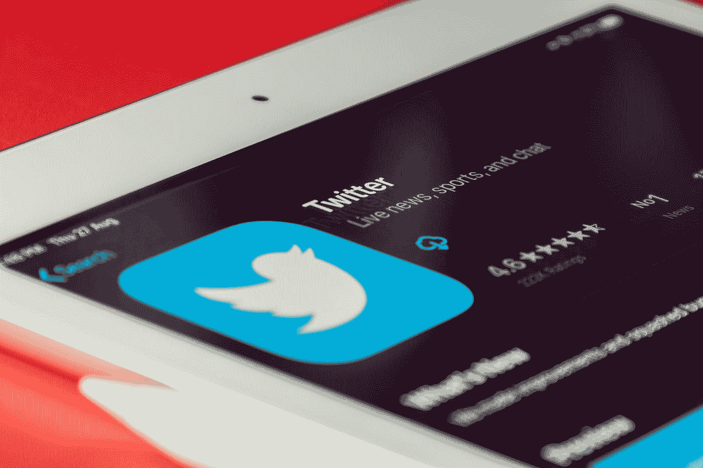
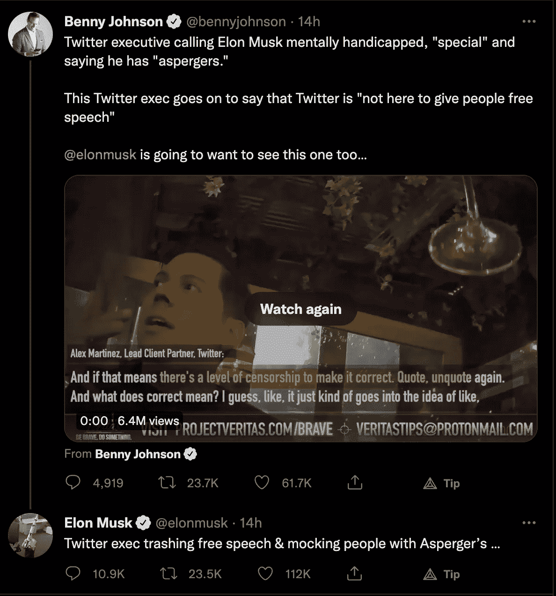

# 我的推特开发者朋友因为埃隆·马斯克而辞职

> 原文：<https://javascript.plainenglish.io/my-twitter-developer-friend-is-quitting-because-of-elon-musk-d4b7a97c062a?source=collection_archive---------8----------------------->

## 对，是关于收购的！

Photo by [Souvik Banerjee](https://unsplash.com/@rswebsols?utm_source=medium&utm_medium=referral) on [Unsplash](https://unsplash.com?utm_source=medium&utm_medium=referral)

是的，我们都知道 Twitter 将被地球上最富有的人埃隆·马斯克收购(尽管在写这篇文章的时候，关于这次收购是否会发生还有些混乱，埃隆可能会拖延或试图退出)。

我不想讨论这次收购对 Twitter 是否有利，因为那会是一篇很长的文章。但是，我对这次收购感觉不太好，我的看法/感觉无所谓。

最近我和我的 Twitter 开发者朋友进行了一次长谈。为了他的隐私，我不会分享任何可以识别他的东西。以下是他所说的关于戒烟和更多内容的总结。

结尾有一个转折。不要跳过😄

# 为什么他在考虑辞职

**首先，**工作环境和以前不一样了。这很正常。当一家公司的所有权即将发生变化时，每个人都很担心，因为没有人喜欢对将要发生的事情感到不确定和困惑。

此外，Twitter 正在从公有转为私有。这是一个巨大的变化。所有的员工都在谈论这件事，他们中的许多人都在寻找更好的替代者。像往常一样，我的朋友也是。

许多开发人员和员工都不喜欢马斯克在这件事上的态度。

> 马斯克说推特员工辞职对他来说是**【好】**。他说，“这是一个自由的国家。当然，如果有人对此感到不舒服，他们会主动去别的地方。那也行。”

他对员工和辞职的评论让人觉得他没有同情心。员工不喜欢。

其他部门比技术部门更不开心。由于埃隆在科技领域做出了巨大贡献，他还宣称，收购完成后，公司将超级专注于核心软件工程、设计、信息安全和服务器硬件。这是他和其他许多困惑的开发者仍然在那里的主要原因之一。

**其次，**员工对出售以及他们在公司的股份将会发生什么一无所知。他们从管理层那里听到了一些关于一切的消息。没有人想生活在黑暗中。另一件重要的事情是，不允许任何人公开谈论这笔交易。

首席执行长阿加瓦尔说，在马斯克的领导下，薪酬将基本保持不变，不过他没有从马斯克那里得到任何证实。

它们是不断发展的政策，许多重要的事情还没有确定下来。这对员工来说是个问题。

第三，上市公司和私营公司之间的工作文化是不一样的。虽然 Twitter 不是一家初创公司，但我不知道他到底是什么意思。但在我看来，私企和公企的工作文化不应该有太大差异。

第四，这是很重要的一点。马斯克将特斯拉的总部搬到了德克萨斯州。他会为 Twitter 做同样的事情吗？该公司重返办公室的灵活性如何？管理层试图通过说一切都会一样来让自己平静下来，但员工对答案并不完全满意。

**最后，**他真的不相信马斯克的“言论自由”对公司来说是个好兆头。人们已经可以随心所欲地发微博了。无论 Twitter 屏蔽了什么，这都是必要的，社交媒体应该以这种方式运作。这一行动可能会给公司及其未来带来问题。

马斯克在 Twitter 上也有一些粉丝。在这次宣布收购之前，大多数员工都非常喜欢埃隆，但现在的情况不一样了。

离开公司的可能性仍取决于一些因素。现在，收购很有可能不会发生。但无论他去哪里，我相信公司会很幸运地让他加入技术团队。

我几天前写了这篇文章，就在发表之前，我发现了另一条有趣的推文，关于另一名员工谈论 Twitter 和埃隆·马斯克。埃隆马斯克(Elon Musk)也在这条推文中进行了回复。

Source: [This Tweet](https://twitter.com/bennyjohnson/status/1526720931581894656?s=20&t=noEG-nYFh5X1mM7prUbWFQ)

*感谢阅读！如果你想支持我，* [***加入我吧！***](https://thefemaleprogrammer.medium.com/membership)

*更多内容看* [***说白了。报名参加我们的***](https://plainenglish.io/) **[***免费周报***](http://newsletter.plainenglish.io/) *。关注我们*[***Twitter***](https://twitter.com/inPlainEngHQ)*和*[***LinkedIn***](https://www.linkedin.com/company/inplainenglish/)*。查看我们的* [***社区不和谐***](https://discord.gg/GtDtUAvyhW) *加入我们的* [***人才集体***](https://inplainenglish.pallet.com/talent/welcome) *。***