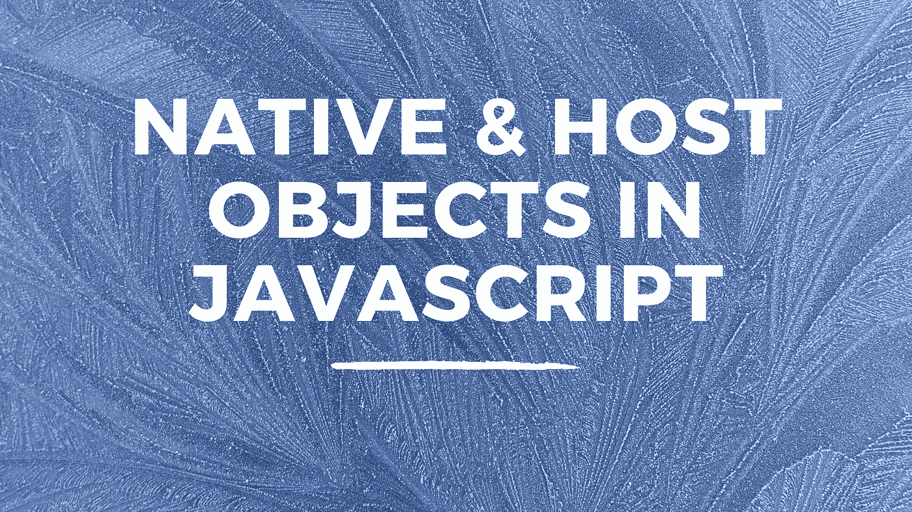

# JavaScript 中的本机和主机对象

> 原文：<https://javascript.plainenglish.io/native-host-objects-in-javascript-8ccd25809c04?source=collection_archive---------10----------------------->

## JavaScript 中的 Native & Host 对象是什么？



## 什么是内置对象？

当您在 JavaScript 中创建对象时，您基于您正在制作的程序的需求来建模数据。JavaScript 有一组所谓的标准内置对象，有时这些对象被称为本地主机对象。

这些对象的集合扩展了语言的功能，帮助我们使用它，它们与语言的不同部分相关。它们为我们提供了使用该语言时通常需要的功能。有时这些对象被称为全局对象，因为它们可以在代码中的任何地方工作。

有些对象代表基本的原始数据类型，例如:

*   线
*   数字
*   布尔代数学体系的

当您处理特定的编程领域时，还有其他对象，例如:

*   日期
*   数学
*   错误
*   正则表达式

最后，其他的是:

*   排列
*   目标
*   功能
*   图像

只要您在 JavaScript 的世界中，这些都是可以访问的，与您运行的环境无关。这些标准内置对象中的每一个都有一组内置属性和方法。方法本质上是一些内置的功能，允许我们执行一些过程或动作。

看看字符串对象，如果我们想在字符串中找到一个特定的字符，或者我们想替换字符串中的某些内容，我们可以使用字符串方法来帮助我们实现这一点。

所有方法都遵循您要调用方法的项的相同结构，后跟一个点、方法名、左括号和右括号。

```
itemName.methodName();
```

## 宿主对象

此外，我们还可以访问主机对象。软管对象不同于内置对象，因为它们是由我们的执行环境提供给我们的。窗口和控制台都是宿主对象的例子。

因此，如果有人问你本机对象和宿主对象之间有什么区别，你可以说本机对象来自 JavaScript 本身，而宿主对象特定于你所使用的环境！

我希望你喜欢这篇文章。请随时发表任何评论、问题或反馈，并关注我以获取更多内容！

*更多内容请看*[***plain English . io***](https://plainenglish.io/)*。报名参加我们的* [***免费周报***](http://newsletter.plainenglish.io/) *。关注我们关于*[***Twitter***](https://twitter.com/inPlainEngHQ)[***LinkedIn***](https://www.linkedin.com/company/inplainenglish/)*[***YouTube***](https://www.youtube.com/channel/UCtipWUghju290NWcn8jhyAw)***，以及****[***不和***](https://discord.gg/GtDtUAvyhW) *对成长黑客感兴趣？检查* [***电路***](https://circuit.ooo/) ***。*****