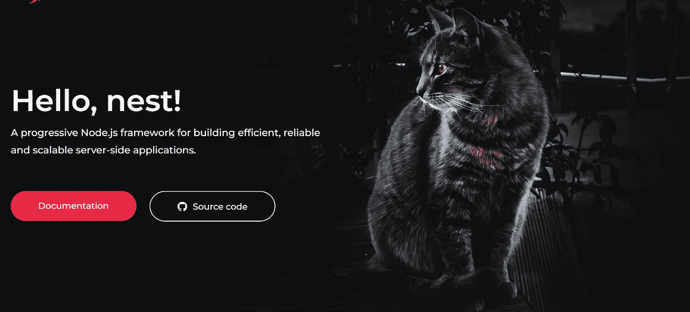
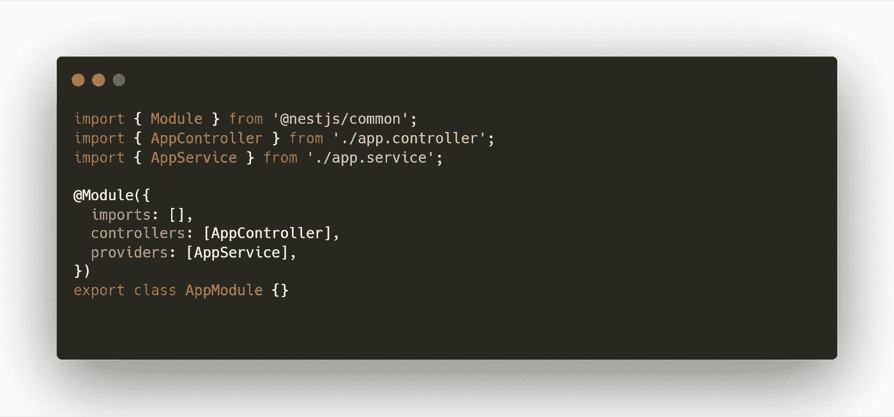
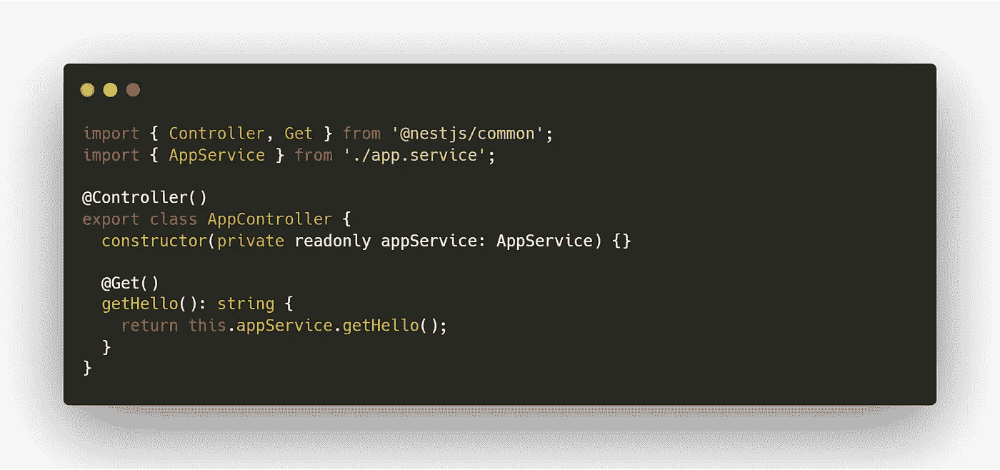
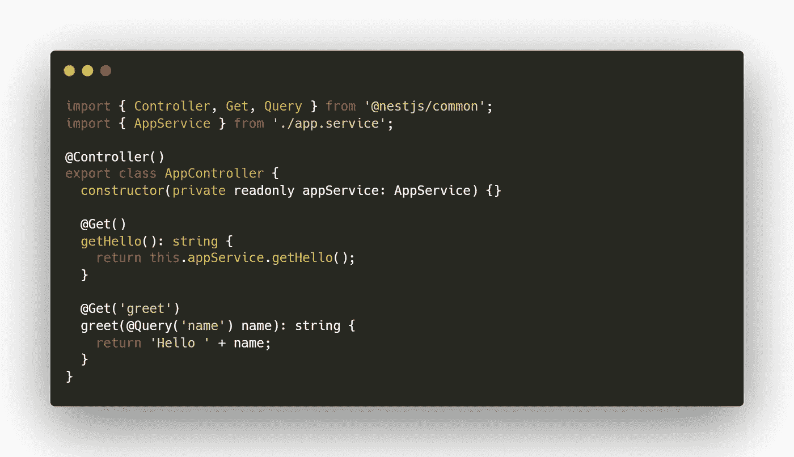
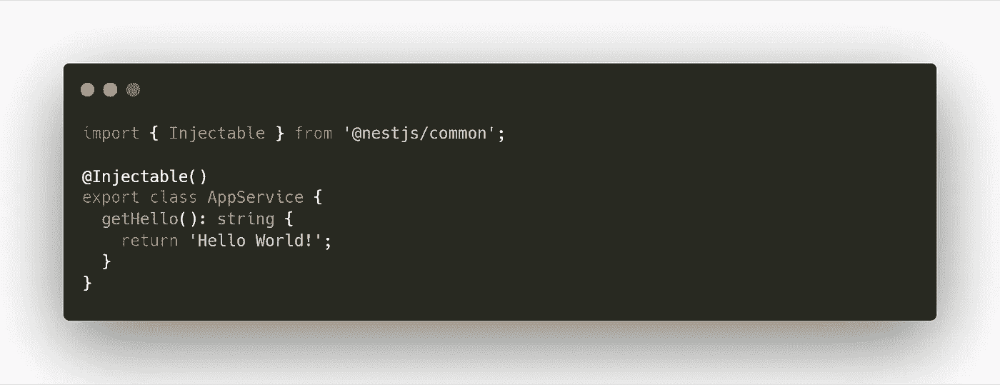

# Nest.js —入门

> 原文：<https://javascript.plainenglish.io/nest-js-getting-started-5ffa116cc7af?source=collection_archive---------9----------------------->



Nest.js

> 任何傻瓜都能写出计算机能理解的代码。优秀的程序员编写人类能够理解的代码。—马丁·福勒

# 介绍

NestJS 是一个开源的 node.js 框架，用于构建高效且可伸缩的服务器端应用程序。

在底层，NestJS 利用 express.js 来处理 http 请求，或者可以将其配置为利用 fastify.js(一个强大的 node.js http 服务器)。

与 express.js 或 koa.js 等其他 node.js 框架相比，NestJS 是一个完整的框架。与其他框架相比，NestJS 默认解决了一些需要大量设置和配置的问题:

*   代码组织
*   API 路由设置
*   设置 web 套接字。
*   命名规格
*   数据库集成
*   Typescript 设置
*   强大的 CLI

# 安装 NestJS

运行 NestJS 应用程序的唯一要求是 node.js 和 npm。以下命令检查 node.js 和 npm 是否已安装

```
node --version
npm --version
```

NestJS 可通过以下方法之一搭建:

## NestJS CLI

以下命令用于全局安装 NestJS CLI。

```
npm i -g @nestjs/cli
```

您还可以检查 NestJS CLI 的安装版本。

```
nest --version
```

bellow 命令用于可视化 NestJS CLI 可以完成的伟大工作。

```
nest --help
```

# 首次 NestJS 应用

通过在终端中执行下面的命令，可以创建一个名为**博客**的 NestJS 应用程序。

```
nest new blog
```

该应用程序可以通过在应用程序的目录中输入下面的命令来运行。

```
npm run start
```

出于生产率和可测试性的原因，如果 src 文件夹中有变化，NestJS 可以通过在终端中输入以下命令来重启应用程序:

```
npm run start:dev
```

# 应用架构

在 NestJS 应用程序中，一切都是结构化和有组织的。所有应用程序逻辑都存在于 src 文件夹中。默认情况下，它包含以下文件:

## 入口点(main.ts)

这是 NestJS 应用程序的入口点。它使用 **NestFactory.create** 并使用 **AppModule** 来创建应用程序。

main.ts

## 应用程序模块

**app.module.ts** 是应用的根模块。NestJS 应用程序应该至少有一个模块。

模块是用@Module 注释的类，它为类提供了更多信息。

该模块采用具有以下属性的单个对象:

*   提供者:它是注入这个模块的**服务**的列表。
*   控制器:是该模块中定义的**控制器**的列表。
*   imports:它是导出提供程序的导入模块的列表。
*   exports:它是服务的子列表(在 providers 中定义),被导出供其他模块使用。



app.module.ts

## 应用控制器(app.controller.ts)

**app.controller.ts** 是处理对根 url /的请求的控制器。**控制器使用可注入服务。**

控制器负责处理**请求**并将**响应**发送回客户端。

控制器还通过向**@控制器**装饰器传递一个字符串来定义应用程序的**路由**。



app.controller.ts

通过声明另一个函数并用 **@Get** decorator 进行注释，可以向控制器添加新的路由。下面的控制器有两条路径，默认的/和/greet 路径。

通过调用这个 URL[http://localhost:3000/greet？name=Bewar%20Salah](http://localhost:3000/greet?name=bewar%20salah) ，它将返回 **Hello Bewar Salah**



with greet

## 应用服务(app.service.ts)

**app.service.ts** 是一个由 **@Injectable** decorator 注释的服务。这个类可以注入任何其他类(控制器或其他服务)。

服务被提供给一个模块，并且它可以被同一模块中的控制器使用。服务可以由一个模块导出到另一个模块，以便由其他模块的控制器使用。

服务对于将逻辑从控制器中分离出来非常重要。控制器仅用于定义路由、请求和响应形状。该服务处理数据库查询和电子邮件发送。



app.service.ts

# NestJS CLI 和命令

*   在博客目录中创建新的博客控制器**如果目录不存在，也创建目录。**

```
nest g controller blogs
```

*   在博客目录中创建新的博客**模块**，如果目录不存在也创建目录。

```
nest g module blogs
```

*   在博客目录中创建新的博客服务，如果目录不存在，也创建目录。

```
nest g service blogs
```

*   在 blogs/dto 文件中创建名为 **blog.entity.ts** 的新**类**文件。

```
nest g class blogs/dto/blog.entity
```

*   引导您创建一个名为 **blogs** 的新目录，其中包含 dto、实体、控制器、服务和模块。

```
nest g resource blogs
```

# 结论

还有许多其他的概念，如认证和授权、验证、数据库集成等。每个都需要一篇文章。

NestJS 是非常强大和完整的框架。一切都是围绕 decorator(typescript 强大的特性)构建的，这使得代码可读性更好，测试更容易。

*更多内容请看*[***plain English . io***](https://plainenglish.io/)*。报名参加我们的* [***免费周报***](http://newsletter.plainenglish.io/) *。关注我们关于*[***Twitter***](https://twitter.com/inPlainEngHQ)[***LinkedIn***](https://www.linkedin.com/company/inplainenglish/)*[***YouTube***](https://www.youtube.com/channel/UCtipWUghju290NWcn8jhyAw)*[***不和***](https://discord.gg/GtDtUAvyhW) *。对增长黑客感兴趣？检查* [***电路***](https://circuit.ooo/) *。***