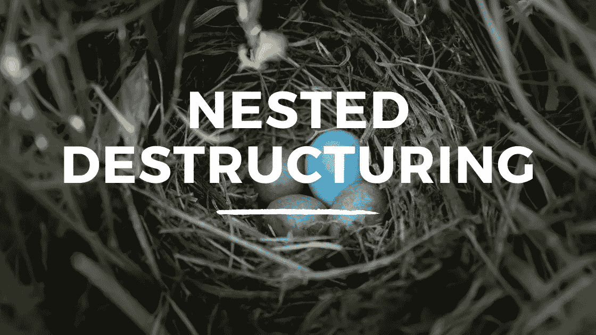

# JavaScript 中嵌套对象的析构

> 原文：<https://javascript.plainenglish.io/nested-destructuring-in-javascript-3fe186b1d34e?source=collection_archive---------4----------------------->

## 析构封闭在数组中的嵌套对象的指南。



我最近发表了两篇文章，解释了对[数组](/array-destructuring-in-javascript-c79b747dd864)和[对象](/basic-object-destructuring-in-javascript-7c4538ec70ec)的析构。当我们处理嵌套的数据结构时，比如一个嵌套的对象，我们也可以使用析构。让我们从析构一个包含在数组中的嵌套对象开始。

```
const cats = [{
  name: "Molly",
  owner: "Fred Larkin",
  color: "Brown",
  age: 10,
  kittens: 0
},
{
  name: "Bob",
  owner: "Sally Doe",
  color: "Black",
  age: 2,
  kittens: 0
},
{
  name: "Poppy",
  owner: "Alice Green",
  color: "Tabby",
  age: 3,
  kittens: 2
}];
```

上面的数组被赋值给一个名为*猫*的变量，它包含三个具有关于猫的属性的对象。如果我们想在第二个对象(Bob)中找出猫的名字，我们可以使用析构来实现。假设对象存储在一个数组中，我们从数组使用的方括号开始。我们将它设置为我们试图从中挑选属性的数据结构的名称。我们想访问第二个对象，就像我们在析构平面数组时一样，我们可以用逗号来跳过一个元素。然后我们用花括号，因为我们在一个对象里面，我们想从对象中挑选出属性的名字。就像我们从一个对象中析构值一样。

```
const cats = [{
  name: "Molly",
  owner: "Fred Larkin",
  color: "Brown",
  age: 10,
  kittens: 0
},
{
  name: "Bob",
  owner: "Sally Doe",
  color: "Black",
  age: 2,
  kittens: 0
},
{
  name: "Poppy",
  owner: "Alice Green",
  color: "Tabby",
  age: 3,
  kittens: 2
}];const [, { name }] = cats;console.log(name);
//Returns ---> Bob
```

就像对象析构一样，我们也可以给变量一个不同于属性名的名字。

```
const cats = [{
  name: "Molly",
  owner: "Fred Larkin",
  color: "Brown",
  age: 10,
  kittens: 0
},
{
  name: "Bob",
  owner: "Sally Doe",
  color: "Black",
  age: 2,
  kittens: 0
},
{
  name: "Poppy",
  owner: "Alice Green",
  color: "Tabby",
  age: 3,
  kittens: 2
}];const [, {name: catsName }] = cats;console.log(catsName);
//Returns ---> Bob
```

如果我们正在处理一个包含在对象中的嵌套对象，当我们执行析构时，我们不会使用方括号。相反，我们将使用花括号，即我们要从中选取元素的对象的名称，后跟我们要选取的属性的名称。

```
const cats = {
  one: {
    name: "Molly",
    owner: "Fred Larkin",
    color: "Brown",
    age: 10,
    kittens: 0
  },
  two: {
    name: "Bob",
    owner: "Sally Doe",
    color: "Black",
    age: 2,
    kittens: 0
  },
  three: {
    name: "Poppy",
    owner: "Alice Green",
    color: "Tabby",
    age: 3,
    kittens: 2
  }
};const { two: { name } } = cats;console.log(name);//Returns ---> Bob
```

我希望你喜欢这篇文章，请随时发表任何意见，问题或反馈，并关注我的更多内容！

如果你想了解更多关于 ES6 的知识，我最近发布了一个技能分享课程，你可以点击[这里](https://skl.sh/39wrP0w)进入

*更多内容请看*[***plain English . io***](https://plainenglish.io/)*。报名参加我们的* [***免费周报***](http://newsletter.plainenglish.io/) *。关注我们关于*[***Twitter***](https://twitter.com/inPlainEngHQ)*和*[***LinkedIn***](https://www.linkedin.com/company/inplainenglish/)*。加入我们的* [***社区不和谐***](https://discord.gg/GtDtUAvyhW) *。*