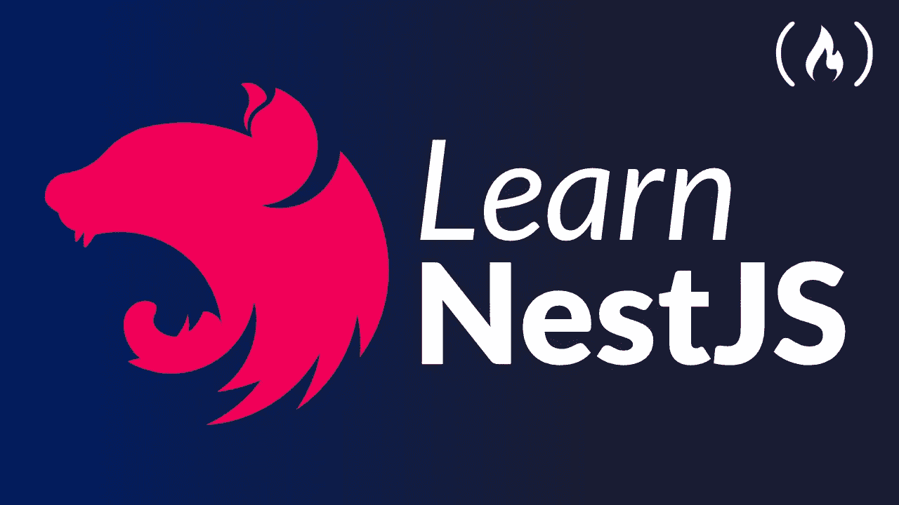

# NestJS 后端架构文件

> 原文：<https://javascript.plainenglish.io/nestjs-back-end-architecture-files-quick-start-dba96f45aff4?source=collection_archive---------2----------------------->

## 关于 NestJS 后端架构文件的快速教程。



**NestJS** 是基于 Express 构建的 Node.js 后端开发框架，利用了 TypeScript 的强大功能。

NestJS 利用了 JavaScript 作为一种语言和 Node.js 作为一种技术令人难以置信的流行性和健壮性。它的灵感来自 Angular、React 和 Vue.js 等常见库和框架，这些库和框架提高了开发人员的工作效率和体验。

即使考虑到服务器端 Node.js 的优秀库、助手和工具的数量，它们都没有有效地解决主要问题——应用程序的**架构**。

NestJS 提供了一个开箱即用的应用程序架构，允许开发人员和团队创建高度可测试、可伸缩、松散耦合且易于维护的应用程序。

## **安装 Nest CLI**

`yarn global add @nest/cli`

通过测试嵌套 CLI 命令的版本来检查您是否有权使用它，因此只需键入下一个命令:`nest -v`

如果你有正确的版本，那么安装将会成功，如果你有`*nest*: *command not found*`并且你有 Mac，请输入下一个命令:`sudo yarn global add @nest/cli`，然后输入密码。现在它应该全局安装 Nest CLI。

再次键入`nest -v`来测试我们是否有访问 nest 命令的权限。

使用 Nest CLI 创建一个新的 NestJS 项目

```
$ nest new project-name
```

# 模块

模块是用`@Module()`装饰器标注的类。`@Module()`装饰器提供元数据，**嵌套**利用这些元数据来组织应用程序结构。

使用嵌套 CLI 创建一个新模块

`yarn g module moduleName` —例如`yarn g module users`现在你应该会看到一个名为`users.module.ts`的新文件

# 控制器

控制器负责处理传入的**请求**并将**响应**返回给客户端。

**使用 Nest CLI 创建新控制器**

`yarn g controller moduleName`例如`yarn g controller users`，现在你应该会看到一个名为`users.controller.ts`的新文件

您可以添加`--no-spec`来避免控制器创建时附带的测试文件。

Nest CLI 会自动将控制器导入模块。

# 服务

**使用 Nest CLI 创建新服务**

例如`yarn g service users`，现在你应该会看到一个名为`users.service.ts`的新文件

您可以添加`--no-spec`来避免服务创建时附带的测试文件。

我们可以使服务可注入，以便在提供者中使用服务。

Nest CLI 会自动将服务导入模块。

例如服务:

```
@**Injectable**()
export class UsersService {
  users:User[] = []; getUserById(userId: string): User {
    return this.users.find((user) => user.id === userId);
  }
}
```

# 提供者

提供者是 Nest 中的一个基本概念。许多基本的嵌套类可以被视为提供者——服务、存储库、工厂、助手等等。提供者的主要思想是它可以作为一个依赖项被**注入**；这意味着对象可以相互创建各种关系，并且“连接”对象实例的功能可以在很大程度上委托给 Nest 运行时系统。

```
import { Module } from '@nestjs/common';
import { UsersController } from './cats/cats.controller';
import { UsersService } from './cats/cats.service';

@Module({
  controllers: [UsersController],
  providers: [UsersService],
})
export class AppModule {}
```

# 模型

我们可以用模型来定义一个物体的形状，为此我们可以使用一个界面。

首先，让我们创建模型文件为`user.model.ts`

在文件内部，让我们键入用户对象的形状，例如:

```
export interface **User**{
  id:number;
  name:string,
  age:number
}
```

现在，我们可以在服务中使用这个用户对象形状，例如:

```
class users{
  users:User[] = [
    {id:1, name:'John', age:12},
    {id:2, name:'Arik', age:16}
  ]; getAllUsers():**User**[]{
    return this.users;
  }
}
```

在我们的控制器中:

```
@Get('/:userId')getTaskById(@Param('userId') userId: string): **User** {return this.usersService.getUserById(userId);}
```

有关 NestJS 的更多信息，请查看文档 [***此处***](https://docs.nestjs.com/) ***。***

**感谢您迄今为止的阅读，**如果您喜欢这样的内容，并且您想支持我作为一名程序员和作家撰写更多这样的文章， [***请使用我的链接注册 Medium 成为会员(每月订阅 5 美元)，您将可以无限制地访问 Medium 上的所有内容。***](https://medium.com/membership/@nissimzarur)

*   如果你想了解 [***回调***](https://nissimzarur.medium.com/what-is-callbacks-how-it-works-in-javascript-step-by-step-real-life-example-425bc277893) 以及它在 JavaScript 中是如何工作的，你可以在这里 阅读它们。
*   如果你想了解一下 [***用 Formik***](https://nissimzarur.medium.com/react-native-forms-formik-the-best-way-step-by-step-3bde7d02ba4f) 反应原生形式以及它在 JavaScript 中是如何工作的，你可以在这里 阅读它们 [**。**](https://nissimzarur.medium.com/react-native-forms-formik-the-best-way-step-by-step-3bde7d02ba4f)
*   如果你想了解 [***范围***](https://towardsdev.com/4-types-of-javascript-scopes-all-you-need-to-know-about-207598da120e) 以及各个范围之间的区别，你可以在这里阅读[](https://towardsdev.com/4-types-of-javascript-scopes-all-you-need-to-know-about-207598da120e)*。*
*   *如果你想了解 [***闭包***](https://nissimzarur.medium.com/what-is-closures-how-it-works-in-javascript-step-by-step-real-life-example-eb4a97c7120d) 以及它在 JavaScript 中是如何工作的，可以在这里 阅读 [**。**](https://nissimzarur.medium.com/what-is-closures-how-it-works-in-javascript-step-by-step-real-life-example-eb4a97c7120d)*
*   *如果你想了解一下 [***箭头函数&常规函数***](https://nissimzarur.medium.com/javascript-arrow-function-vs-regular-function-whats-the-difference-fast-understanding-cda1a162a355) 的区别你可以在这里阅读一下[](https://nissimzarur.medium.com/javascript-arrow-function-vs-regular-function-whats-the-difference-fast-understanding-cda1a162a355)*。**

***更多内容请看*[***plain English . io***](https://plainenglish.io/)*。报名参加我们的* [***免费周报***](http://newsletter.plainenglish.io/) *。关注我们关于*[***Twitter***](https://twitter.com/inPlainEngHQ)*和*[***LinkedIn***](https://www.linkedin.com/company/inplainenglish/)*。加入我们的* [***社区不和谐***](https://discord.gg/GtDtUAvyhW) *。***