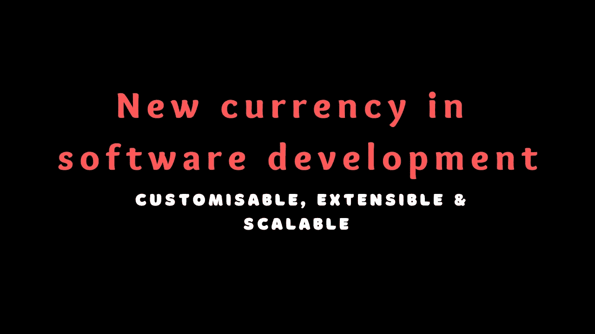
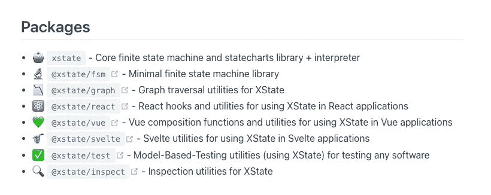

# 软件开发中的新货币

> 原文：<https://javascript.plainenglish.io/new-currency-in-software-development-a53fe7a5475?source=collection_archive---------12----------------------->

## 软件开发中的可扩展、可定制和可升级===国际贸易中的美元。

## 在后台

软件开发发展非常快，我们总是有新的东西出现。

在上个月，我发现了这么多有趣的开源包，它们确实值得一试。

当我开始我的编程之旅时，我被告知很多关于架构的事情。我唯一关注的是在前端和后端寻找高度可扩展的解决方案，架构扮演了非常好的角色。

正因为如此，我已经报道了很多关于前端架构的故事，以及我们如何让它扩展到天知道的程度。

事实上，为了减少可重用的工作量，我在网站上创建了一个[自定义 repo](https://ihatereading.in/customrepo) 部分，以便轻松下载预装了您选择的顶级软件包的存储库。

## 不是唯一的故事情节

但这不是今天故事的重点，我们完全处于一个混沌的世界。

我们有如此多的软件包、工具、框架和概念可以依赖，但我们却无法开发出最具扩展性、最快速和高度可定制的产品。

## 在软件开发中引入一种新的权衡货币

可扩展、可定制和可升级是新的权衡或所谓的新货币。

让我们用我最喜欢的部分“真实世界的例子”来探讨这个问题。

## **太空基地 vs 火焰基地**

最近我发布了一条关于 Firebase 替代产品 Supabase 价格波动的问题。

Twitter 太好了，你可以直接和世界上最大的社区即时解决你的疑惑。

讨论进行得很顺利，甚至 Supabase 的创始人 Ant Wilson 也在回复中附上了一篇来自 tech crunch 的关于谷歌存储价格上涨的文章。

但这不是重点，人们提到的关于 Supabase 的最重要的事情是，我们可以直接退出数据库，并在我们自己的服务器上独立运行它。

想象一下，几年后，当你的网站获得巨大流量时，你可以简单地退出 Supabase，独立运行自己的后端服务器。

这意味着可伸缩和可扩展，而且，我们可以定制数据库到我们想要的任何程度。这就是使用 Supabase 背后让人开心的地方。

另一个激励开发者为 Supabase 做贡献的因素是它的开源性。到目前为止，他们已经有了赞助商和超过 480 个贡献者。

firebase 替代产品已经准备好冲击市场，价格会越来越高。但是真正的权衡发生了，因为它非常可伸缩、易于使用、可定制和可扩展。

再举一个我现在讨论很多的例子。

## [**Astro —一体机框架**](https://ihatereading.in/t/1DUa7ZPeCj3VQrWLXzRc/5-things-to-know-about-all-in-one-framework---Astro)

Astro 跟随引擎盖下的岛屿建筑。这意味着独立且排他地加载每个组件。这使得 Astro 在 2020 年比 Next.js 和其他 javascript 竞争对手更快。

但这并不是阿童木得到如此多喜爱和认可的唯一原因。

Astro 被称为一体化框架，这意味着我们可以在一个存储库中编写 React、Svelte 和 Vue.js 代码。我们可以使用 markdown 扩展在单个存储库中延迟加载优化的图像组件和第三方组件，如 Tailwind CSS 和 Vercel 集成。

 [## astro-All in one framework #短裤

### astro——一体化框架意味着您可以在一个存储库中为一个应用程序编写 React、Svelte 和 Vue 代码

youtube.com](https://youtube.com/shorts/mOrNs53Syt8) 

想象一下，直接为静态页面(如 blog)编写 HTML 或 markdown，并为主页使用 React with Redux 或 Zustand，这需要在单个存储库中进行复杂的状态管理。

这使得 Astro 具有高度的可扩展性和可定制性，我们可以在单个存储库中做任何我们想做的事情。这是我所能看到的未来，我们不再争论框架的选择，而是以任何方式添加我们想要的东西。

## Next.js 行业标准

那么我们来了解一下 [Vercel](https://vercel.com/) 开发的 Next.js。Next.js 基于文件的路由受到全球几乎所有框架的喜爱。最近，我读了 Expo 团队的一篇文章，该团队帮助开发适用于手机和桌面的应用程序。

Expo 本身支持新的基于文件的路由，实际上 Astro 就像 Next.js 一样提供基于文件的动态路由。

阅读世博会团队成员介绍世博会中新的基于文件的路由的推文。

Next.js 在前端架构方面提供了一个可扩展的解决方案，从而建立了新的标准。人们喜欢这一点，并以某种方式使之成为行业传统。

仅仅提供一个可扩展的解决方案就能使产品更具交易性和可接受性，并成为软件开发折价的新货币。

## 打火刷时代

我们都很喜欢 tinder swipe 的效果，也很好地习惯了它。Tinder 在业内以提供最轻松的用户体验而闻名。

在这个故事中， [Josep Ferrer](https://medium.com/u/8213af8f3ccf?source=post_page-----a53fe7a5475--------------------------------) 讲述了 tinder 是如何思考和创造最有效的功能的。这种单一的功能扰乱了市场，正因为如此，我们可以在浏览器上看到更多的滑动功能。

因为它的可伸缩性、可扩展性和易用性，人们喜欢它，包括开发人员。

## x state——未来的状态管理

Xstate 是被低估的状态管理库。Xstate 最重要的一点是它的可扩展性，这意味着你可以使用 React、Vue.js、Svelte，甚至是普通的 JavaScript。

如果你想了解这里是有限状态机概念的介绍短片。

 [## 有限状态机解释和介绍#shorts

### 状态机概念是日常生活产品中广泛使用的概念，例如自动售货机、机器…

youtube.com](https://youtube.com/shorts/JKq3xiMaVsY) 

Xstate 不局限于您正在使用的单一框架，这使得它非常强大。

Xstate packages list for other frameworks

要明白，将来如果我们想删除 React，那么只有 UI 组件需要更改，整个 UI 逻辑和业务逻辑仍然可以保持不变。

我们可以很容易地用新框架替换 React，这一切都是可能的，因为 Xstate 可以用其他库扩展。

## 无头用户界面

这是一个相当流行的概念，人们喜欢它，包括我

让我解释一下，早先当我们必须开发 UI 时，我们使用第三方包，如 Material UI、React、Bootstrap 或 Ant Design，并将逻辑添加到组件中。

为了根据你的主题创建网站，我们必须覆盖 CSS 或者为这些第三方库提供的每个组件添加新的主题。

因此，这些库带来了可定制性和可扩展性的成本，直到他们在市场上有了竞争对手，他们才明白这一点。

## 竞争对消费者有利

我说的是 [Mantine dev](https://mantine.dev/) 这是一个无头 UI 库，只提供组件，你可以直接给每个组件添加你的样式。没有覆盖，省时，可扩展，可定制的组件库。

现在，看看当我们如此热爱 mantine.dev 和 headless UI 时会发生什么。google 自己支持的 Material UI 开发并推出了 MUI 基础，名为 Headless Material UI。

这就是开源的力量，也是新货币的力量，让交易变得可扩展、可定制、灵活。

甚至另一个 React 前端 UI 库 [Chakra UI](https://chakra-ui.com/) 也朝着这个方向前进，它创建了一个没有提供任何样式的无头 UI 库。

我们有越来越多的库，它们将只提供功能，而你负责设计、外观和风格，基本上使它具有高度的可定制性、可伸缩性和可扩展性。

此外， [Chakra UI](https://chakra-ui.com/) 计划更进一步，他们将在组件的业务逻辑中使用 Xstate，这样他们可以提供高度可定制和可扩展的组件，这些组件可以直接与 React、Svelte 和 Vue.js 一起使用，节省了他们为每个单独的框架创建组件的大量时间。

查克拉 UI 团队将其命名为 Zagjs。

 [## zag——快速构建 UI 组件，而无需为逻辑伤脑筋。— Zag

### 今天，设计系统正成为一个非常受欢迎的工具包，为公司创造一个有凝聚力和易接近的用户…

zagjs.com](http://zagjs.com/) 

我已经直接向 Chakra UI 创始人询问了这个在后台使用 Xstate 的新的无头 UI 库。这是回复—

想法是使用 Xstate 创建一个高度可定制、可扩展和可伸缩的无头 UI 库，使其成为一个高标准的产品，并易于在开发人员之间进行权衡。

你看，我告诉过你 Twitter 是一个相当不错的产品，你可以直接和创始人、团队成员以及任何你想要的人交谈。

## USD in Trade =在软件开发中可扩展、可定制和可伸缩

就像美国在 90 年代做的那样，用美元交换黄金来进行世界上的任何贸易。

嗯，这是我在所有其他第三方软件包、公司和开源产品中看到的故事。它们都有希望成为其中一个类别，这是为开发者和消费者制造产品的正确方式。

## 鼓励还是很少的

但我们都应该明白一件事，不管这些公司做出如此高标准的承诺，他们都在努力实践。

谴责产品或第三方或者说我们用过的任何包或软件不好是非常容易的。

开发和维护开源产品是一项相当艰巨的任务，许多开发人员甚至没有为他们的辛勤工作得到报酬。我们应该明白，竞争应该继续存在，但它不应该使人们失业，而是应该创造更多的机会。

这就是为什么我大量介绍了大多数被低估的第三方开源包。

最近，我在 LinkedIn 上发帖提到了 Moralis Web3。讽刺的是，Moralis 团队自己也在评论区表明了自己的喜爱。

[https://www . LinkedIn . com/posts/shrey-vijayvargiya-b62a 3a 105 _ rainbowkit-activity-6980450163530039297-4 b-t？UTM _ source = share&UTM _ medium = member _ IOs](https://www.linkedin.com/feed/update/urn:li:activity:6980450163530039297/)

我们都应该鼓励它，正如我总是加上我最喜欢的—

> 技术本身不会随着时间的推移而发展，而是人们在努力工作，使之成为现实。

所以，支持他们，展示你的爱，与你的观众分享他们的优秀作品，鼓励他们做出如此高水准的作品。

## 结论

很高兴看到竞争，我期待着我们未来的发展方向。我们会一直在框架语言之间保持竞争，还是会相互支持，不断改进？

时间会证明一切，但目前看来软件开发进展顺利，人们不太关心钱，而是更关注提供顶级和最好的服务。

如果你是任何类型的开源贡献者，那么请在 Twitter 上给我发关于你的产品的消息，或者在评论区提到它，我一定会回复并尝试使用你的产品。

我衷心祝愿所有开源贡献者和开发者，你们做得很好，值得称赞。

继续发展
Shrey
T2【IHA tereading】T3

*更多内容看* [***说白了就是***](https://plainenglish.io/) *。报名参加我们的* [***免费周报***](http://newsletter.plainenglish.io/) *。关注我们关于* [***推特***](https://twitter.com/inPlainEngHQ) ， [***领英***](https://www.linkedin.com/company/inplainenglish/) *，*[***YouTube***](https://www.youtube.com/channel/UCtipWUghju290NWcn8jhyAw)*，以及* [***不和***](https://discord.gg/GtDtUAvyhW) *。对增长黑客感兴趣？检查* [***电路***](https://circuit.ooo/) *。*