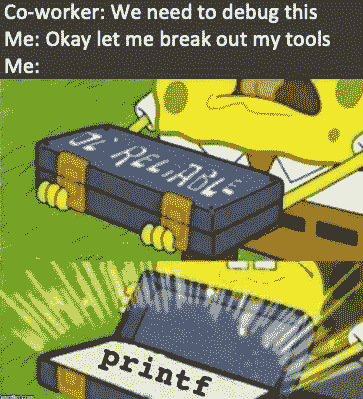
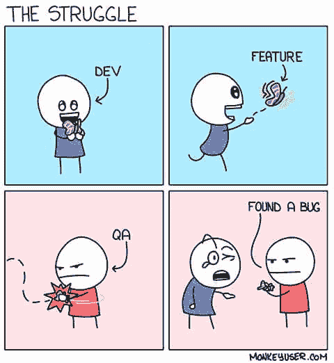

# 程序员的新笑料

> 原文：<https://javascript.plainenglish.io/new-doses-of-laughter-for-programmers-4c642fbf9644?source=collection_archive---------2----------------------->

## 用新笑话迎接 2022 年

Photo by [Manny Moreno](https://unsplash.com/@mannydream?utm_source=medium&utm_medium=referral) on [Unsplash](https://unsplash.com?utm_source=medium&utm_medium=referral)

祝大家新年快乐。对程序员来说，新的一年意味着新的框架、新的技术、新的语言和新的 bug。

但是为了解决所有这些消极的问题，我再次提出积极的、有趣的、令人捧腹的笑声，这会让你精神焕发。

希望你能把这些笑话和你的日常编程联系起来。

# 最佳恋爱建议

Picture Credit: [https://www.reddit.com/r/ProgrammerHumor](https://www.reddit.com/r/ProgrammerHumor)

# 你够大了，可以看这种文件的复制传输吗？

Picture Credit: [https://www.facebook.com/funnyProgramming4All](https://www.facebook.com/funnyProgramming4All)

# 我去过最多的地方…

Picture Credit: [https://www.facebook.com/javascriptJS](https://www.facebook.com/javascriptJS)

# 终于，有些东西起作用了

Picture Credit: [https://www.facebook.com/jokesvala](https://www.facebook.com/jokesvala)

Picture Credit: [https://programmerhumor.io/](https://programmerhumor.io/)

# 那种幸福…

Picture Credit: [https://www.reddit.com/r/ProgrammerHumor/](https://www.reddit.com/r/ProgrammerHumor/)

# 我的第一个调试工具..

Picture Credit: [https://programmerhumor.io/programming-memes/simple-and-reliable/](https://programmerhumor.io/programming-memes/simple-and-reliable/)

# 嗯…我在 chrome 上工作…

Picture Credit: [https://programmerhumor.io/](https://programmerhumor.io/)

# 是的…我有心情跳舞…

Picture Credit: [https://www.facebook.com/jokesvala](https://www.facebook.com/jokesvala)

# 当你丈夫对编程更感兴趣的时候…

Picture Credit: [https://www.reddit.com/r/ProgrammerHumor/](https://www.reddit.com/r/ProgrammerHumor/)

# 当你试着向你的朋友展示你的代码，而他们非常认真地听的时候…

Picture Credit: [https://programmerhumor.io/programming-memes](https://programmerhumor.io/programming-memes)

# 让我在测试版中添加一个最终补丁…

Picture Credit: https://monkeyuser.com

# 这个比较酷…

Picture Credit: [https://programmerhumor.io/programming-memes](https://programmerhumor.io/programming-memes)

# 为什么？为什么？

Picture Credit: [https://workchronicles.com/comics/](https://workchronicles.com/comics/)

# 至少我在努力…

Picture Credit: [https://programmerhumor.io/programming-memes](https://programmerhumor.io/programming-memes)

# 啊… IDE 是值得的…

Picture Credit: [https://programmerhumor.io/programming-memes](https://programmerhumor.io/programming-memes)

# 给我的经理…哈哈…

Picture Credit: [https://workchronicles.com/comics/](https://workchronicles.com/comics/)

# 同样的事情也发生在 JS 变量上…

Picture Credit: [https://programmerhumor.io/programming-memes](https://programmerhumor.io/programming-memes)

# 奖金

# 通常发生在我周五工作并为客户做演示的时候…

[https://www.facebook.com/ProgrammersCreateLife/photos/a.241809332534619/3750971258285058/](https://www.facebook.com/ProgrammersCreateLife/photos/a.241809332534619/3750971258285058/)

# 有时初级开发人员知道得更多…

[https://www.facebook.com/DZoneInc/photos/a.336758034711/10159280091324712](https://www.facebook.com/DZoneInc/photos/a.336758034711/10159280091324712)

# 我根据项目购买课程，当我按照这样的指示结束时…

[https://www.facebook.com/javascriptJS/photos/a.1387402908063976/2172042662933326/](https://www.facebook.com/javascriptJS/photos/a.1387402908063976/2172042662933326/)

# 当我试图修复一个让事情变得更糟的小错误时…

[https://www.quora.com/What-are-the-best-programming-comic-strips](https://www.quora.com/What-are-the-best-programming-comic-strips)

# 总有一些隐藏的错误..不要打扰他们…

[https://www.facebook.com/ProgrammersCreateLife/photos/a.241809332534619/3817315068317343/](https://www.facebook.com/ProgrammersCreateLife/photos/a.241809332534619/3817315068317343/)

# 当我的教练问我最喜欢哪台机器时…

[https://www.facebook.com/javascriptJS/photos/1833542923449970](https://www.facebook.com/javascriptJS/photos/1833542923449970)

# 星期五提前离开…

# 永远不要试图扰乱工作代码…

[https://www.facebook.com/javascriptJS/photos/1602108066593458](https://www.facebook.com/javascriptJS/photos/1602108066593458)

# 随着太多框架的出现…

[https://www.facebook.com/yuva.krishna.memes/photos/a.105527467815845/299995221702401/](https://www.facebook.com/yuva.krishna.memes/photos/a.105527467815845/299995221702401/)

# 当我的学长让我在代码中添加注释时…

[https://www.facebook.com/javascriptJS/photos/a.1387402908063976/2170533493084243/](https://www.facebook.com/javascriptJS/photos/a.1387402908063976/2170533493084243/)

# 添加所有东西，这样它就能在自动工具中捕捉到…

[https://www.reddit.com/r/ProgrammerHumor/comments/mnbgz1/knows_every_programming_language/](https://www.reddit.com/r/ProgrammerHumor/comments/mnbgz1/knows_every_programming_language/)

# 我最好的敌人是…

[https://www.facebook.com/DZoneInc/photos/10158920521754712](https://www.facebook.com/DZoneInc/photos/10158920521754712)

希望你喜欢这篇文章。保持微笑！

*更多内容看* [*说白了. io*](http://plainenglish.io/) *。报名参加我们的* [*免费每周简讯*](http://newsletter.plainenglish.io/) *。在我们的* [*社区*](https://discord.gg/GtDtUAvyhW) *获得独家写作机会和建议。*