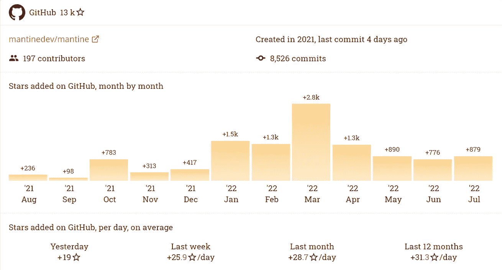
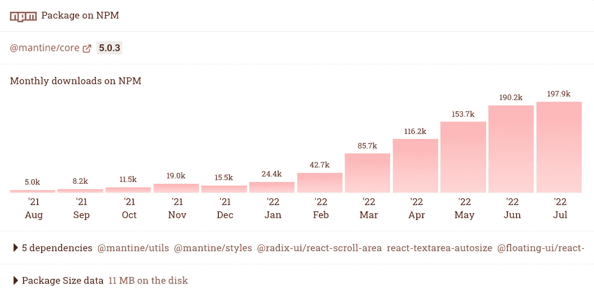
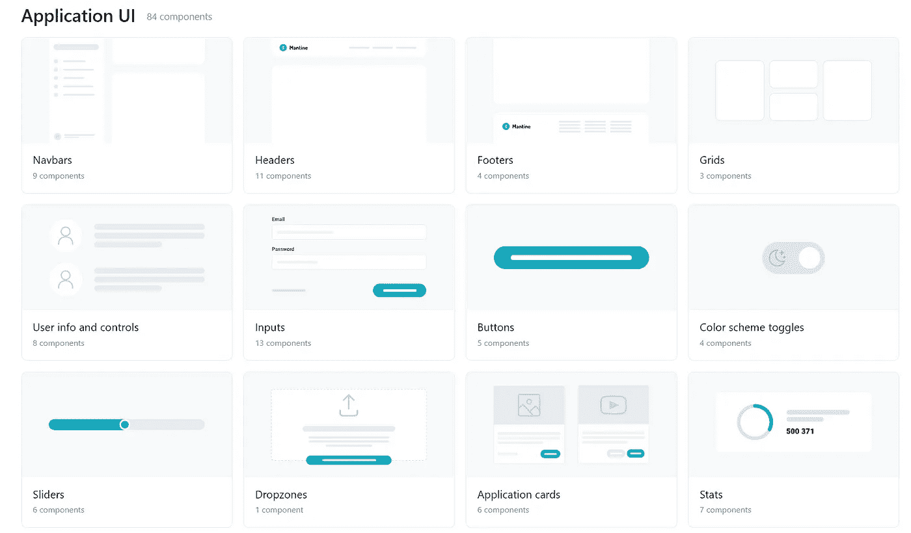
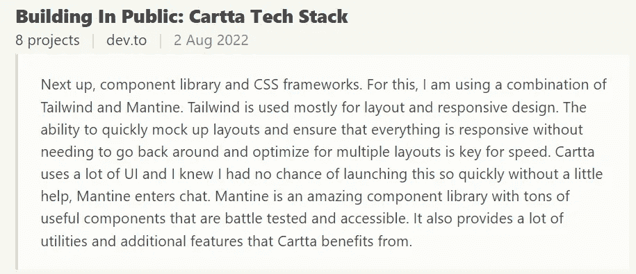

# Meet Mantine:一个基于 TS 的开源 React 组件库

> 原文：<https://javascript.plainenglish.io/new-popular-replacement-ui-mantine-829aca3be18a?source=collection_archive---------7----------------------->


Photo by [Kelly Sikkema](https://unsplash.com/@kellysikkema?utm_source=medium&utm_medium=referral) on [Unsplash](https://unsplash.com?utm_source=medium&utm_medium=referral)

顺风？材质？查克拉？您一定听说过很多关于您的项目的不同种类的 UI 选择。体验和性能越好，越受欢迎。

开发人员一直在为用户构建出色的 ui，让他们更有效率，体验更好。这样我们就可以节省更多的时间来创作新一代的杰作。在这方面，我发现了名为 Mantine 的 UI，它于 2021 年发布，目前仍在不断发布新功能。

Mantine 是一个 React 组件库，致力于提供出色的用户和开发人员体验，并附带了本机黑暗主题支持。

[](https://github.com/mantinedev/mantine) [## GitHub-mantinedev/mantine:React 组件库，支持原生黑暗主题

### 带有原生黑暗主题支持的 React 组件库

github.com](https://github.com/mantinedev/mantine) 

2021 年，用户数量保持增长。



bestofjs



bestofjs

UI 可以与 Next.js、Vite、Create React App、Remix 和 Gatsby 等不同的框架协同工作。或者可以在没有框架的情况下开始。

## 包装

> `@mantine/hooks`–用于状态和 UI 管理的 40 多个钩子的集合
> 
> `[@mantine/styles](https://mantine.dev/styles/create-styles/)`–[基于情感](https://emotion.sh/)的 css-in-js 库，用于所有 Mantine 组件
> 
> `@mantine/core`–核心组件库–100 多个组件，从`@mantine/styles`导出所有组件
> 
> `[@mantine/form](https://mantine.dev/form/use-form/)`–表单管理库
> 
> `[@mantine/notifications](https://mantine.dev/others/notifications/)`–功能全面的通知系统
> 
> `[@mantine/spotlight](https://mantine.dev/others/spotlight/)`–`Ctrl + K`您应用的命令中心
> 
> `[@mantine/prism](https://mantine.dev/others/prism/)`–使用 [prism-react-renderer](https://github.com/FormidableLabs/prism-react-renderer) 构建的代码高亮显示
> 
> `[@mantine/rte](https://mantine.dev/others/rte/)`–基于 Quill 的富文本编辑器
> 
> `[@mantine/dropzone](https://mantine.dev/others/dropzone/)`–管理拖放到某个区域或整个屏幕的文件
> 
> `[@mantine/carousel](https://mantine.dev/others/carousel/)`–转盘组件
> 
> `[@mantine/nprogress](https://mantine.dev/others/nprogress/)`–导航进度
> 
> `[@mantine/modals](https://mantine.dev/others/modals/)`–集中模式管理器
> 
> `[@mantine/ssr](https://mantine.dev/guides/ssr/)`–服务器端渲染实用程序
> 
> `[@mantine/next](https://mantine.dev/guides/next/)`–next . js 的服务器端渲染实用程序
> 
> `[@mantine/remix](https://mantine.dev/guides/remix/)`–用于混音的服务器端渲染工具
> 
> `[gatsby-plugin-mantine](https://mantine.dev/guides/gatsby/)`–用于设置服务器端渲染的 Gatsby 插件
> 
> `[eslint-config-mantine](https://www.npmjs.com/package/eslint-config-mantine)`–ESLint 和更漂亮的配置，用于所有 Mantine 项目

*[***文档***](https://mantine.dev/pages/getting-started/)*

# *如何入门？*

```
*npm install [@mantine/core](http://twitter.com/mantine/core) [@mantine/hooks](http://twitter.com/mantine/hooks) [@emotion/react](http://twitter.com/emotion/react)*
```

*用[**mantine provider**](https://mantine.dev/theming/mantine-provider/)包装您的应用程序根组件:*

```
*import { MantineProvider } from '@mantine/core';function Demo() {return (<MantineProvider withGlobalStyles withNormalizeCSS><App /></MantineProvider>);}*
```

*一切就绪！现在，您可以在应用程序中的任何地方导入和使用 Mantine 组件:*

```
*import { Button } from '@mantine/core';function Demo() {return <Button>Click me!</Button>;}*
```

*对于框架用户来说，应用起来会更容易。如**创建 react app** :*

*首先，生成新的应用程序，*

```
*npx create-react-app my-mantine-app — template typescript*
```

*然后安装 Mantine，*

```
*npm install [@mantine/core](http://twitter.com/mantine/core) [@mantine/hooks](http://twitter.com/mantine/hooks) [@emotion/react](http://twitter.com/emotion/react)*
```

*将 App.tsx 的内容替换为:*

```
*import { MantineProvider, Text } from '@mantine/core';export default function App() {return (<MantineProvider withGlobalStyles withNormalizeCSS><Text>Welcome to Mantine!</Text></MantineProvider>);}*
```

*一切就绪！启动开发服务器:*

```
*npm run dev*
```

*UI 最棒的部分是它内置了 123 个响应组件。*

**

*在您的项目中使用预构建的组件非常容易，没有任何麻烦。*

*[***更多组件***](https://ui.mantine.dev/) 在此查阅。*

## *你认为哪个更好？Mantine 还是 Material UI？我们来对比一下。*

*1.Mantine 是一个具有原生黑暗主题支持的 React 组件库(由 [mantinedev](https://github.com/mantinedev/mantine) )。而 MUI Core 是 React UI 库的集合，用于更快地发布新特性。从我们的全加载组件库 Material UI 开始，或者将您自己的设计系统引入我们的生产就绪组件。(由[梅伊](https://mui.com/))。*

*2.Mantine 是用黑暗主题模式的 TypeScript 构建的。材质 UI 是用 JavaScript 搭建的。*

*下面是关于他们的*回顾*:*

**

*libhunt.com*

# *有哪些替代方案？*

*下面列出了一些来源于 [libhunt](https://www.libhunt.com/compare-mantine-vs-material-ui) 的备选方案，您也可以在比较项目的 Material UI 和 Mantine 时加以考虑。*

> ***antd** —企业级 UI 设计语言和 React UI 库*
> 
> ***chakra-ui** — ⚡️简单的、模块化的&可访问的 ui 组件，用于您的 React 应用程序*
> 
> *用于快速 UI 开发的实用优先的 CSS 框架。*
> 
> *🧱:一套 React 组件。*
> 
> *⭐️ ⭐️ ⭐️ ⭐️ ⭐️最流行、免费和开源的 Tailwind CSS 组件库*
> 
> ***primereact** —最全的 React UI 组件库*
> 
> ***Ionic Framework** —一个强大的跨平台 UI 工具包，用于使用 HTML、CSS 和 JavaScript 构建原生质量的 iOS、Android 和渐进式 Web 应用。*
> 
> ***react-admin** —一个前端框架，使用 ES6、react 和 Material Design 构建运行在 REST/graph QL API 之上的浏览器中的 B2B 应用程序*
> 
> ***vecha UI**—一组高质量的可访问 React UI 组件，使用 Tailwind CSS 内置黑暗模式。预设计的无头用户界面和基数用户界面。*
> 
> ***风格化组件**——组件时代的视觉原语。使用 ES6 和 CSS 的精华来设计你的应用，没有压力💅*

*我迫不及待地想在我的下一个项目中尝试它们！*

> *继续做你想做的事。在通往顶峰的路上向我们所有人问好。*
> 
> *请跟随并成为我的学习伙伴。和平。✌️*

**更多内容请看*[***plain English . io***](https://plainenglish.io/)*。报名参加我们的* [***免费周报***](http://newsletter.plainenglish.io/) *。关注我们关于* [***推特***](https://twitter.com/inPlainEngHQ)[***领英***](https://www.linkedin.com/company/inplainenglish/)**和* [***不和***](https://discord.gg/GtDtUAvyhW) ***。*****