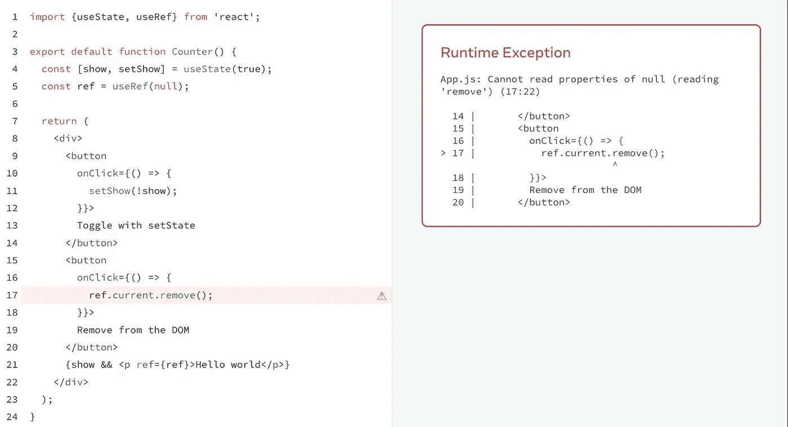
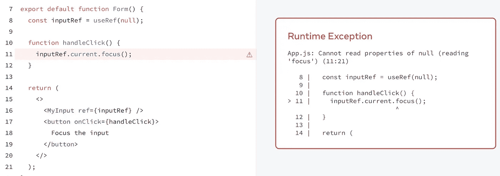

# 新 React 文档:不要滥用引用

> 原文：<https://javascript.plainenglish.io/new-react-documentation-do-not-abuse-ref-8e96dbec6bfc?source=collection_archive---------5----------------------->

## 使用 useRef 的正确场景


Photo by [Valdemaras D.](https://unsplash.com/@deko_photo4?utm_source=medium&utm_medium=referral) on [Unsplash](https://unsplash.com?utm_source=medium&utm_medium=referral)

React 的新文档有一个有趣的细节:在文档中称为 Escape Hatches 的部分引入了两个钩子 API，useRef 和 useEffect。显然，逃生舱口在正常航行中并不需要，只会在危险的情况下使用。如果开发人员过于依赖这两个 API，他们可能会误用它们。

在“新的 React 文档:不要滥用效果中，我们讨论了如何正确使用 use Effect 场景。今天，我们来谈谈 useRef 的使用场景。

## 为什么要逃生舱？

首先思考一个问题:为什么 useRef 和 useEffect 被归为逃生舱？这是因为两者都在 React 控制之外的因素上运行。效果处理副作用。例如: *document.title* 在 useEffect 中修改。 *document.title* 不属于 React 中的状态，React 无法感知它的变化，所以被归类为生效。同样，使 DOM 成为焦点需要调用 *element.focus* ()，DOM API 的直接执行不受 React 控制。虽然它们是 React 无法控制的因素，但 React 也想尽可能防止它们失控，以保证应用的健壮性。

## 失控参考

对于 Ref 来说，失控是什么意思？首先，看看它没有失控的情况。

*   执行 ref.current 的对焦、模糊等。方法。
*   执行 ref.current.scrollIntoView 将元素滚动到视图中。
*   执行 ref . current . getboundingclientrect 来测量 DOM 大小。

虽然我们操纵 DOM，但它们涉及 React 控制之外的因素，因此它们不被视为失控。但是在下面的例子中，

*   执行 ref.current.remove 以删除 DOM
*   执行 ref.current.appendChild 以插入子节点

这些也是 DOM 操作，但是它们在 React 的控制之内，所以通过 ref 执行这些操作是不受控制的。

例如，下面的内容来自 React 文档。单击按钮 1 将插入/删除 P 节点，单击按钮 2 将调用 DOM API 删除 P 节点。

按钮 1 通过反应控制移除 P 节点。按钮 2 通过直接操作 DOM 来删除 P 节点。如果这两种删除 P 节点的方法混合使用，那么单击按钮 1 和按钮 2 将会报告错误。



这是使用 Ref 操作 DOM 导致失控的结果。

## 如何限制失控

现在问题来了，既然叫失控，那就是 React 无法控制的东西。React 不能限制开发者使用 DOM API 吧？如何限制失控？在 React 中，组件可以分为:

*   高阶组件
*   低阶组件

低阶组件是那些基于 DOM 包装的组件，比如下面的组件，它直接基于输入节点包装。

```
function MyInput(props) {
  return <input {.. .props} />;
}
```

在低级组件中，可以将 ref 直接指向 DOM，例如

```
function MyInput(props) {
  const ref = useRef(null);
  return <input ref={ref} {.. .props} />;
}
```

高阶组件是那些基于低阶组件包装的组件，例如下面的表单组件，它基于输入组件包装。

```
function Form() {
  return (
    <>
      <MyInput/>
    </>
  )
}
```

高阶组件不能将引用直接指向 DOM，这种限制将引用失控的范围保持在单个组件内，因此没有跨组件的引用失控。使用文档中的例子，如果我们想在表单组件中单击一个按钮来操作输入焦点。

```
function MyInput(props) {
  return <input {.. .props} />;
}function Form() {
  const inputRef = useRef(null);function handleClick() {
    inputRef.current.focus();
  }return (
    <>
      <MyInput ref={inputRef} />
      <button onClick={handleClick}>
        input 聚焦
      </button>
    </>
  );
}
```

单击时，会报告一个错误。



这是因为在表单组件中向 MyInput 传递 ref 失败；inputRef.current 不指向输入节点。原因是，如上所述，React 默认情况下不支持跨组件传递 refs，以便在单个组件内保持 refs 的范围不受控制。

## 人为地消除限制

如果必须取消这一限制，可以使用 forwardRef API 显式传递引用。

```
const MyInput = forwardRef((props, ref) => {
  return <input {.. .props} ref={ref} />;
});function Form() {
  const inputRef = useRef(null);function handleClick() {
    inputRef.current.focus();
  }return (
    <>
      <MyInput ref={inputRef} />
      <button onClick={handleClick}>
        Focus the input
      </button>
    </>
  );
}
```

通过使用 forwardRef，可以跨组件传递 Ref。在示例中，我们将 InputRef 从表单跨组件传递到 MyInput，并将其与 input 关联起来。在实践中，一些学生可能会发现 forwardRef API 有点多余。但从一个失控 Ref 的角度来看，forwardRef 的意图是明确的:既然开发人员手动调用 forwardRef 来打破阻止一个失控 ref 的限制，那么他就应该知道自己在做什么，应该自己承担相应的风险。同时，forwardRef 的存在使得在发生与 Ref 相关的错误后更容易定位错误。

## useImperativeHandle

除了限制 refs 跨组件传递，还有一个防止 refs 失控的措施，那就是 useImperativeHandle，其逻辑如下。由于引用因为使用了不应该使用的 DOM 方法(比如 appendChild)而失去控制，所以我可以限制引用中只存在那些可以使用的方法。

用 useImperativeHandle 修改我们的 MyInput 组件。

```
const MyInput = forwardRef((props, ref) => {
  const realInputRef = useRef(null);
  useImperativeHandle(ref, () => ({
    focus() {
      realInputRef.current.focus();
    },
  }));
  return <input {...props} ref={realInputRef} />;
});
```

现在，表单组件只能通过 inputRef.current 获取以下数据结构。

```
{
  focus() {
    realInputRef.current.focus();
  },
}
```

这消除了这样的情况，即开发人员通过 ref 获得 DOM，然后执行不应该使用的 API，ref 失去控制。

## 摘要

通常情况下，ref 的使用相对较少，它是作为一个逃生出口而存在的。

*   为了防止误用/滥用导致 ref 失控，React 限制 ref 在默认情况下不能跨组件传递。
*   要打破这种限制，可以使用 forwardRef。
*   为了减少对 DOM 上 ref 的误用，可以使用 useImperativeHandle 来限制 ref 传递的数据结构。

***欢迎关注我上***[***Twitter***](https://twitter.com/yanghui0324)*[***LinkedIn***](https://www.linkedin.com/in/hui-yang-075076245/)***，以及***[***GitHub******！***](https://github.com/guchen-yh)*

*写作一直是我的激情所在，它给了我帮助和激励他人的快乐。如果您有任何问题，请随时联系我们！*

**更多内容看* [***说白了就是***](https://plainenglish.io/) *。报名参加我们的* [***免费周报***](http://newsletter.plainenglish.io/) *。关注我们关于* [***推特***](https://twitter.com/inPlainEngHQ) ，[***LinkedIn***](https://www.linkedin.com/company/inplainenglish/)*，*[***YouTube***](https://www.youtube.com/channel/UCtipWUghju290NWcn8jhyAw)*，以及* [***不和***](https://discord.gg/GtDtUAvyhW)*