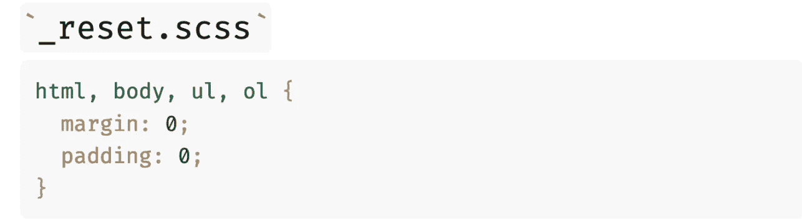
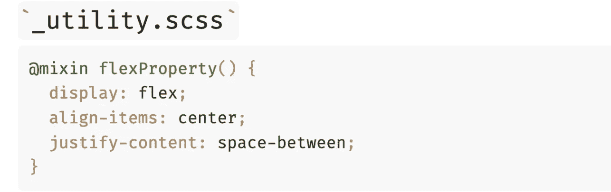
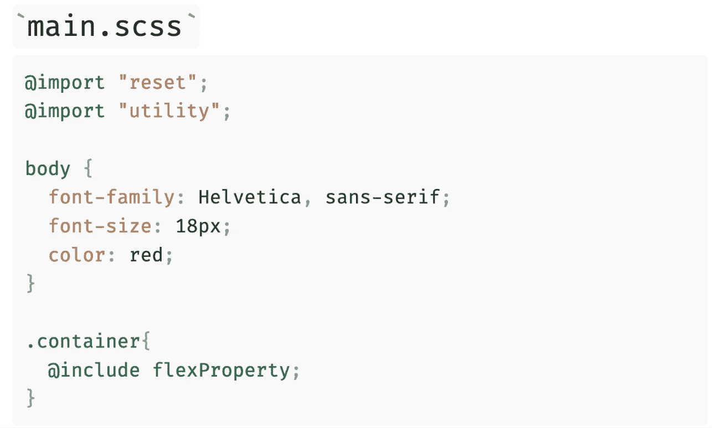
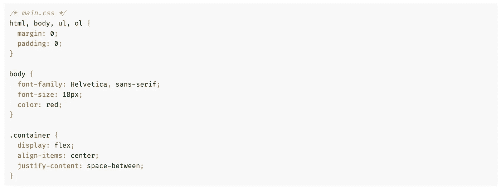
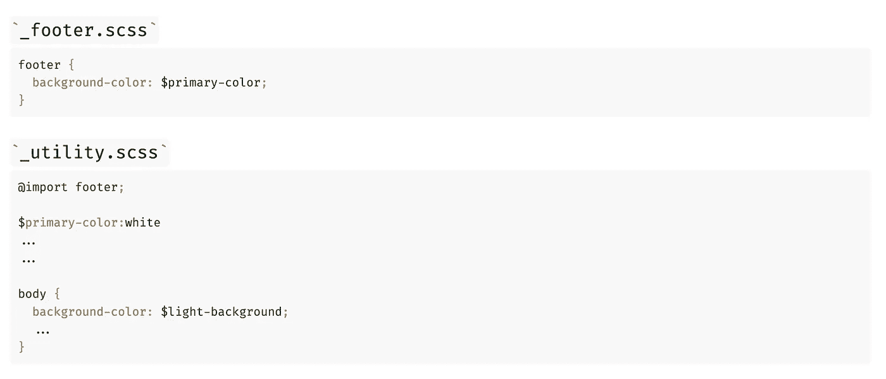
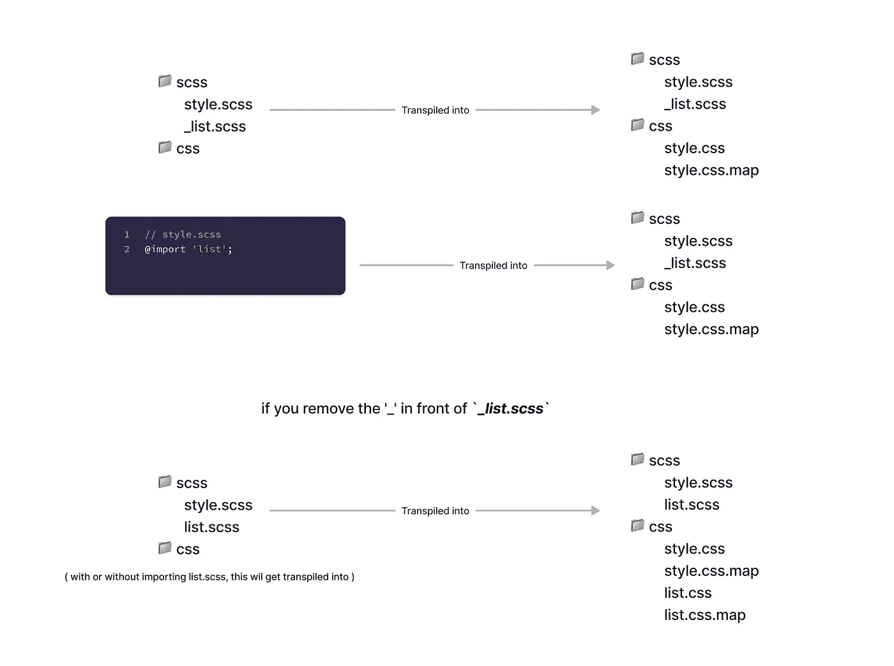

# 新的 SASS 模块系统

> 原文：<https://javascript.plainenglish.io/new-sass-module-system-out-with-import-in-with-use-part-1-2291203b4c1e?source=collection_archive---------15----------------------->

## 第 1 部分:用@ import 输出，用@ use 输入

New Sass Module System — Hritik Jaiswal

# 目录

*   什么是萨斯？
*   什么是 SASS 模块系统？
*   SASS 模块系统包括什么？
*   Sass 导入文件
*   Sass 导入语法
*   Sass 新模块系统启动👀
*   更新🚨

## ***什么是 SASS？***

Sass 是一种编译成 CSS 的样式表语言。它允许你使用 ***变量*** 、 ***嵌套规则、mixins、函数等等，*** 都具有完全兼容 CSS 的语法。

**了解更多**:

 [## SCSS/萨斯完全指南

### 这不是一个完整的萨斯/ SCSS 手册。

ghost-together.medium.com](https://ghost-together.medium.com/the-complete-guide-to-scss-sass-49ac053fcde5) 

## **什么是 SASS 模块系统？**

Sass 扩展了 CSS 的`@import`规则，能够导入 Sass 和 CSS 样式表，提供对混合、函数和变量的访问，并将多个样式表的 CSS 组合在一起。"

与普通 CSS 导入不同，普通 CSS 导入需要浏览器在呈现页面时发出多个 HTTP 请求，Sass 导入完全是在编译期间处理的。

## SASS 模块系统包括什么？

*   导入
*   分音

## Sass 导入文件

*   就像 CSS 一样，Sass 也支持`@import`指令。
*   `@import`指令允许你将一个文件的内容包含在另一个文件中
*   提供对混合、函数和变量的访问，并将多个样式表的 CSS 组合在一起。
*   CSS `@import`指令的一个主要缺点是性能问题；每次您调用它时，它都会创建一个额外的 HTTP 请求。然而，Sass `@import`指令将文件包含在 CSS 中；所以在运行时不需要额外的 HTTP 调用！
*   Sass 导入完全是在编译期间处理的
*   除了导入`.sass`和`.scss`文件，Sass 还可以导入普通的旧`.css`文件。唯一的规则是导入不能显式地包含`.css`扩展名，因为它用来表示一个普通的 CSS `@import`。

**了解更多**:

 [## @导入

### Sass 用导入 Sass 和 CSS 样式表的能力扩展了 CSS 的@import 规则，提供了对 mixins…

sass-lang.com](https://sass-lang.com/documentation/at-rules/import#importing-css) 

## **Sass 导入语法**

*   您不需要指定文件扩展名，Sass 自动假定您指的是一个`.sass`或`.scss`文件。也可以导入 CSS 文件。
*   `@import`指令导入文件，在导入文件中定义的任何变量或混合可以在主文件中使用。
*   使用 import 时，首先导入那些包含变量、mixin 或函数的模块。以便稍后定义的模块可以使用它。

**编译 main.scss 时👇🏻**

Compiled main.scss file

## **注意📌**

当你在 sass 中使用 import 和 partial 时，特殊性规则仍然适用，这意味着浏览器将从上到下阅读你的文档。

因此，如果您正在导入文件，即`main.scss`顶部的`footer.scss`，并且导入的文件使用了定义`main.scss`文件的任何变量，那么 ***将会抛出一个错误🐛***

## SASS 中的部分是什么🤔？

-`_(underscore)`是 scss 的一部分。

-这意味着样式表将被导入主样式表`@import`，而不会被编译成常规的 css 文件。

-当您在文件名前面包含`"_"`时，它不会生成到 CSS 中，除非您将其导入到另一个非部分的 sass 文件中。

-💡部分 Sass 文件`"_colors.scss"`，该文件不会直接传输到`"colors.css"`

Partial Flow

## Sass 新模块系统启动👀

## 更新🚨

*   自 2019 年 10 月**起，实施`@use`的新模块化系统现已在 **Dart Sass 1.23.0** 中提供**

****

*   **从 2021 年 10 月起`@import`将被弃用，同时弃用的还有全局内置函数，一年后(不迟于 2022 年 10 月)`@import`将不再支持😱**

**让我们通过 **SASS 新模块系统**帖子的第二部分中有趣的例子来理解`@use`是如何工作的😄**

****了解更多**:**

** [## 新型 SASS 模块系统—第二部分🤯

### 用@ import 输出，用@ use 输入

medium.com](https://medium.com/@hritik.jaiswal/new-sass-module-system-out-with-import-in-with-use-part-2-c73442c0157a)** 

**请👏🏻如果你喜欢这个帖子。这将激励我创造和分享更多像这样的内容。**

# **支持我**

**感谢你阅读这篇文章。如果你喜欢它，那么请支持我，通过在 Twitter 和 LinkedIn 上与感兴趣的人分享这篇文章来传播我的话。**

1.  ****贝宝**——[https://paypal.me/hritikdj](https://paypal.me/hritikdj)**
2.  ****高保真**——[https://ko-fi.com/hritik](https://ko-fi.com/hritik)**
3.  **给我买杯咖啡吧——https://www.buymeacoffee.com/hritikdj**