# 新的 SASS 模块系统

> 原文：<https://javascript.plainenglish.io/new-sass-module-system-out-with-import-in-with-use-part-2-c73442c0157a?source=collection_archive---------8----------------------->

## 第 2 部分:用@ import 输出，用@ use 输入

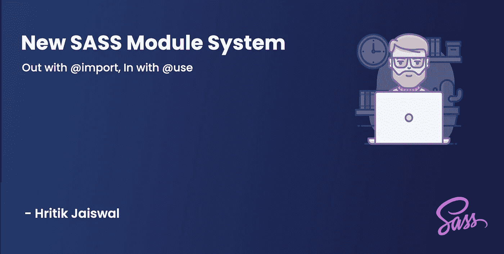

New Sass Module System — Hritik Jaiswal

在阅读这篇文章之前，我强烈建议浏览一下**新的 SASS 模块系统——第 1 部分**

**了解更多信息**:

[](https://medium.com/@hritik.jaiswal/new-sass-module-system-out-with-import-in-with-use-part-1-2291203b4c1e) [## 新型 SASS 模块系统—第一部分🤯

### 用@import 输出，用@use 输入

medium.com](https://medium.com/@hritik.jaiswal/new-sass-module-system-out-with-import-in-with-use-part-1-2291203b4c1e) 

# Sass 新模块系统启动👀

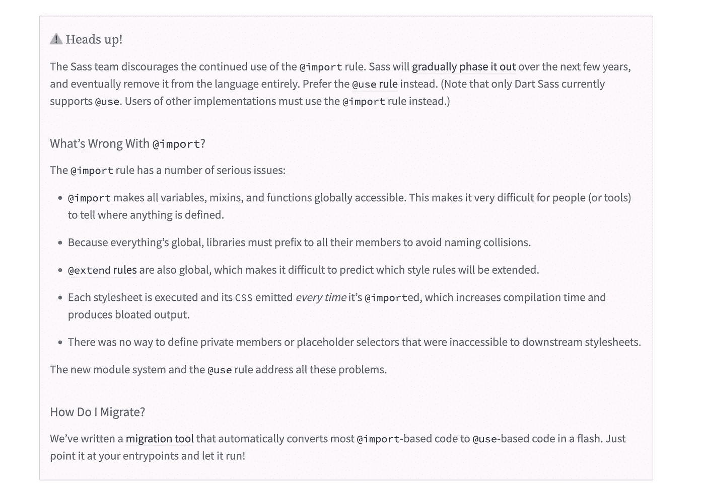

`@import`正被更明确的`@use`和`@forward`规则所取代。在接下来的几年里，Sass `@import`将被弃用，然后被移除。你仍然可以使用 CSS 导入，但是它们不会被 Sass 编译。

# 为什么需要新的 SASS 模块系统？@import 的缺点是什么？🤔

早在 2016 年 10 月“ **Dart Sass** ”就已发布，2018 年 3 月，Dart Sass 1.0.0 发布，此后“ **Ruby sass** ”不再受支持。这显示了 sass 是如何参与更快🔥

`@import`也是 CSS 的一个特性，两者的区别可能会令人困惑

`@import`使一切都是全局的，包括变量、混合和函数，因此，当你使用像 ***color()*** 这样的函数时，人们很难分辨事物是否被定义以及它们来自哪里。不可能确切知道它是在哪里被定义的。它来自哪个`@import`？

因为在一个样式表中定义的任何内容都可以用于在它之后导入的所有样式表。

`@import`使得库很难命名变量，因为相同名称的变量可能出现在其他导入的文件中。因此，它可能会覆盖其他文件中定义的现有变量—例如，我的 ***color()*** 函数可能会覆盖您现有的 ***color()*** 函数，反之亦然。为了安全起见，用户必须手动将冗长、笨拙的名称空间添加到他们定义的所有内容中。

如果多次使用同一个文件，可能会降低编译速度，导致覆盖冲突，并生成重复的输出。

没有办法定义私有数据成员，因此会导致严重的安全问题

## @使用，模块系统的心脏❤️

`@use`规则是对`@import`的主要替代:它使得来自另一个样式表的 CSS、变量、混合和函数可以在当前样式表中访问。默认情况下，变量、混合和函数在基于 URL 基本名称的名称空间中是可用的。

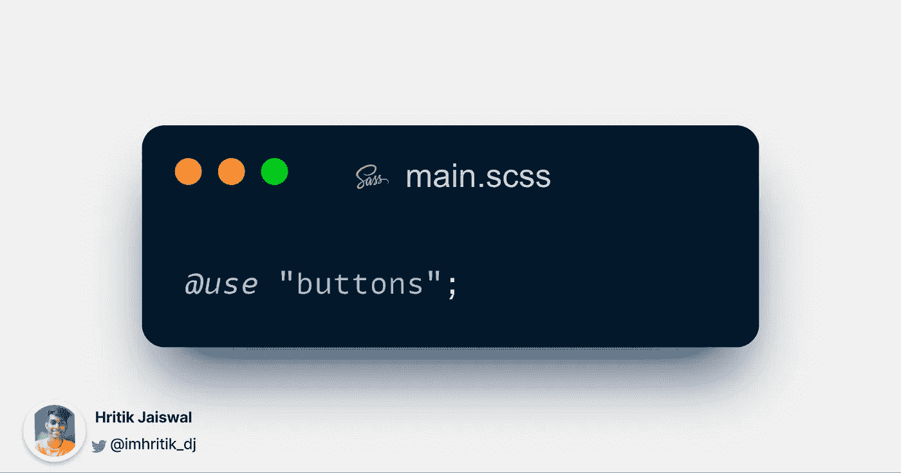

> @use rule 是@import 的主要替代品

`@use`和`@import`之间有一些重要的区别:

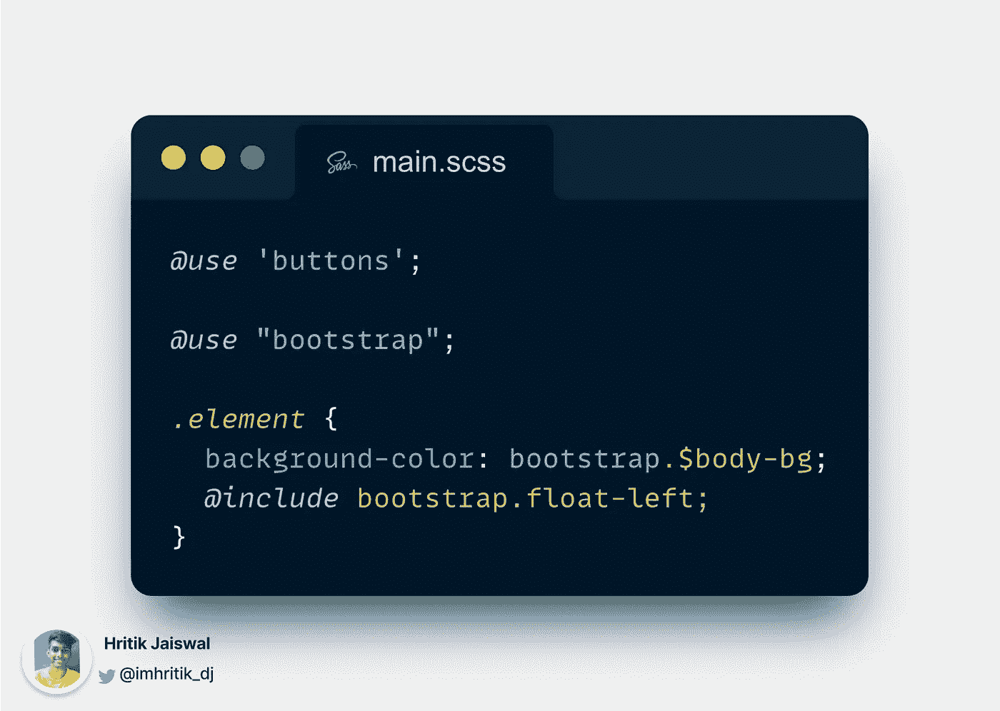

*   `@use`无论样式表使用多少次，只执行一次样式表并包含它的 CSS。
*   `@use`仅使名称在当前样式表中可用，而不是全局可用。
*   以下划线``(_)``或连字符``(-)``开头的变量、混合和函数(Sass 称之为“成员”)被认为是私有的，不会被导入。
*   如果样式表包含`[@extend](http://twitter.com/extend)`，那么这个扩展只应用于它导入的样式表，而不是导入它的样式表。

> 变量冲突—使用@import 时😭

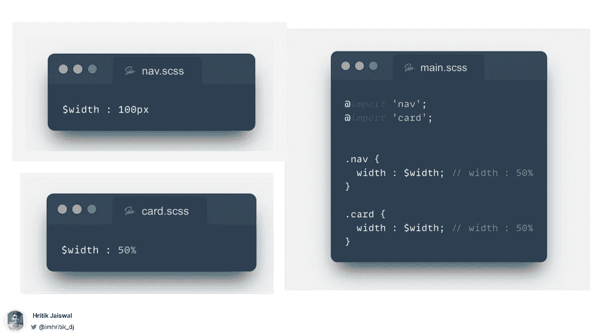

Example 01 : Collision of the variable — while using @import 😭

有两个文件，即`card.scss`和`nav.scss`(子文件)正在 main.scss(父文件)中导入

`.nav`类想要使用在`nav.scss`文件中定义的宽度，而`.card` 类想要使用在`card.scss`中定义的宽度

这里两个文件都包含一个名为`$width`的公共变量，所以在 main.scss 中导入这些文件时，card.scss 的`$width`的值将被拾取，因为它是在`main.scss`文件中的`nav.scss`之后导入的

> @使用前来救援😌

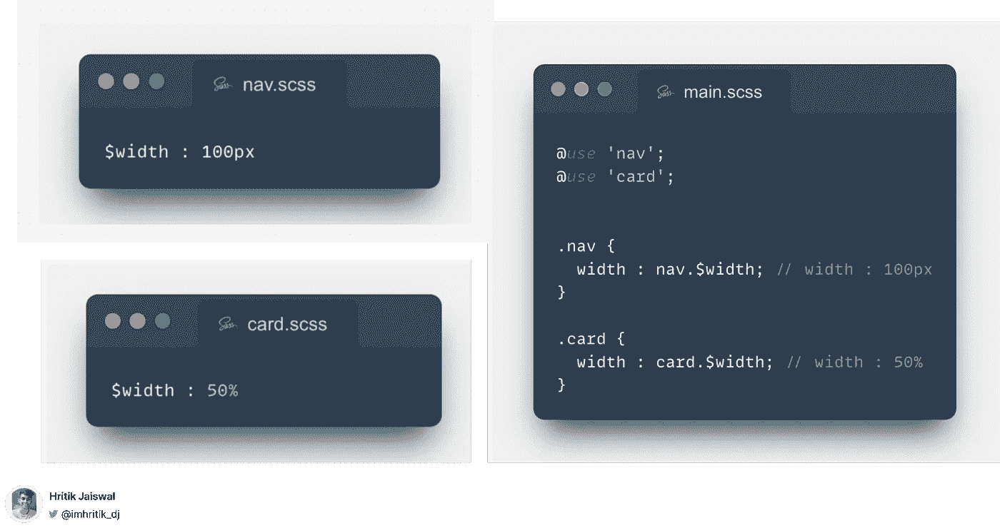

Example 02 : @use came for rescue 😌

您可能认为这个名称空间没有意义，实际上您可以使用`**作为**来控制这些名称空间

> 使用“as”显式重命名命名空间🙀

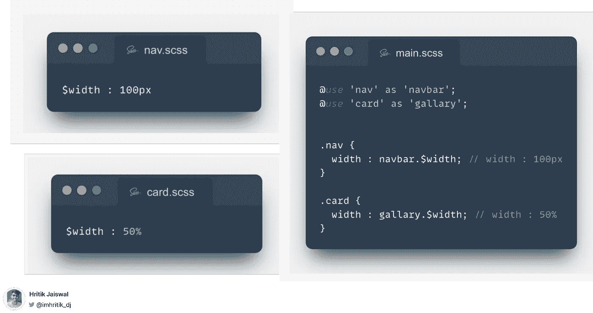

Example 03 : Explicitly rename namespaces using “as” 🙀

> 将模块移动到顶级名称空间📈

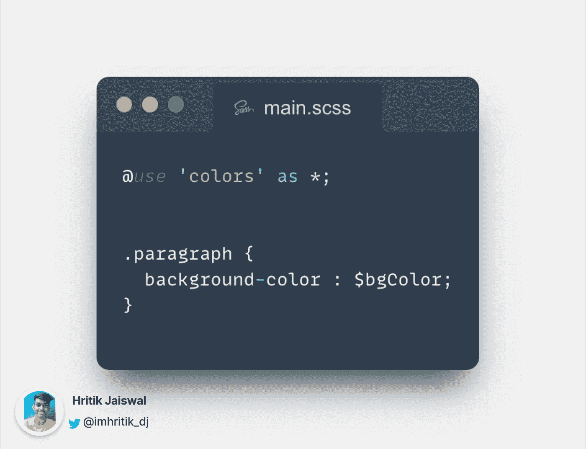

Example 04 : Promote modules to top-level namespace 📈

我们甚至可以使用 ***astrick (*)*** 将模块提升到顶级域，但我们对此要小心，并确保不会引入任何冲突，如果发现冲突，编译器将会抛出错误。

> 能够配置和修改默认值🤩

这个新模块系统的另一个伟大特性是配置默认值的能力。这是定义默认字体大小的库，我们可以像这样修改默认值

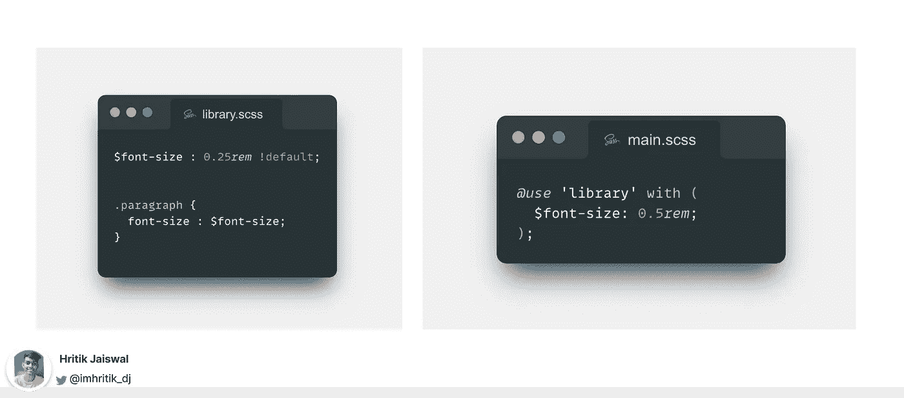

Example 05 : Ability to configure and modify default value 🤩

> 定义私有变量🔒

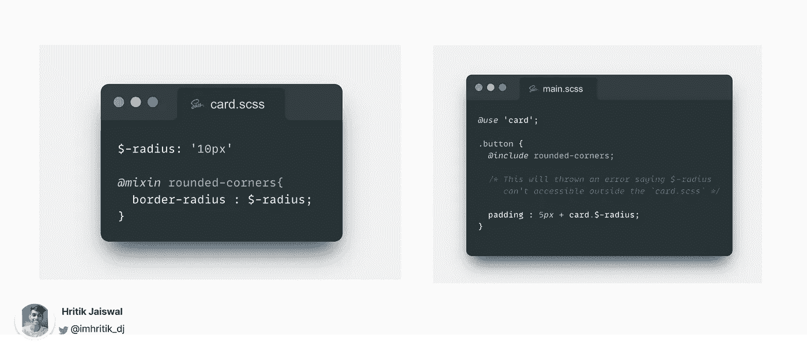

Example 06 : Defining private variables 🔒

在新的模块系统之前，sass 样式表中从来没有私有变量，现在我们可以通过以破折号`( - )`或下划线`( _ )`开始定义私有成员。这个成员将在定义它们的样式表中正常工作，但是它们不是模块的一部分。公共 API 意味着它不能被其他模块全局使用。

> 内部内置模块📦

您过去可能使用过内置的 Sass 函数，如 adjust-hue 和 map.get。这些内置函数中的大部分仍将可用，但不是在全局级别上。这意味着您还需要使用新的`@use`导入规则来导入这些**模块**。

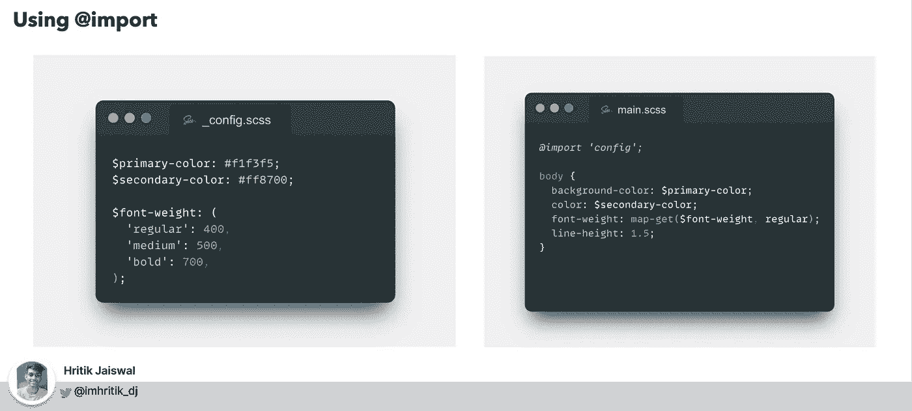

Example 07 : Internal Built-in modules 📦 ( using @import )

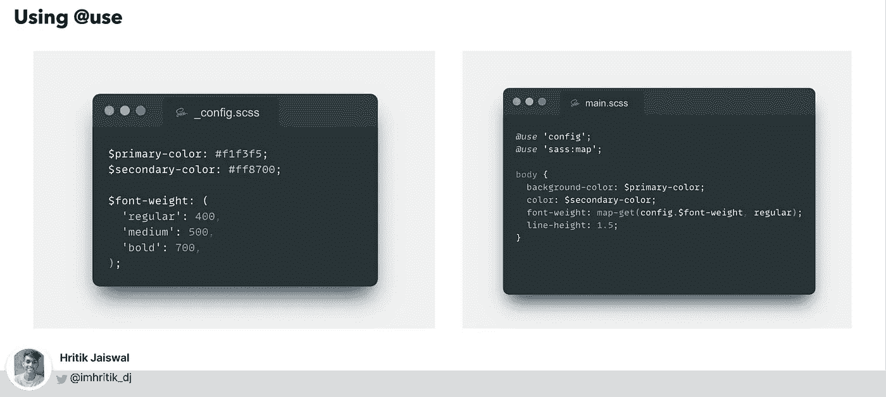

Example 08 : Internal Built-in modules 📦 ( using @use )

> @use 和@import 之间的主要区别🎯

**前面我们谈到了**

> 使用 import 时，首先导入那些包含变量、mixin 或函数的模块。以便稍后定义的模块可以使用它。

而`@use`不再是这种情况

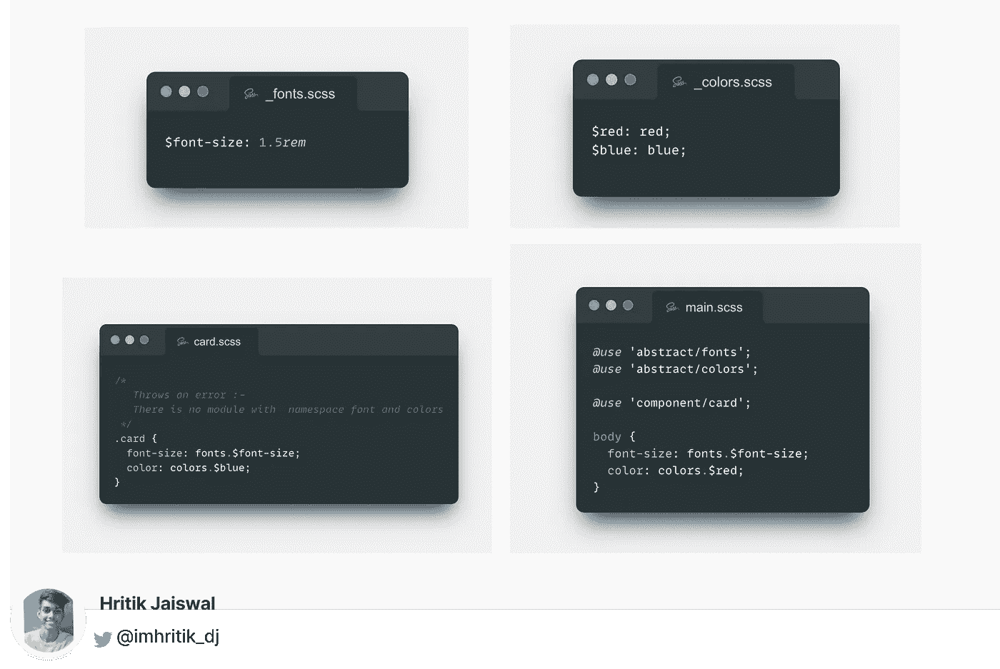

Example 09 : A major difference between @use and @import 🎯

字体和颜色不是全局可访问的，所以无论它后面是什么，都不能再访问成员(即变量、混合和函数)，因此`cards.scss`文件不能访问`$font-size`和`$red`成员。

当我们使用@use 时，它只能在单个文件中访问。
因此字体和颜色模块成员只能在这个`main.scss`文件中访问。

如果你想在 card.scss 中使用字体和颜色的成员，你必须在`card.scss`中导入这些模块👇🏻

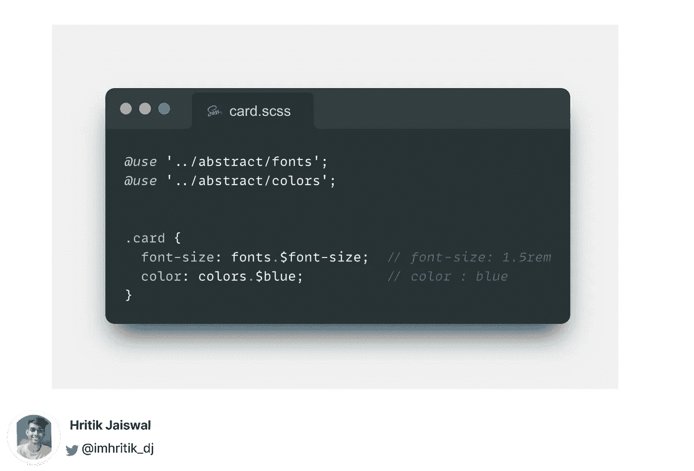

Example 10: A major difference between @use and @import 🎯

## 编译程序支持

新模块系统的一个缺点是目前只有`dart-sass`支持它，对`lib-sass`的支持在☹️还不可用

所以如果你正在使用这个 VS 代码扩展来编译 sass，那么请停止❌

Ritwick Dey 的实时 sass 编译器:[https://github.com/ritwickdey/vscode-live-sass-compiler](https://github.com/ritwickdey/vscode-live-sass-compiler)(这是一个没有维护的库)

**编译 sass 文件的方法**

*   Glenn marks 的分叉式实时 sass 编译器:-[https://github.com/glenn2223/vscode-live-sass-compiler](https://github.com/glenn2223/vscode-live-sass-compiler)
*   使用 CLI Sass 编译器:`npm install -g sass`

```
$ sass watch sass/style.css css/style.css
```

参赛:https://www.npmjs.com/package/sass

*   使用大口任务运行器:[https://github.com/dlmanning/gulp-sass](https://github.com/dlmanning/gulp-sass)

请👏🏻如果你喜欢这个帖子。这将激励我创造和分享更多像这样的内容。

# 支持我

感谢你阅读这篇文章。如果你喜欢它，那么请支持我，通过在 Twitter 和 LinkedIn 上与感兴趣的人分享这篇文章来传播我的话。

1.  **贝宝**——【https://paypal.me/hritikdj 
2.  https://ko-fi.com/hritik**Ko-fi**—[](https://ko-fi.com/hritik)
3.  给我买杯咖啡吧