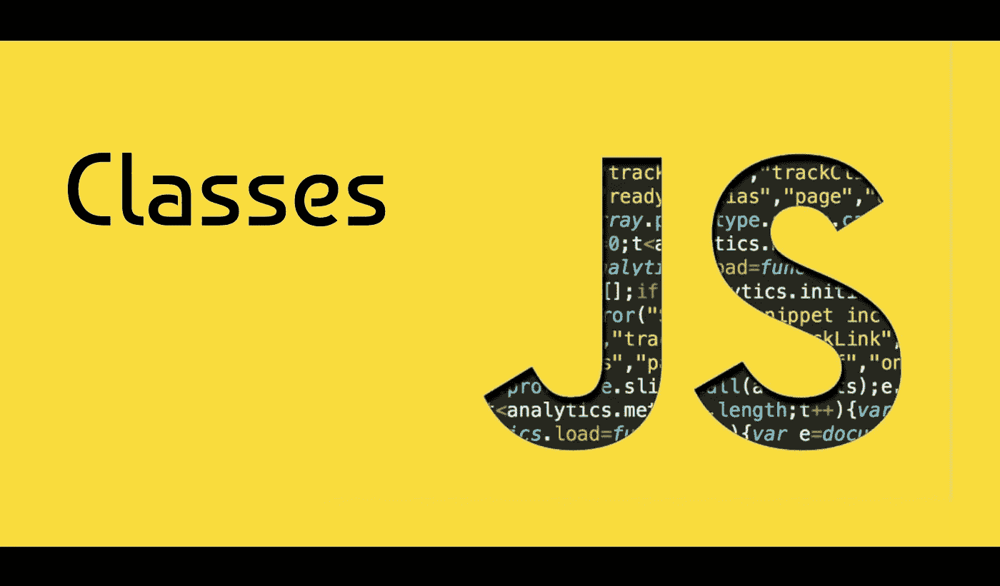
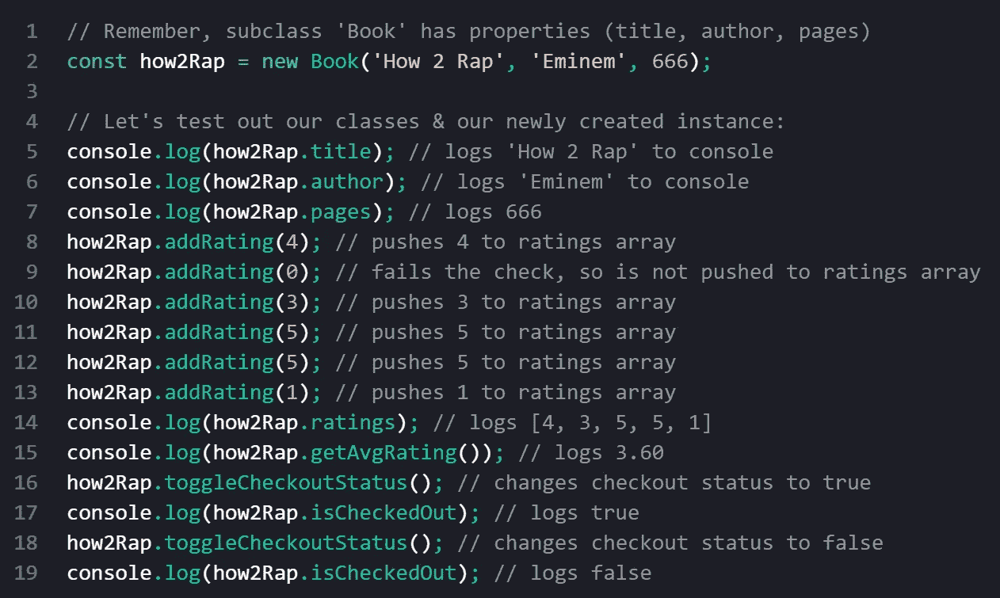

# 不熟悉 JavaScript 类？读读这个。

> 原文：<https://javascript.plainenglish.io/new-to-classes-in-javascript-read-this-e38cad775190?source=collection_archive---------15----------------------->

如果你现在已经学习了一点 JavaScript，你可能已经做过一些函数和对象的工作。如果我告诉你，有一种方法可以更有效地创建具有相似属性的对象，而不是单独创建每个对象，煞费苦心地确保所有的键具有相同的名称，值是正确的类型，等等。？

实际上有许多不同的方法可以做到这一点，比如通过使用工厂函数和类，但是现在，如果你不知何故错过了标题，我们将把重点放在类上。

您可能想知道类如何帮助我们在现实生活中管理数据。在本文中，我将使用管理图书馆内容的例子，但是类也可以用于管理人员、跟踪企业不同分支或位置的信息(如餐馆或银行)、管理大学的课程数据等等。

在我们看我们的例子之前，你应该知道在我们创建类的**实例**之前，我们必须首先创建一个**父类**(也称为**超类**)。类的每个实例都是一个对象，它包含父类的属性、方法、getters、&setter，但具有唯一的属性值，并且可能包含自己的属性、方法等。:下一段将详细介绍这一点。将父类视为构造实例的模板，因为它包含每个实例&子类可以访问的**属性**、**获取器**、**方法**(可以在类的实例上调用的函数)和**设置器**(如果需要)。

类的实例可能与其他实例略有不同，因为它们可能包含父类中没有建立的唯一属性或方法。对于这种情况，我们应该创建一个**子类**(也称为**子类**)。这些包含了父类所包含的一切，只是我们可以添加更多的属性、getters、方法、&setter，如果我们需要的话，这些都是子类所独有的。但是理论谈得够多了，让我们从理论上着手&看看我们前面提到的库的例子。

为了简洁起见，让我们想象我们生活在 1889 年&我们的图书馆里只有一种媒介:书。在更现实的情况下，会有像电影和 CD 这样的东西，我们会为它们创建子类。毫无疑问，它们都有一些共同的属性、getters、方法，也许还有一些 setters，所以在为 books 创建子类之前，让我们用所有这些创建一个名为“Media”的父类:

## 创建父类“媒体”

Create superclass ‘Media’

我们来分解一下上图中发生的事情(下面的数字对应上面评论中的数字):

1.  我们用关键字`class`声明一个类，后跟类名和一个花括号。类名必须大写&用 CamelCase 写。
2.  我们用关键字`constructor`建立类属性。属性名被传递到括号中。然后，我们将属性值设置为默认值，或者在以后创建该类的实例时，设置为传递到构造函数括号中的任何值。注意我们使用了`**this._**`语法**。**
3.  对于每个属性，我们必须建立一个相应的 getter，这样我们以后就可以访问该类的每个实例的相应值。
4.  我们为类创建方法，以及任何必要的设置器。在这个例子中，我们有一个方法，允许我们为这个类(库项目)的实例添加 1–5 的等级。这个新的评级存储在一个数组中。然后，我们有一个方法，使用存储所有评级的数组来确定库项目的平均评级。最后，我们有一个切换项目签出状态的方法。这个方法需要一个 setter，所以我们把它直接放在方法声明之前。

## 创建“Book”，它是超类“Media”的子类

现在，让我们为图书馆中的所有书籍创建一个子类。请记住，我们需要添加属性`**author**` & `**pages**`，这些属性是 books &所独有的，在父类或我们稍后可能为其他项目创建的其他子类中不存在。

Create class ‘Book’, a subclass of ‘Media’

让我们回顾一下正在发生的事情:

1.  我们给子类一个名字，这个名字跟在关键字`**class**`后面。在声明类名之后，我们使用关键字`**extends**`来表示新类是`**Media**`的子类。
2.  我们使用构造函数来建立子类的属性。这些属性没有默认值，因此超类中的`**isCheckedOut**` & `**ratings**`属性不包含在该子类的构造函数中，因为`**isCheckedOut**`的默认值为`**false**` **，** & `**ratings**`最初被设置为空数组。超类的属性`**title**`包含在构造函数中，因为它没有默认值。如果我们输入关键字`**super**` &并将`**title**`放在后面的括号中，这个子类从超类继承这个属性。因此，我们不需要为它创建一个 getter，因为它从超类继承了这个属性。
3.  由于我们添加了两个特定于这个子类的新属性，`**author**` & `**pages**`，我们需要为每个属性创建一个 getter。

## 创建子类“Book”的实例

现在是时候通过创建一个实例来使用我们的类了。让我们创作一本书，标题是阿姆的《如何说唱》，总共 666 页:

Create new instance of subclass ‘Book’

一旦创建了实例，它的行为就像一个对象(从技术上讲，它就是一个对象)。我们可以调用它的 getters 将这些值记录到控制台，以确保我们正确地设置了一切。我们也可以在它上面调用我们在超类和子类中建立的方法。

Are our classes and instance working correctly? Yes.

好了，关于 JavaScript 类的一些内容。在你应该何时使用它们的问题上有一些冲突，但我会让你自己进入这些口水战，无论是在 YouTube 评论区，在 StackOverflow 上，还是在其他地方，甚至可能在下面的评论区。

一如既往，让我知道你是否学到了什么，或者你有什么问题。如果你发现我可以做得更好，请告诉我。

编码快乐！

[关于 JS 类的 MDN 文档](https://developer.mozilla.org/en-US/docs/Web/JavaScript/Reference/Classes)

*更多内容请看*[***plain English . io***](https://plainenglish.io/)*。报名参加我们的* [***免费周报***](http://newsletter.plainenglish.io/) *。关注我们关于*[***Twitter***](https://twitter.com/inPlainEngHQ)*和*[***LinkedIn***](https://www.linkedin.com/company/inplainenglish/)*。查看我们的* [***社区不和谐***](https://discord.gg/GtDtUAvyhW) *加入我们的* [***人才集体***](https://inplainenglish.pallet.com/talent/welcome) *。*