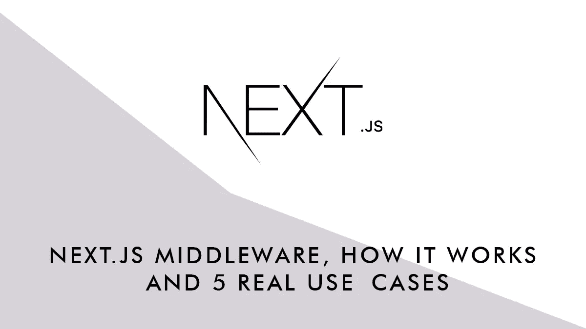

# Next.js 中间件:工作原理和 5 个真实用例

> 原文：<https://javascript.plainenglish.io/next-js-middleware-how-it-works-and-5-real-use-cases-cfacbeb810c9?source=collection_archive---------1----------------------->

# Next.js 中的中间件是什么？

从 v . 12 . 0 . 0(12 . 2 . 0 起稳定)开始，Next.js 增加了中间件。中间件(和许多其他框架一样)是一种在用户请求到达实际页面之前拦截用户请求的方法。简单地说，它是位于服务器和前端之间的一段代码。中间件在用户发出每个请求之前运行(但它可以被过滤以在特定页面上工作)，可以从用户请求中读取数据，执行函数管道并返回给客户端。

# 中间件如何在 Next.js 中工作

将一个`**middleware.ts**`文件(它将导出一个名为 function 的中间件)放在你的项目的每个页面的根目录下，你的站点的 API 将在到达页面之前执行中间件管道。下面是最基本的中间件，它简单地记录用户请求(因此您可以看到请求是由什么组成的)，不做任何其他事情，并返回页面(使用`**NextResponse.next()**`):

除了使用`**next()**`返回页面，NextResponse 还可以设置和获取 cookies，设置标题，并将请求重定向或重写到另一个 URL。

此外，基于在请求
中找到的*路径名*使用匹配器或条件语句，中间件只能在特定页面上运行。由于中间件在将页面发送给用户之前运行，它不会影响页面的呈现方式，因此它可以与 CSR、SSR、SSG、ISR 一起工作。

通过中间件利用请求将允许我们在没有页面中的服务器端代码的情况下操作响应。

> 如果你想学习更多关于中间件的知识，你可以阅读 Next.js 文档

 [## 高级特性:中间件| Next.js

### 中间件允许您在请求完成之前运行代码，然后基于传入的请求，您可以修改…

nextjs.org](https://nextjs.org/docs/advanced-features/middleware) 

# 重定向和重写

有时候你改变了一个页面的 URL 或者(甚至更糟)一个网站部分的完整结构，但是你不想失去你获得的 SEO 分数。大多数指南会告诉你，你需要重定向你的旧网址到新的。通过将所有匹配模式重定向到其他地方，您可以很容易地用中间件实现它。例如，您可能想从像`**/blog/date/post**`这样的结构转移到像`**/content/post**`这样的结构。新结构就绪后，使用中间件执行重定向:

另一种情况是重写内容(保留 URL，但显示不同的页面)。例如，您有一个餐馆网站，其中有一个页面(姑且称之为/about)显示开业日期和时间。在很短的一段时间内，你的时间表发生了变化，你不想编辑你的“关于”页面，但你也不想更改它的地址。使用临时数据创建一个新页面/about-temp，并使用中间件将/about 页面重写为/about-temp:

> 我们使用`clone()`来保持 querystring 和其他 url 部分不变

# 证明

从基本用户/密码，以这种方式使用 401 状态:

到更复杂的授权/认证模式。因为您可以从请求中读取头和 cookies，所以您可以使用它们进行身份验证。在下面的示例中，我们正在读取一个载体认证令牌，如果用户被授权，我们将显示页面，否则，我们将客户端重定向到一个登录页面:

# 脚手架

在开发一个网站时，你可能想向用户展示一个“正在建设中”的页面，但同时，你需要向你的客户展示网站的进展。您可以将一个密钥放在 URL 的末尾，让中间件在第一次访问时检查密钥是否存在，并设置一个会话 cookie。如果密钥存在，所有其他请求都将检查 cookie。如果 cookie 不存在，用户将被重定向(或重写)到“正在构建”页面:

# 个性化

基于 cookies(或其他请求参数)，您可以将用户重定向到不同的页面。让我们假设你有一个电子商务，并把你的客户分成四组。您可以使用不同的优惠和 CTA 创建 4 个不同的主页，并根据用户的分组向他们展示:

# 僵尸阻断

因为您可以读取用户代理，所以您可以将机器人和收割机重定向到 404 页面:

# 更多用途

因为您可以访问客户端请求(包括标题、cookies、地理位置和更多数据)，所以在向用户显示页面之前，您可以执行许多操作。你真的可以根据语言、cookies、位置、页面请求本身进行深度个性化。您可以记录统计和调试请求，计算页面访问次数，等等。一旦部署到 Vercel，中间件功能非常快，因为它们部署在 Edge 上。这比在页面级别拥有相同的代码要快得多，不考虑是在上面一个级别，它们可以访问更多的请求数据，并且它们不需要为每个页面复制。

## 进一步阅读

 [## 使用 Next.js 13 的前沿特性获取数据——入门

### NextJS 13 中的数据获取使用了应用程序目录、流、暂挂以及混合服务器和客户端组件。

javascript.plainenglish.io](/data-fetching-with-next-js-13s-bleeding-edge-features-a-primer-a60ddd3f7570) 

*更多内容请看*[***plain English . io***](https://plainenglish.io/)*。报名参加我们的* [***免费周报***](http://newsletter.plainenglish.io/) *。关注我们关于*[***Twitter***](https://twitter.com/inPlainEngHQ)[***LinkedIn***](https://www.linkedin.com/company/inplainenglish/)*[***YouTube***](https://www.youtube.com/channel/UCtipWUghju290NWcn8jhyAw)*[***不和***](https://discord.gg/GtDtUAvyhW) *。***