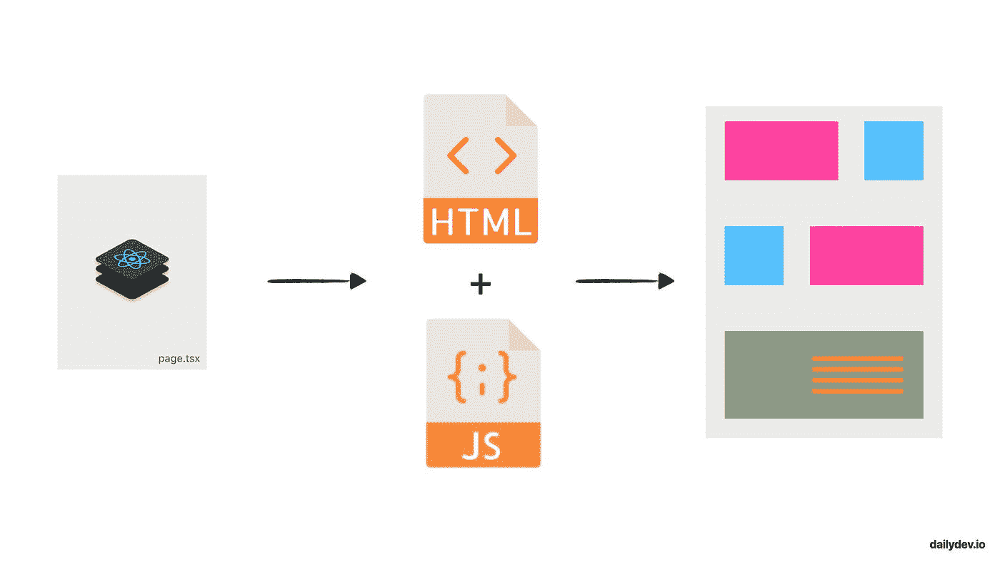
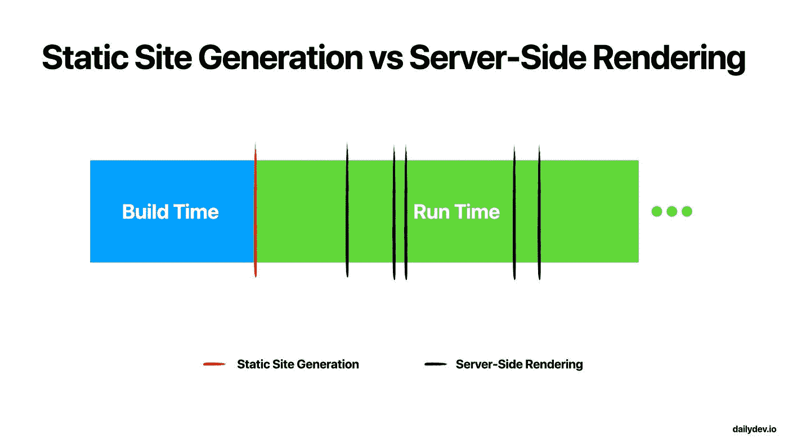
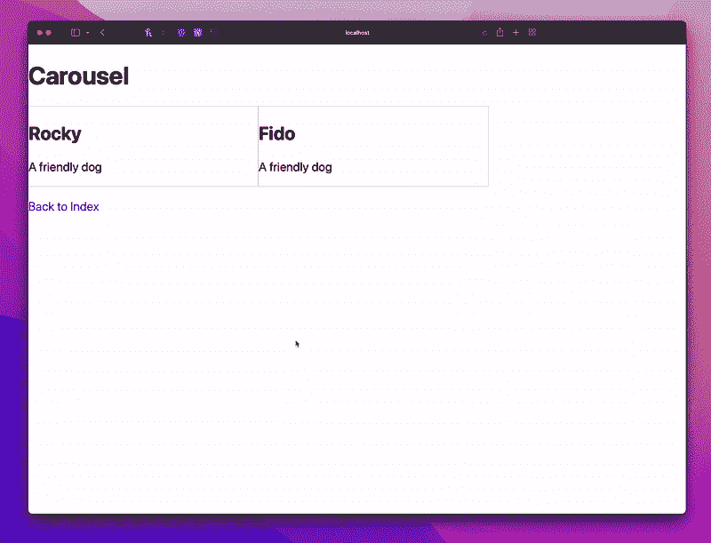
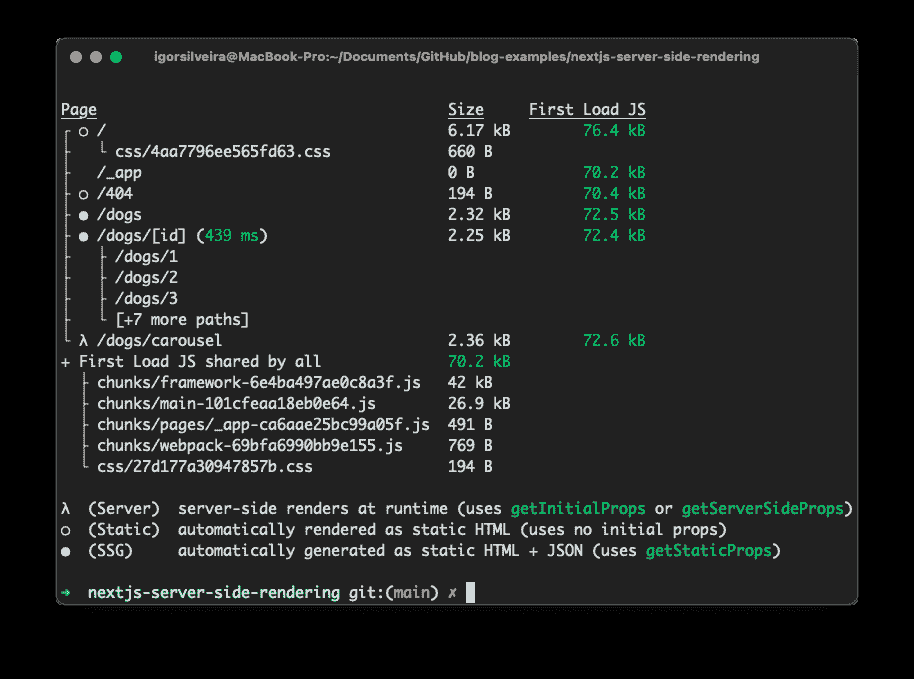

# Next.js 服务器端渲染实例

> 原文：<https://javascript.plainenglish.io/next-js-server-side-rendering-practical-example-23f9345722c6?source=collection_archive---------5----------------------->

## 用一个实际例子探索 Next.js 服务器端呈现。

Server-Side Rendering

*你好，我的名字是 Igor，如果你碰巧喜欢我写的东西，你可能也喜欢我在* [*我的 Twitter 个人资料*](https://www.twitter.com/igorasilveira) *上说的话，来打个招呼吧！👋。*

本文是我整理的整个 Next.js 系列文章的一部分，旨在帮助您成为 Next.js 专业人士，并构建速度极快的 React 应用程序。

💡如果你不想错过任何教程，请点击[此处](https://www.getrevue.co/profile/igorasilveira)注册我的时事通讯，或前往 [DailyDev.io](https://dailydev.io/) 获取更多信息。

在这个问题上，我们将讨论 Next.js 服务器端渲染，补充上一个关于预渲染主题的视频。

💡你可以在这里找到这个项目[的源代码。](https://github.com/igorasilveira/blog-examples/tree/main/nextjs-server-side-rendering)

所以让我们开始吧！

在继续更好地理解我们将在这里做什么之前，请务必查看我以前在 *Next.js pages* 、*动态路由、*和*静态站点生成*上的文章。

# 快速回顾

上一次我们在这里介绍了预呈现的概念，这是 Next.js 用来呈现页面的默认方法，通过为客户端提供预构建的 HTML 文件和必要的 JavaScript 文件，从而为客户端带来更好的性能和更少的工作量。

我们讨论了 Next.js 提出了两种主要的预呈现方式:静态站点生成和服务器端呈现。那一次，我们讨论了前者，并更新了我们即将推出的狗搜索应用程序，以获得 Next.js 功能的好处，在这一次，我们将学习一些新的东西。

# 服务器端渲染

服务器端呈现与静态站点生成的工作原理相同，其目标是为客户端提供一个预先构建的静态 HTML 页面，该页面由服务器预先呈现，然后由捆绑的 JavaScript 文件进行处理，将页面恢复到其真正的交互状态。

Next.js 附带的这两种预呈现方法的主要区别在于页面的 HTML 是何时预呈现的。

运行`next build`命令时，静态站点生成的页面会在构建时预先呈现。这是一个生成并遗忘它们的例子，直到需要一个新的构建来反映新的变化。

但是，在服务器端生成的页面上，页面的 HTML 是在每次请求服务器时生成的。这意味着在应用程序的生命周期中，同一个页面会呈现多次。请求多少就有多少(除非我们使用*缓存*，稍后会详细介绍)。

如您所见，服务器端呈现的页面性能不如静态生成的页面，并且不能存储在 CDN 上以实现更快的全局访问。

然而，有时服务器端呈现可能是唯一的选择。在创建页面时，您可能会考虑使用服务器端呈现而不是静态站点生成，主要原因是该页面需要预先呈现频繁更新的数据，这些数据必须从一些外部数据源获取，因此不能在构建时静态生成，因为它需要始终保持最新。

# 如何使用它

除非我们指定一个页面要么在服务器端呈现，要么用数据静态呈现(查看上一篇文章)，否则 Next.js 将无法区分这两者。

为了做到这一点，Next.js 允许我们在页面的组件中定义特定的方法，然后评估每个页面是在构建时还是在每次请求时预呈现。

之前，我们讨论了特定于静态站点生成的方法，这与服务器端呈现没有什么不同。

为了对页面使用服务器端呈现，我们从页面的 React 组件中导出一个名为`getServerSideProps`的`async`函数。这是 Next.js 服务器在每次请求该页面时将调用的函数。

这个函数将通过它的`props`把我们想要的任何数据输入到我们的页面组件中，通过一个非常具体的返回类型。

就这样，我们的页面变成了服务器端呈现的，并且每次被请求时都会更新！😎

# 更新我们的狗应用程序

现在让我们在 Doggo 应用程序中创建一个服务器端渲染页面来看看它的运行。

出于本教程的目的，我们将创建一个页面，该页面将显示一个 dog carousel，每次我们请求该页面时，它的数据都将来自服务器。

💡注意:如果你没有关注 Doggo 应用的创建，你可以检查这个 GitHub 库并修改它。

# 创建我们的新页面

让我们在`/pages/dogs`目录下创建一个名为`carousel.tsx`的新文件。

导出一个名为`Carousel`的新 React 组件，它将接收一个`data`对象作为组件`props`，这些组件是用上一篇文章中创建的狗`interface`的`array`类型化的(检查`/definitions/dogs.d.ts`)。

在其中呈现一些 HTML，您的组件应该如下所示:

# 使其在服务器端呈现

现在让我们添加一个神奇的函数，让它成为一个服务器端呈现的页面，`getServerSideProps`函数。

这个函数将获取我们的内存数据库中的所有狗，这些狗是我们作为导出`array`的类型脚本文件创建的(检查`/db/dogs.ts`，我们还为本教程添加了一些条目)，并将它们作为随机排序的列表返回，以便我们新创建的组件可以使用它来创建“频繁”更新的 carousel。

💡请记住，在真实的场景中，这将是一个外部 API 调用，可能会处理更多的逻辑来生成所需的数据。但是出于本教程的目的，我们将简化这个过程，以便专注于手头的主题，服务器端渲染。

我们的函数应该是这样的:

# 呈现数据

既然我们的组件已经接收了数据，我们就可以接受它并对它做任何我们想做的事情。

我将创建一个两列的`grid`，在里面，我们遍历我们的`data`道具(我们知道是一个`Dog`)上的每一个物品，并在屏幕上呈现它们的名称和描述。当然，我们也添加了一些 CSS，这样就不会变成 HTML 的混乱。😉

也许是这样的:

# 决赛成绩

所以到最后，可以在`/dogs/carousel`下找到的页面应该看起来像这样，并且每次我们请求它时都用服务器获取的数据进行更新。酷！😎

# 结束语

要体验静态站点生成和服务器端呈现之间的差异，不要忘记运行 build 命令(`npm run build`)，然后运行 serving ( `npm run start`)生成的文件。这就是页面在生产环境中的服务方式，并由某个 CDN 进行缓存。

以`npm run dev`模式运行项目将总是在每个请求上构建所有页面，在所有请求上运行所有特定的预渲染功能。

注意 Next.js 是如何检测哪些页面是静态的或服务器端呈现的。

如果你遇到任何麻烦，请随时在 Twitter 上联系我，我的 DMs 永远是开放的。

下一步:请关注我接下来的 Next.js 教程，我们将在 Next.js 领域进行更多的讨论！如果你不想错过任何教程，点击这里注册我的时事通讯。

*更多内容看* [***说白了。报名参加我们的***](https://plainenglish.io/) **[***免费周报***](http://newsletter.plainenglish.io/) *。关注我们关于*[***Twitter***](https://twitter.com/inPlainEngHQ)*和*[***LinkedIn***](https://www.linkedin.com/company/inplainenglish/)*。查看我们的* [***社区不和谐***](https://discord.gg/GtDtUAvyhW) *，加入我们的* [***人才集体***](https://inplainenglish.pallet.com/talent/welcome) *。***