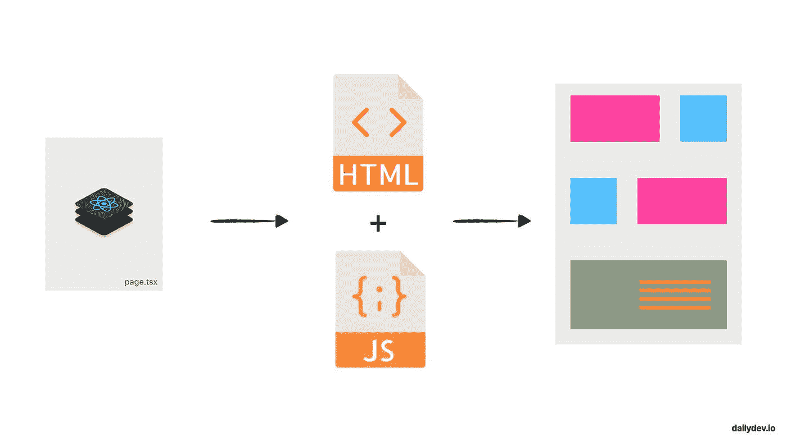
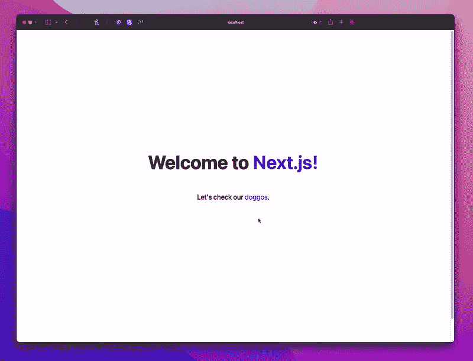
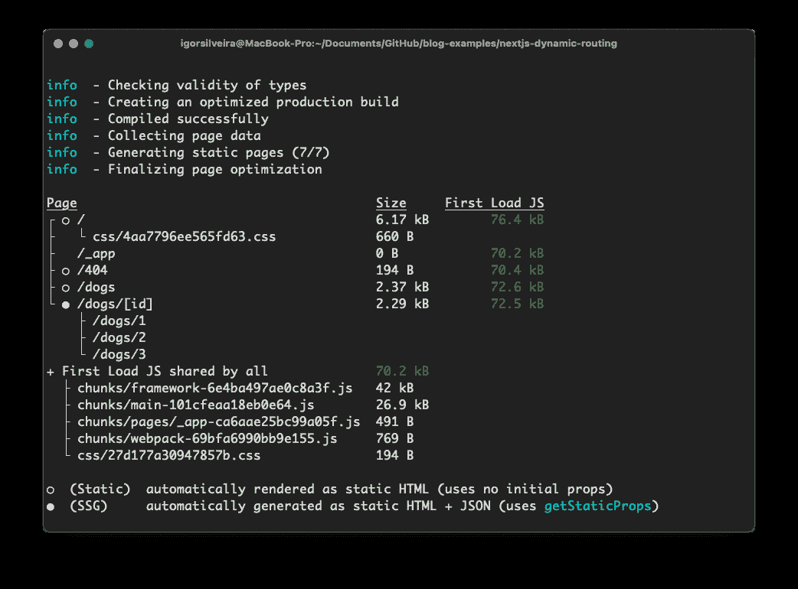

# Next.js 静态站点生成实例

> 原文：<https://javascript.plainenglish.io/next-js-static-site-generation-practical-example-9c0f53d2f897?source=collection_archive---------8----------------------->

## js 如何通过默认预渲染每个页面来实现高性能网站，而不是全部由客户端 JavaScript 来完成。

本文是我整理的整个 Next.js 系列文章的一部分，旨在帮助您成为 Next.js 专业人士，并开始构建速度极快的 React 应用程序。

💡如果你不想错过任何教程，请通过[点击这里](https://www.getrevue.co/profile/igorasilveira)注册我的时事通讯，或者前往 [DailyDev.io](https://dailydev.io/) 获取更多信息。

在这个问题上，我们将了解 Next.js 如何通过默认预渲染每个页面来实现高性能网站，而不是像常规 React 应用程序通常所做的那样，全部由客户端 JavaScript 完成。

💡你可以在这里找到这个项目[的源代码。](https://github.com/igorasilveira/blog-examples/tree/main/nextjs-static-generation)

所以让我们开始吧！

# 先决条件

*   节点≥ 12
*   反应基础

# 快速回顾

到目前为止，我们一直在讨论页面的概念，如何在我们的 Next.js 项目中表示它们，以及如何使它们成为静态或动态的，以便 Next.js 知道如何呈现特定的 URL 并将其匹配到相应的 React 组件。

然后，我们通过运行`npm run dev`启动我们的开发服务器，等待浏览器窗口弹出，显示我们在`http://localhost:3000`运行的应用程序。太好了！👍

但有一件事我们还没有做，那就是深入研究 Next.js 是如何组装这些页面，并在我们访问某个 URL 时将它们返回给我们的。更好的是，我们的应用程序的生产版本与我们在本地运行的开发环境有什么不同。**而这才是 Next.js 真正大放异彩的地方。**

# 预渲染

“什么是预渲染？”你可能会问。预渲染是在应用程序中获取一个页面并预先为其生成普通 HTML 的行为，而不是让客户端处理大部分工作。HTML 还附带了最少的 JavaScript 代码，这些代码将在客户机上运行，是使页面完全交互所必需的。

这个过程有助于解决通常与 React 应用程序和一般单页应用程序(spa)相关的两个主要缺点:

*   令人震惊的是**搜索引擎优化** (SEO)能力低下，因为所有页面和转换都由客户端通过 JavaScript 代码处理，因此搜索引擎无法抓取
*   **客户负担沉重**因为他们必须在浏览器上下载并运行整个应用程序，随着应用程序变得越来越大，交互性越来越强，这很快就出现了问题

# Next.js 如何处理预渲染

默认情况下，Next.js 将预先呈现每个页面。它可以以两种不同的方式发生，不同的是当为页面生成 HTML 时**:**

*   **静态生成:**HTML 在**构建** **时间**生成，并在该页面的每个请求中重用。
*   **服务器端** **渲染(针对另一篇文章):**页面的 HTML 是在**每个请求**上生成的。

这两个选项都将提供我们在上一节中讨论的好处，但是它们可以根据不同的需求用于不同的用例，您甚至可以通过静态生成大多数页面和服务器端呈现其他页面，在同一应用程序中开发*混合*方法。

为 web 应用程序提供服务的最佳和最具性能的选择是静态生成所有应用程序的页面，因为它们可以很容易地缓存在*内容交付网络* (CDN)中，并通过在最靠近请求客户端的地方提供服务来提高性能。然而，在某些情况下，服务器端呈现可能是唯一的选择。

现在，我们来看看如何在或狗 app 内实现静态生成。

# 静态生成

使用静态生成，当我们运行`next build`命令时，页面的 HTML 在**构建时**生成。每当页面被请求时，生成的 HTML 就被提供和重用。

有两种静态生成页面的方法，**有或没有来自外部来源的数据**。

# 无数据静态生成

这是 Next.js 页面最基本的用例，因为这是框架的默认行为。

从`pages`文件夹中的文件导出的简单组件在预渲染之前不需要获取任何外部数据，在构建期间会生成一个 HTML 文件。

一个例子是我们在 Next.js 基本路由的第一个教程中创建的单个狗页面:

# 数据静态生成

然后是静态生成，依赖于获取外部数据进行预渲染。您可以想象需要获取外部数据来呈现页面的两种不同的用例:

1.  您的页面内容依赖于外部数据。
2.  您的页面**路径**(现有路线)依赖于外部数据。

**场景 1**

我们可以在 doggo 应用程序中想到一个例子，其中我们的页面内容将依赖于外部数据。我们在上一个教程中制作了动态页面，所以所有的狗都由同一个 React 组件渲染。但是所有的狗都有不同的信息呈现在页面上，因此，每只狗的页面都有不同的内容。

让我们假设更新后的狗页面的以下片段:

为了用正确的数据呈现每个狗页面，我们需要向 React 组件提供特定的狗数据。

为了在 Next.js 中做到这一点，我们将在导出表示页面的 React 组件的同一个页面中导出一个具有特定名称`getStaticProps`的`async`函数。这个函数将在构建时预呈现页面时被调用，您可以将必要的获取数据传递给页面的`props`。

**场景二**

上次，我们在应用程序中创建了一个动态页面**来启用动态路线**。于是，我们的应用程序开始响应所有对`/dogs/:id`页面的请求。但是我们的应用程序并没有只为现有的狗*id*公开路线，而是匹配每一个 id，所以它永远不会在该路线下返回一个 *404 - Not Found* 。****

在现实世界中，这没有多大意义。我们只想为数据库中存在的特定和单独的资源呈现和提供页面。

所以我们的页面路径**依赖于外部数据，应该被预先渲染。与之前类似，Next.js 允许你在你的页面组件的文件中声明一个特定的函数，其唯一的目的是返回这个**动态页面**应该呈现的**路径**的列表，`getStaticPaths`。这个函数也会在构建时被调用。**

现在`getStaticPaths`和`getStaticProps`可以协同工作，基于单个动态 React 组件预渲染现有狗的所有页面。

# 更新我们的狗应用程序

现在是时候看看这是怎么回事了，给我们之前创建的动态页面加电，让它发挥最大潜力。

# 创建狗界面

由于我们使用 TypeScript 来确保类型安全和易于开发，我们应该利用它并创建一个`interface`来表示我们的狗，并通过应用程序方便它的使用。

让我们创建一个新的`/definitions`文件夹来存储我们的定义文件，并创建一个包含以下内容的`dogs.d.ts`文件，现在我们有了一个简单的 dog 对象表示。

# 创建我们的狗数据库

为了简单起见，我们将创建一个小的内存结构来存储我们的狗和它们的信息，以便 Next.js 可以访问它们并预先呈现所有的页面。

让我们创建一个`/db`文件夹，在这里我们可以存储所有内存中的数据结构，以便于访问。在里面，我们将创建一个`dogs.ts`文件，并使用我们之前创建的`interface`用一些狗的结构数据填充它。

# 更新我们的狗页面组件

我们将对页面组件进行一些更新，以使其成为 100%动态的，即:

*   移除 Next.js 路由器的使用:Next.js 将通过组件`props`为我们提供所有必要的信息。
*   创建`getStaticPaths`函数来生成一个基于字符串的**路径列表**，它只代表我们可用的狗。
*   创建`getStaticProps`函数，根据`params`中接收的信息获取相应的狗。
*   更新我们的页面内容，使用`dog`道具上的狗信息，它现在从`getStaticProps`接收。

最后，我们的 React 组件应该如下所示:

# 最后一笔:更新狗索引页面

最后，让我们更新一下我们的狗的`index.tsx`页面，这样它会列出所有现存的狗，并链接到它们各自的页面。

同样的原则也适用于这里，但是因为它只是一个非动态页面，所以我们只使用`getStaticProps`并将狗列表作为`props`传递给页面，以便它可以呈现列表。

# 决赛成绩

最后，您的应用程序应该看起来像这样。相当整洁！😎

# 结束语

要体验静态生成的全部功能和速度，不要忘记运行 **build** 命令(`npm run build`)，然后运行 **serving** ( `npm run start`)生成的文件。这就是页面在生产环境中的服务方式，并由某个 CDN 进行缓存。

在`npm run dev`模式下运行项目将总是根据每个请求构建所有页面。

请注意 Next.js 如何检测哪些页面是静态的并依赖于外部数据，从而准确地生成由内存数据库定义的路径。

如果你遇到任何麻烦，请随时在[推特](https://twitter.com/igorasilveira)上联系我，我的 DMs 永远是开放的。

**下一步:**请关注我接下来的 Next.js 教程，我们将在 Next.js 领域进行更多讨论！如果你不想错过任何教程，请通过[点击这里](https://www.getrevue.co/profile/igorasilveira)注册我的时事通讯。

*更多内容看* [***说白了就是***](https://plainenglish.io/) *。报名参加我们的* [***免费周报***](http://newsletter.plainenglish.io/) *。关注我们关于*[***Twitter***](https://twitter.com/inPlainEngHQ)*和*[***LinkedIn***](https://www.linkedin.com/company/inplainenglish/)*。查看我们的* [***社区不和谐***](https://discord.gg/GtDtUAvyhW) *加入我们的* [***人才集体***](https://inplainenglish.pallet.com/talent/welcome) *。*