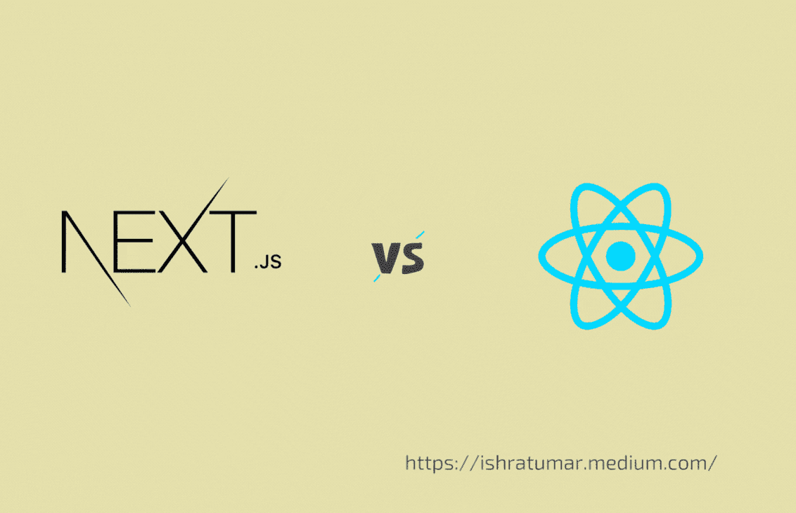

# Next.js vs. React:哪个最适合你的项目？

> 原文：<https://javascript.plainenglish.io/next-js-vs-react-which-is-the-best-for-your-projec-8658cd384e24?source=collection_archive---------3----------------------->

## 您应该在项目中使用哪一个🤔

Next.js or ReactJS

在这个故事中，我们将讨论 React.js 和 Next.js，以找出我们应该在项目中使用哪一个来获得最大的好处。

这个故事的目的不是比较 Next 和 React。相反，它旨在帮助您理解这两者，以便您可以决定是否在您的项目中使用 Next。

我们先分别深入了解一下 React.js 和 Next.js。

所以，让我们开始吧！

## React.js

[React](https://reactjs.org/) 是一个 JavaScript 库，用来在 UI 组件的帮助下创建用户界面。组件是小的、独立的、可重用的代码片段，使大型应用程序易于管理。它是一个免费开源的前端 JavaScript 库，由 Meta 维护。

ReactJS 比其他任何前端开发库都受欢迎；想做前端开发者就要学。由于对 ReactJS 开发人员的需求不断上升，精通 ReactJS 的开发人员有很多机会。

我写了一篇文章解释 ReactJS 及其基本概念，以便给初学者一个快速的概述。

看看这里👇🏻

 [## 什么是反应？react-初学者基础

### 在这个简短的介绍中，我们将讨论一些基本的 React 构建块。还有，看完之后，你会…

ishratumar.medium.com](https://ishratumar.medium.com/what-is-react-react-basics-for-beginners-e44ff22418d3) 

## Next.js

[Next.js](https://nextjs.org/) 是由 [Vercel](https://vercel.com/) 、脸书、谷歌打造的基于 [Node.js](https://nodejs.org/en/) 和 [Babel](https://babeljs.io/) 的 JavaScript 框架。

这可能看起来很奇怪，因为许多 React 网站都是基于 Next.js 构建的。React 网站通常是基于 Next.js 构建的，以简化服务器端的渲染，因为 Next.js 提供了创建开箱即用的网站所需的所有功能。Next.js 有全面的文档。我相信文档是它变得更受欢迎的原因之一。

## ReactJS vs NEXT.js

让我们看看其中的两种，然后决定使用哪一种:

## 工作流程

因为 React 是一个库，所以需要创建自己的工作流。Next 本质上是一个工作流，由于它的有用性，它变成了一个框架。Next 构建于 React 之上，旨在使开发更简单、更快速。在 React 项目中，由于速度的原因，Next 通常是首选。

## 表演

Next.js 支持自动服务器端渲染。用 Next.js 搭建的网站，因为服务器端渲染，速度非常快。React 需要另一个用于服务器端渲染的库，因为它只支持客户端渲染。

查看下面这篇我写的关于 React 状态管理库的文章:

 [## 什么是反应状态管理？

### 8 个超级有用的 React 状态管理库——了解你应该使用哪一个

javascript.plainenglish.io](/what-is-react-state-management-1937c49de5c4) 

## 初学者友好

对于刚刚开始使用 React 的开发人员来说，Next.js 是一个很好的选择。

它使用 [Create React App](https://reactjs.org/docs/create-a-new-react-app.html) ，节省开发人员设置和定制工具集的时间和精力。有了这个，你就不必从头开始构建应用程序了。您可以为不同的应用程序类别使用预构建的模板，或者从头开始创建自己的模板。

首先，只需在终端中输入命令`npx create-next-app@latest`。

**注意:**这个`create-next-app`只创建你的应用的前端。

## 搜索引擎优化

用 Next.js 构建的网站是搜索引擎优化的。搜索引擎优化(SEO)可以提高你的网站在谷歌上的排名。用 Next.js 构建的网站比用 React 构建的网站更有可能在谷歌上排名。

## 社区支持

尽管 Next 的教程和支持资源非常少，但社区和项目成员确实非常积极地参与开源项目。因此，在支持方面，Next 几乎可以与 React 竞争。

## 没有反应就没有 Next.js

没有 React.js 就不能使用 Next.js，就像没有 JavaScript 就不能使用 React 一样。

## 结论

如果您需要利用许多 API 来实现某些功能，那么 Next.js 是您的正确选择。对于简单的静态网站，React 就足够了。

希望这能帮助你理解 Next.js，并帮助你决定是否使用它。

更多有用的内容，请关注 [Ishrat Umar](https://medium.com/u/598701dcfe04?source=post_page-----8658cd384e24--------------------------------) 并与其他人分享。

快乐学习！

你也可以在 [***推特***](https://twitter.com/ishratUmar18) ***，***[***GitHub***](https://github.com/ishratUmar18/)***，***[***hash node***](https://hashnode.com/@ishratUmar18)， ***和***[***dev . to***](https://dev.to/ishratumar)