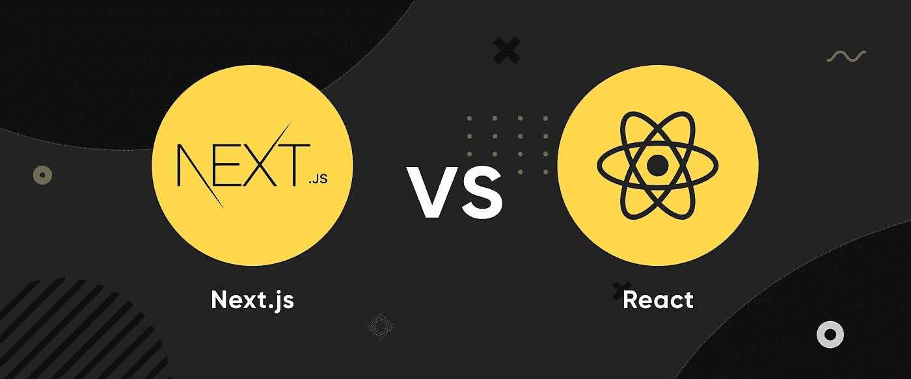
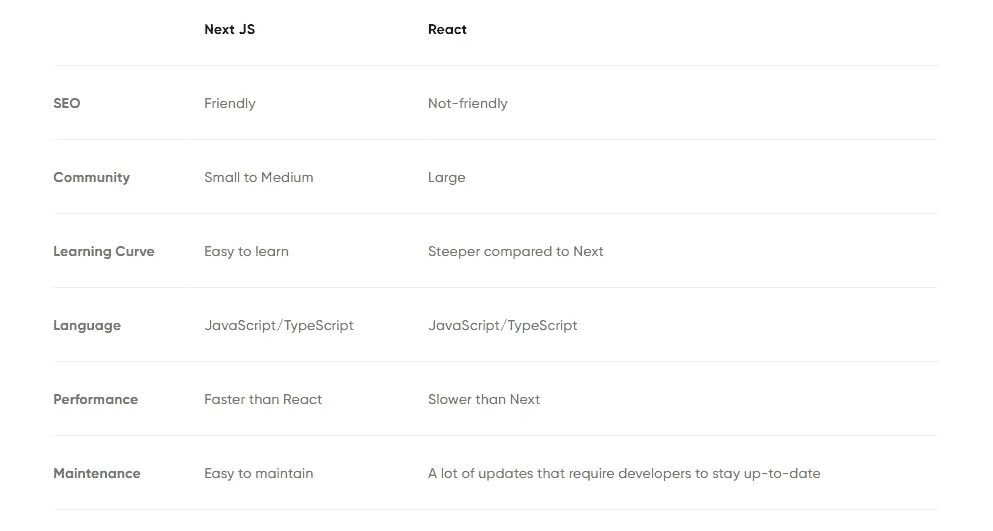

# next . js vs React:2022 用哪个？

> 原文：<https://javascript.plainenglish.io/next-js-vs-react-which-one-to-use-in-2022-7ce9b7068106?source=collection_archive---------11----------------------->

## 比较 Next.js 和 React——在为你的下一个项目选择框架之前，先了解利弊。

如今市场上可用的框架和库的数量肯定会让一些开发人员质疑他们的选择。然而，我们是来帮忙的！在本文中，我们将深入探讨 Next.js 与 React 的冲突，它们的优点和缺点，以及更多！

# Next.js 是什么？

自 2016 年发布以来， [Next.js](https://nextjs.org/) 已经成为 web 开发领域广泛使用的框架。但是如何描述什么 Next.js 是平实简单的呢？对它最简单的定义是，它是一个 **React 框架，开发者可以用它来创建单页面的 JavaScript web 应用**。

Next.js 由 Vercel 创建，旨在照顾开发人员可能需要 React 的所有工具和配置。更重要的是，在框架的帮助下，**开发者可以构建使用服务器端渲染的应用。**

让我们看看 Next.js 的创建者对这个框架说了些什么:

*“我们决定创建一个名为 Next.js 的开源框架，将 React 的所有优势都展现出来。(…)但除此之外，我们还构建了一个由工具、工作流和全球 CDN 组成的完整生态系统，这样您不仅可以创建自己的前端，还可以尽可能快地将其部署到最终用户手中。”*

当谈到比较两者时——next . js 与 React，这真的很难做到，因为 **Next.js 是 React 框架，React 是库**。也就是说，我们认为适当地列出这两种技术的优缺点是最好的。我们开始吧！

# 优势

## 搜索引擎优化友好

现在的 React 其实可以做到 SEO 友好，但是 Next.js 呢？嗯，那就更友好了！在 React 中，每当用户点击一个不同的页面时，它都会被单独安装在浏览器中。这一切都发生在客户端。不幸的是，这导致网络爬虫无法正确地索引页面。

Next.js 的情况不同，由于服务器端呈现，借助框架构建的应用程序可以更有效地进行索引，从而在 **SERP(搜索引擎结果页面)**中获得更好的可见性。

## 表演

在 Next.js 的帮助下开发的应用程序被证明是快速高效的，这都归功于静态生成、代码分割和服务器端呈现。更重要的是，随着[下一个 10](https://nextjs.org/blog/next-10) 更新，框架获得了**一个叫做图像优化**的特性，使得 web 应用的性能更快。

## 简单学习曲线

当我们把 React 和 Next 都拿来看一看它们的复杂性时，我们会注意到后者更容易，至少在编码方面。它的特点是代码更少，更容易实现(一旦页面完成，您必须将它链接到标题中的组件)。

## 缩短上市时间

更简单的编码、更快的开发和更好的性能——所有这些因素都会缩短上市时间。事实上，当谈到开发 MVP 时，Next.js 可能是一个很好的选择。

## 以打字打的文件

除了使用 Next.js 的所有好处之外，该框架还支持 TypeScript。得益于此，开发人员可以构建各种不同的东西，包括**API、页面和其他零配置类型脚本设置**的东西。

# 不足之处

## 缺乏知识

我们有一个不幸的消息给那些在阅读以上所有优点时抱以希望的人。 **Next.js 是 React 的框架，所以为了使用它，你必须先学习 React，或者至少是它的基础知识。**如果事先没有适当的基础知识，你就有陷入开发困境的风险。

## 按指定路线发送

路由是 Next 的另一个明显的缺点。该框架以基于文件的路由器为特色，并且仅在一定程度上支持动态路由,这导致了更复杂的设置，对于某些项目来说可能不够。当然，您可以使动态路由成为可能，但是为此，您将需要来自——例如 NodeJS 服务器的额外帮助。

## 小社区

与 React 相比，Next 的特色是一个相当小的社区。无论如何，这并不禁止您使用这个框架！事实上，确实比 React 小，但它每天都在稳步增长。毕竟，使用框架的人越多，就越容易找到你迫切问题的答案。

# 什么是反应？

[React](https://reactjs.org/) 被广泛认为是市场上最受欢迎的 JavaScript 框架(超过 40%的堆栈溢出调查受访者承认使用 React)。说实话，称 React 为框架有点误导。实际上，**是开源的 JavaScript 库，而不是框架**。但是，嘿，我们不是来改变这种感觉的！

那么 React 是怎么来的呢？

2011 年，乔丹·沃克创作了《反应》，但直到 2013 年才公开发行。从那时起，图书馆的声望急剧上升。毕竟，[是近 1000 万用户的选择库](https://github.com/facebook/react)！嗯，正如您所看到的——数字本身就说明了一切。尽管近十年前就已经发布了，但是从梅塔(脸书)到今天，React 一直由开发人员维护。

这样选择的原因是，React 允许开发人员实现各种不同的东西——例如,**单页应用程序、交互式用户界面、网络应用程序等等。该库还包括一些有用的功能，如**虚拟 DOM 或 JSX** 。此外，最受欢迎的反应应用程序包括脸书、Instagram、Whatsapp 或网飞。**

# 优势

## 易于学习

是的，我们已经在 Next.js 的优势中提到了类似的段落，但是这是否意味着我们不能在这里做呢？当然不是。与 Next.js 类似，与其他库或框架相比，React 还具有简单的学习曲线。该库具有可重用的组件、相对容易的学习过程和通用性，被许多国际公司选择，如**优步**、 **Airbnb** 、 **Dropbox** 等。

## 单向数据流

与大多数其他框架相反，React 的特点是**单向数据流**，而不是双向数据流。但这意味着什么呢？本质上，单向数据流意味着它不必在每次更改时都更新(就像双向数据流一样)。正因为如此，**特定部分的更改不会影响整个应用程序的结构**，也就是说，子组件的更改不会影响父数据。

## 社区

在 Next.js 中，与 reactor 相比，社区处于略微不利的地位，但是对于库呢？嗯，这绝对是个好消息！围绕“反应”的文章、[网络开发博客、](https://massivepixel.io/blog/web-development-blogs/)YouTube 视频、教程和其他出版物太多了，你不应该发现自己在开发过程中迷失和停滞不前。一个强大的用户社区，这是肯定的！

## 可重用组件

反应——很可能——如果没有可重用组件，就不会像今天这样受欢迎。它们是使整个开发过程变得更加容易和顺畅的因素之一。本质上,**可重用组件是代码的“部分”,开发人员可以在应用程序的其他部分甚至在未来的项目中重用它们，而不需要从头开始编写代码。**

## 虚拟 DOM

没有 [**虚拟 DOM(文档对象模型)**](https://massivepixel.io/blog/virtual-dom/) 就不会有 React(或者至少不会像今天这么流行)。在它的帮助下，开发人员可以构建符合现代标准的快速应用程序，因为它负责 React 的速度和性能。

但是什么是虚拟 DOM 呢？简单来说，**是文档对象模型的虚拟表示，DOM 本身是 XML 或 HTML 文档的树形结构**。有了它，开发者甚至可以更新应用程序中最小的组件，而不用担心它会改变整个应用程序。

## React 开发人员工具

幸运的是，尽管 React 没有它所需要的所有工具，但它得到了 React 开发者工具的支持。这是一个浏览器扩展，你可以在谷歌 Chrome 和 Mozilla Firefox 等浏览器上使用。而且你不应该担心它们过时！**超过 300 万开发人员在使用它们**，并不断更新以满足现代需求！

## 创建 React 应用

影响 React 受欢迎程度的另一个功能是 Create React 应用程序。这是一个由脸书开发的工具，旨在帮助用户——顾名思义——创建 React 应用程序。它包括诸如**即时重新加载**、**只有一个依赖**等功能！除此之外，Create React App 实际上很容易维护，是一个非常理想的选择。

## Redux

Redux 是一个 JavaScript 库，经常与其他库或框架一起使用(在这里是 React)。它由丹·阿布拉莫夫和安德鲁·克拉克于 2015 年发行。在库的帮助下，**开发者可以管理应用程序状态或者创建用户界面**。使用 Redux 可以显著影响您的开发过程。比如状态管理模式，更快的开发，更稳定，或者在各种环境下运行的能力。要将 Redux 与 React 一起使用，请确保您获得了允许绑定这两个库的 [React Redux](https://react-redux.js.org/) 工具。

# 不足之处

## JSX

JSX 是一个 JavaScript 扩展，负责使代码更干净、可读性更强。那为什么是骗局呢？这是因为它混合了 JavaScript 和 HTML，导致了一些开发人员可能不喜欢的陡峭的学习曲线。然而，也有好消息。JSX 是可选的，所以如果你是对它不感兴趣的人，你不必担心。

## 大量更新和缺乏文档

由于大量的更新，根本没有时间发布适当的文档。不幸的是，这让开发人员面临一个相当困难的选择，是编写他们自己的文档还是查找其他用户编写的文档。

后一种选择似乎是个不错的选择，对吗？。毕竟，您不必花时间编写自己的文档。但是真的有那么伟大吗？相信其他开发人员的笔记可能会被证明是有效的，但是您也可能会偶然发现稀疏的文本指南，这些指南要么是错误的，要么是不完整的。

然而，更新的数量显然是一件好事。但是一些 [React 开发者](https://massivepixel.io/services/react-development-services/)可能会变得不耐烦，因为每次更新时，他们都必须重新学习 React 或者至少它的一些部分。好吧，我相信我们大多数人都能理解这种情况。

*你也可以在我们的博客上读到关于* [*React 最新版本*](https://massivepixel.io/blog/react-latest-version/) *。*

## 视图层

这可能令人惊讶，但 React 只适用于 web 和移动应用程序的 MVC 模型(模型-视图-控制器)的视图层。为了完成应用程序，开发人员不得不依赖其他工具。

# Next.js vs React:何时使用它们？

直接比较 Next.js 和 React 没有太大意义，因为 Next 是建立在 React 之上的，因此它不是它的竞争对手。这就是为什么——正如你在上面看到的——我们决定列出它们的优缺点。现在，让我们考虑一下开发人员应该在什么时候使用它们。

# Next.js

如果你还在犹豫什么时候应该使用 Next.js，我们在这里可以消除所有的困惑。也就是说，让我们列出你应该利用这个框架的情况。

*   如果您计划创建具有服务器端呈现的 web 应用程序；
*   如果你已经有了关于 React 的知识，但是你还在寻找更多的功能；
*   每当您计划构建一个静态站点时；
*   最后，如果您想构建一个 MVP 并缩短上市时间，Next.js 应该是您的首选框架。

## 反应

现在我们知道了什么时候使用 Next.js，是时候考虑一个开发项目了，在这个项目中使用 React 将是正确的选择。

*   如果你想构建一个 React 项目——也就是——用户界面、单页应用、web 应用等等；
*   如果你想成为 React 拥有的强大而活跃的社区的一员；
*   如果你已经了解 JSX 或者你愿意学习它是如何运作的；
*   如果您计划构建多个应用程序并重用组件。

# 结论

我们的 Next.js vs React 文章即将结束，所以是时候总结一下我们到目前为止学到的一切了。还有什么比对照表更好的方法呢？事不宜迟，我们来看看。

*最初发布于*[*https://massie pixel . io*](https://massivepixel.io/blog/next-js-vs-react/)*。*

*更多内容看* [***说白了。报名参加我们的***](https://plainenglish.io/) **[***免费周报***](http://newsletter.plainenglish.io/) *。关注我们关于*[***Twitter***](https://twitter.com/inPlainEngHQ)*和*[***LinkedIn***](https://www.linkedin.com/company/inplainenglish/)*。查看我们的* [***社区不和谐***](https://discord.gg/GtDtUAvyhW) *加入我们的* [***人才集体***](https://inplainenglish.pallet.com/talent/welcome) *。***