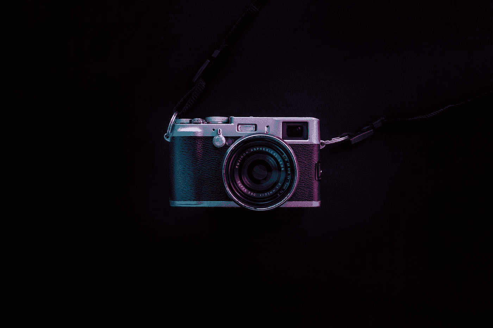
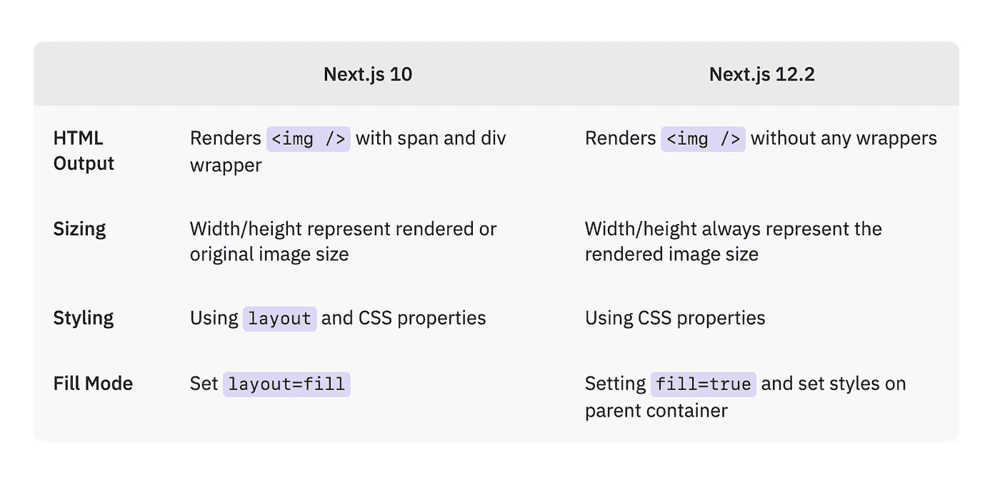

# 如何使用新的<next>组件</next>

> 原文：<https://javascript.plainenglish.io/how-to-use-the-new-next-image-component-1f35379ee1?source=collection_archive---------4----------------------->

## *Next.js 12.2 包含一个完全修订的图像优化组件。让我们看看发生了什么变化。*

Photo by [Robert Shunev](https://unsplash.com/@rshunev?utm_source=medium&utm_medium=referral) on [Unsplash](https://unsplash.com?utm_source=medium&utm_medium=referral)

**注:目前，更新的** `**next/image**` **组件仍在开发中，仅可使用** [**实验标志**](https://nextjs.org/docs/api-reference/next/future/image) **。**

有了 Next.js 10 和随后引入的`next/image`组件，提供图像变得容易多了。图像压缩、现代图像格式、延迟加载——一切都只需替换掉浏览器默认的``标签。

然而，事情毕竟没有那么简单。虽然用户体验改善了很多，但开发人员的体验并不像希望的那样简单。表现不尽如人意的财产，像圣诞节的旧礼物一样包装了几次的图像。

幸运的是，我们听到了反馈，Next.js 为 Next.js 12.2 中的 next/image 组件引入了一个经过修改的实验版本。

让我们来看看主要的变化。

# Next.js 12.2 中`next/image`的变化

下表显示了 Next.js 12.2 中引入的最大变化，以及它与旧图像组件的比较。

让我们看看这在一个例子中会是什么样子。使用图像组件的 API 没有太大变化，但是仍然有一些有用的调整。

# 如何使用固定图像尺寸的`next/image`

如果要保留图像的纵横比，可以使用固定布局。根据你是否在本地导入你的图像，你可以简单的设置渲染图像的宽度和高度图像，就这样！

此外，您可以设置像`style`或`className`这样的属性来设置图像的样式。

几乎不值得解释，对吧？我很高兴事情就这么简单！这种“新”方法与浏览器内置的``行为大相径庭，它并没有让我们思考如何正确使用它。

# 如何在填充模式下使用`next/image`

但是如果你只是想让图片充满它的父容器呢？对于这些情况，您可以使用`fill`属性。将其设置为`true`，确保父容器具有所有需要的样式，您就可以开始了！

如您所见，这也相当简单！当然，还有更高级的场景，但这两个应该涵盖了最常见的用例。

# 演示项目

我创建了一个小项目来展示这两种方法在实际应用中的样子。如果你想仔细看看，你可以在 Github 上找到这个项目。

如果您想更深入地研究，请务必查看官方的 Next.js 文档。它们还涵盖了引擎盖下技术上的变化——绝对值得推荐。

[next/future/image(实验)| Next.js](https://nextjs.org/docs/api-reference/next/future/image)

这篇文章最初发表在 konstantin.digital/blog 的[上。我每月写一篇关于 React 的 web 和产品开发以及如何成为更好的开发人员的文章。](https://konstantin.digital/blog)

*更多内容看* [***说白了就是***](https://plainenglish.io/) *。报名参加我们的* [***免费周报***](http://newsletter.plainenglish.io/) *。关注我们关于* [***推特***](https://twitter.com/inPlainEngHQ) ， [***领英***](https://www.linkedin.com/company/inplainenglish/) *，以及* [***不和***](https://discord.gg/GtDtUAvyhW) *。*