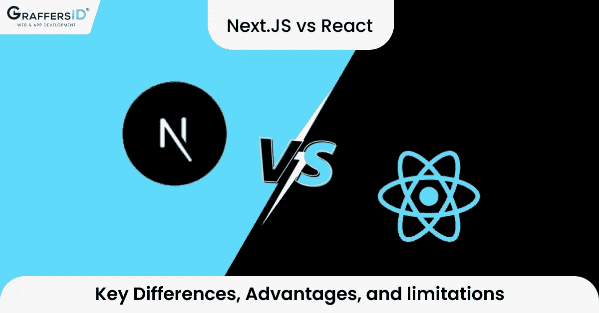

# Next.js 与 React:主要区别、优势和局限性

> 原文：<https://javascript.plainenglish.io/nextjs-vs-react-key-differences-advantages-and-limitations-5b09f03b5a4b?source=collection_archive---------15----------------------->

## 了解 Next.js 与 React 的特性、优点和局限性，以及哪个更适合软件开发。

Next.js vs React

你是一名企业家，正在考虑创建一个登陆页面、电子商务网站、静态网站，或者想开发一个应用程序。你很困惑 [**软件开发**](https://graffersid.com/reduce-custom-software-development-costs-mvp/) 用哪个软件开发平台。然后，不要担心，本文将帮助解决软件开发问题，并在 Next.js 和 React 之间做出最佳选择。

在本文中，您将了解 Next.js 与 React 的特性、优点和局限性，以及哪一种更适合软件开发。

在两个最好的前端开发平台之间进行选择 **(Next.js vs React)** 是一个争论的问题。这两种工具最适合设计 web 应用程序。如果你正在考虑选择哪一种，我们已经详细讨论了两种最流行的前端编程语言 Next.js vs React？我们去看看吧！

React 和 Next.js 都是用于前端开发的流行工具。它们经常用于 [**开发 web 应用**](https://graffersid.com/develop-progressive-web-apps-using-react-js/) 。

# 什么是 React Native？

React 是一种用于前端开发的 JavaScript 语言。它是由脸书开发的，用于构建用户界面。此外，它还用于构建 SEO 友好的动态单页应用程序、移动应用程序、可视化工具和仪表板。

它的交互式用户界面是使用接收数据和呈现显示的组件毫不费力地设计的。

大多数大型科技平台都使用它来开发移动应用**，比如脸书、网飞、BBC、Airbnb、Reddit 等。**

**它的主要竞争对手是 Vue.js 和 angular，但它一直是最受前端开发欢迎的库。**

**通过使用 React Native 等附加库，React 变得更加灵活。与其他 JS 框架相比，它提高了开发速度。**

**它在开发人员中流行的最重要的原因是它易于学习和编码。**

# **使用 React 的优势**

****

## **1.易于理解和使用**

**它很容易学习，因为它附带了一套教程、培训资源和文档。此外，因为它是基于 JavaScript 构建的，所以如果开发人员有 JavaScript 经验，就很容易熟悉 React。由于它的易用性，开发人员可以在几天内用它构建 web 应用程序。**

## **2.易于构建动态 web 应用程序**

**通常，构建动态 web 应用程序需要 HTML 字符串，这使得它们更加复杂。但是使用 React，您可以轻松地构建动态 web 应用程序，因为它是基于 JavaScript 构建的，这使得开发人员可以用更少的代码轻松地构建它们。**

****这里是**[**ReactJS 和 AngularJS**](https://graffersid.com/react-js-vs-angular-js/) **的区别。****

## **3.可重用组件**

**React 有各种组件，其中每个组件都有自己的控件和逻辑。这些组件呈现为可重用的 HTML 片段，这意味着它们可以重复加载到不同的页面上，而不会改变任何特性。您只需编辑组件，更改就会在页面上显示出来。**

## **4.SEO 优化**

**一般来说，JavaScript 框架不能很好地处理繁重的 JS 应用程序，因为它们阅读起来有困难。开发人员经常批评它的使用，但使用 React，开发人员可以轻松地导航搜索引擎，因为 React 应用程序在服务器上运行，虚拟 DOM 可以轻松地呈现并返回到浏览器。**

**此外，使用 React，您可以通过定制和添加不同的工具(如 Redux)来扩展您的库。**

# **React 的局限性**

****

## **1.高速发展**

**它随着环境的变化而不断变化，因此开发人员必须不断地重新学习和更新新技能，并寻找新的工作方式。开发人员可能很难接受环境的变化并不断更新新技能。**

## **2.过时的文档**

**它的开发周期很短，使得可用的文档很快就过时了。此外，社区必须不断学习新的技能和工具，以确保快速响应和查询。**

****这里是** [**颤振 vs React 原生 2021:透视解剖**](https://graffersid.com/flutter-vs-react-native/) **。****

## **3.更新的文档**

**技术的不断升级是如此之快，以至于没有时间来构建和创建文档。通常，开发人员会面临问题，因此他们不得不忍受这些问题，一旦新的工具和版本可用，他们就必须编写说明。**

## **4.性能问题**

**此外，您不能在。js 文件，因为它的 Webpack 不允许它导致性能问题的增加。**

****想从印度** [**雇佣 React 开发者**](https://graffersid.com/hire-dedicated-react-developers/) **。****

# **Next.js 是什么？**

**Next.js 是由 Vercel 创建的开源框架。它基于 Babel 和 Node.js，旨在与 React 协同工作。这是一个构建服务器端渲染(SSR)、网站、应用、林挺和标准化、HTTP 缓存、自动代码分割和 SEO 工具的伟大框架。**

**此外，您可以使用它来创建 SEO 友好的网站、登录页面和电子商务商店。**

**它包含了使网络更快所需的所有工具，是一个网络软件开发工具包。**

**此外，由于 Next.js 构建在 react 之上，它有助于 React 克服其技术能力的不足，并创建服务器端静态的混合应用程序。**

****下面是** [**与**](https://graffersid.com/angular-vs-flutter/) **扑角的详细区别。****

**很多平台都用过，比如 Tiktok、币安、Hulu、Twitch.tv**

**Next.js 展示了两种类型的预渲染。第一种是服务端呈现，它支持在请求时获取数据并呈现，而另一种是静态生成，在请求时间之前数据已经可用，因此它在数据不是特定于用户的或被公共缓存的情况下变得有用。**

**此外，Next.js 支持 typescript，这是它受欢迎的主要原因之一，因为 typescript 是一种基于 JavaScript 的编程语言。它还支持 Redux。**

**Next.js version 12 有许多更新和最新的特性，例如用于更好的图像管理的 rust 编译器、SEO 优化的爬行能力特性，以及用于生产友好和更快构建的各种其他操作工具。**

# **使用 Next.js 的优势**

****

**出于各种原因，大多数开发人员都倾向于 Next.js:**

## **1.易于编码**

**与 React 和其他框架相比，Next.js 需要更少的代码。如此简单，开发人员只需创建一个页面，然后将它链接到标题中的组件，这需要更少的编码，并导致增强的项目管理和更好的可读性。**

## **2.速度**

**如前所述，Next.js 显示了两种类型的呈现:SSR 和静态生成，这使得用 Next.js 构建应用程序时速度更快，因为这是处理数据的更好、更智能的方式。**

**然而，在服务器处理请求之前，服务器端渲染(SSR)会很快，而静态生成很快，因为它是从 CDN 提供的。此外，其本机映像优化功能在更大程度上增强了其性能。**

****知道 Java 与 JavaScript 的** [**区别**](https://graffersid.com/java-vs-javascript/) **。****

## **3.快速渲染**

**它显示了快速渲染，只要你对文件进行任何更改，当你刷新页面时，它将立即可见。由于渲染速度很快，组件可以在现场进行渲染，从而更容易看到编辑内容**

## **4.增强的图像优化**

**它改进了图像优化，这意味着图像可以调整大小，并提供像 WebP 格式。**

## **5.更好的 SEO(搜索引擎优化)**

**此外，它有更好的搜索引擎优化，因为你可以很容易地创建标题和关键字。你只需要使用精选的头部组件。**

## **6.轻松定制**

**Next.js 是高度可定制的，因为它使用了像 babel 这样的插件。此外，它的部署非常简单，使它能够快速启动应用程序。**

# **使用 Next.js 的限制**

****

## **1.按指定路线发送**

**它是一个基于文件的路由器，这意味着它是一个文件系统，使用文件来处理响应和请求。有时这些文件项目对于某些项目来说是不够的。要创建或使用动态路由，您需要准备好 Node.js，这需要熟练的开发人员。**

## **2.灵活性**

**它不是很灵活，因为它没有提供太多的灵活性，因为它没有提供内置的前端页面。你必须从头开始创建前端页面。**

## **3.社区**

**尽管 Next.js 作为 web 的一个组成部分越来越受欢迎，但与 React 相比，没有多少精通 Next.js 的开发人员。对 Next.js 开发人员专业知识的需求正在增加。**

**Next.js 最适合那些精通 React 并使用过 React 的开发人员，他们正在寻找新的工具来构建具有增强的 SEO 功能、高度定制和易于编辑的应用程序。**

****详细了解** [**Deno vs Node:哪个更快？**](https://graffersid.com/deno-vs-node/)**

# **Next.js vs React:**

**Next.js 和 React 编程语言都是显著的构建模块，都是使 web 更快的有益工具。它使用具有更好性能、高生产率和低开发成本的应用程序。**

**使用 Next.js，您可以轻松地构建 web 应用程序，因为它有两种呈现服务:服务器端呈现(SSR)和静态网站，以及其他提供的工具。此外，它易于编码，因此可读性更好。**

**它增强了图像优化和搜索引擎优化组件。对于不熟悉前端开发的开发人员来说，熟悉 Next.js 要容易得多。**

**然而，与 VueJS 和 Angular 等其他替代产品相比，React 非常突出，因为 React 是基于 Javascript 框架构建的，这使得它更受欢迎。**

**此外，如果您想为单页面应用程序构建一个 UI，那么 React 是最好的选择。您还可以通过开发单页面应用程序和创建可重用的 UI 组件来节省大量时间。**

**React 与移动应用程序和 web 的视图层一起工作，使您能够使您的 UI 更具吸引力和更简单。**

****

# **Next.js 比 React 好吗？**

**如果你仍然不知道下一个项目应该使用哪种编程语言，那么这很大程度上取决于你正在处理的项目的目标和类型。**

**Next.js 和 React 对开发者来说都很棒。当然，在性能方面，Next.js 比 React 更突出。**

**由于服务器端渲染(SSR)和静态网站，使用 Next.js 构建的应用程序非常快。此外，其增强的图像优化效果最好。当您使用 Next.js 时，您会得到自动化的服务器呈现和代码分割。服务器端呈现(SSR)增强了应用程序的性能。**

# **结论**

**如果你正在寻找更多的特性和工具来简化工作，你可以使用 Next.js。如果您正在寻找移动和 web 应用程序前端方面的资源，并希望使用户界面更具吸引力和更简单，您可以使用 React。**

**我们希望，有了这些见解，你能为你的下一个项目找到最好的软件！**

***原载于 2022 年 3 月 25 日*[*【https://graffersid.com】*](https://graffersid.com/nextjs-vs-react/)*。***

***更多内容看* [***说白了。报名参加我们的***](https://plainenglish.io/) **[***免费周报***](http://newsletter.plainenglish.io/) *。关注我们关于*[***Twitter***](https://twitter.com/inPlainEngHQ)*和*[***LinkedIn***](https://www.linkedin.com/company/inplainenglish/)*。查看我们的* [***社区不和谐***](https://discord.gg/GtDtUAvyhW) *加入我们的* [***人才集体***](https://inplainenglish.pallet.com/talent/welcome) *。*****