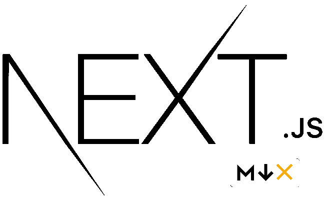

# 带有 MDX 顶级页面的 Next.js

> 原文：<https://javascript.plainenglish.io/nextjs-with-mdx-top-level-pages-da0978a6cfe0?source=collection_archive---------13----------------------->



MDX 是 markdown 的超集，允许您直接在 markdown 文件中编写 JSX。这是一种在内容中添加动态交互性和嵌入组件的强大方法，有助于使您的页面变得生动。

有时，创建带有标记的静态页面并将其作为顶级页面会更容易。

**首先，安装以下软件包:**

```
// If you use Yarn
yarn add @mdx-js/loader @next/mdx

// Or with npm
npm install @mdx-js/loader @next/mdx
```

**编辑或创建 next.config.js:**

**现在可以用了。mdx 页。在 pages 文件夹中创建一个文件，例如 about.mdx:**

```
// ./pages/about.mdx
export const meta = {
author: "Your Name",
title: "About",
};

# My MDX page

This is a list in markdown:

- One
- Two
- Three 
```

**进入“http://localhost:3000/about”就会看到页面。**

*使用下一版本 12.2.2
节点 v16.16.0 (LTS)* 进行测试

*更多内容看* [***说白了。报名参加我们的***](https://plainenglish.io/) **[***免费周报***](http://newsletter.plainenglish.io/) *。关注我们关于*[***Twitter***](https://twitter.com/inPlainEngHQ)*和*[***LinkedIn***](https://www.linkedin.com/company/inplainenglish/)*。查看我们的* [***社区不和谐***](https://discord.gg/GtDtUAvyhW) *加入我们的* [***人才集体***](https://inplainenglish.pallet.com/talent/welcome) *。***