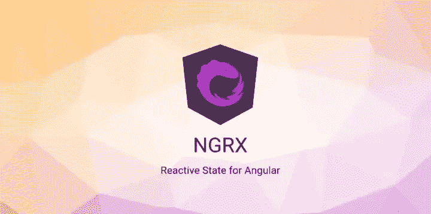
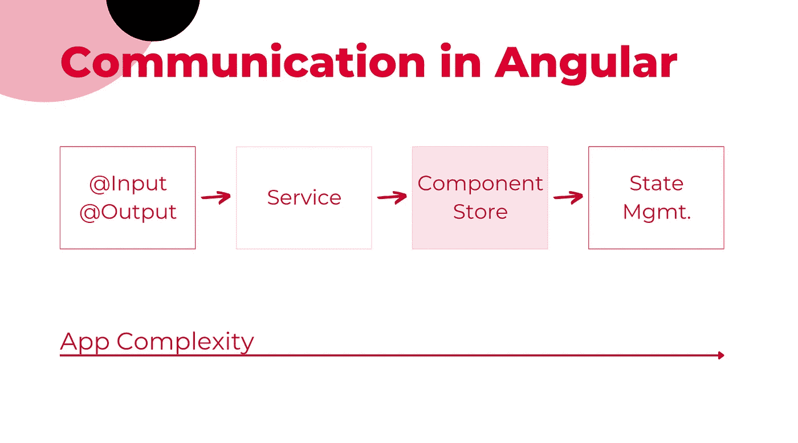
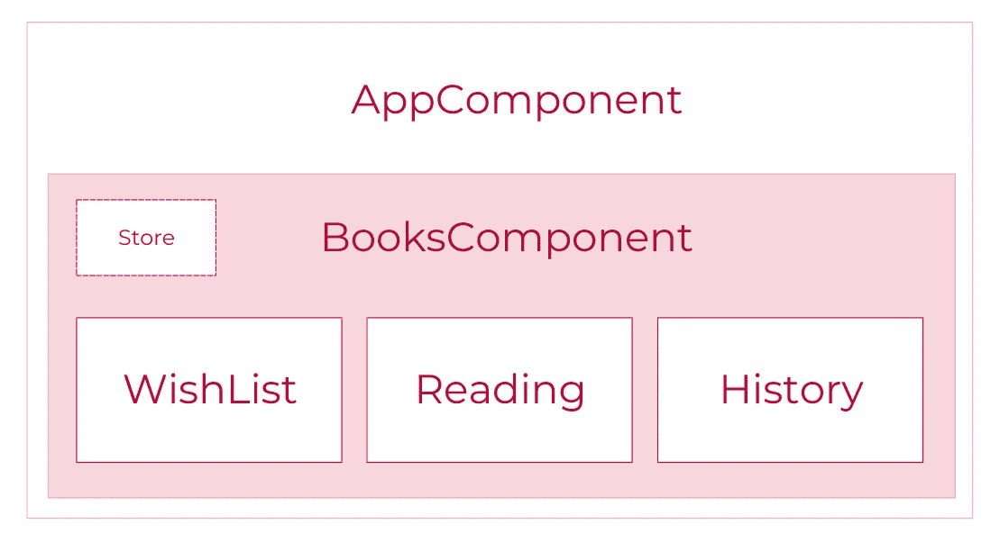
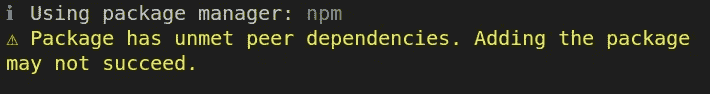
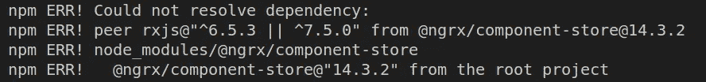

# NgRx 组件存储示例

> 原文：<https://javascript.plainenglish.io/ngrx-componentstore-example-2dd5abf225a9?source=collection_archive---------1----------------------->

## NgRx 组件库介绍及实例

ComponentStore 是一个帮助管理组件状态的状态管理库。 [ComponentStore](https://ngrx.io/guide/component-store#ngrxcomponent-store) 是 NgRx 的一部分，它将自己定位为“*基于被动推送的“主题服务”方法的替代方案。*”



NGRX homepage

了解 NgRx 、Redux 或其他状态管理模式会有所帮助，但是这篇文章解释 NGRX ComponentStore 时假设没有 NgRx 知识。

# NGRX ComponentStore 是什么？

ComponentStore 是一个状态管理工具，允许开发人员在组件级别轻松管理状态(例如本地状态)，而不必在整个应用程序中全局管理它。

这使得推断单个组件的状态以及以可伸缩和可维护的方式实现复杂的状态管理场景变得更加容易。

## 关键概念

[官方文档](https://ngrx.io/guide/component-store)出色地报告了 NGRX ComponentStore 的关键概念:

*   本地状态必须被初始化，但是可以延迟完成。
*   本地状态通常与特定组件的生命周期相关联，并在该组件被销毁时被清除。
*   ComponentStore 的用户可以通过`setState`或`updater`来更新状态，要么强制更新，要么通过提供一个可观察对象来更新。
*   ComponentStore 的用户可以通过`[select](https://ngrx.io/api/store/select)`或顶级`[state$](https://ngrx.io/api/component-store/ComponentStore#state$)`读取状态。选择器是非常高效的。
*   ComponentStore 的用户可以用`[effect](https://ngrx.io/api/effects/EffectNotification#effect)`开始副作用，同步和异步都可以，并强制或被动地输入数据。

# 什么时候应该使用 ComponentStore？

这取决于您的应用程序的复杂性。

如果场景是一个简单的父/子结构，我们可能会选择`@[Input](https://angular.io/api/core/Input)()`和`@[Output](https://angular.io/api/core/Output)()`装饰器。然而，这很快就会变得疯狂。尤其是当父组件和子组件之间有多个组件时。

当应用变得复杂时，状态管理可能是更好的方法。在这种情况下，NgRx 或者它的轻量级版本 ComponentStore 应该是维护单一事实来源和组件间通信的首选方式。

下面是 [Store 和 ComponentStore](https://ngrx.io/guide/component-store/comparison) 的详细对比。



一般来说，如果您正在构建一个 Angular 应用程序，并且希望以一种可预测和可伸缩的方式管理状态，NGRX/ComponentStore 可能是一个不错的选择。

然而，需要注意的是，NGRX/ComponentStore 只是 Angular 应用程序中管理状态的众多选项之一，在决定它是否适合您之前，您应该考虑您的特定需求和用例。

# NgRx 组件存储示例

我们将创建一个应用程序来跟踪三个桶中的一些书的状态:愿望清单，阅读和历史。这三个桶代表

*   你想读的书，
*   你正在读的那些，
*   还有你读过的那些。

该应用程序有一个名为 BooksComponent 的组件，它包含三个子组件:

*   WishListComponent，
*   正在读取组件，
*   历史组件。

该商店位于一个名为 books.store.ts 的文件中，并且位于 BooksComponent 中。

每个子组件都是相似的，但是我想让它们保持独立，以避免混淆。

你当然可以重构应用程序来使用同一个组件的三个实例，但这不是本文的目的。

下面是 app 结构。



App structure

## 安装组件存储

首先，在您的项目中安装 ComponentStore。

我用的是`ng add`，但是如果你喜欢，你也可以[用 npm 或者 yarn](https://ngrx.io/guide/component-store/install#installing-with-npm) 。

```
ng add [@ngrx/component-store](http://twitter.com/ngrx/component-store)@latest
```

您可能会无意中发现以下警告



在我的例子中，这产生了以下错误



我用的是老版本的 rxjs。

一旦您在 package.json 中将 rxjs 版本更新到`^7.5.0`并运行`npm install`，您就准备好安装 ComponentStore 了。

## 初始化 ComponentStore: BooksStore

根据文档，ComponentStore 可以通过两种方式初始化:

*   **通过构造函数**—通过将初始状态传递给构造函数。这发生在 ComponentStore 内部
*   **使用惰性加载** —通过调用`setState`并传递一个匹配状态接口的对象。这发生在组件的类内部，而不是在 ComponentStore 中。

为了简单起见，我将从前者开始，商店的名称将是 BooksStore。

您可以按照文档选择组件库的[惰性初始化。](https://ngrx.io/guide/component-store/initialization#lazy-initialization)

**1。创建 ComponentStore 文件:books.store.ts**

我们可以从在我们创建的文件中创建 ComponentStore 开始，例如 books.store.ts。该文件是 books.component.ts 的兄弟文件，将位于 BooksComponent 中。

从现在开始，我将交替使用 ComponentStore 和 BooksStore 这两个术语，因为后者是 ComponentStore 的一种表示。

**2。进口**

在 BooksStore 的开始，导入可注入的 decorator 和 ComponentStore。

```
import { Injectable } from '@angular/core';
import { ComponentStore } from '@ngrx/component-store';
```

**3。初始化书店**

最后，我们可以通过构造函数初始化 BooksStore。

```
type BooksState {
  wishList: string[];
  reading: string[];
  history: string[];
}

const initialState = {
  wishList: ['Oksi', 'The Pragmatic Programmer', 'Let My People Go Surfing'],
  reading: ['4000 Weeks'],
  history: ['Zero To One', 'Extreme Economies'],
};

@Injectable()
export class BooksStore extends ComponentStore<BooksState> {
  constructor() {
    super(initialState);
  }
}
```

我们正在初始化存储并传递一个名为`initialState`的变量，该变量是一个包含三个键(愿望列表、阅读、历史)和一些表示与每个键相关的书名的字符串的对象。

"*通过构造函数进行初始化使得 ComponentStore 使用者可以立即使用状态。*

请注意，您可以将商店视为扩展 ComponentStore 的服务。然而，在这种情况下，我们并没有像服务中经常发生的那样，在“根”中提供它。

此时，我们有了一个基本的 store 设置，可以将它注入 BooksComponent，这样 BooksComponent 的所有子组件都可以使用相同的 store 实例。

```
// books.component.ts

import { Component } from '@angular/core';
import { BooksStore } from './books.store';

@Component({
  selector: 'app-books',
  templateUrl: './books.component.html',
  styleUrls: ['./books.component.css'],
  providers: [BooksStore],
})
export class BooksComponent {}
```

BooksComponent 几乎是空的，但是我们需要它在 providers 数组中注入 BooksStore，使 BooksComponent 的所有子组件都可以使用这个存储。

## 阅读状态

现在我们想从子组件中读取存储中的状态。此外，我们希望每个组件只能读取状态的相关子集。

WishListComponent 不需要知道 HistoryComponent 中有多少本书，其他组件也是如此。

因此，我希望 WishListComponent 读取 BooksStore 中状态的子集。

**1。准备书店公开数据**

我们可以使用`select`方法来[读取 BooksStore 中的状态](https://ngrx.io/guide/component-store/read#select-method)，并使 wishList$属性在其他组件中可用。`$`符号是一种约定，表示该属性是可观察的。

```
@Injectable()
export class BooksStore extends ComponentStore<BooksState> {

  readonly wishList$: Observable<string[]> = this.select(
    (state) => state.wishList
  );
...
```

**2。读取 WishListComponent 中的状态数据**

在 WishListComponent 中有三件事要做。

*   导入组件中的存储、
*   在构造函数中声明存储，
*   使用商店获取我们需要的财产

```
import { Component } from '@angular/core';
import { BooksStore } from '../books.store';

@Component({
  selector: 'app-wish-list',
  templateUrl: './wish-list.component.html',
  styleUrls: ['./wish-list.component.css'],
})
export class WishListComponent {
  wishList$ = this.booksStore.wishList$; // access data in store 

  constructor(private readonly booksStore: BooksStore) {}
}
```

wishList$属性是一个可观察对象，可以在模板中用来列出属于州的愿望列表部分的书籍。

由于 wishList$属性是可观察的，我们可以如下使用[异步管道](https://betterprogramming.pub/go-reactive-with-angular-async-pipe-b290988f4000)。

```
<li *ngFor="let book of wishList$ | async">{{ book }}</li>
```

对于 ReadingComponent 和 HistoryComponent，我们可以重复这两个步骤(公开存储中的数据和读取组件中的数据)。

最终，我们应该得到类似下面这样的东西。


Child components read data from the state in BooksStore

## 更新状态

如文档中所述，有三种方法可以更新组件存储中的状态:

*   在商店中创建一个`updater`,并通过它传递输入
*   使用组件中的`setState`
*   从组件中使用`patchState`

为了简单起见，我们将探索更新 ComponentStore 中数据的第一种和第二种方法。

点击愿望列表中的任何一本书，使用`updater`将该书移至阅读列表。

点击阅读列表中的任何一本书，使用`setState`将该书移至历史列表。

1.  **更新器**

[更新器](https://ngrx.io/guide/component-store/write#updater-method) " *采用一个纯函数，以当前状态和值作为参数，应该返回新的状态，不变地更新。*

在书店里，我们可以创建一个`updater`，这样当它被触发时，就会把一本书从愿望清单移到阅读清单。

```
// books.store.ts

...
readonly moveToReading = this.updater((state, title: string) => ({
    ...state,
    wishList: [
      ...state.wishList.filter((titleInList) => titleInList !== title),
    ],
    reading: [...state.reading, title],
}));
```

状态是不可变的，因此我们不能将新的属性直接赋给状态，否则变化检测器和选择器将检测不到变化。

这就是为什么我使用数组析构来“复制粘贴”旧的状态，然后修改它来创建新的数组，这些数组被分配给 wishList 和 reading keys。

更新程序准备好了。我们可以在 WishListComponent 中创建一个方法来调用商店中的更新程序。

```
// wish-list.component.ts

handleClick(title: string) {
    this.booksStore.moveToReading(title);
}
```

当用户点击书名时，模板调用`handleClick`方法。

`handleClick`方法获取书名并将其传递给`updater`。逻辑在组件之外。

```
<!-- wish-list.component.html -->
<ul>
    <li *ngFor="let book of wishList$ | async" (click)="handleClick(book)">
      {{ book }}
    </li>
</ul>
```

2.**设置状态**

我们可以使用另一个`updater`将一本书从阅读列表移动到历史中，但是，我们将使用`setState`。

与`updater`不同，`setState`在组件中被调用，不需要存储中的任何方法。

可以调用 setState 方法

*   通过提供状态对象。此"*将整个状态重置为提供的值。这也是惰性初始化的执行方式。*”
*   作为回电。我们将使用这个选项。

虽然 HTML 与 wish-list.component.html 中的完全相同，但是处理函数现在通过传递一个在必要时更新状态的回调函数来使用`setState`。

```
// reading-component.ts
handleClick(title: string) {
    this.booksStore.setState((state) => ({
      ...state,
      reading: [
        ...state.reading.filter((titleInList) => titleInList !== title),
      ],
      history: [...state.history, title],
    }));
}
```

此时，你应该能够点击一个标题，将它从愿望清单移到阅读清单，从阅读清单移到历史清单。

`[patchState](https://ngrx.io/guide/component-store/write#patchstate-method)` [方法](https://ngrx.io/guide/component-store/write#patchstate-method)可以以非常相似的方式使用。

# 结论

在这篇文章中，我们探索了 NgRx ComponentStore 的基础。

我们创建了一个存储，初始化了一个状态，创建了几个选择器来显示状态的一部分，并使用`updater`和`setState`来更新状态。

你可以在 BooksComponent 里面的 GitHub 上找到[代码。](https://github.com/lorenzojkrl/formication/tree/main/src/app/components/books)

还有一件事我们应该经历，效果。正如文档中所解释的，“*效果被设计成从组件中提取任何副作用(比如网络调用)并处理潜在的竞争情况。*

我将撰写并链接另一篇关注这一部分的文章。

*更多内容请看*[***plain English . io***](https://plainenglish.io/)*。报名参加我们的* [***免费周报***](http://newsletter.plainenglish.io/) *。关注我们关于*[***Twitter***](https://twitter.com/inPlainEngHQ)[***LinkedIn***](https://www.linkedin.com/company/inplainenglish/)*[***YouTube***](https://www.youtube.com/channel/UCtipWUghju290NWcn8jhyAw)*[***不和***](https://discord.gg/GtDtUAvyhW) ***。*****

*****对缩放您的软件启动感兴趣*** *？检查* [***电路***](https://circuit.ooo?utm=publication-post-cta) *。***