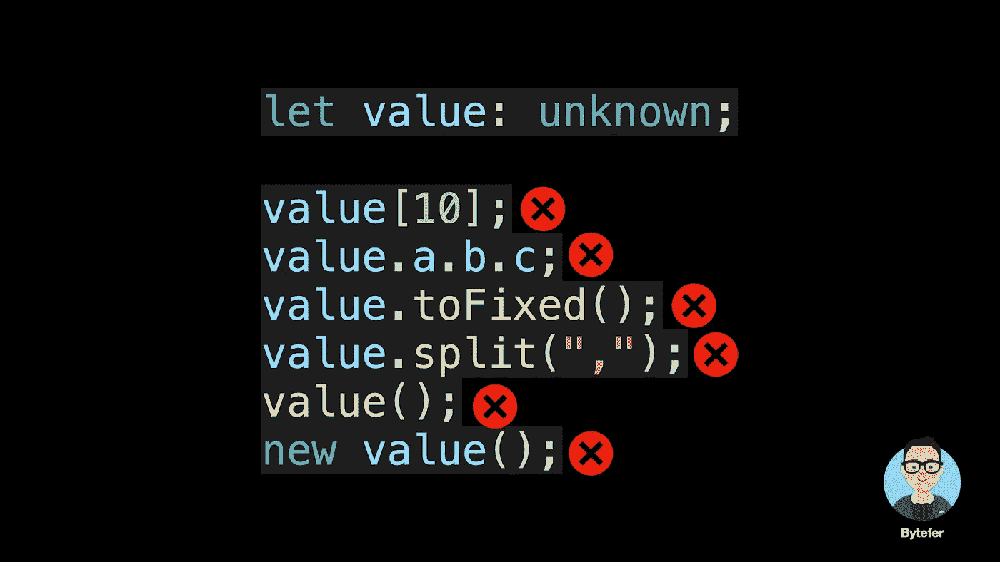
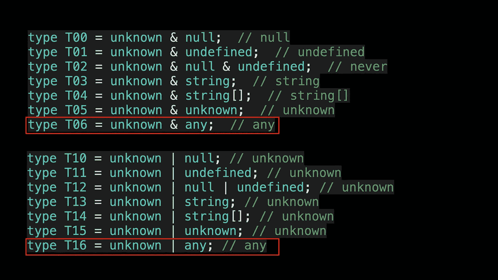

# 不再混淆 TypeScript 的“任何”和“未知”

> 原文：<https://javascript.plainenglish.io/no-more-confusion-about-typescripts-any-and-unknown-98c4b53f8924?source=collection_archive---------1----------------------->

## 掌握任意类型和未知类型之间的异同，避免将 TypeScript 当成任意脚本来学习。


欢迎来到**掌握打字稿**系列。本系列将以动画的形式介绍 TypeScript 的核心知识和技术。让我们一起学习吧！以前的文章如下:

*   [**TypeScript 泛型中的 K、T、V 是什么？**](https://medium.com/frontend-canteen/what-are-k-t-and-v-in-typescript-generics-9fabe1d0f0f3)
*   [**使用 TypeScript 像 Pro 一样映射类型**](/using-typescript-mapped-types-like-a-pro-be10aef5511a)
*   [**使用 TypeScript 条件类型像亲**](/use-typescript-conditional-types-like-a-pro-7baea0ad05c5)
*   [**使用 TypeScript 交集类型像亲**](/using-typescript-intersection-types-like-a-pro-a55da6a6a5f7)
*   [**使用打字稿推断像亲**](https://levelup.gitconnected.com/using-typescript-infer-like-a-pro-f30ab8ab41c7)
*   [**使用 TypeScript 模板字面类型像亲**](https://medium.com/javascript-in-plain-english/how-to-use-typescript-template-literal-types-like-a-pro-2e02a7db0bac)
*   [**可视化打字稿:15 种最常用的实用类型**](/15-utility-types-that-every-typescript-developer-should-know-6cf121d4047c)

你刚开始 TypeScript 的时候，有没有遇到过很多你最终用`any` trick 解决的疯狂问题？如果你以后不花时间学习 TypeScript 的类型系统，你可能会发现你把 **TypeScript** 学成了 **AnyScript** 。


在 TypeScript 中，`any`类型被称为顶级类型。所谓顶级类型，可以理解为泛型父类型，即可以包含所有值的类型。


在 TypeScript 3.0 中，引入了一种新的顶级类型— `unknown`类型。同样，您可以将任何值赋给未知类型的变量。


那么现在问题来了，`any`型和`unknown`型有什么区别？任何类型都可以理解为我不在乎它的类型，未知类型可以理解为我不知道它的类型。

事实上，任何类型本质上都是类型系统的一个出口， **TypeScript 允许我们对任何类型的值执行任何操作，而无需执行任何类型的事先检查**。


这有什么问题？让我们举个例子:


对于上面的 TypeScript 代码，编译时不会提示错误，但运行时会抛出运行时错误。作为开发人员，`any` type 给了我们很多自由，但也带来了一些陷阱。为了解决`any`类型的安全隐患，TypeScript 团队在 3.0 中引入了`unknown`类型，你可以理解为类型安全的`any`类型。

那么未知类型在哪里体现了类型安全呢？这里我们将`callWithErrorHandling`函数参数的类型改为`unknown`类型，然后 TypeScript 编译器会提示相应的错误信息:


与`any`类型相比，TypeScript 对类型`unknown`的参数执行类型检查，以避免 fn 参数不是函数类型。为了解决上述问题，我们需要缩小 fn 参数的类型，也就是说，我们可以使用`typeof`运算符来确保 fn 参数是一个函数类型的对象:


实际上，您还可以通过 instanceof 或用户定义的类型保护来缩小参数的类型:

```
declare function isFunction(x: unknown): x is Function;
​
function fn(x: unknown) {
    if (x instanceof Error) {
        x;  // Error
    }
    if (isFunction(x)) {
        x;  // Function
    }
}
```

与`any`类型不同，因为 TypeScript 对`unknown`类型的变量进行类型检查，所以当我们将前面代码中 value 变量的类型改为`unknown`类型时，所有使用 value 变量的语句都将失败。



另外，需要注意的是**未知类型的变量只能赋给任意类型和未知类型本身**。


我们已经在以前的文章中介绍了运算符的[键和](/master-the-typescript-keyof-type-operator-bf7f18865a8b)[映射类型](/using-typescript-mapped-types-like-a-pro-be10aef5511a)。`any`型和`unknown`型在这些情况下表现不同:

```
type A0 = keyof any;  // string | number | symbol
type U1 = keyof unknown;  // never
​
type M2<T> = { [P in keyof T]: number };
type M21 = M2<any>;  // { [x: string]: number }
type M22 = M2<unknown>;  // {}
```

在上面的代码中， **M2** 类型被称为映射类型。在映射过程中，如果 key 类型是`never`类型，则当前 key 会被过滤掉，所以 M **22** 类型是空对象类型。

在工作中，为了保证类型安全，我们应该尽量使用`unknown`类型。最后，让我们看看不同类型的`unknown`类型上的类型操作的结果:



`any`型比较特殊。当这个类型被构造或与任何类型组合时，将返回`any`类型。看完这篇文章，相信你已经明白了`any`型和`unknown`型的区别。
知道怎么检测`any`型和`unknown`型吗？如果你知道，可以在评论区提交你的答案。

如果你想学习 TypeScript，那么就不要错过**掌握 TypeScript** 系列。在 [Medium](https://medium.com/@bytefer) 或 [Twitter](https://twitter.com/Tbytefer) 上关注我，阅读更多关于 TS 和 JS 的内容！

# **资源**


[字节优先](https://medium.com/@bytefer?source=post_page-----98c4b53f8924--------------------------------)

## 掌握打字稿系列

[View list](https://medium.com/@bytefer/list/mastering-typescript-series-688ee7c12807?source=post_page-----98c4b53f8924--------------------------------)47 stories[](https://github.com/Microsoft/TypeScript/pull/24439) [## ahejlsberg Pull 请求的新“未知”顶级类型#24439 microsoft/TypeScript

### 这个 PR 添加了一个新的顶级类型 unknown，它是 any 的类型安全对应类型。任何事情都可以分配给未知，但是…

github.com](https://github.com/Microsoft/TypeScript/pull/24439) 

*更多内容看* [***说白了就是***](https://plainenglish.io/) *。报名参加我们的* [***免费每周简讯***](http://newsletter.plainenglish.io/) *。关注我们* [***推特***](https://twitter.com/inPlainEngHQ) ，[***LinkedIn***](https://www.linkedin.com/company/inplainenglish/)*，*[***YouTube***](https://www.youtube.com/channel/UCtipWUghju290NWcn8jhyAw)*，* [***不和***](https://discord.gg/GtDtUAvyhW) *。*