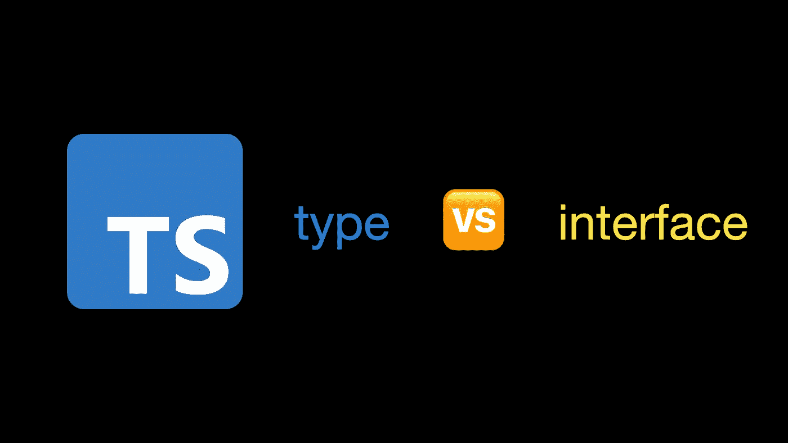
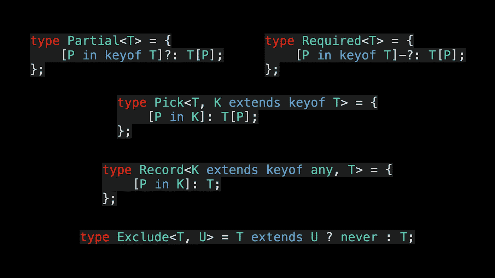
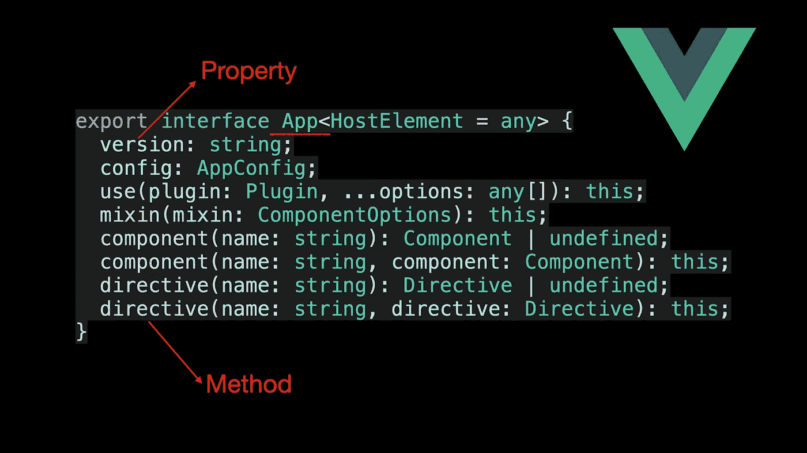
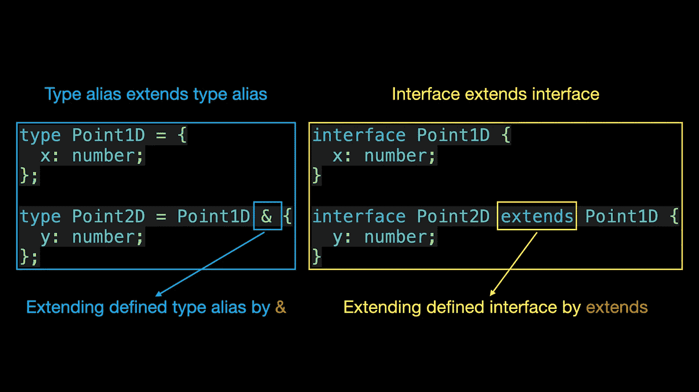
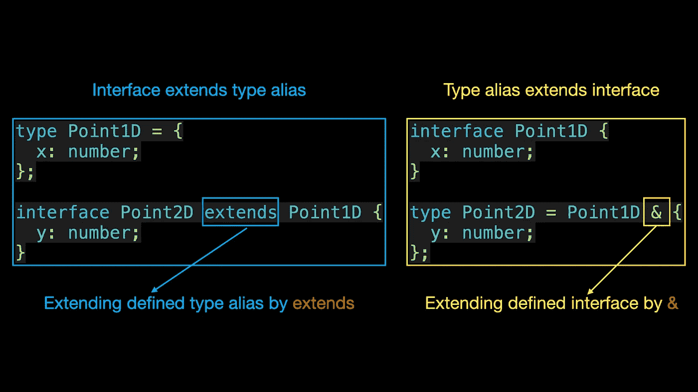
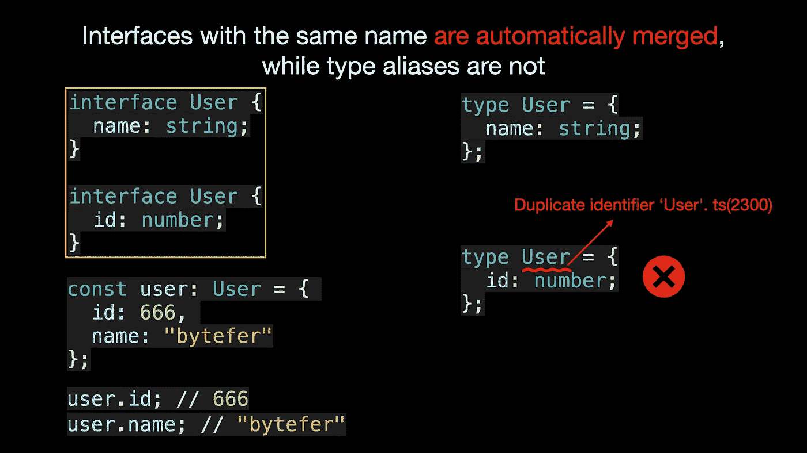
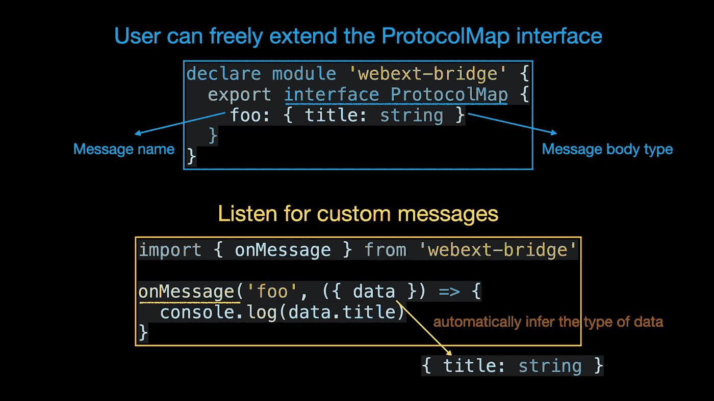

# 不再对 TypeScript 的类型和接口感到困惑

> 原文：<https://javascript.plainenglish.io/no-more-confusion-about-typescripts-type-and-interface-63c39418ae35?source=collection_archive---------0----------------------->

## 用动画解释。掌握类型和接口的异同，了解它们的使用场景



欢迎来到**掌握打字稿**系列。本系列将以动画的形式介绍打字稿**的核心知识和技巧。让我们一起学习吧！以前的文章如下:**

*   [**TypeScript 泛型中的 K，T，V 是什么？**](https://medium.com/frontend-canteen/what-are-k-t-and-v-in-typescript-generics-9fabe1d0f0f3)
*   [**使用 TypeScript 像 Pro 一样映射类型**](/using-typescript-mapped-types-like-a-pro-be10aef5511a)
*   [**使用 TypeScript 条件类型像亲**](/use-typescript-conditional-types-like-a-pro-7baea0ad05c5)
*   [**使用 TypeScript 交集类型像亲**](/using-typescript-intersection-types-like-a-pro-a55da6a6a5f7)
*   [**利用打字稿像专家一样推断**](https://levelup.gitconnected.com/using-typescript-infer-like-a-pro-f30ab8ab41c7)
*   [**使用 TypeScript 模板字面类型像亲**](https://medium.com/javascript-in-plain-english/how-to-use-typescript-template-literal-types-like-a-pro-2e02a7db0bac)
*   [**可视化打字稿:15 种最常用的实用类型**](/15-utility-types-that-every-typescript-developer-should-know-6cf121d4047c)
*   [**关于类型脚本类你需要知道的 10 件事**](https://levelup.gitconnected.com/10-things-you-need-to-know-about-typescript-classes-f58c57869266)
*   [](/purpose-of-declare-keyword-in-typescript-8431d9db2b10)**中‘declare’关键字的用途**
*   **[**如何在 TypeScript**](/how-to-define-objects-type-with-unknown-structures-in-typescript-c35e7b8462b0) 中定义未知结构的对象类型**

**如果你在简历上写了 TypeScript，那么面试官可能会问你**类型和界面有什么区别。**你知道这个问题怎么回答吗？如果你不知道，看完这篇文章你可能就明白了。**

**类型别名可用于为类型提供新名称，在命名非对象类型(如基元或联合)时很有帮助:**

```
type MyNumber = number;
type StringOrNumber = string | number;
type Text = string | string[];
type Point = [number, number];
type Callback = (data: string) => void;
```

**在 TypeScript 1.6 中，类型别名开始支持泛型类型。我们工作中常用的部分、必需、挑选、记录和排除等实用程序类型是根据类型别名定义的。**

****

**定义对象类型时，通常使用`interface`。Vue 3 中的 App 对象是使用接口定义的:**

****

**从上面的代码可以看出，在定义接口时，我们可以在对象类型上声明属性和方法。了解了类型和接口的作用之后，我们来介绍一下两者的相似之处。**

# **类似**

> **类型别名和接口都可以用来描述对象或函数类型。**

****类型别名****

```
type Point = {
  x: number;
  y: number;
};
​
type SetPoint = (x: number, y: number) => void;
```

**在上面的代码中，我们使用 type 关键字分别为 object literal 类型和 function 类型起别名，这样这些类型就可以用在其他地方了。**

****界面****

```
interface Point {
  x: number;
  y: number;
}
​
interface SetPoint {
  (x: number, y: number): void;
}
```

> **类型别名和接口都可以扩展**

**类型别名由`&`扩展，而接口由`extends`扩展。**

********

**那么接口可以通过扩展来扩展类型别名定义的类型吗？答案是肯定的。此外，类型别名还可以通过 **&** 运算符扩展已定义的接口类型:**

********

**现在我们知道了类型别名和接口的相似之处，让我们来谈谈它们之间的区别。**

# **差异**

1.  **类型别名可以为基元类型、联合类型或元组类型定义别名，而接口不能:**

```
type MyNumber = number; // primitive type
type StringOrNumber = string | number; // union type
type Point = [number, number]; // tuple type
```

**2.同名的接口会自动合并(声明合并)，而类型别名不会:**

********

**利用声明合并的特性，我们可以在开发第三方库时为用户提供更好的安全性。比如 [webext-bridge](https://github.com/zikaari/webext-bridge) 库使用 interface 定义了 **ProtocolMap** 接口，这样用户可以自由扩展 **ProtocolMap** 接口。之后，在使用库内部提供的 onMessage 函数监控自定义消息时，我们可以推断出不同消息对应的消息体类型。**

****扩展协议映射接口****

```
import { ProtocolWithReturn } from 'webext-bridge'
​
declare module 'webext-bridge' {
  export interface ProtocolMap {
    foo: { title: string }
    bar: ProtocolWithReturn<CustomDataType, CustomReturnType>
  }
}
```

****收听自定义消息****

```
import { onMessage } from 'webext-bridge'
​
onMessage('foo', ({ data }) => {
  // type of `data` will be `{ title: string }`
  console.log(data.title)
}
```

********

**如果你感兴趣，看看 [webext-bridge](https://github.com/zikaari/webext-bridge) 中 onMessage 的类型定义。遇到问题可以和我交流。最后，让我们总结一些类型别名和接口的使用场景。**

****什么时候使用****

1.  **当定义基本类型的别名时，使用`type`**
2.  **定义元组类型时，使用`type`**
3.  **定义函数类型时，使用`type`**
4.  **定义联合类型时，使用`type`**
5.  **定义映射类型时，使用`type`**

****何时使用** `**interface**`**

1.  **当你需要利用声明合并特性时，使用`interface`**
2.  **当定义一个对象类型并且不需要使用类型时，使用`interface`**

**看完这篇文章，相信你已经明白了类型别名和接口的区别。**

**如果你喜欢学习动画形式的 TypeScript，可以在 [Medium](https://medium.com/@bytefer) 或者 [Twitter](https://twitter.com/Tbytefer) 上关注我，了解更多关于 TS 和 JS 的内容！**

# **资源**

**

[字节优先](https://medium.com/@bytefer?source=post_page-----63c39418ae35--------------------------------)** 

## **掌握打字稿系列**

**[View list](https://medium.com/@bytefer/list/mastering-typescript-series-688ee7c12807?source=post_page-----63c39418ae35--------------------------------)****47 stories****************[](https://stackoverflow.com/questions/37233735/interfaces-vs-types-in-typescript) [## TypeScript 中的接口与类型

### 对于类型，我个人的习惯是:何时使用类型:当…时使用类型

stackoverflow.com](https://stackoverflow.com/questions/37233735/interfaces-vs-types-in-typescript) [](https://www.typescriptlang.org/docs/handbook/2/everyday-types.html#differences-between-type-aliases-and-interfaces) [## 文档-日常类型

### 在这一章中，我们将介绍一些在 JavaScript 代码中最常见的值的类型，并解释…

www.typescriptlang.org](https://www.typescriptlang.org/docs/handbook/2/everyday-types.html#differences-between-type-aliases-and-interfaces) 

*更多内容请看* [***说白了就是***](https://plainenglish.io/) *。报名参加我们的* [***免费每周简讯***](http://newsletter.plainenglish.io/) *。关注我们关于* [***推特***](https://twitter.com/inPlainEngHQ) ，[***LinkedIn***](https://www.linkedin.com/company/inplainenglish/)*，*[***YouTube***](https://www.youtube.com/channel/UCtipWUghju290NWcn8jhyAw)*[***不和***](https://discord.gg/GtDtUAvyhW) *。****