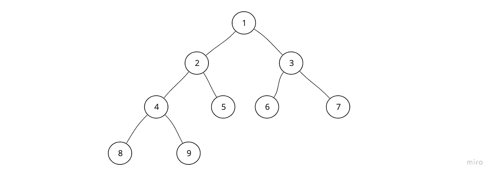
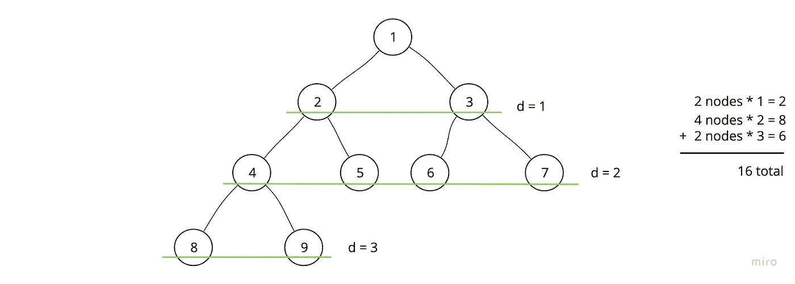

# 返回二叉树中所有节点深度的总和

> 原文：<https://javascript.plainenglish.io/node-depths-3b11f0e9d1c4?source=collection_archive---------11----------------------->

## 解决 AlgoExpert 的“节点深度”问题。

大家准备好迎接更多递归二叉树的乐趣了吗？

今天的问题是 AlgoExpert 的“节点深度”。

如前所述，我非常喜欢任何使用递归来遍历二叉树的机会。这是干净和简单的，这两个似乎他们几乎是天生的一对。

在这个问题中，我们被要求返回二叉树中所有节点深度的总和。

## **想清楚**

假设我们得到了这棵树作为输入:



为了理解我们被要求做什么，我将首先绘制出树的深度，计算每层的总深度，然后是树的总深度。



要实现这一点，显然需要一个完整的遍历。我先从深度开始。

我的伪代码算法:

```
// create a variable to store total depth// visit each node while tracking current depth along the way// whenever moving “upward” in the tree, increment total depth with the current depth// return total depth
```

## **实施**

我最喜欢递归 BST 遍历的一点是，它可以以令人难以置信的简洁进行编码，在这些方面，这个问题不会令人失望…

内部助手函数将在树中移动，一路上记住我们的深度。

然后，当我们从树中的一个节点向上返回时(总是在第 8 行的右子树被浏览之后)，在从上面的深度返回到执行上下文之前，我们将用当前深度增加总深度。

此时，我们可以返回总深度！

**有感而发**

对我来说，起初，我认为 DS 和 Algo 是招聘过程中不幸的一部分，但现在我真的开始喜欢让它们塑造我处理问题的方式。

在过去，如果被要求在一个带计时器的面试官面前做这样的事情…

现在其实挺好玩的。

我希望这有所帮助！

对于任何觉得这些有用的人，我将在不久的将来继续解决 AlgoExpert 问题，所以请随时订阅更新。

*更多内容请看*[***plain English . io***](https://plainenglish.io/)*。报名参加我们的* [***免费周报***](http://newsletter.plainenglish.io/) *。关注我们关于*[***Twitter***](https://twitter.com/inPlainEngHQ)*和*[***LinkedIn***](https://www.linkedin.com/company/inplainenglish/)*。查看我们的* [***社区不和谐***](https://discord.gg/GtDtUAvyhW) *加入我们的* [***人才集体***](https://inplainenglish.pallet.com/talent/welcome) *。*