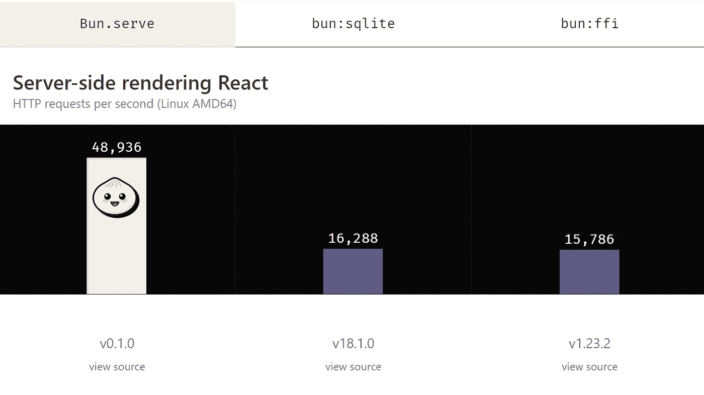
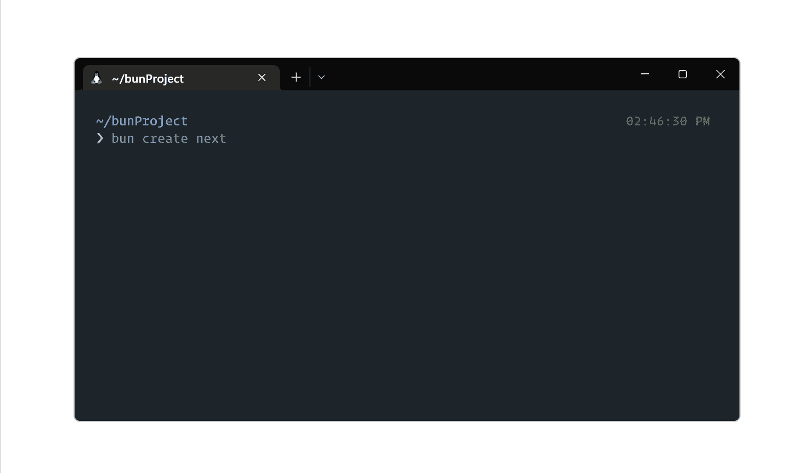
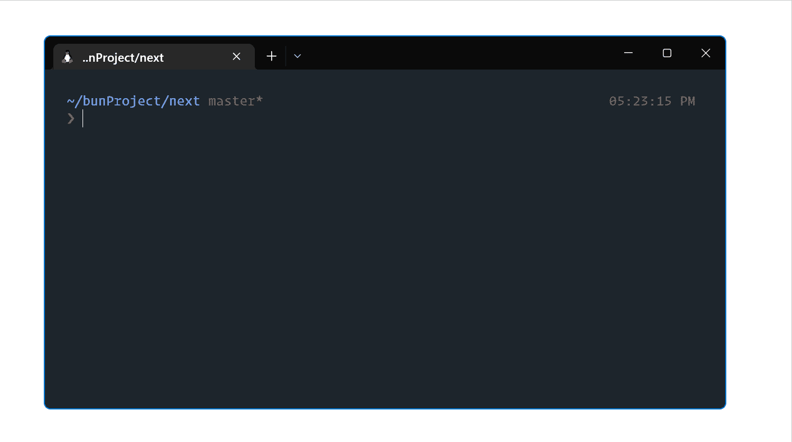
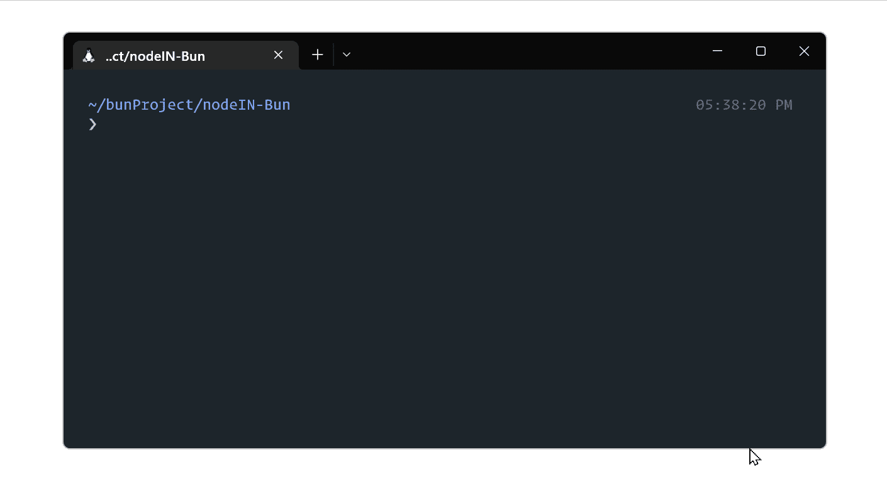
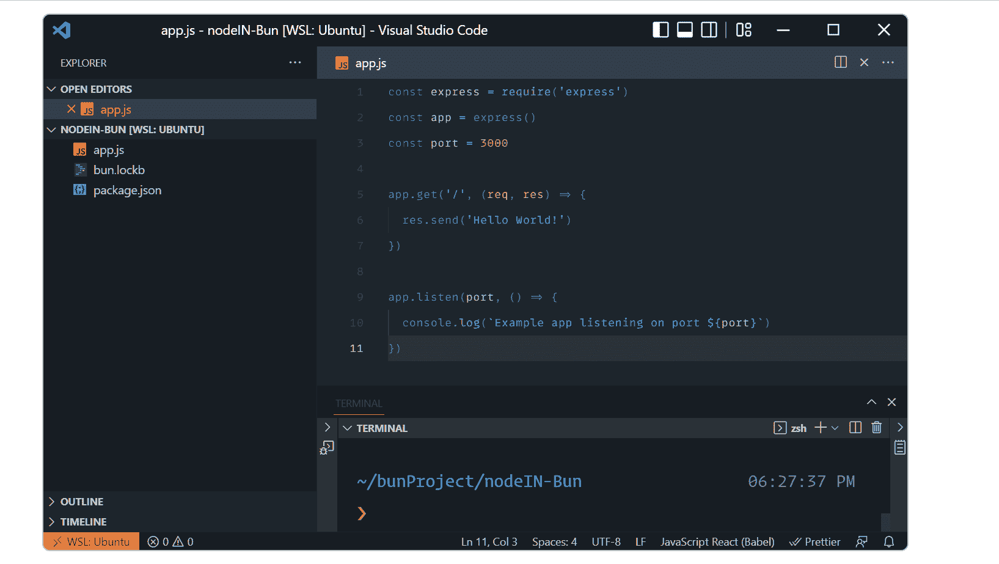
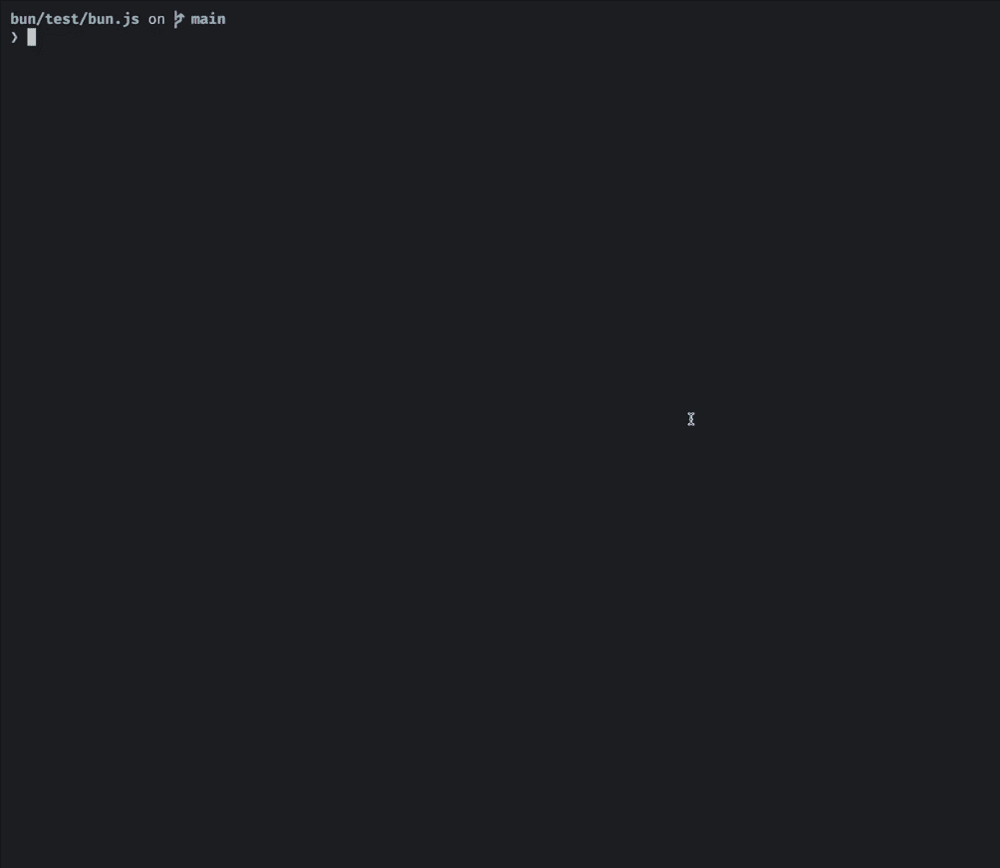
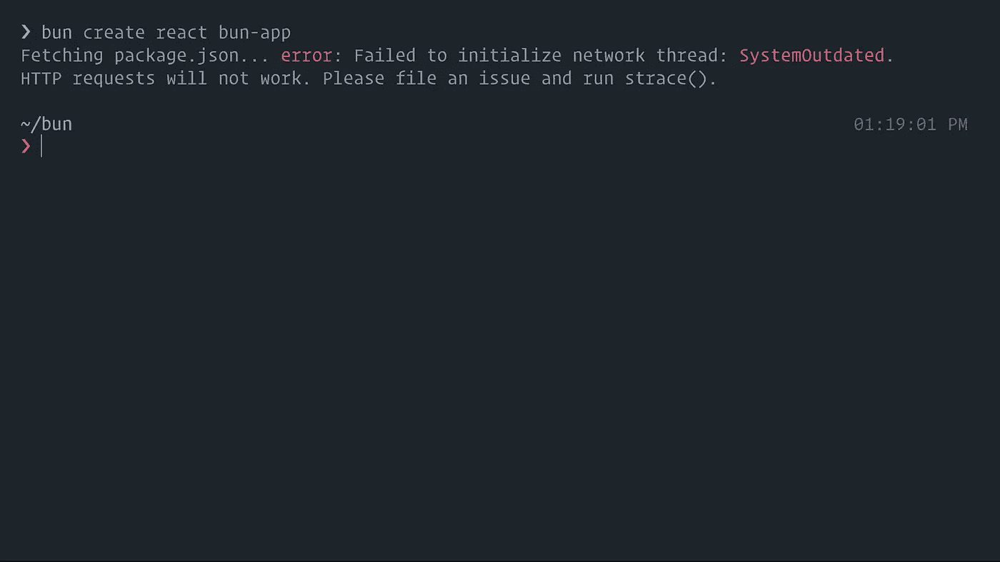
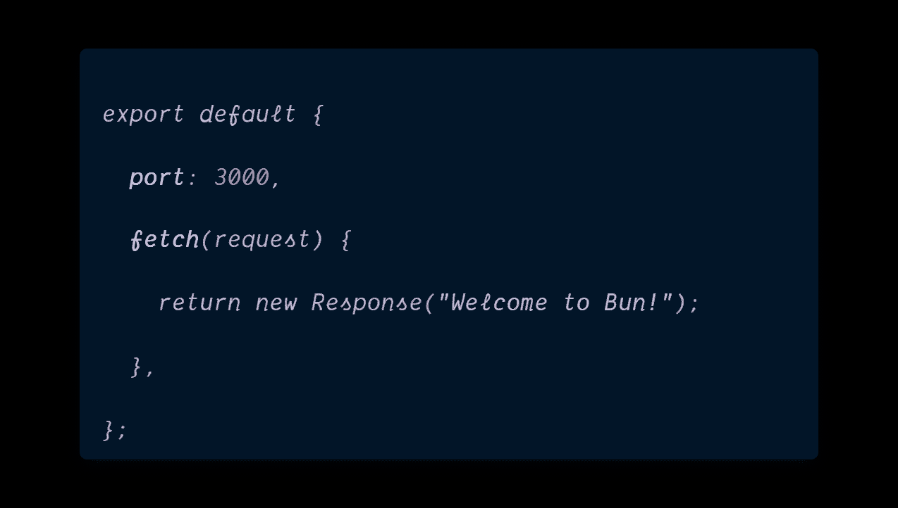

# Node.js 和 Deno 已经死了——新的东西正在取代它！

> 原文：<https://javascript.plainenglish.io/node-js-and-deno-are-dead-something-new-is-replacing-it-7ae2da0b6569?source=collection_archive---------0----------------------->

## 这是 JavaScript 世界的下一次革命。

[📷](https://unsplash.com/@magnusdiv?utm_source=medium&utm_medium=referral)

JavaScript 开发人员厌倦了重新发明库，他们决定转向运行时本身。

这可能是今年对网络开发者来说最令人兴奋的消息。

昨天我在想，我们到底为什么会被 Node.js 攻击？为什么没有太多的选择？

当我正在思考这个问题，而其他人都在忙于创建 JavaScript 框架时，有人又创建了另一个 JavaScript 运行时——这将使您的生活变得更加轻松。

# 我们是怎么到这里的？

很多年前，谷歌发布了 V8，并宣布，“嗯，我们造了这个东西。”现在，JS 将在浏览器中加载得更快。

是的，“它是用 C++写的，没有必要担心内存的使用。”(顺便说一句，他们在这一点上撒了谎)

然而，有人想出了一个好主意，用它在服务器上运行 JS。于是他写了一个程序(runtime)，把 V8 包含在里面。Node 就这样诞生了。

Node.js 是 JavaScript 世界的游戏改变者。

第一次，我们不仅可以在服务器上运行 JavaScript，还可以高效地运行它。

它是如此之快，以至于让 JS 的憎恨者更加愤怒。

JS 社区到处都有庆祝活动。

JavaScript 开发人员终于可以在街上昂首阔步了。

他们终于可以看着其他 Java 开发人员的眼睛，点一杯饮料。

对于 JS 开发人员来说，事情进展顺利。

一天，`node.js`的创造者出来说，“*嘿 Node.js 是个错误，我会带着更好的东西回来！*

时代过去了，与此同时，世界接受了 Node.js。

每个人仍然习惯于把节点模块的重量扛在肩上(并试图找出他们背部有问题的原因)。

`node.js`的创造者从他的隐居地回来了，回来时他说:

*我做了比 Node.js 更好的东西！*

人问 ***什么*？**

***轨道上的节点*** ？

好不了多少*！*

*这太不礼貌了。*

*他在返回隐居地之前向全世界宣布了这一点。*

*三年过去了，开发者社区几乎没有出现对 Deno 的改编。*

*对它的成功有很多怀疑。(不是我——瑞安——那些该死的 Redditors)*

*人们已经接受了节点的缺陷，或者已经习惯了它。*

> *“人是一种可以适应任何事情的生物，我认为这是对他的最好定义。”*
> 
> *―费奥多·陀思妥耶夫斯基*

*对于许多人来说，Deno 作为一个运行时并没有太大的区别。*

*现在情况要变了，镇上又多了一个孩子。*

# *面包——一个新的开始*

*Bun 的出现让我对 web 发展的未来充满希望。*

*Bun 使用苹果的 JavaScriptCore 引擎，众所周知，该引擎的启动和执行速度略快于谷歌的 V8 引擎(Node.js 和 Deno 都使用该引擎)。*

*它是用 Zig(一种巫师用来获得低级记忆的编程语言)编写的*

> *如果你不喜欢速度——你不够在乎你的时间*

*在生活中的某些事情上，我是一个激进分子，尤其是*速度*。*

*我不能容忍一件缓慢的事情。*

*这就是小圆面包赢得我心的地方。*

*Bun 快如闪电。*

*它应该有多快有多快。*

**

*To be precise, three times faster than the fastest option [available](https://bun.sh/).*

*唉…我一直不喜欢经历`create-next-app`的过程，更讨厌`create-react-app`这个命令。*

*这些命令不重视您的时间——Bun 重视！*

**

*Setting Up Your React/Next App is a Breeze*

**

*Running them in Dev Environment is Bliss.*

*这是应该的。*

*仅仅是建立一个该死的项目，人们不需要等待永恒。*

# *不仅仅是另一个运行时。*

*Bun 是一个非常快速的 JavaScript 运行时，bundler，transpiler 和包管理器——集于一身。*

*它不仅仅是另一个运行时，而是一个生态系统。*

*我一直想要一个土生土长的 bundler——Bun 自带。*

*你现在不再需要等待缓慢的 webpack 来构建你的应用程序。*

*支持众多节点核心模块，内置`fetch`、`WebSocket`、`ReadableStream`等 Web APIs。*

*它将允许许多国家预防机制包也发挥作用。*

**

*Install packages from npm into bun project and those packages install 20x faster*

**

*ESM and CommonJS are supported, but Bun internally uses ESM.*

*对于担心安全的人— bun 自动从。环境文件。不再有`require("dotenv").config()`*

*对于 TypeScript 狂热者——Bun 有一个本机 transpiler，所以您可以开箱即用地编写 TypeScript 代码。*

*所有那些 TDD 的鼓吹者——它也有适合你的东西——内置于 Bun 中的 JavaScript & TypeScript 项目的 Jest-like 测试程序。*

**

*Ever seen a JavaScript test runner this [**fast**?](https://twitter.com/jarredsumner/status/1542824440618049536)*

*我也听说过它的文件处理能力。我可以担保——尽管我还没有使用它。*

# *这是爱丽丝开发，但它不是仙境*

*错误和开发人员的生活密不可分。*

*Bun 很有前途——是我喜欢每天使用的东西。*

> *但是，但是，但是——有些人总是需要被踢屁股才能工作*

*它仍处于起步阶段。*

*会有错误，你肯定会碰到一些。*

*如果你在 Windows 上，你没有其他选择，只能使用 WSL。*

*不，担心，但即使这样也给了我一些问题。*

**

*I had to update WSL to solve this issue.*

*但是这不应该阻止你尝试这项神奇的技术。*

# *生命是短暂的——船要快*

*要安装 Bun，请在终端中运行以下命令:*

**

*This downloads Bun from GitHub and You are good to go.*

*制作一个`server.js`文件，在里面编码如下:*

****

*Check your localhost:3000*

*仅此而已。你可以走了。今天就去开始用 Bun 吧！*

*🔴[点击此处](https://bun.sh/)访问本文中使用的代码。🟥*

# *摘要*

*我一直相信，如果 JavaScript 运行时、框架和服务器从一开始就得到优化，它们可以运行得更快。*

*正如面包的创造者所说:*

**Bun 白手起家，专注于三件事:**

*   **起步快(心里有边)。**
*   **新的性能水平(扩展 JavaScriptCore，引擎)。**
*   **成为一个伟大而完整的工具(打包员、运输员、包装经理)。**

*能够用 JavaScript 编写复杂的业务逻辑，同时仍能获得接近原生的性能，这是两全其美。*

*Bun 是实验性的，需要一些时间和努力才能成熟，但它已经显示出一些令人难以置信的潜力。*

# *感谢信*

*我想利用这最后的机会说声谢谢。*

*感谢您的光临！如果没有像你这样的人，我不可能做我现在所做的事情。*

*我希望你能 [**和我一起**](https://polymathsomnath.medium.com/subscribe) 发表 [**我未来的博文**](https://polymathsomnath.medium.com/subscribe) 并留下来，因为我认为我们这里有一些很棒的东西。我希望在未来的许多年里，我能在你的职业生涯中帮助你！*

*下次见。再见！*

**更多内容请看* [***说白了就是***](https://plainenglish.io/) *。报名参加我们的* [***免费每周简讯***](http://newsletter.plainenglish.io/) *。关注我们*[***Twitter***](https://twitter.com/inPlainEngHQ)**和*[***LinkedIn***](https://www.linkedin.com/company/inplainenglish/)*。查看我们的* [***社区不和谐***](https://discord.gg/GtDtUAvyhW) *加入我们的* [***人才集体***](https://inplainenglish.pallet.com/talent/welcome) *。***