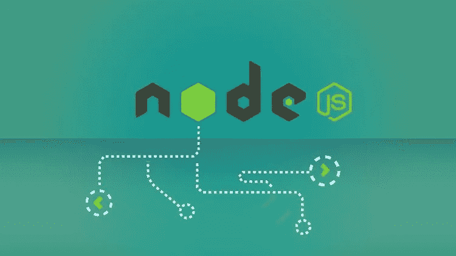

# 初学者和专家的最佳实践

> 原文：<https://javascript.plainenglish.io/node-js-best-practices-for-beginners-and-experts-7fb64c832ce2?source=collection_archive---------7----------------------->

## Node.js 开发人员构建高效且更易维护的应用程序的一些最佳实践。

Node.js 是最流行的 web 开发框架之一。它被几家公司使用，从小型项目到大型解决方案。
有了它，您可以通过为浏览器编写 JavaScript 代码来创建轻量级、可扩展、快速且健壮的服务器端 web 应用程序。

今天，我们将讨论一些使用 Node.js 开发的最佳实践，这些实践将帮助所有类型的开发人员构建一个高效且更易维护的应用程序，从初学者到最有经验的人都可以。

## 每次更改时重新启动应用程序

在开发时，应用程序会随着代码的每一次更改而停止和重新启动，这可能会造成麻烦，并会导致注意力和工作效率的损失。要解决这个问题，您可以使用避免重复重启应用程序的工具来反映变化。

下面是一些最流行的 Node.js 代码监控包:

1.  Nodemon:它提供了一个每当新代码发生变化时自动重启的功能。要使用 Nodemon，只需用 Nodemon 替换节点。
2.  永远:它还提供了自动启动功能以及其他配置，如写入日志和将工作目录设置为特定文件。
3.  PM2:与前两个工具相比，另一个过程管理工具具有出色的控制和特性。

《永远》和《PM2》都可以在生产环境中使用。有了它们，就可以保证代码在运行时错误后被恢复，并且在服务器停机时保证快速启动。

## 用异步替换回调

最初，回调用于在 Node.js 中创建异步方法，但是当连续嵌套时，它们往往会失去控制。此时代码变得不可读。随着异步/等待的引入，开发人员注意到这个问题有所缓解。然而，为了避免回调，有必要确保异步/等待的使用。您可以通过用异步和等待调用替换它来轻松避免这种糟糕的回调场景。

## 应用集群

Node.js 运行时仅限于单个 CPU 内核，在大型服务器上部署非集群的 Node.js 应用程序可能会浪费资源。相反，选择向您的应用程序添加集群支持，这样您就可以充分利用多核。在群集的支持下，即使在小型硬件上运行单个进程，您也可以获得灵活性。

## 避免垃圾

Node.js 有一个默认限制为 1.5GB 的慢速垃圾回收器。这个垃圾回收器将一直等待，直到它实际上有未使用的内存可以回收。如果内存不足，不是因为泄漏，而是因为垃圾收集器的懒惰行为。但是，您可以通过为 V8 提供标志来完全控制垃圾收集器。

`web: node — optimize_for_size — max_old_space_size=920 — gc_interval=100 server.js`

这一点至关重要，尤其是当您在内存小于 1.5GB 的环境中运行节点时。

`web: node — optimize_for_size — max_old_space_size=460 — gc_interval=100 server.js`

上面的代码可以用来为一个 512MB 的容器定制节点。

## 干净的代码

我们已经在之前的文章中讨论了干净代码的好处，以及它的采用如何帮助提高代码质量。为了有助于这种采用，我将强调 ide 和用于语义和风格修正的插件的使用如何在编码时帮助程序员。除了 Node 之外，我们还可以使用一个“Lint”插件来查找语义和语法错误代码并发出警告，同时我们可以使用一个格式化程序来处理风格因素，以确保一组格式和样式在整个项目中保持一致。我们有一些非常著名的插件，如 ESLint、JSLint 和 JSHint，它们被大多数 IDEs 代码编辑器接受，如 Atom 和 VSCode，它们重视代码质量并提供格式化插件。这些 ide 提供了额外的特性，比如重构、自动完成、文档支持、自动导入、调试工具、代码导航等等。

## 依赖注入

这种软件设计提倡将依赖项或服务作为参数注入或传递给模块，而不是创建它们。这个奇特的术语使你的模块保持独立、灵活、可伸缩和应用范围可测试。通过依赖注入，您可以使您的函数更加通用和灵活。除了依赖注入之外，还有其他实践可以让你的软件变得更好，为此，我推荐阅读这篇文章，在这篇文章中，我讨论了 S.O.L.I.D .的原则。

*   不要重复
*   单一责任原则
*   保持简单(保持简单)
*   关注点划分
*   避免早期优化
*   依赖注入

## 使用安全、分层、环境感知的配置

一个好的故障安全设置的标志包括:秘密信息不会提交给代码，层次模式之后是一个易于搜索的设置，并且密钥可以从环境变量中读取。密切关注项目设置，以满足 DevOps 团队的配置需求。

## 用头盔设计你的网络应用

构建 web 应用程序非常有趣。为了让你的编码更简单，首先，保护你的应用。使用:

*   XSS 保护
*   设置上下文安全策略头
*   确保所有连接都是 HTTPS
*   使用 X-Frame-Options 避免点击劫持
*   禁用 X-Powered-By 标头，使攻击者无法穿透您对特定软件的攻击

如果你觉得做上面的练习有点令人生畏，只需使用默认设置的头盔，你就可以根据需要进行调整。

## 结论

在找到最佳推荐实践之前，没有开发是太难的，也没有语言是太容易的。我建议您在 Node.js 中构建的后端项目的最佳实践，这将在本文中介绍。

我希望它能帮助您找到构建健壮的、可伸缩的、灵活的软件的方法。

*更多内容请看*[***plain English . io***](http://plainenglish.io/)*。报名参加我们的* [***免费周报***](http://newsletter.plainenglish.io/) *。在我们的* [***社区***](https://discord.gg/GtDtUAvyhW) *获得独家获得写作机会和建议。*