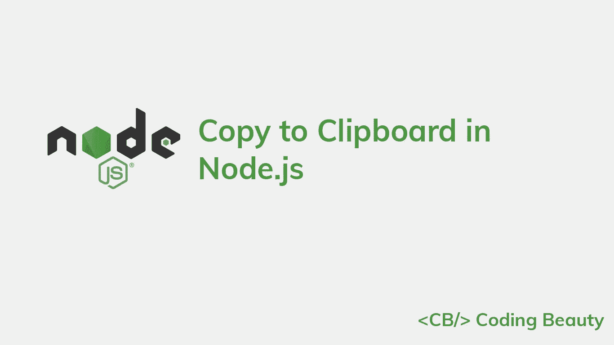

# 如何在 Node.js 中复制到剪贴板

> 原文：<https://javascript.plainenglish.io/node-js-copy-to-clipboard-ff6709a3fdf1?source=collection_archive---------10----------------------->

## 了解如何在 Node.js 中轻松复制到剪贴板。



要复制到 Node.js 中的剪贴板，可以使用 NPM 的`clipboardy`包。首先，通过在项目目录的根目录下运行以下命令来安装它:

```
npm i clipboardy
```

我们可以使用`clipboardy`来读取或写入系统剪贴板:

```
import clipboardy from 'clipboardy';async function main() {
  await clipboardy.write('butter');
  const text = await clipboardy.read();
  console.log(text); // 'butter'
}main();
```

该模块还可以同步读/写:

```
import clipboardy from 'clipboardy';clipboardy.writeSync('butter');const text = clipboardy.readSync();
console.log(text); // butter
```

## 注意

`clipboardy`是一个 ES 模块，只能与`import`关键字一起使用。使用 Node.js 中的`import`关键字将`package.json`文件中的`type`字段设置为`module`:

**package.json**

```
{
  // ... other fields
  "main": "index.js",
  "type": "module",
  // ... other fields
}
```

*更新于:*[*codingbeautydev.com*](https://cbdev.link/ae5dd9)

# JavaScript 做的每一件疯狂的事情

一本关于 JavaScript 微妙的警告和鲜为人知的部分的迷人指南。


[**报名**](https://cbdev.link/d3c4eb) 立即免费领取一份。