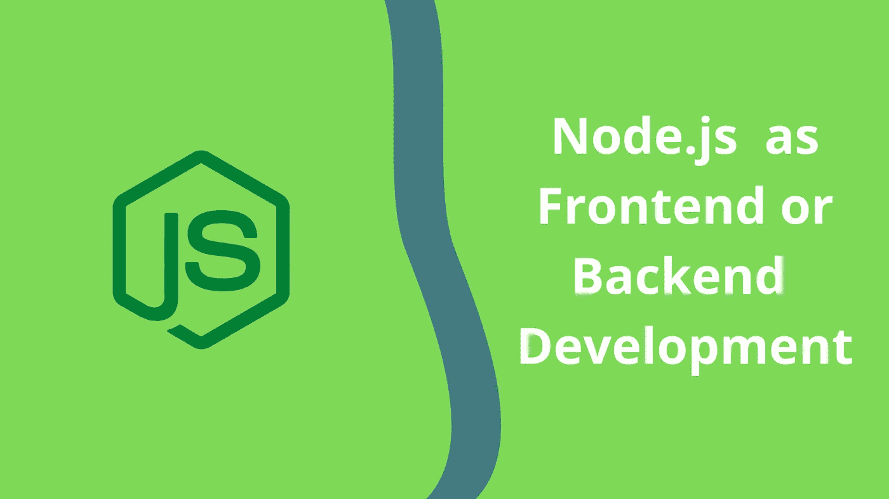

# Node.js 对前端开发好还是后端开发好？

> 原文：<https://javascript.plainenglish.io/node-js-is-it-good-for-frontend-or-backend-development-245e15d3754c?source=collection_archive---------7----------------------->

## 搞清楚 Node.js 到底是前端好还是后端好开发。

Node.js 很好，我们都知道。我们知道它不是一种编程语言，而是一种 JavaScript 运行时环境，工作在 Chrome 的 V8 引擎上，可以在浏览器之外运行 JavaScript 代码。我们也知道它非常受欢迎，因为它有非常好的特性和基于它构建的很酷的 web 框架，比如 Express.js 和 Next.js。

然而，尽管有这些令人瞩目的事情，我脑海中仍然萦绕着一个问题，即 Node.js 是更适合前端开发还是作为后端工具。答案是两者都有，这可能是 Node.js 最显著的优势之一。但真正的诀窍在于知道何时将它用于前端，何时用于后端。

这里，我们讨论了一些明确的要点，可以帮助开发人员确定 Node.js web 开发的正确类型。但是在讨论这些要点之前，我们先看一下后端和前端开发的基础，因为这将有助于更好地理解。

# **什么是前端和后端？**

前端和后端是 web 开发词汇学中最常用的两个术语。它们对 web 开发至关重要，为了使网站顺利运行，前端和后端应该能够作为一个单元平稳高效地运行。

前端是指用户直接看到并与之交互的那部分网站。也被称为“客户端”，它包含了所有影响用户及其浏览体验的东西，如图像、颜色、导航、响应、内容、结构、图标等。虽然有各种健壮的框架和 [**Node.js 库**](https://web-and-mobile-development.medium.com/8-extremely-handy-node-js-libraries-to-enhance-app-functionality-fdece6b8d545) 可用于前端开发，但开发人员(直接或间接)用于前端开发的最常见语言是 HTML、CSS 和 JavaScript。

后端，也称为网站的服务器端，是指 web 开发的一部分，包含系统或软件的核心技术，主要由三部分组成，服务器、数据库和编码，处理 API 和库以及插件的部分。用外行人的话来说，后端是 web 应用程序的隐藏部分，整个功能都发生在这里。像前端一样，后端也有一系列不同语言的框架，但最常用的语言是 Python、PHP、Java、C++、JavaScript 和. NET。

# **Node.js 作为双向开发工具**

因此，我们现在来看看 Node.js 的一些特性，这些特性使它成为一个可行的前端和后端开发工具。

## Node.js **前端功能**

**模块捆绑器:**

模块捆绑器在前端开发中起着举足轻重的作用。它们通过接收几个代码文件并将它们打包成一个文件来帮助管理代码库和优化开发。像 React 这样公认的框架也有它们。但是 Node.js 为开发人员提供了一些足智多谋的模块捆绑器，比如 FuseBox 和 Webpack，这使得它成为前端开发的理想选择。

**林挺代码:**

Linters 是扫描和分析源代码并识别格式错误、缩进或错误的程序。在代码林挺期间，linters 标记了导致违反样式、语法等相关规则的部分。从而提高编码质量。他们还可以选择通过配置文件导入样式指南。

简而言之，短绒有助于完美的前端开发。ESLint 就是这样一个工具，它与 Node.js 一起使用来查找和修复编码样式问题，从而减少错误并提高一致性。

【HTML 文件样式:

Node.js 通过其各种框架，比如 Express，使得 HTML 文件的样式化变得很容易。开发人员可以在标题部分包含样式。他们甚至可以直接在 HTML 中附加内嵌 CSS 样式。因此，样式工具使 Node.js 成为一个强大的前端开发工具。

**核动力源的功率:**

一个漂亮、有趣的用户界面的秘密之一是收集所需的组件并把它们放在一起。Node 为开发人员提供了 npm，在这里他们可以找到所需的设计组件，如颜色选择器、身份验证组件、编辑器等。有了它，他们可以很容易地设计一个交互式和功能性的用户界面。

**动态页面内容生成:**

Node.js 在借助模板呈现前端和生成动态页面内容方面非常有用。模板允许开发人员在 HTML 中使用循环和执行动态内容。它还允许在运行时进行动态数据注入。Node.js 提供了多种模板库，可用于前端开发中动态页面内容的生成。

## Node.js **后端功能**

**数据库集成:**

数据处理和管理是至关重要的后端任务，Node.js 通过各种库的无缝数据库集成来简化这些任务。这使得开发人员能够对数据执行 CRUD(创建、读取、更新和删除)操作。

**RESTful API**

Node.js 支持 REST 体系结构，这不仅有助于在客户端和服务器端之间建立无缝通信，还使开发人员能够创建 RESTful APIs 和基于 API 的应用程序，这些应用程序具有增强的特性和功能。此外，像 Koa 和 Express 这样的节点框架有内置的工具来帮助创建基于 API 的应用程序。

**操作系统级虚拟化(OS 级虚拟化)**

操作系统级虚拟化是一个过程，在这个过程中，开发人员在某些编码实践和工具的帮助下，可以明智地使用服务器和计算资源。Node.js 通过支持开发人员在基于 ELinOS 的 Linux 系统上运行的 Node.js web 服务器中嵌入 Docker(一组用于软件执行的操作系统级虚拟化的工具)来促进这一过程。

**任务同时处理**

Node.js 能够同时处理多个任务，因为它能够执行异步功能，并且本质上是非阻塞的。Node.js 的这一特性加快了服务器活动的速度，因为任务是通过单线程而不是通过队列来处理的，这有助于更快的应用程序开发。

## **带走**

在考虑了所有给定的特性后，我们可以得出结论，Node.js 更适合后端开发还是作为前端工具的问题似乎更像是其特性及其应用的问题。大多数开发人员更喜欢将它作为两者来使用，因为 Node 在一种单一语言(即 JavaScript)的帮助下统一了 web 应用程序开发。

这进一步提高了服务器端和客户端之间信息交换的效率，从而提高了应用程序的吞吐量。所以，下次你前往[**node . js web development**](https://www.hiddenbrains.com/nodejs-development.html?utm_source=guest-blog&utm_medium=medium&utm_campaign=jane&utm_term=node-js)时，先评估需求，然后再做出选择。

有一个高效的编码！

*更内容于* [***普通英语***](https://plainenglish.io/) *。报名参加我们的* [***免费周报***](http://newsletter.plainenglish.io/) *。* [***推特***](https://twitter.com/inPlainEngHQ) *和*[***LinkedIn***](https://www.linkedin.com/company/inplainenglish/)*追随我们。查看我们的* [***社区不和***](https://discord.gg/GtDtUAvyhW) *并加入我们的* [***人才集体***](https://inplainenglish.pallet.com/talent/welcome) *。*