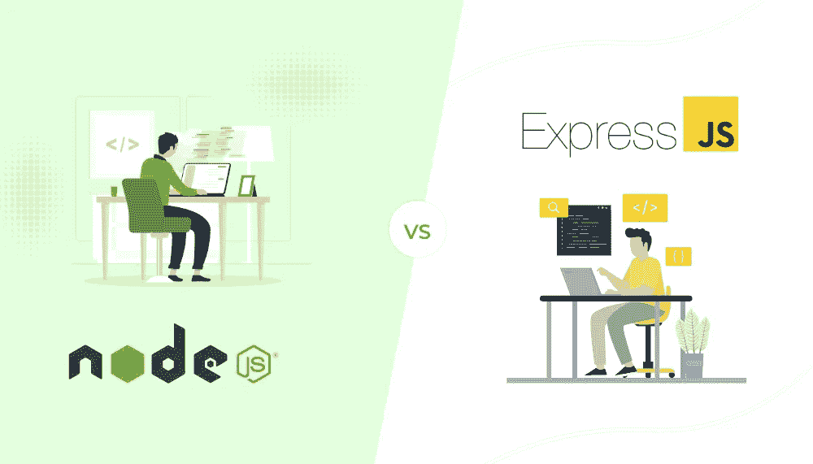
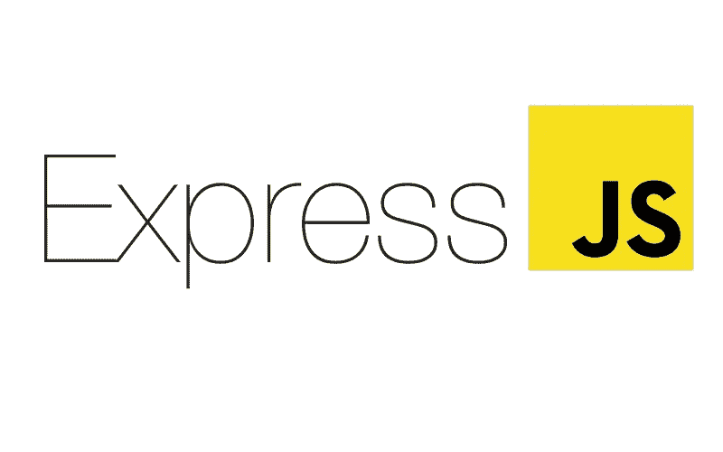
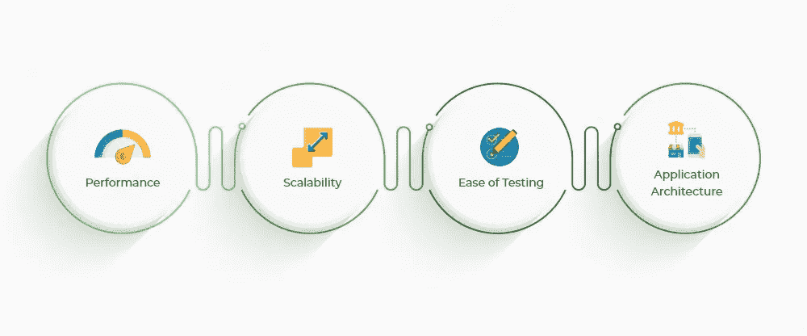

# Node.js 与 Express:后端技术的并行比较

> 原文：<https://javascript.plainenglish.io/node-js-vs-express-side-by-side-comparison-of-backend-technologies-eef25c4ed5d0?source=collection_archive---------6----------------------->

## 在决定合适的后端技术之前，了解它们之间的主要差异。

选择合适的后端技术很重要，因为它会严重影响应用程序未来的性能和可扩展性。

Node.js 和 Express 是当今流行的两种选择，所以在决定选择哪一种之前，了解它们之间的主要差异很重要。

在 Node.js 与 Express 的这种并行比较中，我们将深入分析每种框架的优点和缺点，这样您就可以明智地决定哪一种最适合您的项目。

让我们深入研究，为您的项目找到合适的后端技术。

# 什么是节点. js？—概述

Node.js 是一个基于 Chrome V8 JavaScript 引擎的 JAVAScript 运行时。Node.js 采用了一种事件驱动的、非阻塞的 I/O 模型，这种模型通常使它高效且轻量级。它非常适合运行在分布式设备上的数据密集型实时应用。

Node.js 提供了一个优秀的开发环境，可以用来构建快速、可扩展的网络应用程序。

**重大市场趋势**

*   根据堆栈溢出开发者调查，2021 年，63%的开发者使用 nodeJS 构建可扩展的应用。

# 节点 JS 的特点

*   轻巧有效
*   适应性极强且多才多艺
*   零缓冲
*   事件驱动
*   使用非阻塞 I/O 模型

# 节点 JS 的用例

*   数据流应用
*   单页应用程序(SPAs)的服务器端渲染
*   视频和音频会议应用程序
*   实时应用
*   基于物联网的应用
*   休息 API
*   网络游戏

# 什么是快递？—概述

Express.js 是一个为 Node 构建的开源框架。JS 是用 Javascript 编写的，它提供了快速的模块、模板、中间件功能和路由能力来创建更快、更高效的 web 应用程序，这些应用程序可以使用第三方集成库轻松定制。

**重大市场趋势**

*   根据一份报告，Express 是第十大最受欢迎的构建顶级应用的框架。
*   根据一份报告，有 245，657 个网站使用 Express 构建，其中 48，406 个仅在美国制造。

# 快速 JS 的特点

*   更快的服务器端开发
*   一种高度先进的路由机制
*   模板
*   排除故障
*   容易修复错误

# 快递的使用案例

*   单页应用程序(SPAs)
*   混合网络应用
*   可重用应用程序
*   RESTful APIs
*   电子商务 web 应用程序

在讨论了这两种后端技术的特性后，让我们对这两种技术进行对比分析，以帮助您决定哪一种技术最适合您的项目开发需求。

# Node.js 与 Express:比较分析

## **1 .性能**

从 JavaScript 继承的异步和非阻塞特性允许 Node.js 创建一个处理小任务的最佳环境，而不会干扰执行的主线程。Node.js 以提供更快的性能而闻名，这要归功于该框架的实时多路复用能力及其强大的 V8 JS 引擎。你可以[雇佣 Node js 开发者印度](https://www.quytech.com/hire-node-js-developers.php)来构建可扩展的应用。

Express 因其令人难以置信的处理速度而被成千上万的开发人员使用。一个简单的“Hello，World”基准测试表明，一个 Express 应用程序每秒可以处理多达 11，202 个请求。

## **2。可扩展性**

Node.js 为构建能够处理多个并发请求的可伸缩 web 应用程序提供了理想的框架。这是由于它的异步和事件方法，这种方法允许每个请求彼此独立处理，所以它们是并发处理的。

由于 Node 利用单线程(事件循环)进行抢占式多任务处理，因此它可以并行处理所有请求，非常适合构建高性能应用程序。

Express 最初受 Node.js 的启发，借鉴了其前身的非阻塞功能。这可以提高处理用户请求的效率，同时便于开发人员创建可伸缩的 web 应用程序。

Express 与 Nginx 和 Apache 服务器有许多其他相似之处——例如可伸缩性、有助于促进伸缩的轻量级设计以及多功能性等。

## **3。易于测试**

Node.js 提供了可靠的测试和调试工具，因为它有一个广泛的第三方模块库，包括各种自动化工具，如 Mocha、Jest、Lab and Code、Jasmine 和 AVA。这些模块为 Node.js 应用程序创建了一个良好的测试生态系统，具有出色的用户体验。

测试 Express 应用程序有许多明确的最佳实践。使用 Mocha、Jest、和 Postman 等框架，结合 Sinon、Chai 和 Supertest 等库，可以在 Express 应用程序中测试 API 和中间件。

## **4。应用架构**

节点。Js 利用单线程事件循环架构，提高了处理并发请求的性能。它还提供了 MVC/MVP 设计模式，使得隔离和装载新的代码库变得容易。该工具还为相同的数据提供了多个视图，从而通过分而治之的方法提高了生产率。与此同时，对各种组件之间异步通信的支持允许它们同时工作，而不会相互干扰。

Express 对代码的结构没有严格的要求。但是你可以使用 MVC(模型-视图-控制器)架构，因为它很常用。

## **5。微服务兼容性**

Node.js 和微服务能够创建应用程序的较小部分。Node.js 能够高效地处理许多并发请求，这使得它成为构建具有高可伸缩性的健壮系统的良好选择。

Express 以简单为设计理念，非常适合与微服务架构相结合。这实现了高度可扩展的性能和效率，这对于老牌企业来说至关重要。

## **6。数据库支持**

Node.js 支持许多不同类型的数据库，比如关系数据库和非关系数据库，但是我们建议使用 MongoDB 之类的非关系数据库，因为它将数据存储在 JSON 对象中，这为 Node.js 之类的基于 Javascript 的后端提供了更多的可访问性。

作为一个轻量级框架，Express 在设计上非常简单，并且没有将数据库集成作为其核心特性的一部分。它也不提倡使用任何一种类型的数据库。这个特性允许您通过 Node.js 驱动程序查看 MySQL、MongoDB、Oracle、SQL Server 或 CouchDB 等数据库，这些驱动程序可以很容易地在应用程序中下载和激活。

## **7。社区**

凭借其强大的社区支持，node.js 已经发展成为当今 web 开发行业的重要组成部分。在 Stackoverflow，据报道，51.4%的专业开发人员正在使用 node.js 开发框架、库和工具。亚马逊、脸书和谷歌都对这一环境做出了巨大贡献，这进一步增加了这项技术的可信度。

作为全球最受欢迎的框架之一，Express 总是被其开源社区审查和改进。每隔一周，有定期会议讨论开发和维护问题，可通过他们的 YouTube 频道访问。

# 结论

如上所述，您现在对这两种后端技术如何帮助您构建可伸缩的应用程序有了更好的理解。这两种技术各有优缺点。根据您的项目要求，您可以选择任何一个。你可以[在印度雇佣程序员](https://www.quytech.com/hire-dedicated-developers.php)开发强大的应用程序，让你的业务更上一层楼。

如果您想要创建一个 web 应用程序来传输内容，或者想要构建一个高性能的单页面应用程序，那么 node。JS 一定是你的首选。

如果您想要构建一个使用非阻塞 Express 服务器的实时应用程序，或者想要扩展可以同时处理多个请求的应用程序，那么 Express 一定是您的首选。

*更多内容请看*[***plain English . io***](https://plainenglish.io/)*。报名参加我们的* [***免费周报***](http://newsletter.plainenglish.io/) *。关注我们关于*[***Twitter***](https://twitter.com/inPlainEngHQ)[***LinkedIn***](https://www.linkedin.com/company/inplainenglish/)*[***YouTube***](https://www.youtube.com/channel/UCtipWUghju290NWcn8jhyAw)*[***不和***](https://discord.gg/GtDtUAvyhW) *。对增长黑客感兴趣？检查* [***电路***](https://circuit.ooo/) *。***