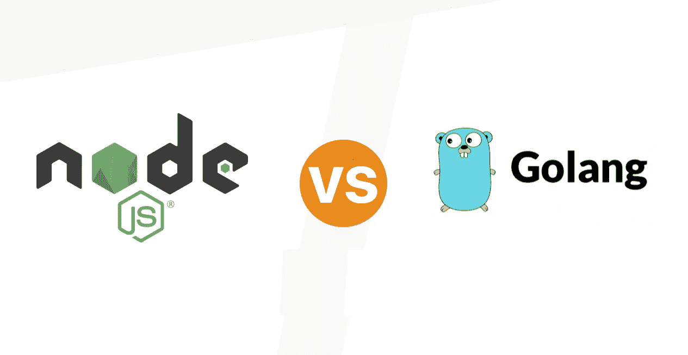
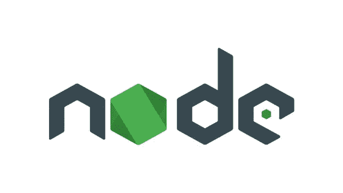

# node . js vs . Golang:Web 开发哪个更好？

> 原文：<https://javascript.plainenglish.io/node-js-vs-golang-which-is-better-for-web-development-67baa81c7a5?source=collection_archive---------4----------------------->

## Node.js 和 Golang 的关键区别是每个 web 开发人员都应该记住的。

我们再次发现自己处于十字路口，必须选择一个 web 开发平台。如今，选择 apt 技术栈已经成为一项令人困惑的任务，因为 web 工程师有很多选择。

在这种情况下，满足于正确选择的最佳方式是进行基于特征的比较。我们也将在本文中做同样的事情，等待比较的两个平台是 Node。JS 和 Golang(也叫 Go)。

从它的。JS 扩展，Node 属于著名的 JavaScript，但这并不削弱 Go 的意义，因为它是谷歌的技术。很明显，这两个平台都有相当强大的技术支持，并带有相当可靠的特性。

有趣的是，这两种开发技术都是在 2009 年被引入 IT 世界的，并且表现得非常健壮。因此，特别是追求一个目标，将会非常困难。但是就像我们说的，我们可以通过对两者进行比较来使它变得简单一点。但是首先，让我们多了解他们一点。

# 什么是节点。JS？

节点。JS 是在 Chrome 的 V8 JavaScript 引擎上运行的运行时环境，广泛用于创建可伸缩的动态网络应用程序。Node 的一个奇妙之处在于。JS 的好处在于，它既可以用于客户端，也可以用于服务器端脚本，从而让开发者在 web 开发中实现单一性。

它的实用性、可扩展性和跨平台支持已经促使一些大型科技巨头向它低头，包括 PayPal、LinkedIn、微软和 GoDaddy。据 W3Techs 报道，Node。大约 2.1%的网站使用 JS，这些网站的服务器为用户所知。

# Golang 是什么？

由 Google 构思、设计和开发的 Go 是一种编译的静态类型编程语言，旨在通过提高语言的运行时效率、多处理能力和可读性来提高整体生产率。从语法上来说，Go 的结构类似于 C 语言，但是它具有额外的特性，比如垃圾收集、并发性和内存安全。

在 Stackflow 的 2020 年开发者调查报告中，Golang 在最受欢迎的编程语言中排名第五。一些著名的项目使用 Golang 的公司有美国运通、Trivago、Twitter 和优步。

# 基于特征的比较

这两种技术的基本介绍对于了解相似之处和理解基本差异是必要的。到目前为止，我们知道 Node 和 Go 都是在同一年进入行业的，都是为了更好的可伸缩性、提供跨平台支持和提高编程效率而设计的。我们现在来看看它们之间有什么不同。

## 结构

最基本的区别在于它们的结构。事实上，当 Node 与任何其他开发技术相比时，这是讨论的最重要的一点。首先，它是基于 JavaScript 的，是一个运行时环境，而不是一个平台。另一方面，Golang 是一种编程语言。所以从结构上来说，它们彼此之间的差异很小。

## 学习曲线

学习的容易程度产生了巨大的影响，因为开发人员越容易学习和使用一门语言，他们就越能掌握这门语言。现在两个[节点。JS](/node-js-is-it-good-for-frontend-or-backend-development-245e15d3754c) 和 Go 很容易学习，但是由于 JavaScript 是一种更古老的语言，并且在 web 开发市场上有更强的控制力，所以熟悉 Node 更容易。

## 开发工具和资源

作为 JavaScript 的产物，Node 的足智多谋毋庸置疑。然后，我们有 npm，Node 的默认包管理器，以及一个由众多模块和构建块组成的扩展库，帮助开发人员处理各种操作。

现在把注意力转向围棋，人们也不能怀疑它的足智多谋。加油！毕竟，我们谈论的是谷歌，这个搜索引擎凭借其网站、Android 和应用程序继续统治着网络世界。

但与 Node 相比，它落后了几步，因为该语言仍在发展中，虽然它有一个标准库，开发人员可以在其中找到必要的资源，但他们可能需要看得更远一些，而 Node 不是这样的。

## 错误处理

两个节点。JS 和 Golang 都挺擅长这个功能的。在 Node 中，它主要是通过大多数开发人员已经熟悉的抛出-捕捉技术来解决的。但是 Go 的方法有所不同，因为它需要明确地检查错误，从而得到完美无缺的结果。

## 并发性和可伸缩性

并发是 Go 的 USP 之一。所以就这个特性而言，Go 肯定是一个更好的竞争者。goroutines 函数具有并发执行的能力，因此也带来了更好的可伸缩性。此外，该功能还支持线程的无缝执行。另一方面，Node 的并发性不如 Go。

## 社区

自节点。JS 和 Golang 是开源技术，它们从不缺少社区支持。前者享有一个充满活力的社区的有益支持，该社区努力建立节点。JS 开发服务更加完美无瑕。

事实上，节点。JS foundation 包含了像 GoDaddy 和 Paypal 这样使用 Node 的大人物。Golang 的社区虽然比 Node 小，但也是一个生动的社区，因为它为年轻的开发人员提供了试验和改进语言的绝佳机会。

## 选择因素

两个平台之间的比较是一个主观问题。虽然我们只考虑了最常见的关键点，但还有其他因素会影响开发商的最终决策。除了上述因素之外，其他一些要考虑的选择因素有:

*   安全性
*   应用程序类型及其要求
*   开发成本和时间
*   专业知识的可用性

## 拿走

如果你是一名开发人员，那么迟早你会自己做出决定。但如果你是投资者或企业家，那么明智的做法是在你着手[雇佣 Node 之前了解这两个平台的基础知识。JS 开发人员](https://www.hiddenbrains.com/hire-node-js-developers-consultants-expert.html)或 Golang 程序员。这里明智的做法是去找专家咨询，然后照此进行。

*更多内容看* [***说白了。报名参加我们的***](https://plainenglish.io/) **[***免费周报***](http://newsletter.plainenglish.io/) *。关注我们关于* [***推特***](https://twitter.com/inPlainEngHQ)[***LinkedIn***](https://www.linkedin.com/company/inplainenglish/)*[***YouTube***](https://www.youtube.com/channel/UCtipWUghju290NWcn8jhyAw)*[***不和***](https://discord.gg/GtDtUAvyhW) *。对增长黑客感兴趣？检查* [***电路***](https://circuit.ooo/) *。*****