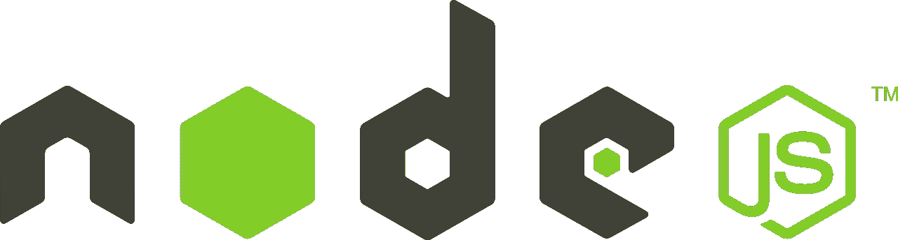
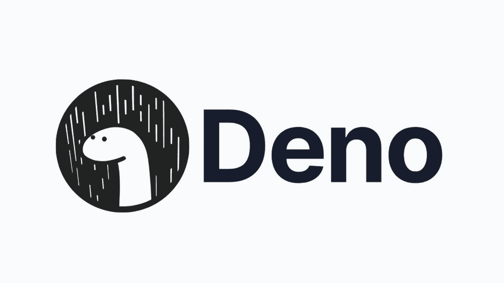
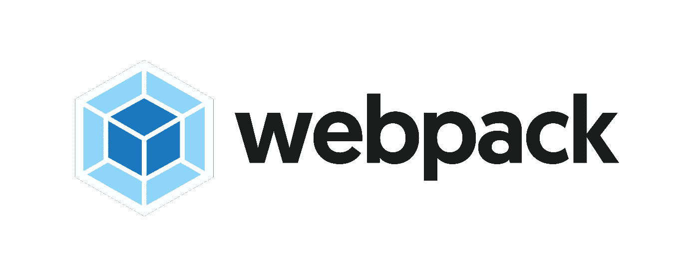
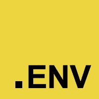
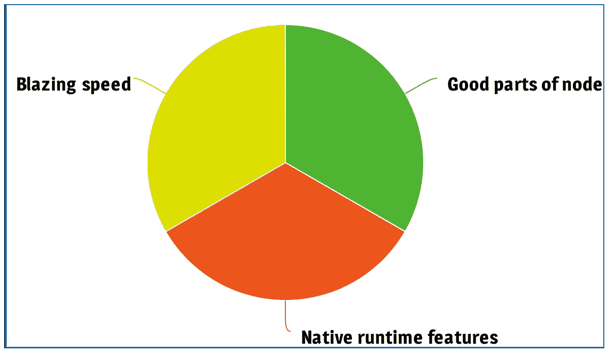

# Bun 如何成为 JavaScript 运行时之王

> 原文：<https://javascript.plainenglish.io/node-time-to-die-how-bun-aims-to-be-king-of-javascript-runtimes-b9dad687cab6?source=collection_archive---------4----------------------->

## Node.js 和 Deno 让路，有一个新的运行时。

Bun — the new king?

如果你在过去 10 年中做过前端开发，那么你很有可能使用过 Node js。事实上，很难想象没有 npm 包和 node_modules 的现代 web 开发。

Node.js 是最普及、最受欢迎的 JavaScript 运行时，但它的头把交椅正受到一个听起来可爱的竞争者的挑战— **Bun。**

但是什么是 JavaScript 运行时呢？为什么面包很重要？让我们把它分解一下，这样你对 Bun 就有足够的了解，可以说“嘿，我读过一些关于它的东西”并且*让你的同事惊叹*建议他们迁移遗留 Node.js 项目来使用 Bun(注意:请不要这样做，除非你想不受欢迎)

# JS 运行时

在 1995 年 Javascript 首次被创建的时候，它运行在 Netscape 浏览器中。这一切都很好，但如果我们想在更现代的浏览器如 Chrome 上运行 JS 呢？嗯，Chrome 需要一种自己执行 JS 代码的方式——这被称为 **JavaScript 引擎**。

JavaScript 引擎对于 web 浏览器是必不可少的，主要的 web 浏览器供应商都有自己的引擎。有数百个自制 JS 引擎，但“三大”是:

*   V8——由谷歌为 Chrome 开发
*   苹果公司为 Safari 开发的 JavaScriptCore
*   **SpinderMonkey**——由 Mozilla 为 Firefox 创建

Googles V8 engine, which is extremely popular.

好了，现在我们有了一个引擎，可以在各自的浏览器中运行我们的 JS。但是如果我们根本不想在浏览器中运行 JS 呢？
简单地说，JS 运行时指的是**我们运行 JS 代码的地方。**

# 两千和 Node.js

> “在一开始 node_modules 就被创建了。这让许多人非常愤怒，并被广泛认为是一个糟糕的举动。”

在 2009 年创建了 Node.js 运行时环境。这允许开发人员编写 JS 应用程序，而不需要显式地绑定或运行在 web 浏览器上。这使你可以在 Node.js 中编写前端、后端或全栈应用程序，然后可以在任何地方运行，如 webserver、app service 或 edge。

The Node.js logo

尽管 Node.js 在 js 运行时方面是一个彻底的改变，但它仍然与我们熟悉的 JS 生态系统有着紧密的联系，因为它是使用 *Chrome V8 引擎*构建的。

Node.js 很快成为前端和后端开发的默认 js 运行时(在 JS 中),并且从那以后一直非常受欢迎。
但是流行并不意味着完美，已经有人尝试对 Node.js 进行改进。

# Deno — Node.js 2.0？

Node.js 的创始人 Ryan Dahl 有遗憾。事实上，他在他的演讲“关于 Node.js 我后悔的 10 件事”中列出了 10 件事。

如果您对 JS 运行时八卦感兴趣，我建议您听听这个演讲，但总体感觉是 Node.js 可以在以下方面进行改进:

*   安全性
*   NPM——开源库的一种极其混乱且有点基于信仰的方法
*   模块编译
*   参差不齐的打字稿和 JSX 支持

Ryan 旨在通过发布一个名为 **Deno** 的新 JS 运行时来纠正这些问题，是的，它是 Node.js 的变位词。

The (cute) Deno logo

Deno 有很多开发者可能想要的优秀特性，但是正在努力解决最重要的部分——大规模采用。
开发人员通常对核心技术相当固执，Deno 似乎没有从 Node.js 吸引他们。这可能有多种原因，但主要是由于基础设施的规模。

> 国家预防机制包:1，300，00 以上
> 
> 德诺包装:4929

当然，包的数量并不是衡量成功的唯一标准，事实上，大多数人都会同意 npm 臃肿得令人难以置信，但这是 Node.js 与 Deno 争论中的一个重要论点。当这场争论正在酝酿的时候，一个开发人员正忙于创建运行时战争中的最新挑战者。

# 小圆面包

The (even cuter) Bun JS logo

Bun 是为现代 web 开发而构建的 JS 运行时。Bun 和 Node.js/Deno 的关键区别在于，它是建立在一个 JavaScriptCore 引擎(T4)上，而不是谷歌的 V8。
JSC 往往比 V8 更具性能，代价是更难共事。谢天谢地，面包的创造者贾勒德·萨姆纳为我们付出了辛勤的劳动，这样我们就可以享受 JSC 引擎的加速了。Bun 是用 Zig(一种低级的高性能编程语言，像我一样，你可能从来没有听说过)编写的，这进一步增加了速度上的优势。

这些因素意味着 Bun 比 Node.js 和 Deno 更快。这是一个很高的荣誉，也是诱使开发人员转换运行时的一种东西。

## 所以很快。但是它有包装吗？

是啊！Bun 没有陷入和 Deno 一样的陷阱，试图维持一个独立于广受欢迎的 npm 的系统。Bun 实现了与 Node.js 相同的模块解析算法。这是一种奇特的说法，Bun 能够使用 npm 包，同时安装速度提高了 20 倍。所以你可以使用 130 万个 npm 包，也可以使用 npm 的速度。干得好，小傍。

Bun 使用节点包管理器的事实有点像一把双刃剑，因为 Ryan Dahl 非常清楚，npm 并不完美。但是，在有一个非常受欢迎的替代品出现之前，Bun 一直在尽力应对“糟糕”的情况。

No more fumbling with bundling

## 捆绑和传输呢？

Bun 是一个一体化的运行时。也就是说你不用担心搞乱 Webpack/rollup/babel，Bun 有原生的 bundler。你不必担心使用 TypeScript 或 JSX/TSX，因为 Bun 有一个本地 transpiler。这意味着您可以从一开始就开始以这些文件格式编写，而不是与 ts 配置和捆绑器斗争。在我看来，这是一个非常酷的特性，因为你关心的任何东西都应该用 TypeScript 编写。

## 还有其他酷的地方吗？

Bun 能够处理。env 文件，不需要安装任何依赖项，不像 Node.js 必须使用 dotenv 包。这只是一件小事，但感觉上**能够在运行时本地处理 env 文件是有意义的。**

Bun makes handling these files easy!

对于那些编写测试的人(首先做得很好)，Bun 提供了一个类似于 Jest 的本地测试运行器。毫不奇怪，它的速度快得惊人，能够 [*“运行 266 次测试，SSR 与 react-dom 的速度比 jest 打印其版本号的速度快 40%”*。这是吸引你项目眼球的索赔类型。](https://twitter.com/jarredsumner/status/1542824445810642946/photo/1)

# 结论——所有人向新国王致敬？

Bun 的目标是成为事实上的 JS 运行时，他们的策略可以分为三个主要部分；

Bun 有很多优点，但是现在还不是每个人都放弃 Node.js 的时候。

虽然 Bun 很有前途，但它目前的发展动力非常有限(无意冒犯萨姆纳)。这意味着有相当多的 bug，这可能是这样一个雄心勃勃的项目在其生命周期早期的预期。
Windows 用户目前必须使用 WSL(用于 Linux 的 Windows 子系统)才能安装和使用 Bun，这可能会拒绝一些开发人员，并且通常会让 Windows 体验感觉有点半生不熟。

因此，虽然 Bun 的推出令人难以置信地震撼了 JS 领域，但它可能需要更多时间才能超越 Node.js。

如果你喜欢这篇文章或者觉得它有用，那么欢迎关注。或者，你可以在 Medium [*这里*](https://jamesmbrightman.medium.com/membership) *支持我或者给我买一杯* [*咖啡*](https://ko-fi.com/jamesbrightman) *！非常感谢所有的支持。*

*更多内容请看*[***plain English . io***](https://plainenglish.io/)*。报名参加我们的* [***免费周报***](http://newsletter.plainenglish.io/) *。关注我们关于*[***Twitter***](https://twitter.com/inPlainEngHQ)**和*[***LinkedIn***](https://www.linkedin.com/company/inplainenglish/)*。查看我们的* [***社区不和谐***](https://discord.gg/GtDtUAvyhW) *加入我们的* [***人才集体***](https://inplainenglish.pallet.com/talent/welcome) *。**