# node . js back end in 2022——通过 5 个简单的步骤设置服务器

> 原文：<https://javascript.plainenglish.io/nodejs-backend-in-2022-setting-up-server-in-5-simple-steps-19074ab861f1?source=collection_archive---------0----------------------->

## 如何使用 Node.js 建立自己的后端服务器的分步指南

你不需要去 bootcamp 学习如何设置你的后端服务器。今天，我们将快速浏览一下如何使用 Node.js 轻松设置自己的后端服务器。

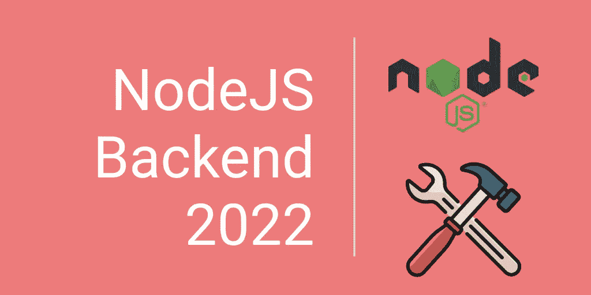

今天，我将带您了解如何使用 Node.js 设置服务器，并创建简单的 API 端点，从而开始您的 web 后端之旅。

# 1.在计算机上安装 Node.js

[](https://nodejs.org/en/) [## 节点. js

### Node.js 是基于 Chrome 的 V8 JavaScript 引擎构建的 JavaScript 运行时。

nodejs.org](https://nodejs.org/en/) 

去上面的网站下载 Node.js 的 LTS 版本并安装在你的电脑上。

# 2.检查 Node.js 和 NPM 版本

步骤 1 安装完成后，您可以在 Mac 或 Windows 的 CMD 中打开终端，并键入以下命令:

```
node -v
```

您应该能够看到安装的 Node.js 版本。

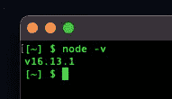

terminal showing node version v16.13.1

```
npm -v
```

您应该能够看到安装的 npm 版本。

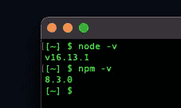

terminal showing npm version 8.3.0

您可以在下面的网站中找到 Node.js 和 NPM 配对版本:

[](https://nodejs.org/en/download/releases/) [## 以前的版本| Node.js

### 发行版 1.x 到 3.x 被称为“io.js ”,因为它们是 io.js 分支的一部分。从 Node.js 4.0.0 开始，前者…

nodejs.org](https://nodejs.org/en/download/releases/) 

# 3.草签新项目

现在您已经完成了 Node.js 的设置，是时候开始了。转到一个空目录并创建一个`index.js`文件。


Try your first line of Node.js code

现在您已经保存了文件。您回到您的终端或 CMD，并导航到您的目录。运行`node index.js`来运行你的文件。您应该可以在您的终端中看到这一点。

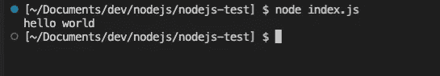

console.log successfully printed

🎉恭喜你！您已经成功编写了第一个 Node.js 代码。

# 4.设置 Node.js 服务器

首先，让我们初始化一个`package.json`文件到你的目录。您可以通过在您的目录中运行这个命令来实现。

```
npm init
```

您可以回答提示的所有问题，或者一直按`enter`，一切就绪。这个`package.json`文件是一个供你下载第三方库和依赖项的文件，供你在你的项目中使用。

要启动 Node.js 服务器，您可以安装`express`包来完成这项工作。只需回到您的终端并运行以下命令:

```
npm i -S expressnpm — node package manageri — install-S — shorthand for --saveexpress — package name
```

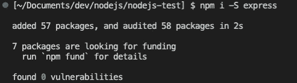

Installing express packge into your project

一旦软件包安装完毕，回到你的`index.js`文件，写下这几行代码:

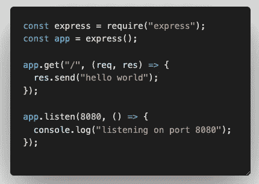

index.js

让我解释一下上面发生了什么，您刚刚通过使用`require`关键字将`express`库导入到您的文件中。你通过调用`express()`初始化了一个`express`的实例。如果有人在`'/'`访问您的端口，您设置了一个根路由`'/'`来发送回一个文本`hello world`，最后您通过在端口`8080`运行`app.listen`来启动 Node.js 服务器。

现在回到您的终端，重新运行命令:

```
node index.js
```

您应该能够看到您在代码中编写的 console.log 消息。

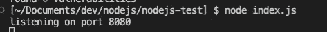

现在打开浏览器，在地址栏中输入— `localhost:8080`。

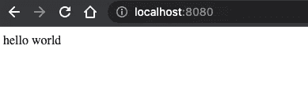

Accessing local server through the browser

再次祝贺你🎉，您已经成功创建了 Node.js 服务器。

# 5.从 CRUD 开始创建 API

没有教你如何创建 API 的 Node.js 后端服务器设置是什么？API 代表应用程序编程接口，它是一个允许您的`frontend`客户端(网站)与您的`backend`服务器(Node.js)通信以处理和检索数据等的接口。

API 的基础通常被称为`CRUD`——创建、读取、更新和删除。例如，如果您正在创建一个类似 Twitter 的应用程序，您希望允许您的用户写一条 tweet(创建),并且您希望允许其他用户能够在其提要中看到(阅读)这条 tweet。如果发布推文的用户犯了一些错别字，您希望允许他们编辑(更新)他们的推文来纠正错别字。最后，当某条推文不合适时，您希望允许用户移除(删除)该推文。

既然我们已经清楚 API 是什么了。让我们开始吧。出于开发目的，您可以在本地安装一个离线数据库，将数据存储在您的机器中。您可以按照下面链接中的步骤在您的机器上安装和启动 MongoDB:

[](https://www.mongodb.com/docs/manual/tutorial/install-mongodb-on-windows/) [## 在 Windows 上安装 MongoDB 社区版

### MongoDB Atlas 是一个托管在云中的 MongoDB 服务选项，不需要安装开销，并提供免费的…

www.mongodb.com](https://www.mongodb.com/docs/manual/tutorial/install-mongodb-on-windows/) [](https://www.mongodb.com/docs/manual/tutorial/install-mongodb-on-os-x/) [## 在 macOS 上安装 MongoDB 社区版

### MongoDB Atlas 是一个托管在云中的 MongoDB 服务选项，不需要安装开销，并提供免费的…

www.mongodb.com](https://www.mongodb.com/docs/manual/tutorial/install-mongodb-on-os-x/) 

现在回到您的项目，您需要安装这个包`mongoose`来访问您的本地 MongoDB 数据库，安装`body-parser`来从前端客户端访问 JSON 数据。

```
npm i -S mongoose body-parser
```

安装包之后，将这几行代码添加到您的`index.js`文件中。

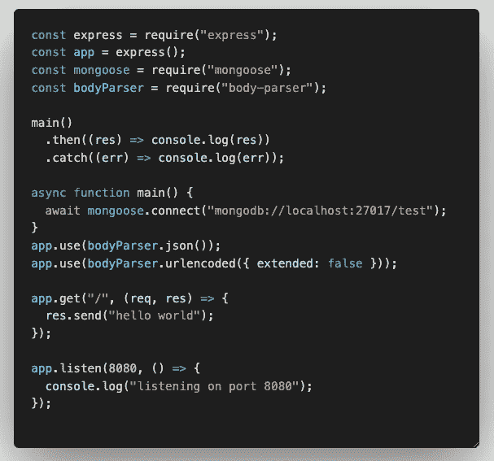

index.js

现在，当您运行您的`index.js`文件时，您应该能够看到您的本地主机运行在端口 8080 和未定义的文本，因为您的 MongoDB 中的`test`集合还没有定义。但这是一个好迹象，表明您已经与本地 MongoDB 数据库建立了连接。如果您在连接 MongoDB 时看到一个错误，请检查您是否已经从我前面提供的 MongoDB 设置链接启动了您的 MongoDB 数据库。

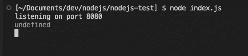

第一步，让我们在项目中创建 3 个文件夹——模型、控制器和路线文件夹。Models 文件夹将包含不同 API 的所有对象模式。Controllers 文件夹将处理来自前端客户端的请求，并从后端服务器返回一个 JSON 响应。路由文件夹将定义前端客户端可访问的所有 API 路由。我们将为每个文件创建一个. js 文件，以包含为 todo 列表 CRUD 创建 API 所需的代码。

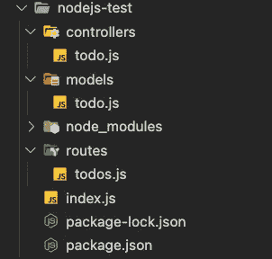

第二步，在 models > `todo.js`文件中为您的数据定义模式。

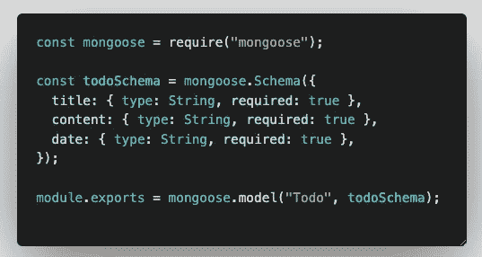

todo.js

第三步，在 controllers > `todo.js`文件中为你的待办 CRUD 定义控制器。


C for Create

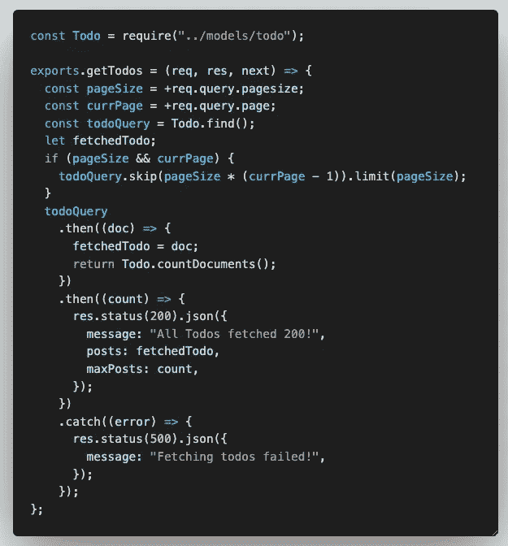

R for Read all todo items

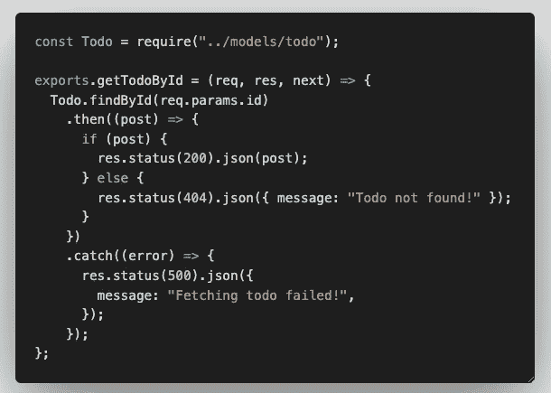

R for Read todo items by todo id

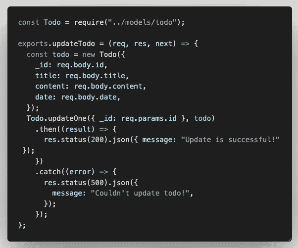

U for Update todo by id

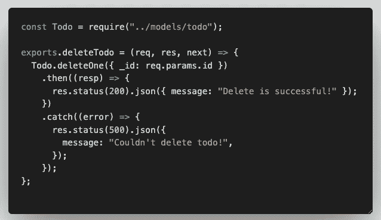

D for delete todo by id

第四步，为前端客户端定义路由名，以调用 routes > `todos.js`文件中的 API。

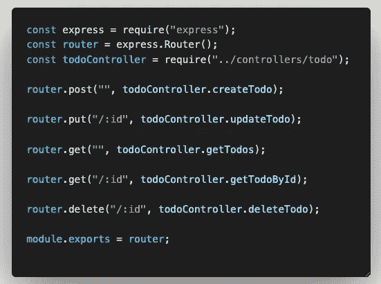

todos.js

终于，你到了最后一步。将您创建的内容添加到`index.js`文件中，并重新运行您的节点服务器。

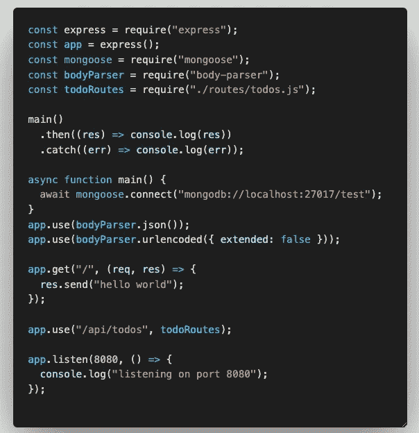

index.js

对于 MongoDB 上的更多 mongoose 操作，您可以查看下面的链接，了解您的应用程序需要什么:

[](https://mongoosejs.com/docs/index.html) [## mongose v 6 . 5 . 3:入门

### 首先确保您已经安装了 MongoDB 和 Node.js。接下来从命令行使用 npm: $ npm 安装 Mongoose

mongoosejs.com](https://mongoosejs.com/docs/index.html) 

现在，是时候检验你写的东西了。市面上有很多 API 测试工具，但是为了方便，我会推荐安装 Postman。这是测试你的 API 最容易出错的工具。

[](https://www.postman.com/) [## 邮差 API 平台|免费注册

### 超过 2000 万开发者使用 Postman。通过注册或下载桌面应用程序开始。什么是邮递员…

www.postman.com](https://www.postman.com/) 

一旦你安装好了，你就可以开始测试了！

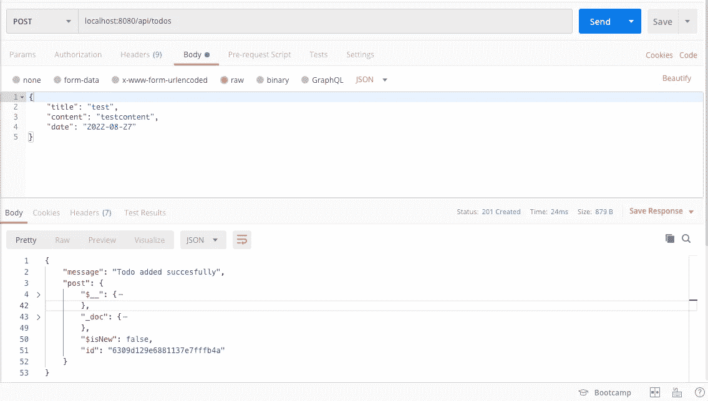

test detail for Create/Post API

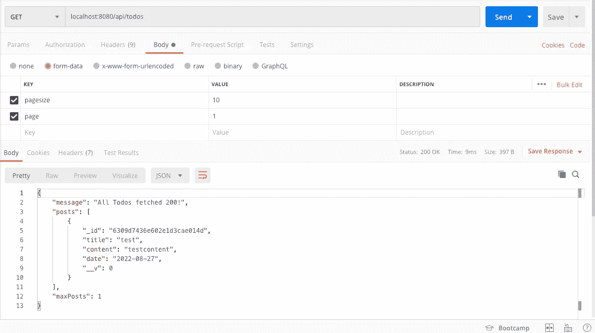

test detail for Read/Get all API

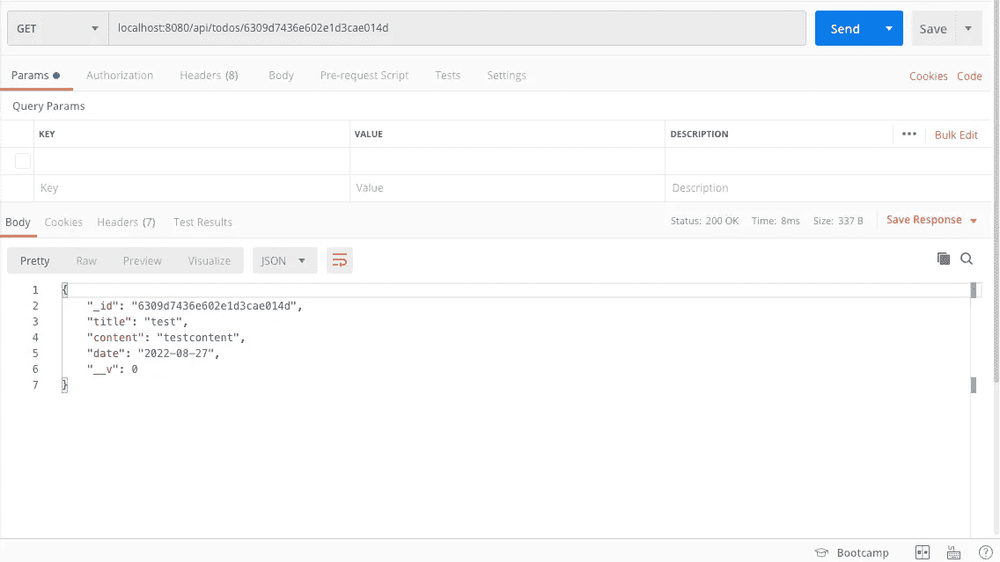

test detail for Read/Get by id API

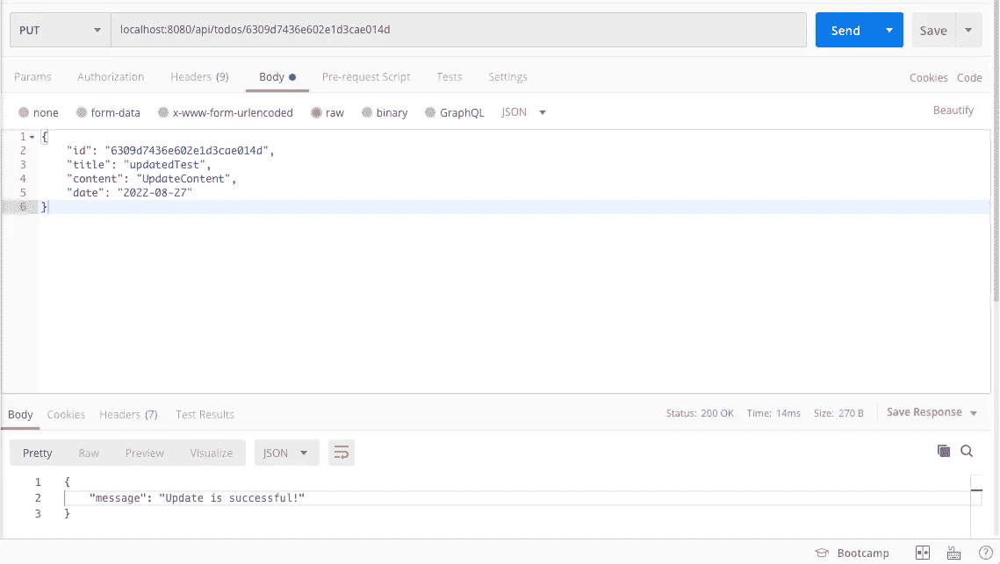

test detail for Update/Put by id API

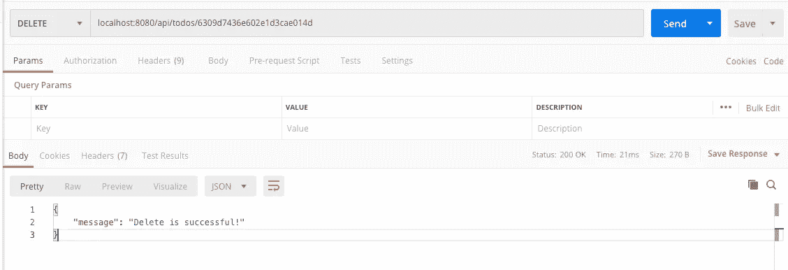

test detail for Delete by id API

🎉很好地完成了这篇文章，祝贺你现在成为 Node.js 的官方后端开发者！有了这些基础知识，您将能够创建一个功能完整的后端服务器，供前端客户端与之交互。

# 摘要

希望本文已经教会了您设置 Node.js 服务器的必要知识。你可以看到，从头开始设置自己的后端服务器并不困难，只需遵循本文中的 5 个简单步骤，现在你就拥有了自己的后端服务器。💯

要准备好生产环境的设置，您只需要将 mongoose 连接切换到生产 MongoDB，并将后端代码部署到任何服务器托管站点，如 AWS、Azure 或 GCP。

如果你对设置有任何疑问或需要澄清，请在下面的评论中告诉我。我会尽力帮助你，我们可以一起提高，成为更好的开发者。干杯！

[](https://medium.com/@devjo/membership) [## 用我的推荐链接- DevJo 加入媒体

### 阅读 DevJo 的每一个故事(以及 Medium 上成千上万的其他作者)。你的会员费直接支持 DevJo 和…

medium.com](https://medium.com/@devjo/membership) 

*更多内容请看*[***plain English . io***](https://plainenglish.io/)*。报名参加我们的* [***免费周报***](http://newsletter.plainenglish.io/) *。关注我们关于*[***Twitter***](https://twitter.com/inPlainEngHQ)[***LinkedIn***](https://www.linkedin.com/company/inplainenglish/)*[***YouTube***](https://www.youtube.com/channel/UCtipWUghju290NWcn8jhyAw)*[***不和***](https://discord.gg/GtDtUAvyhW) *。***