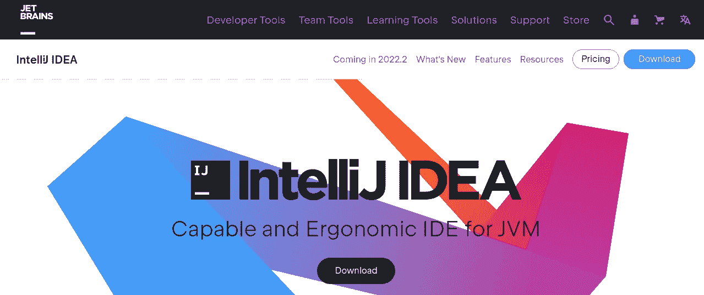

# 现代应用程序开发的顶级 Node.js IDEs

> 原文：<https://javascript.plainenglish.io/nodejs-ides-for-modern-app-development-f99e05327b32?source=collection_archive---------9----------------------->

## 探索允许您构建现代应用程序的 7 个最流行的 Node.js IDEs。

作为一名企业家，需要做好适应变化的准备，并在收入和客户方面做好准备。这就是拥有一个技术栈变得重要的地方，它允许构建运行速度非常快的应用程序，同时在市场上也表现良好。

由于这些因素，技术栈已经成为开发人员的最爱。然而，这里值得注意的是:除了拥有允许更快应用开发的技术堆栈，开发者还需要拥有执行调试和编辑等任务的工具。这使得所开发的程序能够有效运行。这就是拥有 IDE(集成开发环境)至关重要的地方。

在这篇文章中，我们将向您介绍 IDE 的概念，解释它在开发人员执行 Node.js 开发时的重要性。在此之后，我们将招募 top 7 Node.js IDE，让应用程序无缝运行。

## ***IDE —简介***

IDE 或集成开发环境由软件组成，使构建应用程序成为开发的一件轻而易举的事情。它由单个应用程序中的编程任务组成，还为开发人员提供了一个中央界面，其中包含用于执行该任务的集成工具。此外，它还有助于满足开发人员的不同编码需求，包括创作、编译等。，不一而足。

 [## 证明 Node.js 步伐加快的 5 个用例

### 特别是在移动应用程序开发等任务中，需要考虑的最重要的方面是什么，或者…

xongolab.medium.com](https://xongolab.medium.com/5-use-cases-to-prove-accelerated-pace-of-node-js-42d23a475db4) 

了解了一点软件应用程序(IDE)，现在让我们理解它在移动应用程序开发中的重要性的原因。

## ***IDE 对构建现代 App 的意义***

*   **减轻开发人员的负担。这是因为 IDE 为开发人员提供了一个一体化的界面，允许他们执行不同的任务，如编码、编辑、调试等。，都在一个地方。**
*   **节省时间&精力。**软件应用程序(IDE)为他们提供了一个用于测试、编辑、编码等的中央界面。，这提高了专业人员的工作效率并节省了时间。

由于上述原因，IDE 在加快开发速度方面扮演着重要的角色，这一点变得很明显。

 [## Node.js 与 React——开发 Web 应用程序的致命组合

### 这种新兴的技术为开发人员提供了过多的选择

xongolab.medium.com](https://xongolab.medium.com/nodejs-with-react-to-develop-web-app-8db098f88498) 

既然你已经明白了 IDE 的意义，那么我就给你一个列表，列出 Node.js 开发者在进行移动 app 开发时推荐的 7 个顶级 IDE。

这就是了。给你的综合清单。

## ***Top 7 Node.js IDE 打造现代应用***

## 1.智能理念

**GitHub:** 13.8k 星

Image source: jetbrains.com

IntelliJ IDEA 在加快移动应用程序开发速度的七大 Node.js IDE 列表中名列第一，它是一个为开发人员提供丰富工具集的 IDE。这使得他们可以很容易地执行任务，比如完成代码，并一起检查它们。

***IDE 也提供了如下特性:***

*   简化工作流程的开发人员工效学。
*   深入的代码洞察，帮助开发人员访问他们项目的虚拟地图，使错误检测变得容易，同时还为他们提供了完成代码的方法，等等。
*   版本控制允许开发人员从欢迎屏幕上执行不同的任务，比如项目克隆，除了能够检查两个版本之间的差异，等等。

了解了 IntelliJ IDEA 之后，现在让我告诉你 Node.js 开发人员推荐的下一个 IDE。

## 2.Visual Studio 代码

**GitHub:** 133k 颗星星

Image source: visualstudio.com

代码编辑器 Visual Studio Code，也称为 VS Code，主要帮助重新定义和优化代码。这是为了允许无缝的应用程序开发，也可以以一种方便的方式进行调试。

代码编辑器由微软分别为 Windows、Linux 和 macOS 等平台开发，它赋予开发人员运行任务、控制版本等的灵活性。

***这是由于它所具有的特性如:***

*   用于控制执行编辑器启动的技术的命令行。
*   Git 集成，帮助开发人员将代码及其各种更改提交、推和拉至远程 Git 存储库。
*   拆分视图允许无缝的多任务处理，允许开发人员在处理两个文件时灵活地检查它们之间的差异。

## 3.崇高的文本

image source: sublimetext.com

一个复杂的跨平台源代码编辑器，它使得像代码编辑、代码标记和代码散文这样的任务对开发人员来说轻而易举。

拥有一个光滑的用户界面，除了许多独特的功能，开发人员可以在短时间内学会使用它，而不会面临任何挑战。

***这是由于其中存在以下元素:***

*   允许开发者灵活地导航文件、符号和行。
*   同步编辑，提供在多个选定区域内进行交互式更改的灵活性。
*   升华文本片段以加速插入文本和代码。

## 4.网络风暴

Image source: jetbrains.com/webstorm/

WedStorm 在 Node.js IDE 排行榜上名列第四，它是一个 JavaScript IDE，可以帮助开发人员在编码时提高工作效率。同时，在整个项目中重命名组件时要注意变化。

此外，它确保代码的整体质量得到提高，并且可以写得更快，同时减少编写代码时的错误。

***除了这些，IDE 还包含以下特性:***

*   内置的开发工具使调试和测试变得容易。
*   快速导航和搜索使代码移动成为一项简单的任务。
*   智能编辑器使代码编写变得简单。

## 5.原子

**GitHub:** 57.6k 颗星星

Image source: atom.io

一个免费的开源文本和源代码编辑器，它支持执行可能用 JavaScript 编写的插件和嵌入式 Git 控件。它使用 web 技术构建，同时包含 UI 和语法主题，当开发人员开始确定一个合适的应用程序来使应用程序在本质上具有视觉吸引力时，它可以大大节省他们的时间。

***除了这些优点之外，Atom 还拥有以下特性:***

*   为开发人员提供的包含不同功能的包。
*   主题——增强应用程序视觉元素的用户界面和语法。
*   定制赋予用户界面一种独特的感觉，同时增加新的特性。

## 6.月蚀车

**GitHub:** 6.7k 星

Image source: eclipse.org

Eclipse Che 是一个开源的、基于 Java 的开发人员工作区服务器，它帮助开发人员在类似 prod 的环境中不断测试应用程序，并在 Kubernetes 上无缝运行。他们只需要一个浏览器。他们可以开始不同的编码相关的任务，并确保自动化的 Git 设置。

所有这些因素使它成为开发人员的最爱，因为他们可以更快地编码，并防止错误发生。

***同样，由于下面的特性，它变得如此流行:***

*   Git 服务集成允许轻松连接 GitHub、Gitlab 等。，使用 OAuth。
*   与团队共享开发设置的 URL。
*   多租户通过 OIDC (OpenID Connect)协议验证用户是否可以访问工作区。

## 7.云 9

**GitHub:** 2.5k 星星

Image source: aws.amazon.com/cloud9/

AWS Cloud9 是一个基于云的 IDE，允许开发人员通过浏览器轻松编写、运行和调试代码。

由于拥有流行编程语言的工具，如 JavaScript、Python 等。，消除了对安装文件或配置开发机器来启动新项目的依赖。

***这是由于存在于其中的特性:***

*   全功能编辑器，允许在浏览器中无缝编写、运行和调试代码。
*   内置终端，用于代码编译和显示服务器输出。
*   修订历史和定制，以方便地访问代码，并更新过去的错误检查(如果有的话)。

这些 IDE 帮助开发人员构建高质量的轻量级应用程序。然而，它要求做出正确的选择。这将确保企业获得最大的成功。因此，您需要检查项目需求并评估您的需求。然后你就可以雇佣 Node.js 开发人员了。在了解您的需求后，他们将通过他们创建的最终解决方案列出 Node.js IDE 保证项目流程的候选名单。

## 包扎

Node.js IDE 有助于开发快速上市的轻量级应用程序。目前，我们有各种各样的 Node.js IDE 来加快移动应用程序开发的步伐。然而，入围最佳的确是一个具有挑战性的考验！因此，最好是 [**雇佣 Node.js 开发者**](https://www.xongolab.com/hire-node-js-developers/) 。

如果您正着手寻找能够简化移动应用程序开发过程的最佳 Node.js IDE，现在就与专业人士合作吧！他们将帮助您确定构建应用程序的最佳集成开发环境，最终为您的业务带来最大价值并获得最大投资回报。

*更多内容看* [***说白了就是***](https://plainenglish.io/) *。报名参加我们的* [***免费周报***](http://newsletter.plainenglish.io/) *。关注我们关于*[***Twitter***](https://twitter.com/inPlainEngHQ)*和*[***LinkedIn***](https://www.linkedin.com/company/inplainenglish/)*。查看我们的* [***社区不和谐***](https://discord.gg/GtDtUAvyhW) *加入我们的* [***人才集体***](https://inplainenglish.pallet.com/talent/welcome) *。*