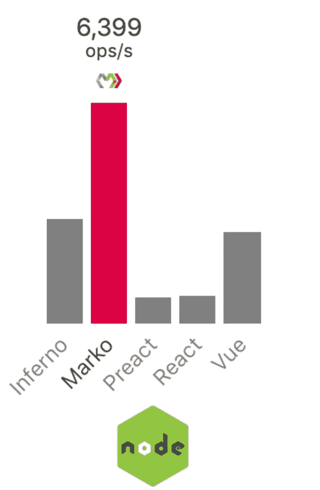

# 现在 React 正在消亡——这里有一些(更好的)替代方案

> 原文：<https://javascript.plainenglish.io/now-that-react-is-dying-here-are-some-better-alternatives-fb89ed5c4f74?source=collection_archive---------1----------------------->

## React 不再是唯一的选择——不要落后——尽快学习这些令人敬畏(但被低估)的 JS 框架。

Photo by [Mohammad Metri](https://unsplash.com/@mohammadmetri?utm_source=medium&utm_medium=referral) on [Unsplash](https://unsplash.com?utm_source=medium&utm_medium=referral)

今天，在框架世界里发生了许多了不起的事情(你可能没有意识到)。

如果你喜欢——该死！我们需要另一个 JavaScript 框架吗？

不，我不是来告诉你尝试另一个新的框架。你到底为什么要这样？不要为了用而用某样东西？

我在这里分享 web 框架中的一些(惊人的)创新，因为我们应该得到更好的——不是吗？

这些框架已经存在了一段时间(未得到充分重视)，值得我们关注。

现在是我们审视它们的时候了，因为所有这些框架都是向前迈出的重要一步。

如果对他们一无所知，那将是一种遗憾。

# 你不能在薄弱的基础上建造一座伟大的建筑，你需要一个坚实的基础。

作为程序员，我们应该经常问自己，*“我们今天所知道的，我们如何能做得更好？”*

由于被要求去做一些本不该做的事情，React 已经变得一团糟。

***实为*** 实质上是重启后的反应。

它解决了两个主要问题:

*   第一个是 ***虚拟 DOM*** (组件不断重新渲染是一个性能问题)。
*   第二种是 ***状态*** 管理。

Solid.js 拥有我们今天在 hooks 中得到的所有反应式状态管理，但做得更好，就好像我们从零开始了解我们现在知道的东西一样。

它既实用又极具表现力。

它与 react 组件有许多相似之处，例如返回 JSX(用于 UI)的 JavaScript 函数，但与 react 不同，它没有虚拟 DOM。

我们得到了一种超薄的编译器，可以将你的代码转换成普通的 JavaScript，让你尽可能地接近 DOM。

该框架本身只有 7KB 大小，完全超越了运行时性能基准，而无需在代码中使用任何额外的魔法或奇怪的技巧，最重要的是，它是真正的 ***反应型*** 。

因为一个函数组件只被调用一次，所以您可以做一些闻所未闻的事情，比如在发生变化的顶层数据中使用`setInterval`(可预见的)。

框架不会重新呈现整个组件，而是会监视这些数据，并在数据发生变化时通过外科手术更新它在 DOM 中的确切位置。

状态由返回一个 *getter* 和 *setter* 的`createSignal`原语管理。

Making It (truly) Reactive

信号是包含签名列表的事件发射器。每当它们的值改变时，它们通知它们的订户。Solid 使用自动相关性跟踪。随着数据的变化，更新会自动发生。

昂贵的计算？不用担心——我们有一个函数来记忆返回值。

想在数据发生变化时运行代码(副作用？)— `createEffect()`让它更简单。

Introduce Side Effects Without Any Dependency Array Nonsense

函数体中引用的任何信号都将被自动订阅以重新运行副作用。

每当值发生变化时，solid 还提供了`onmount`和`oncleanup`功能，这些功能可以利用组件生命周期的开始和结束。

Solid 的编译器足够智能，可以优化处理决策——Ternaries(`a ? b : c`)和 Boolean expressions ( `a && b`)

说到集合，它还提供了一个`createStore`函数，可以轻松处理嵌套反应。

它支持带有`use`关键字的定制指令，这是将定制行为附加到不同元素的高效方式。

***懒* *加载*，*上下文*， *SSR 支持，*** *凡是你能想到的****——***它拥有你在现代框架中所期望的一切。

# 不要着急。动作要快(但不要急)。

如果你没有读过我在 Qwik 上的(趋势)文章——你错过了一些真正精彩的东西([一定要去看看](/react-and-next-js-is-dead-something-new-is-finally-replacing-it-for-good-c792c48806f6))。

Qwik 带来了一些全新的东西。

这和你以前用过的完全不同。

它引入了**和*的概念*和**。

应用程序在服务器上启动。它让自己处于一种特殊的状态。我们对状态进行快照，将状态以 HTML 的形式发送到客户端，在客户端，我们从停止的地方继续。

它完全抛弃了水合作用的过程，这使得你的应用程序从一开始就准备好了。

这意味着更少的下载和执行。

无论用户使用何种设备或网络，都可以享受顶级性能。

Regular vs Qwik

JS 的一个“撒”不用多久就会变成瀑布。随着您的 sprinkles 增长，您的加载时间不会。

Qwik 让您随心所欲地编写尽可能多的 JavaScript，而没有包大小或缓慢性能的负担。用户也可以通过服务人员在后台预取代码，这样就没有等待时间了。

# 如果生活是一幅画布，那么你就是画家——留下你的印记

如果我们能够扩展 HTML 语言，并以声明的方式构建 web 应用程序，会怎么样？

***马克*** 是 HTML 被重新想象成一种用于构建动态和反应式用户界面的语言。

几乎任何有效的 HTML 都是有效的 Marko。它扩展了 HTML 语言，允许以声明的方式构建现代应用程序。

Marko 会在内容准备就绪后立即将其发送给用户。不需要等待客户端 JavaScript 包或数据请求来开始渲染。

HTML、资源和图像会随着异步数据加载的完成而尽快加载。

它消除了反应图级别的代码。没有虚拟 DOM —没有组件。

编译器会自动检测哪些特定组件需要在服务器上呈现。

它生成针对*的代码，并在*运行。代码小得令人难以置信，速度也快得令人难以置信(Todomvc 和 HackerNews 演示只有 2kb 或更少)。

只需编写一次代码，它就可以针对服务器和浏览器进行优化。

Marko 比其他流行的解决方案快几倍。

像 ***Qwik*** 一样，Marko 也是可以恢复的(目前还没有发布)。

# 热从来不会伤害

如果我告诉你有另一种(巧妙的)方法来构建现代 web 应用程序，会怎么样呢？

你可以拥有快速的第一次加载页面和超高效的开发体验——同时使用你最喜欢的语言(*我已经在 Ruby、Python、Elixir 甚至 JS* 中使用过——结果令人震惊)——而不会牺牲任何 ***速度*** 或 ***响应能力*** ，这是你在*传统* **单页应用**中获得的。

不用写很多代码(*或者 JavaScript* )就可以在短时间内做很多事情(创建特性)。

您的代码将完美地与 iOS 和 Android 的原生混合应用程序一起工作。

唉…听起来像童话？

遇见 ***HOTWIRE*** 。

Hotwire 这个名字有点误导，因为它不是一个东西，实际上是 ***两个*** ( *涡轮*和*刺激*)。

其中之一(Turbo)实际上是三样东西(*驱动、帧和流*)。总的来说，它们是构建快速响应的 web 应用程序的强大方法。

Hotwire 的核心是 Turbo。一套加速页面变化与 ***表单提交*** 的互补技术，将复杂的页面分割成 ***组件*** ，*流式部分* ***页面更新*** over WebSocket。

我看到 JS 社区中的人们回避 WebSocket，并把它当作一些深奥的话题(事实并非如此)。

使用现有的模板系统，将动态行为添加到页面非常快速和简单。

它的无状态特性有助于避免错误。

对于那些需要少量 JavaScript 代码的情况， *Stimulus* 可以让你更轻松。

除了 Turbo 和 Stimulus，我们很快还将有 ***Strada*** ，它将允许任何现有的 web 应用程序转变为本地应用程序。

热线的简单是不可思议的。你不试试就不知道了。

An Exceptional Presentation by Beloved DHH (A MUST WATCH)

# 受够了宿醉——是时候克服它了

som——你鄙视 React——不是吗？

不尽然。

你生命中有没有这样一个人，你为他付出了所有，却发现他不值得你付出？

React 让我想起了那个人(前任——如果你曾经有过的话？)

你鄙视他们吗？

不是吧？

曾经有一段时间，他们的存在给你带来快乐，但总有一天，他们出现在你的生活中只会给你带来痛苦。

我从来没有见过一个框架需要这么多额外的库来解决 state 这么简单的东西——*反冲、Redux、Jotai 等等*。这条通道表明底层技术存在严重的设计缺陷。

我不介意，但是弊大于利，尤其是对新人。他们变得专注于将库粘合在一起，而不是构建应用程序。

更糟糕的是——它被宣传为创建 web 应用程序的唯一(也是最终)方法，这是彻头彻尾的谎言。

脸书创建了 React 来解决他们遇到的问题(不是为你)。我不明白如果没有脸书肆无忌惮的营销，像 React 这样臃肿的公司怎么能坚持这么久。

作为一名程序员，你必须克服羊群心理，审视自己的*问题*并找到具体的 ***解决方案*** 而不是**鹦鹉学舌**别人在做什么。

你不必仅仅因为某个花哨的公司正在使用(并推广)某样东西就一定要使用它，很多时候流行的解决方案对你来说并不是最好的解决方案。

选择让你快乐(和富有成效)的东西，而不是别人强加给你的东西。

如果没有你喜欢的东西，自己动手做——这就是我们得到漂亮工具的方法。

问问你自己——如果别人或该死的就业市场没有推你，你还会学习(和使用)它吗？

# 结论

> 做你自己。
> 
> 其他人都已经有人了。

回到我最初的观点:作为程序员，我们应该经常问自己，“我们今天所知道的，我们如何能做得更好？”

事实是， *React 从未打算成为一个完全充实的框架——*它的设计初衷只有一个(处理视图),但它已经逐渐变得一团糟。

我希望你能看到并理解为什么 *Solid，Qwik，Marko，和* ***Hotwire*** 不仅存在而且 ***需要*** 存在，如果我们想要 web 开发生态系统进一步进化的话。

他们都在帮助我们前进，让我们的生活变得更轻松。

# 感谢信

我想利用这最后的机会说声谢谢。

感谢您的光临！如果没有像你这样的人，我不可能做我现在做的事情。

我希望你能 [**和我一起**](https://polymathsomnath.medium.com/subscribe) 在 [**我未来的博客文章**](https://polymathsomnath.medium.com/subscribe) 中留下来，因为我认为我们这里有一些伟大的东西。我希望在未来的许多年里，我能在你的职业生涯中帮助你！

下次见。再见！

*更多内容看* [***说白了就是***](https://plainenglish.io/) *。报名参加我们的* [***免费每周简讯***](http://newsletter.plainenglish.io/) *。关注我们关于* [***推特***](https://twitter.com/inPlainEngHQ) ，[***LinkedIn***](https://www.linkedin.com/company/inplainenglish/)*，*[***YouTube***](https://www.youtube.com/channel/UCtipWUghju290NWcn8jhyAw)*[***不和***](https://discord.gg/GtDtUAvyhW) *。对增长黑客感兴趣？检查出* [***电路***](https://circuit.ooo/) *。**