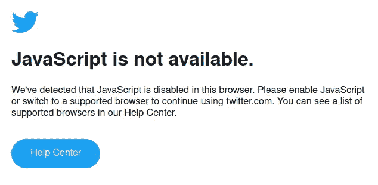

# 现在 React 死了，下一件大事是什么？

> 原文：<https://javascript.plainenglish.io/now-that-react-js-is-dead-whats-the-next-big-thing-7fa72a36a69b?source=collection_archive---------0----------------------->

有些告别对你来说是最好的。

[Source](https://unsplash.com/photos/8BxRYuPkzkU)

反应是一个错误，更大的错误。

它欺骗了所有人，让他们相信它是一切的答案。

Next.js 努力纠正这个错误，但却变成了另一个问题。

你知道当他们说，“你不能把*****建筑在*** *薄弱的***基础上*”他们是对的。***

**React 是 web 开发演进过程中的绊脚石。**

**是时候接受我们在使用 react.js 时犯下的错误，朝着更好的生活前进了。**

# ****当事情出错时，不要随波逐流****

**react.js 出现后不久，单页面应用程序风靡一时。**

**我们用 react 做的只是重新创建浏览器已经知道如何做的事情！**

**从导航*到*处理表单*到*提出申请请求。**

**React 将概念开销提高了一个数量级。虽然在罕见的地方，这是值得的开销，在其他地方，这只是一个烂摊子。**

**追求对所有事情都做出反应的代价是现代复杂性的一个畸形。**

**是的，它使前端比以往任何时候都更加强大。但是这也使得它比大多数 web 应用程序更复杂和耗时。**

**是时候走出这个烂摊子了！**

**在此之前，让我们确保我们知道我们的意思是:**

****SSR** (服务器端渲染)——把它想象成传统的画图方式。艺术家在画布上创作整幅画，然后将完成的画送给观众。**

****

**这是一个从浏览器接受请求并返回一个 HTML 文档的页面渲染版本作为响应的过程，这对于搜索引擎优化来说非常好，因为它很容易被爬虫索引。**

****MPA** (多页面应用程序)是另一个术语，用于基于 **SSR-** 的应用程序，其中你导航的每个页面都必须刷新页面——想想电子商务应用程序。**

****SSG** (静态站点生成)与 **SSR** 类似，但不是(每次)按需构建页面，而是预先绘制(***【prerender】***)页面，你可以将它们存储(缓存)在某个地方。**

****

**You must cache every time you make a change.**

**在另一边(使用 ***客户端渲染*** )，艺术家会将一个空画布发送给查看者，然后使用 JavaScript 在客户端上绘制图片，让查看者实时看到这幅画变得栩栩如生。**

****

**如果你想听起来精通技术，你可以说 **CSR** (客户端渲染)是你向浏览器发送一个空的 HTML 文档，让浏览器使用 JavaScript 处理所有内容的渲染。**

****SPA** (单页应用)是 **CSR —** 的副产品，CSR 是一个通用术语，用来描述一个当你改变路线时不需要重新加载的应用，它包含在一个页面中，JavaScript 使用 **CSR 处理所有事情。****

***行话表演够了。***

**现在，在 web 开发领域，我们被 SPA(或 CSR)或 SSR 的构建方式所震惊。**

**虽然对许多人来说似乎是这样，但一个并不比另一个更好。**

**在使用 SPA 的时候——你可以实现像 speed 这样的原生应用，但是你最终得到的 SEO 很差(这对你的业务没有好处)。**

**现在，为了一些搜索引擎公司而放弃 SPA snappiness 似乎是愚蠢的——为什么他们不能致力于此并解决它呢？**

**[**谷歌说它可以用 JavaScript**](https://developers.google.com/search/docs/advanced/javascript/javascript-seo-basics) 抓取网站，但这并不便宜，因为与查看 HTML 页面并对其进行索引相比，你必须在无头浏览器中 ***打开*** 页面并执行 JavaScript，*一旦 Googlebot 的资源* ***允许*** *，无头 Chromium 就会呈现页面并执行 JavaScript。***

**现在，这是一件成本很高的事情，尤其是当你在爬数十亿个页面的时候。如果你使用一个 ***单页应用*** 你将不可避免地发送大量的 JS，如果你想要伟大的 SEO，你将会受到惩罚。**

**在某些情况下，前端肯定需要现代化的反应能力。但是我不赞成将客户端渲染范式作为拯救的唯一途径。**

**这是世界上最著名的 SPA——如果 JavaScript 被 ***禁用或者*** 加载失败，这就是你得到的。**

****

**This is simply not acceptable**

**此外，SPA 有时是 ***不可预测的*** (在处理导航时似乎有问题)。**

***服务器端渲染的优点在于，由于 HTML 是在服务器上生成的，可以立即发送到客户端，因此可以更快地向用户提供完全渲染的网站。这可以改善用户体验，特别是对于使用较慢互联网连接或处理能力有限的设备的用户。***

***但是您失去了 snappiness 部分，它也有设置和维护更复杂的缺点，因为它需要服务器做更多的工作。***

***为了构建 web 应用程序，我们被困在这两种范式中——这更像是 SSR 和 CSR 之间的斗争——我们必须找到一种明智的方式来构建东西。***

# ****做不了大事？用伟大的方式做小事情****

***当涉及到管理状态时，React 在浏览器中执行其大部分逻辑，这不仅在性能方面很昂贵，而且最终会带来相对较大的捆绑包开销。***

***React 不必要地使简单的事情复杂化。***

***它发生在 JSX——VDOM 虫洞，这消耗了开发人员生命中的宝贵时间。***

***把一件 ***简单的*** 变成一件*复杂的东西，并从中得到成就感，这根本没有意义。****

****我们不能做得更好吗？****

**好在这个问题的答案是— ***是*** 。**

**而且事实证明它涉及到这一代人最爱的框架。**

****

**svelte = elegance**

**苗条帮助你从 JSX 和虚拟世界的漩涡中挣脱出来。**

**它允许您通过三个简单的步骤编写简单的声明性代码。**

****

**它包含了 web 开发的三大支柱— ***脚本、风格和标记。*****

**这让事情变得简单多了。**

****

**`Hooks` already feels like legacy code — Simply define a variable using let and then reference it dynamically in the HTML using braces {} and Voila! Right there you get your “Reactive State”**

**Svelte 在构建步骤中处理反应状态，这意味着它不仅更快更轻，而且您不必处理钩子的限制，核心团队可以在编译器中包含他们想要的任何东西，而不用担心包的大小。**

**一旦你开始使用 svelte 来构建哪怕是简单的东西，react 的开销就会变得很明显。**

****

**Once you start using Svelte — The joy it brings becomes quite evident.**

**使用 HTML 支持的(声明性)语法，它允许您执行无聊的事情而不会感到无聊，比如:**

****

**conditional rendering**

****

**animation**

****

**… and much more**

# **明智的建筑方式**

**事实上，后端开发人员不想接触客户端，前端开发人员也不想在服务器端做任何事情——大多数框架都是围绕这一原则构建和营销的。**

**它们旨在吸引特定的开发者群体，而不是以有效的方式解决问题。结果？我们以框架的名义得到蹩脚的抽象。**

**像 Next 和 Remix 这样的著名框架几乎不允许你自由地将它用于多种用途( ***SSR/CSR*** )，但它们是围绕 React 构建的，React 具有虚拟 dom 的基本限制，对于许多不同类型的应用程序来说，它是一个进化的死胡同。**

**可爱的是 **SvelteKit** 不是建立在 Svelte 之上——它是一个后端 web 框架，使用 ***Svelte*** 作为视图层。**

**因此，如果 svelte 明天感觉像一个遗产，我们可以通过用其他东西(支持服务器端渲染)替换它来快速前进，不像其他框架那样及时受到底层技术的影响。**

**SvelteKit 的主要优势之一是它对性能的关注。**

****

**With its simplicity comes freedom and awesome performance.**

**与其他使用虚拟 DOM 更新页面的框架不同，SvelteKit 在构建时编译您的代码，生成直接在浏览器上运行的高效普通 JavaScript。**

****

**You can write declarative code and let the SvelteKit compiler handle the rest.**

**这意味着您的应用程序将更快，响应更快，用户体验更流畅。**

*****SvelteKit*** 还可以轻松构建由 ***服务器渲染、静态生成或完全由客户端渲染的应用。*****

**这意味着您可以选择对您的项目最有意义的方法，而不必受限于特定的体系结构。**

**默认情况下，您的页面在您第一次访问时是 ***服务器端呈现的*** ，但是当您导航到其他页面时，它们将是 ***客户端呈现的*** *。***

**SvelteKit 的另一个优点是它的代码组织方法。**

**与要求您遵循特定目录结构和文件命名约定的其他框架不同，SvelteKit 允许您以对项目有意义的方式组织代码。**

**这种灵活性允许您随着项目的增长轻松地扩展和维护您的代码库。**

**此外，SvelteKit 附带了一个用于构建实时应用程序的强大工具包。**

**它包括像 ***WebSockets*** 和 ***服务工作者*** 这样的特性，使得构建反应性的和总是最新的应用程序变得容易。**

****

**Having WebSocket out of the box opens up a world of possibilities**

**总的来说，SvelteKit 是一个强大而灵活的框架，与其他流行的框架如 Next.js、Remix 等相比，它提供了许多优势。**

**它对性能、代码组织和实时能力的关注使其成为构建现代 web 应用程序的绝佳选择。**

# **结论**

> **“你想要的一切都在恐惧的另一边。”**
> 
> **—乔治·阿戴尔**

**在过去的 5 年中，React 最显著的变化是 React Docs 的革新。**

**除此之外——还有什么？**

**React 唯一有用的功能就是可以买单。**

**对比 React 混乱的 API 命名(Hooks)——Java 感觉就像一本儿童读物。**

**react 生态系统本身是有问题的，有状态管理和大量的库——几乎所有这些都比你在其他地方得到的要差。**

**以行业标准的名义——React 正在做 Java 当年做过的事情。**

**今天你在 react 里做的 ***苗条*** 没有你做不到的事。**

**唯一不同的是 ***苗条的*** *很看重你的时间，react 不。***

**SvelteKit 拥有成为下一个大事件的所有必要元素。**

**现在它已经达到了 1.0 版本，商业采用可以从这一点真正起飞——加入这个旅程——另一边见。**

# **感谢信**

**我想利用这最后的机会说声谢谢。**

**感谢您的光临！没有像你这样的人，我不可能做我现在所做的事情，他们跟随我，带着那种信念阅读我的帖子。**

**我希望你能 [**和我一起**](https://polymathsomnath.medium.com/subscribe) 发表 [**我未来的博客文章**](https://polymathsomnath.medium.com/subscribe) 并留下来，因为我认为我们这里有一些很棒的东西。我希望在未来的许多年里，我能在你的职业生涯中帮助你！**

**下次见。再见！**

***更多内容看* [***说白了。报名参加我们的***](https://plainenglish.io/) **[***免费周报***](http://newsletter.plainenglish.io/) *。关注我们关于* [***推特***](https://twitter.com/inPlainEngHQ) ，[***LinkedIn***](https://www.linkedin.com/company/inplainenglish/)*，*[***YouTube***](https://www.youtube.com/channel/UCtipWUghju290NWcn8jhyAw)*，以及* [***不和***](https://discord.gg/GtDtUAvyhW) ***。*******

*****有兴趣缩放你的软件启动*** *？检查出* [***电路***](https://circuit.ooo?utm=publication-post-cta) *。***