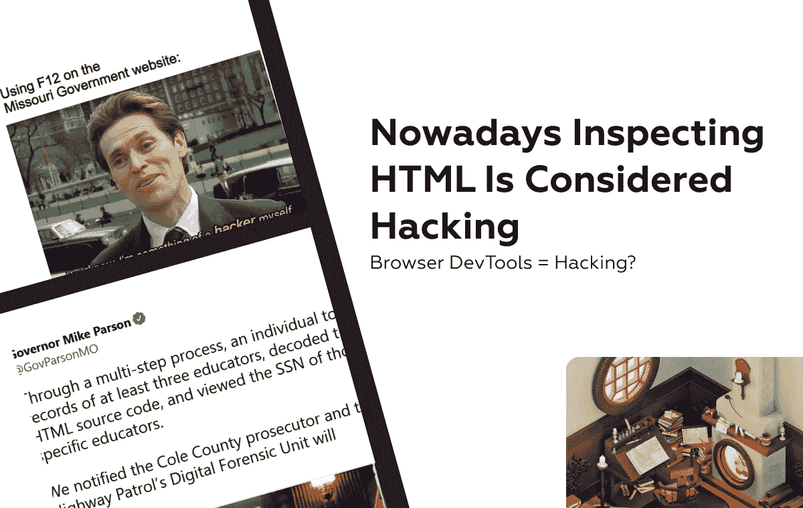
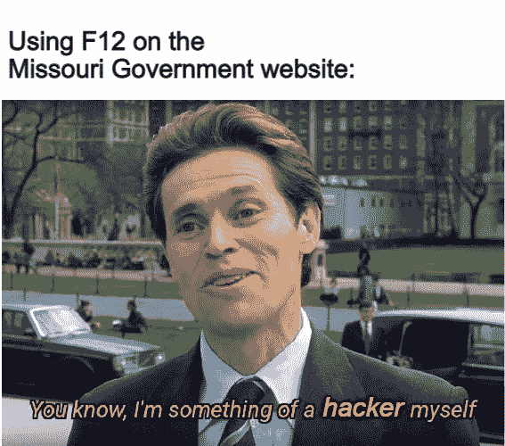
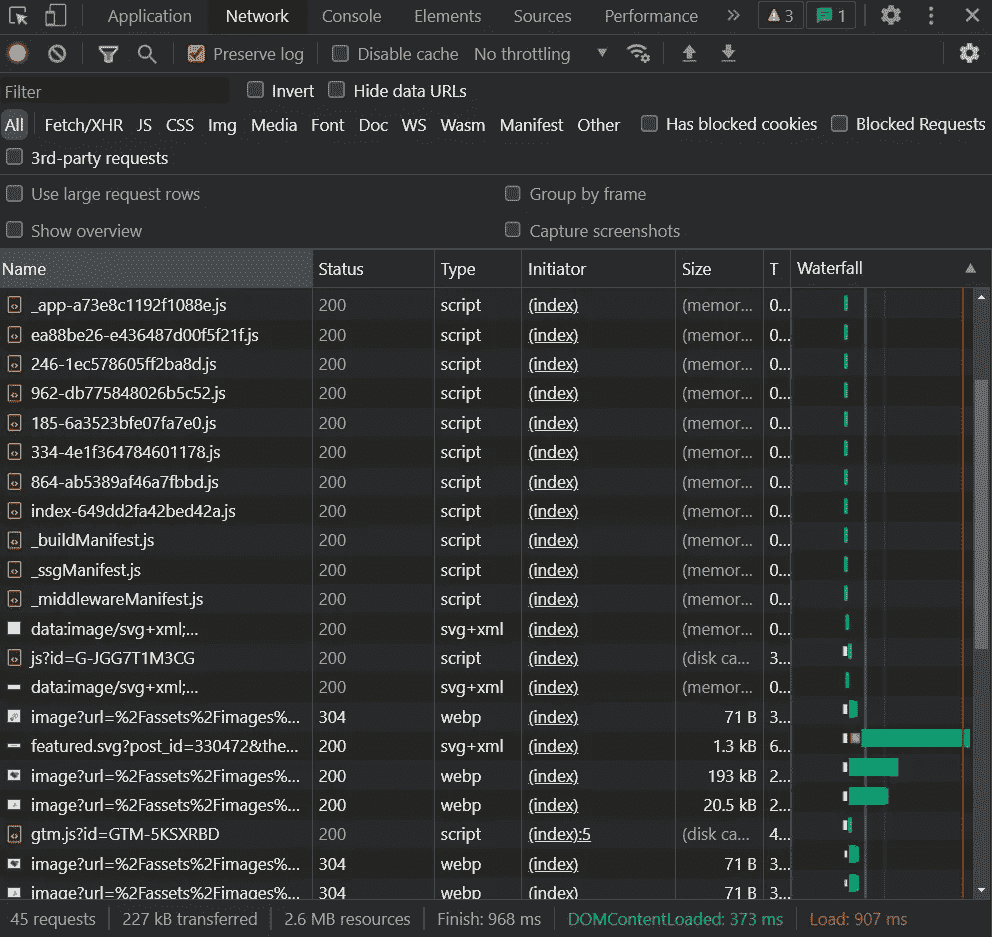
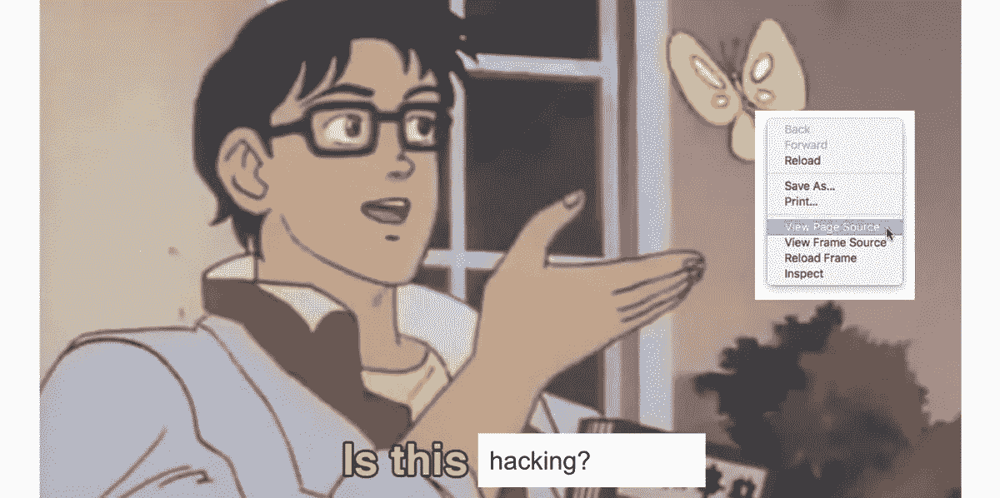
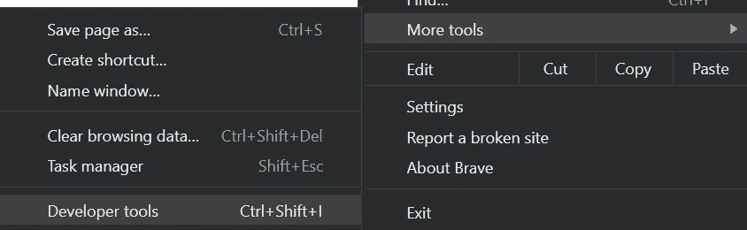

# 如今，检查 HTML 被认为是黑客行为

> 原文：<https://javascript.plainenglish.io/nowadays-inspecting-html-is-considered-hacking-6ea0d83980c6?source=collection_archive---------2----------------------->



## 浏览器 DevTools =黑客？

是的，标题是**荒谬**，这个故事也是如此，真的值得更多的报道。检查网站 HTML 是大多数正常人都知道的一个极其常见的功能，他们在学校里学会了修改在线成绩册上的成绩供父母查看，或者通过观看 YouTube 上的印度[骗子报复](https://www.youtube.com/watch?v=B20Ul9sKb1E)视频。



F12 = Hacker Tool

# 故事

## 将敏感信息保存在服务器上

想象一下，有一天你醒来查看当地一所学校的网站，看到一个简单的表格，上面有教育工作者和教师的信息。你决定涉猎一下这个网站，并通过 **Inspect Element** 工具发现了一个专业，你立即报告并被归类为黑客，并受到威胁**要接受州长的指控**。

这实际上发生在去年十月的密苏里州，当时一名记者在检查该州中小学教育部门的申请时，发现它泄露了教师的私人信息。

该漏洞包括一个搜索功能，该功能采用社会安全号码的最后 4 位数字，以方便过滤同名教师。

泄漏是由于通过请求返回的有效负载也包含了以 **Base64** 编码的完整社会安全号，而不是只有最后 4 位数字以及表中显示的其余数据。



Sample Network Requests

即使 SSN 不是明文，编码只是一种将数据转换成更适合传输或转换以进一步加密的格式的方法。

这意味着它可以通过[网站](https://www.base64decode.org/)或[以编程方式](https://developer.mozilla.org/en-US/docs/Glossary/Base64)用这样的一行代码轻松地手动解码:

```
const decodedSSN = atob(encodedSSN);
```

开发者认为在客户端而不是服务器上拼接 SSN 只显示最后 4 位数字是一个好主意，这样任何人都可以去网络选项卡并检查有效负载。

对于一个可能向公众泄露了大约 10 万个社会安全号码的系统来说，这真是一个巨大的缺陷。尽管这款前置应用的本意是供当地学校使用，但任何人都可能很容易发现这一漏洞。

# 结果

## 值得一提的迷因

现在你想知道这位记者是否因为他的道德行为获得了可观的赏金，我很抱歉地说，但他实际上受到了密苏里州州长的斥责，他在推特上起诉了他的行为。

A Meme Worthy Tweet

州长迈克·帕森(Mike Parson)甚至威胁要起诉这名记者，称他为“黑客”，并称他的行为为“政治仇杀”火上浇油。

在这种情况下缺乏最低限度的技术能力和快速判断导致了非常火热的 Twitter 帖子和一些 [**黄金模因**](https://www.reddit.com/r/missouri/comments/q9eqka/can_we_do_memes_because_this_is_a_very_memeable/) 的诞生，它们应该有自己的子编辑。



Inspect HTML Memes Are Glorious

你可能会认为这个故事已经过时了，因为十月份已经过去很久了，但实际上仅仅一周前,[的法律案件已经完全解决了,](https://www.theregister.com/2022/02/15/missouri_html_hacking/)**,这名记者被免于指控。试图通过对不存在的罪行迫害无辜者来掩盖上级的错误是不可接受的。**

**一些网站多年来一直试图阻止用户访问页面源代码，以防止手动删除付费墙或下载网站上的文件，但没有真正的方法可以在所有浏览器中禁用 inspect element(至少据我所知没有)。**

# **不合时宜的解决方法**

**一种适用于经验不足的用户的解决方案是通过 onkeydown 方法监听与 Inspect 元素或右键菜单的快捷方式相关的按键，并通过返回 false 来消除正常行为，如下所示。**

```
document.onkeydown = function(e) {
    if(e.keyCode == 123) {
     return false;
    }
    if(e.ctrlKey && e.shiftKey && e.keyCode == 'I'.charCodeAt(0)){
     return false;
    }
    if(e.ctrlKey && e.shiftKey && e.keyCode == 'J'.charCodeAt(0)){
     return false;
    }
    if(e.ctrlKey && e.keyCode == 'U'.charCodeAt(0)){
     return false;
    }

    if(e.ctrlKey && e.shiftKey && e.keyCode == 'C'.charCodeAt(0)){
     return false;
    }      
 }
```

**这只是部分修复，因为任何人仍然可以通过浏览器中的选项菜单访问[开发工具](https://developer.chrome.com/docs/devtools/)，并选择更多工具- >开发工具。这绝不是允许向客户端传递敏感数据的解决方案。**

****

**Access DevTools Via UI In Brave**

**还有其他隐藏页面源代码的方法，但是通常过于复杂，比如使用 headers & CSS 用这种[花哨的方法](https://www.youtube.com/watch?v=msdymgkhePo)注入 HTML。**

**我希望你喜欢这篇离奇的与黑客相关的文章。不要忘记👏并关注更多软件&编程相关内容💜或者[甚至建造&从头开始推出一个 AI app】。](https://medium.com/r?url=https%3A%2F%2Fjavascript.plainenglish.io%2Fhow-i-launched-a-saas-in-60-days-with-an-empty-pocket-313aa59c3e78)**

***更多内容请看*[***plain English . io***](https://plainenglish.io/)*。报名参加我们的* [***免费周报***](http://newsletter.plainenglish.io/) *。关注我们关于*[***Twitter***](https://twitter.com/inPlainEngHQ)*和*[***LinkedIn***](https://www.linkedin.com/company/inplainenglish/)*。加入我们的* [***社区不和谐***](https://discord.gg/GtDtUAvyhW) *。***