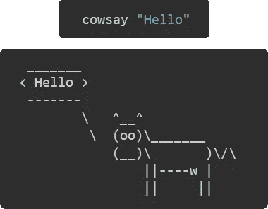

# NPM 对 NPX

> 原文：<https://javascript.plainenglish.io/npm-vs-npx-6444aad0e892?source=collection_archive---------8----------------------->

## npm 和 npx 的关键区别是什么？


任何时候你使用 Javascript，不管是前端还是后端，我相信你都会使用外部包。从像 **Moment** 或 **Lodash** 这样的实用程序库到像 **Express** 或 **Angular** 这样的成熟框架，你需要外部帮助来创造一些资源丰富的东西。我们使用这些外部库的方式是通过 npm。Npm 是一个在线注册表，在这里你可以用不同的工具浏览不同的包。它还有一个命令行工具，可以让您在项目中安装这些包。我真的没有必要继续谈论 npm，因为它几乎就像是 Javascript 社区中管理项目依赖关系的一个标准。

你也可能遇到过一个类似的工具，叫做 **npx** ，特别是如果你曾经使用 **create-react-app** 使用 React。因此，当 npm 管理你的 nodeJS 包时，npx 用于执行这些包。让我们看一个例子。

Youtube 上有这篇博文的视频版本。

## 使用 npm 安装软件包

通过键入`npm init -y`创建一个示例 NodeJS 应用程序。要安装一个包并在这个项目中使用它，我们通常要做的是键入`npm install`，后跟包的名称。让我们安装一个叫做 **cowsay** 的虚拟包。这个包将简单地回显您发送的消息。



所以如果你运行`cowsay "Hello"`，你会得到一个错误信息

> **“术语 cowsay 不被识别为 cmdlet、函数、脚本或可操作的程序”**。

这意味着无论何时你从 npm 注册表安装一个包，它可以像 **cowsay** 或 **nodemon** 一样被执行，为了运行这个包，你需要这个包的可执行文件的确切路径。如果你没有正确的路径，它就不会运行。默认情况下，无论何时安装可执行文件，Npm 都会创建指向它们的链接。因此，每当你在本地安装一个包时，指向它的可执行文件的链接就会在**中创建。/node_modules/。bin/** 文件夹。因此，如果您运行相同的命令，但使用类似于`./node_modules/.bin/cowsay "Hello"`的完整路径，这应该可以工作。

## 全局安装包如何工作

现在，当您全局安装软件包时，您的系统中也有一个 bin 目录，至少对于基于 Linux 的系统是这样。对于 Windows，它通常位于 AppData 文件夹中(大部分情况下)。因此，每当您没有向命令传递任何路径时，您的操作系统会认为您正在运行一个全局安装包。它试图在你的系统中的 bin(全局文件夹)中寻找可执行文件。如果有可用的全局安装，它将运行它，否则您将得到与我们在示例中看到的相同的错误消息。

我们实际上可以通过添加脚本来模拟本地安装的这种行为。因此，在 package.json 文件内的脚本对象中，让我们为 cowsay 命令添加一个脚本。

```
//package.json
...
"scripts": {
   "test": "echo \"Error: no test specified\" && exit 1",
   **"cowsay": "./node_modules/.bin/cowsay"**
}
...
```

现在，您可以通过键入`npm run cowsay “Hello”`来简单地执行此操作。

虽然这看起来是比以前更好的解决方案，但是您仍然需要为本地安装的每个可执行包做额外的工作。这就是 npx 的用武之地。

## 使用 NPX

Npx 是 npm 附带的 CLI 工具(从 npm v5.2.0 开始)。它让你执行你的包没有任何花招。Npx 检查该命令是否存在于路径变量和本地二进制文件中。因为我们在本地安装了 cowsay 包，所以它能够毫无问题地找到并执行它。因此，如果您尝试在您的终端中运行`npx cowsay “Hello"`，您将得到预期的结果。

但是现在最精彩的部分来了。继续从您的项目中卸载 cowsay 库=> `npm uninstall cowsay`。现在尝试再次运行该包，看看它是否工作(剧透警告，它会工作)。

这样做的原因是 npx 不是安装软件包并占用永久空间，而是创建一个**临时缓存**并将软件包二进制文件存储在该缓存中。一旦执行完成，它将从系统中清除缓存的二进制文件。这可以节省磁盘空间并保持全局文件的整洁。如果您想在将包添加到项目之前测试它们，npx 是一个好方法。不仅如此，它还可以运行 GitHub 上的代码。理想情况下，你不应该执行来自未知库/gist 的随机脚本，但是如果你知道你在做什么，并且有一个只能通过使用 GitHub 上的脚本来解决的特定解决方案，那么你可以尝试一下。

## 结论

这就是 npm 和 npx 的主要区别。我相信你一定遇到过的一个完美的用例是使用 create react app 来设置你的 React 项目。如果这个库在我们的开发生命周期中只会被使用几次，那么安装它就没有意义。所以还是用 npx 比较好。

[***Youtube 上有这篇博文的视频版本。***](https://youtu.be/GklQWcRauW4)

如果你有任何疑问或建议，你可以在评论中提出，或者通过我的任何一个社交网站与我联系。干杯！

[YouTube](https://www.youtube.com/channel/UCaktnqx_IENyT5T2lJ3F09w)
[LinkedIn](https://www.linkedin.com/in/akilesh-rao-610357137/)
[Twitter](https://twitter.com/themangalorian)
[GitHub](https://github.com/AkileshRao)

*更多内容看* [***说白了就是***](https://plainenglish.io/) *。报名参加我们的* [***免费每周简讯***](http://newsletter.plainenglish.io/) *。关注我们* [***推特***](https://twitter.com/inPlainEngHQ) ， [***领英***](https://www.linkedin.com/company/inplainenglish/) *，*[***YouTube***](https://www.youtube.com/channel/UCtipWUghju290NWcn8jhyAw)*，* [***不和***](https://discord.gg/GtDtUAvyhW) *。对增长黑客感兴趣？检查出* [***电路***](https://circuit.ooo/) *。*