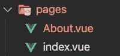

# 如何在 Nuxt3 中实现 auth0 认证

> 原文：<https://javascript.plainenglish.io/nuxt-3-auth0-authentication-70e86a98a3b3?source=collection_archive---------3----------------------->

## 在 Nuxt3 项目中实现 auth0 认证的指南。


Photo by [FLY:D](https://unsplash.com/@flyd2069?utm_source=unsplash&utm_medium=referral&utm_content=creditCopyText) on [Unsplash](https://unsplash.com/s/photos/security?utm_source=unsplash&utm_medium=referral&utm_content=creditCopyText)

我正在为我的新项目试用 [Nuxt3](https://v3.nuxtjs.org/) ，并希望将 [auth0](https://auth0.com/) 实现为认证即服务。在写这篇博客的时候，我找不到适用于旧版本 Nuxt 的 Nuxt 模块。因此，我认为这个小小的变通办法可能对其他人也有帮助，直到他们发布 auth0 的新 Nuxt3 模块。

所以先从 Nuxt3 项目说起。

```
npx nuxi init nuxt-app
```

我使用的是 auth0 "@auth0/auth0-spa-js "中的 JavaScript 库。

```
npm i @auth0/auth0-spa-js
```

从文档来看，似乎是这样的:要创建全局中间件，我们只需要在文件名后面加上后缀“global ”:


在这个文件中，我们将编写在加载每个路由之前运行的逻辑(对于 Nuxt，它将是每个页面)。这是我们认证验证所需要的。

下面是 auth.global.ts 的代码:

在上面的代码中，您将需要 auth client，您可以将它添加到您的商店或其他地方，您也可以将该文件共享到 Vue.js 组件。

让我们看看我们要实现什么:

1.  当有人直接路由到其他页面而不是主页时，我们需要身份验证。
2.  当有人点击登录按钮时，我们也需要验证。

下面是 app.vue 文件:

让我们创建 About.vue(用于 About 路线)和 index.vue(用于 home 路线):



现在我们应该能够看到它全部工作。让我们来测试一下。

```
npm run dev
```

小贴士:

请确保在 Auth0 平台设置上正确配置了所有重定向 URLs 例如，我为重定向 URI 和注销 URI 配置了“http://localhost:3000 ”,在我的应用程序中也是如此。但是，您可以在您的应用程序中更改注销重定向:

```
await auth.logout({    returnTo: window.location.origin,  });
```

你可以在这里查看 [Github 回购](https://github.com/ashansurkar/nuxt3-auth)。

希望这对你有帮助。请随意给我鼓掌。如果有什么困惑或者有什么建议，请在评论中告诉我。编码快乐！

*更多内容请看*[***plain English . io***](https://plainenglish.io/)*。报名参加我们的* [***免费周报***](http://newsletter.plainenglish.io/) *。关注我们关于*[***Twitter***](https://twitter.com/inPlainEngHQ)*和**[***LinkedIn***](https://www.linkedin.com/company/inplainenglish/)*。查看我们的* [***社区不和谐***](https://discord.gg/GtDtUAvyhW) *加入我们的* [***人才集体***](https://inplainenglish.pallet.com/talent/welcome) *。**